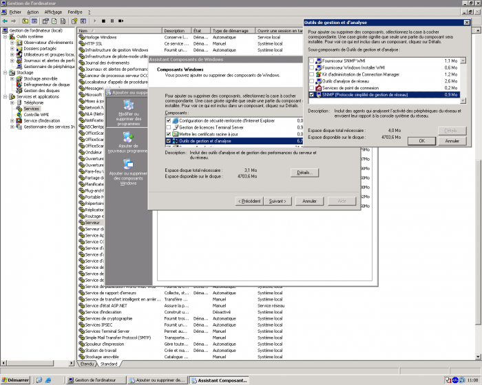
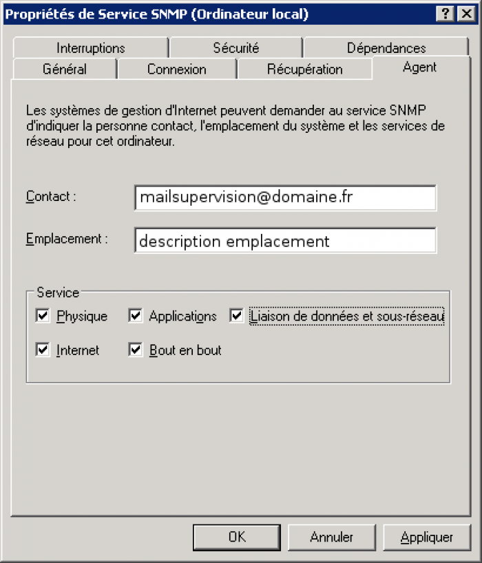
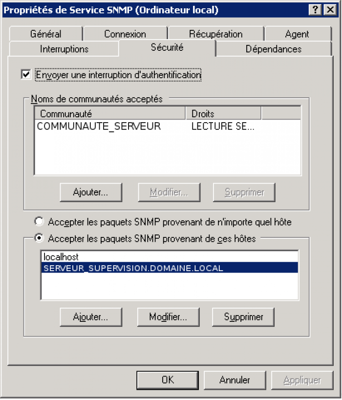

Documentation permettant d’installer ou activer SNMP sur divers
éléments.

Ce tutoriel a été réalisé par :

  **Rôle**        **Nom**
  --------------- -----------------
  **Rédacteur**   Romain BERTHAUD

Installer SNMP sous Windows {#installer-snmp-sous-windows .sectionedit3}
===========================

Afin de faire fonctionner la remonté d’informations SNMP, il faut que le
service SNMP soit démarré. Si il n’est pas présent, il faut l’installer.
Il est déjà préconfiguré sur les templates VMware Windows 2003 et 2008.

-   Dans “Ajout/Suppression de composants Windows” situé dans
    “Ajout/Suppression de programmes” du Panneau de configuration
    sélectionnez Outils de gestion et d’analyse puis détails.
-   Enfin activez la case à cocher SNMP(Protocole simplifié de gestion
    réseau) puis cliquez sur ok et finissez par suivant.

Sous Windows 2008, c’est une fonctionnalité à ajouter et qui ne
nécessite pas le CD de windows pour être installé. Néanmoins, on est
obligé de redémarrer le serveur pour avoir accès aux informations de
configuration.

Pour cette opération le CD-ROM du système utilisé avec le même Service
Pack sera demandé.

Ensuite, il faut paramétrer SNMP pour qu’il envoi les informations que
nous voulons.

Accéder aux propriétés du service et renseigner les valeurs suivantes.

Les informations de contacts et les services supervisés (tout cocher).

Dans l’onglet sécurité, définir la communauté auquel appartient le
serveur (COMMUNAUTE\_SERVEUR pour tous les serveurs Windows et Linux) et
la machine qui a l’autorisation de récupérer les informations (notre
serveur de supervision).

Valider et la réception d’information SNMP par Nagios commence
directement au prochain check si l’hôte à déjà été ajouté.

Installer SNMP sous Linux {#installer-snmp-sous-linux .sectionedit4}
=========================

SNMP est déjà installé sur tout les serveurs Linux en principe. Il fait
parti du template Vmware. Cependant, il faut vérifier sur les serveurs
physiques si il est présent. Pour l’installer,

~~~
yum install net-snmp
~~~

Un fichier `/etc/snmp/snmpd.conf` est positionné

On peut aussi utiliser l’utilitaire `snmpconf` pour paramétrer le
fichier de configuration.

Récupérer le fichier de configuration `snmpd.conf` sauvegardé sur un
serveur de fichiers ou obtenu d’un autre serveur et le positionner en
lieu et place de l’existant dans `/etc/snmp/snmpd.conf`. Laisser toutes
les valeurs par défaut mais en bas du fichier, adapter les volumes
disques en fonction

Fichier `/etc/snmp/snmpd.conf` typique.

~~~
syscontact [email protected]
/*  */!function(){try{var t="currentScript"in document?document.currentScript:function(){for(var t=document.getElementsByTagName("script"),e=t.length;e--;)if(t[e].getAttribute("cf-hash"))return t[e]}();if(t&&t.previousSibling){var e,r,n,i,c=t.previousSibling,a=c.getAttribute("data-cfemail");if(a){for(e="",r=parseInt(a.substr(0,2),16),n=2;a.length-n;n+=2)i=parseInt(a.substr(n,2),16)^r,e+=String.fromCharCode(i);e=document.createTextNode(e),c.parentNode.replaceChild(e,c)}}}catch(u){}}();/*  */ (edit snmpd.conf)
syslocation room1 (edit snmpd.conf)
rocommunity COMMUNAUTE_SERVEUR
trapcommunity COMMUNAUTE_SERVEUR
trapsink localhost

# SECTION: Monitor Various Aspects of the Running Host
#
#   The following check up on various aspects of a host.

# disk: Check for disk space usage of a partition.
#   The agent can check the amount of available disk space, and make
#   sure it is above a set limit.
#
#    disk PATH [MIN=100000]
#
#    PATH:  mount path to the disk in question.
#    MIN:   Disks with space below this value will have the Mib's errorFlag set.
#           Can be a raw byte value or a percentage followed by the %
#           symbol.  Default value = 100000.
#
#   The results are reported in the dskTable section of the UCD-SNMP-MIB tree

disk  / 200000
disk  /boot 200000
disk  /tmp 200000
disk  /usr 200000
disk  /var 200000du partitionnement.
~~~

Redémarrer le service snmpd.

~~~
/etc/init.d/snmpd restart
~~~

Vérifier que snmpd est au démarrage.

~~~
chkconfig --list | grep snmpd.
~~~

Si non, mettre snmpd au démarrage du système.

~~~
chkconfig snmpd on
~~~

Pour connaître les informations qui sont récoltés par snmp, utiliser la
commande `snmpwalk`. Voici un exemple pour l’utilisation de l’espace
disque. On a le numéro du disque avec en face le pourcentage utilisé.

~~~
[root@srv-vmtmp01 snmp]# snmpwalk -v 1 -c COMMUNAUTE_SERVEUR localhost UCD-SNMP-MIB::dskPercent
UCD-SNMP-MIB::dskPercent.1 = INTEGER: 28
UCD-SNMP-MIB::dskPercent.2 = INTEGER: 7
UCD-SNMP-MIB::dskPercent.3 = INTEGER: 3
UCD-SNMP-MIB::dskPercent.4 = INTEGER: 62
UCD-SNMP-MIB::dskPercent.5 = INTEGER: 10
~~~

Faire un `df -h` pour voir à quoi correspond chaque volume en fonction
du pourcentage indiqué.

Installer SNMP sous ESX {#installer-snmp-sous-esx .sectionedit5}
=======================

Sous Vmware ESX, on n’installe rien. SNMP est déjà prévu sur le système,
il est simplement démarré et configuré dans le kickstart de déploiement
du système ESX. Si ce n’est pas le cas, le fichier de configuration
(/etc/snmp/snmpd.conf) doit ressembler à ce qui suit.

~~~
syscontact [email protected]
/*  */!function(){try{var t="currentScript"in document?document.currentScript:function(){for(var t=document.getElementsByTagName("script"),e=t.length;e--;)if(t[e].getAttribute("cf-hash"))return t[e]}();if(t&&t.previousSibling){var e,r,n,i,c=t.previousSibling,a=c.getAttribute("data-cfemail");if(a){for(e="",r=parseInt(a.substr(0,2),16),n=2;a.length-n;n+=2)i=parseInt(a.substr(n,2),16)^r,e+=String.fromCharCode(i);e=document.createTextNode(e),c.parentNode.replaceChild(e,c)}}}catch(u){}}();/*  */ (edit snmpd.conf)
syslocation room1 (edit snmpd.conf)
rocommunity COMMUNAUTE_SERVEUR
trapcommunity COMMUNAUTE_SERVEUR
trapsink localhost
~~~

Redémarrer le service avec un `/etc/init.d/snmpd restart`.

Vous remarquerez que c’est exactement comme sous Red Hat pour la bonne
et simple raison que VMware ESX est une Red Hat!

Il faut que le SNMP soit autorisé sur le firewall de l’ESX pour que les
requêtes passent.

Activer SNMP sur les routeurs ou switchs Cisco {#activer-snmp-sur-les-routeurs-ou-switchs-cisco .sectionedit6}
==============================================

Configuration réalisé sur des switchs de niveau 3. Pour des routeurs
distants fournit par un opérateur, il faut lui demander si le SNMP est
offert dans sa solution car c’est lui qui à la possibilité d’accéder à
la configuration des routeurs et pas nous.

Ce dont on a besoin pour activer le SNMP de manière basique.

~~~
enable
conf t
snmp-server community COMMUNAUTE_RESEAU ro 1
snmp-server host @IP_SERVEUR_SUPERVISION COMMUNAUTE_RESEAU
~~~

Et c’est tout car nous n’utilisons pas les traps SNMP des éléments. Dans
le cas contraire, il faut paramétrer les traps avec la commande
`snmp-server enable traps` comme ci-dessous.

~~~
snmp-server community COMMUNAUTE_RESEAU RO 1
snmp-server trap-source Vlan1
snmp-server enable traps snmp authentication linkdown linkup coldstart warmstart
snmp-server enable traps tty
snmp-server enable traps fru-ctrl
snmp-server enable traps entity
snmp-server enable traps flash insertion removal
snmp-server enable traps cpu threshold
snmp-server enable traps vtp
snmp-server enable traps vlancreate
snmp-server enable traps vlandelete
snmp-server enable traps envmon fan shutdown supply temperature status
snmp-server enable traps port-security
snmp-server enable traps rf
snmp-server enable traps hsrp
snmp-server enable traps bridge newroot topologychange
snmp-server enable traps stpx inconsistency root-inconsistency loop-inconsistency
snmp-server enable traps syslog
snmp-server enable traps vlan-membership
snmp-server host @IP_SERVEUR_SUPERVISION COMMUNAUTE_RESEAU
~~~

Pour mettre à jour une configuration existante

~~~
no snmp-server community COMMUNAUTE_RESEAU RO 1
snmp-server community COMMUNAUTE_RESEAU RO 1
no snmp-server host @ancienne_IP COMMUNAUTE_RESEAU
snmp-server host @IP_SERVEUR_SUPERVISION COMMUNAUTE_RESEAU
~~~

Pour configurer les ACL.

~~~
sh running-config
sh snmp
sh access-lists 1
conf t
ip access-list standard 1
no 40
40 permit @IP_SERVEUR_SUPERVISION
exit
exit
wr m
~~~