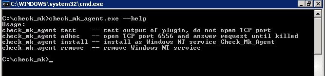
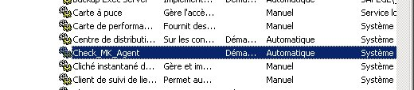
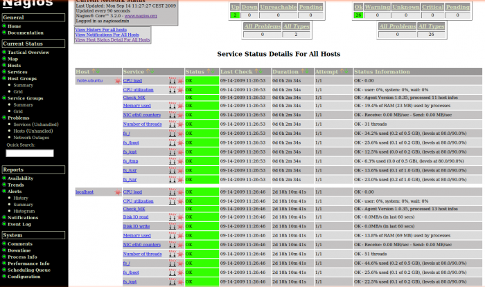

[[[Installation de
check\_mk](../../nagios/addons/check_mk/check_mk-install@do=backlink.html)]]

[wiki monitoring-fr.org](../../start.html "[ALT+H]")

-   [Accueil](../../index.html "Cliquez pour revenir |  l'accueil")
-   [Blog](http://www.monitoring-fr.org "Blog & News")
-   [Forums](http://forums.monitoring-fr.org "Forums")
-   [Doc](http://doc.monitoring-fr.org "Doc")
-   [Forge](https://github.com/monitoring-fr "Forge")

Vous êtes ici: [Accueil](../../start.html "start") »
[Nagios](../../nagios/start.html "nagios:start") » [Nagios
Addons](../../nagios/addons/start.html "nagios:addons:start") »
[check\_mk](../../nagios/addons/check_mk/start.html "nagios:addons:check_mk:start")
» [Installation de
check\_mk](check_mk-install.html "nagios:addons:check_mk:check_mk-install")

### Table des matières {.toggle}

-   [Installation de
    check\_mk](check_mk-install.html#installation-de-check_mk)
    -   [Installation de l'agent sous
        linux](check_mk-install.html#installation-de-l-agent-sous-linux)
    -   [Installation de l'agent sous
        windows](check_mk-install.html#installation-de-l-agent-sous-windows)
    -   [Utilisation](check_mk-install.html#utilisation)
    -   [Intégration avec
        Nagios](check_mk-install.html#integration-avec-nagios)
        -   [Configuration](check_mk-install.html#configuration)
        -   [Inventaire](check_mk-install.html#inventaire)
        -   [Intégration des
            check\_mk's](check_mk-install.html#integration-des-check_mk-s)

Documentation à mettre à jour

Installation de check\_mk {#installation-de-check_mk .sectionedit1}
=========================

Installation de l'agent sous linux {#installation-de-l-agent-sous-linux .sectionedit2}
----------------------------------

C’est une installation à partir des sources qui est proposé ici. Il est
possible d’utiliser un paquet DEB ou RPM pour arriver au même résultat.
Il n’y a de toute façon rien à compiler et un script setup.sh est
fourni.

~~~ {.code .bash}
sudo wget http://mathias-kettner.de/download/check_mk-1.1.3.tar.gz
tar xzf check_mk-1.1.3.tar.gz
cd check_mk-1.1.3
sudo ./setup.sh
~~~

Voici la transaction terminal résultante de cet appel

~~~
                  _               _                  _                  
              ___| |__   ___  ___| | __    _ __ ___ | | __              
             / __| '_ \ / _ \/ __| |/ /   | '_ ` _ \| |/ /              
            | (__| | | |  __/ (__|   <    | | | | | |   <               
             \___|_| |_|\___|\___|_|\_\___|_| |_| |_|_|\_\              
                                     |_____|                            
                                                                        
   check_mk setup                                   Version: 1.0.35     

Welcome to check_mk. This setup will install check_mk into user defined
directories. If you run this script as root, installation paths below
/usr will be suggested. If you run this script as non-root user paths
in your home directory will be suggested. You may override the default
values or just hit enter to accept them. 

Your answers will be saved to /home/system/.check_mk_setup.conf and will be 
reused when you run the setup of this or a later version again. Please
delete that file if you want to delete your previous answers.

Trying to autodetect details of your Nagios installation...
Found your running Nagios process, autodetected 12 settings.

                                                                        
   Installation directories of check_mk                                 
                                                                        

executables
Directory where to install executable programs such
as check_mk itself:
(/usr/bin):

check_mk configuration
Directory where check_mk looks for its configuration files. An example
configuration file will be installed there:
(/etc/check_mk): 

check_mk checks
check_mk's different checks are implemented as small Python
scriptlets that parse and interpret the various output sections
of the agents. Where shall those be installed:
(/usr/share/check_mk/checks): 

check_mk modules
Directory for main componentents of check_mk itself:
(/usr/share/check_mk/modules): 

SNMP mibs
Directory for SNMP MIB files (for copyright reasons we currently do
not ship any MIB files, though...):
(/usr/share/snmp/mibs): 

documentation
Documentation about check_mk will be installed here:
(/usr/share/doc/check_mk): 

check manuals
Directory for manuals for the various checks. The manuals can be viewed 
with check_mk -M <CHECKNAME>.:
(/usr/share/doc/check_mk/checks): 

working directory of check_mk
check_mk will create caches files, automatically created checks and
other files into this directory. The directory needs to be writable by 
the Nagios process:
(/var/lib/check_mk): 

agents for operating systems
Agents for various operating systems will be installed here for your 
conveniance. Take them and install them onto your target hosts:
(/usr/share/check_mk/agents):

                                                                        
   Configuration of Linux/UNIX Agents                                   
                                                                        

extensions for agents
This directory will not be created on the server. It will be hardcoded 
into the Linux and UNIX agents. The agent will look into this directory
for extensions:
(/usr/lib/check_mk_agent): 

configuration dir for agents
This directory will not be created on the server. It will be hardcoded
into the Linux and UNIX agents. The agent will look for its configuration
files here (currently only the logwatch extension needs a configuration file):
(/etc/check_mk): 

                                                                        
   Integration with Nagios                                              
                                                                        

Webpages
Directory for web pages and .php files. Current check_mk ships only 
one PHP file called logwatch.php. Make sure it's in the same directory
as the Nagios HTML files (the place where side.html and main.html reside):
( autodetected  --> /opt/nagios/share): 

Name of Nagios user
The working directory for check_mk contains several subdirectories
that need to be writable by the Nagios user (which is running check_mk 
in check mode). Please specify the user that should own those 
directories:
( autodetected  --> nagios): 

Common group of Nagios+Apache
Check_mk creates files and directories while running as nagios. 
Some of those need to be writable by the user that is running the webserver.
Therefore a group is needed in which both Nagios and the webserver are
members (every valid Nagios installation uses such a group to allow
the web server access to Nagios' command pipe)::
( autodetected  --> nagcmd): 

Nagios binary
The complete path to the Nagios executable. This is needed by the
option -R/--restart in order to do a configuration check.:
( autodetected  --> /opt/nagios/bin/nagios): 

Nagios main configuration file
Path to the main configuration file of Nagios. That file is always 
named 'nagios.cfg'. The default path when compiling Nagios yourself
is /usr/local/nagios/etc/nagios.cfg. The path to this file is needed
for the check_mk option -R/--restart:
( autodetected  --> /opt/nagios/etc/nagios.cfg): 

Nagios object directory
Nagios' object definitions for hosts, services and contacts are
usually stored in various files with the extension .cfg. These files
are located in a directory that is configured in nagios.cfg with the
directive 'cfg_dir'. Please specify the path to that directory:
( autodetected  --> /opt/nagios/etc/objects): 

Nagios startskript
The complete path to the Nagios startskript is used by the option
-R/--restart to restart Nagios.:
( autodetected  --> /etc/init.d/nagios): 

Base URL of website
The configuration files generated by check_mk contain some
HTTP links to Nagios web pages. Please enter the correct base
URL of your Nagios pages. The trailing slash will be appended by check_mk:
( autodetected  --> /nagios): 

Base URL of cgi programs
The Nagios cgi programs have their own base URL. If you are
unsure then hower your mouse over a link to host or status 
data and look at your browser's status line. Leave out the
host name and also the 'status.cgi?...':
( autodetected  --> /nagios/cgi-bin): 

Nagios command pipe
Complete path to the Nagios command pipe. check_mk needs write access
to this pipe in order to operate:
( autodetected  --> /opt/nagios/var/rw/nagios.cmd):

Path to check_icmp
check_mk ships a Nagios configuration file with several host and
service templates. Some host templates need check_icmp as host check.
That check plugin is contained in the standard Nagios plugins.
Please specify the complete path to check_icmp:
( autodetected  --> /opt/nagios/libexec/check_icmp): 

                                                                        
   Integration with PNP4Nagios                                          
                                                                        

round robin databases
Base directory for round robin databases. If you use PNP4Nagios as
graphing tool check_mk can directly write into the exsting databases.
This saves CPU and disk IO:
(/var/lib/check_mk/rrd): 

PNP4Nagios templates
check_mk ships templates for PNP4Nagios for most of its checks.
Those templates make the history graphs look nice. PNP4Nagios
expects such templates in the directory pnp/templates in your
document root for static web pages:
(/usr/share/check_mk/pnp-templates): 

----------------------------------------------------------------------

You have chosen the following directories: 

 executables                     /usr/bin                                
 check_mk configuration          /etc/check_mk                           
 check_mk checks                 /usr/share/check_mk/checks              
 check_mk modules                /usr/share/check_mk/modules             
 SNMP mibs                       /usr/share/snmp/mibs                    
 documentation                   /usr/share/doc/check_mk                 
 check manuals                   /usr/share/doc/check_mk/checks          
 working directory of check_mk   /var/lib/check_mk                       
 agents for operating systems    /usr/share/check_mk/agents              
 extensions for agents           /usr/lib/check_mk_agent                 
 configuration dir for agents    /etc/check_mk                           
 Webpages                        /opt/nagios/share                       
 Name of Nagios user             nagios                                  
 Common group of Nagios+Apache   nagcmd                                  
 Nagios binary                   /opt/nagios/bin/nagios                  
 Nagios main configuration file  /opt/nagios/etc/nagios.cfg              
 Nagios object directory         /opt/nagios/etc/objects                 
 Nagios startskript              /etc/init.d/nagios                      
 Base URL of website             /nagios                                 
 Base URL of cgi programs        /nagios/cgi-bin                         
 Nagios command pipe             /opt/nagios/var/rw/nagios.cmd           
 Path to check_icmp              /opt/nagios/libexec/check_icmp          
 round robin databases           /var/lib/check_mk/rrd                   
 PNP4Nagios templates            /usr/share/check_mk/pnp-templates       

Proceed with installation (y/n)? y
Installation completed successfully.
~~~

Le script possède une fonction d’auto-détecte permettant de trouver
votre installation nagios. Donc plus de soucis par rapport aux versions
antérieures de check\_mk.

Une fois le script d’installation exécuté, il faut encore copier à la
main l’agent de supervision et le préparer au démarrage avec xinetd.

Si xinetd n’est pas installé sur la machine à superviser, un petit
apt-get devrait résoudre la chose

~~~ {.code .bash}
sudo apt-get install xinetd
~~~

la copie des fichiers

~~~ {.code .bash}
sudo cp /usr/share/check_mk/agents/check_mk_agent.linux /usr/bin/check_mk_agent
sudo cp /usr/share/check_mk/agents/xinetd.conf /etc/xinetd.d/check_mk
sudo /etc/init.d/xinetd restart
~~~

Une petite vérification pour voir si le démon est en écoute sur le port
6556 par défaut.

~~~
netstat -ltn
~~~

~~~
Active Internet connections (only servers)
Proto Recv-Q Send-Q Local Address           Foreign Address         State      
tcp        0      0 0.0.0.0:5666            0.0.0.0:*               LISTEN      
tcp        0      0 0.0.0.0:6556            0.0.0.0:*               LISTEN     
tcp6       0      0 :::22                   :::*                    LISTEN 
~~~

Il reste à tester le démon en l’interrogeant avec check\_mk

~~~
sudo check_mk -I alltcp localhost
~~~

Le démon découvre alors les services associé à la machine

~~~
sudo check_mk -I alltcp localhost
No new checks of type oracle_asm_dg.
No new checks of type vms_md.
1 new checks written to /var/lib/check_mk/autochecks/cpu.loads-2009-04-28_10.00.58.cfg
No new checks of type lsi.disk.
No new checks of type statgrab_net.link.
No new checks of type statgrab_net.params.
No new checks of type oracle_tbs.
No new checks of type multipath.
1 new checks written to /var/lib/check_mk/autochecks/cpu.threads-2009-04-28_10.00.58.cfg
2 new checks written to /var/lib/check_mk/autochecks/diskstat-2009-04-28_10.00.58.cfg
No new checks of type winperf.cpuusage.
No new checks of type vms_sys.mem.
No new checks of type local.
No new checks of type statgrab_net.ctr.
No new checks of type lsi.array.
No new checks of type vms_df.
2 new checks written to /var/lib/check_mk/autochecks/df-2009-04-28_10.00.58.cfg
No new checks of type ipmi.
1 new checks written to /var/lib/check_mk/autochecks/mem.used-2009-04-28_10.00.58.cfg
1 new checks written to /var/lib/check_mk/autochecks/netif.params-2009-04-28_10.00.58.cfg
No new checks of type services.
No new checks of type tsm_stgpool.
No new checks of type winperf.diskstat.
No new checks of type vms_sys.util.
1 new checks written to /var/lib/check_mk/autochecks/netctr.combined-2009-04-28_10.00.58.cfg
No new checks of type md.
1 new checks written to /var/lib/check_mk/autochecks/kernel.util-2009-04-28_10.00.58.cfg
No new checks of type oracle_inst.
No new checks of type logwatch.
1 new checks written to /var/lib/check_mk/autochecks/netif.link-2009-04-28_10.00.58.cfg
No new checks of type oracle_asm_disk.
No new checks of type vms_netif.
~~~

L’installation est finie.

Installation de l'agent sous windows {#installation-de-l-agent-sous-windows .sectionedit3}
------------------------------------

Sous windows l’installation est vraiment triviale. A l’intérieur de
l’archive “source” vous trouverez une archive **agents.tar.gz**. Il
suffit d’extraire le contenu de l’archive et de transférer le fichier
**check\_mk\_agent.exe** sur un serveur windows (par exemple dans le
répertoire **c:\\check\_mk**.

L’invocation de check\_mk en ligne de commande avec l’argument –help
nous donne le résultat suivant :

L’installation en mode service se fait donc de la manière suivante :

~~~
check_mk_agent.exe install
~~~

Il ne reste plus qu’a démarrer le service grâce à la console de gestion
des services windows (Menu démarrer → exécuter → services.msc).

Un petit test pour vérifier que tout se passe bien :

~~~
check_mk_agent.exe test
~~~

et voila !

Utilisation {#utilisation .sectionedit4}
-----------

~~~ {.code .bash}
sudo check_mk -nv localhost
~~~

~~~
Getting info cpu from host localhost (127.0.0.1)
CPU load             OK - 0.02                                                             
Number of threads    OK - 76 threads                                                       
fs_/                 OK - 4% used                                                          
fs_/boot             OK - 15% used                                                         
Disk IO read         OK - 0.0MB/s (in last 1240909505 secs)                                
Disk IO write        OK - 0.0MB/s (in last 1240909505 secs)                                
CPU utilization      OK - user:  0%, system:  0%, wait:  4%                                
Memory used          OK - 31.3% of RAM (157 MB) used by processes                          
NIC eth0 counters    OK - Receive: 0.00 MB/sec - Send: 0.00 MB/sec                         
NIC eth0 link        OK - Link is up                                                       
NIC eth0 parameter   OK - 1000Mb/s,Full,off                                                
OK - Version 16, Successfully processed 11 host infos
~~~

Voici l’écran d’aide la commande check\_mk

~~~
Usage: 

MAJOR MODES:

  check_mk [-n] [-v] [-p] HOST [IPADDRESS]  perform host checks
  check_mk -S|-H                            output configuration files for Nagios
  check_mk -C                               precompile host checks
  check_mk -d HOSTNAME|IPADDRESS            show plain information from agent
  check_mk -I df  [HOST1 HOST2...]          Inventory of mounted partitions

OPTIONS:

  -c FILE        read config file FILE instead of /etc/check_mk/check_mk.cfg
  -S             output service configuration for Nagios
  -H             output host configuration for Nagios
  -C, --compile  precompile host checks (into /var/lib/check_mk/precompiled/)
  -L             list all available check types
  -v, --verbose  verbose output, for manual testing
  --cache        read info from cache file is present, use TCP only,
                 if no cache file present
  --no-cache     never use cached information (use *before* -I)
  -p             also show performance data (use with -v)
  -n             do not submit results to Nagios, do not save counters
  -d             just show ouput from agent, do not perform checks
  -I type1,type2,..  make inventory of one or more checktypes. 
                 Use '-L' or '-I list' for list of check types available
                 for inventory. Use '-I alltcp' for inventory on
                 all checks based on mknagios (and leave out SNMP)
  --no-tcp       for -I: only use cache files. Skipt hosts without
                 cache files.
  --list-hosts [G1 G2 G3...] output all hostnames or only those
                 contained in one of a list of hostgroups
  
  -h, --help     print this help
  -V, --version  print version and exit

  If called without options check_mk retrieves information about host
  at IPADDRESS via TCP or SNMP and submits passive check results to
  Nagios for all services configured in /etc/check_mk/check_mk.cfg for that host.
~~~

Intégration avec Nagios {#integration-avec-nagios .sectionedit5}
-----------------------

L’agent check\_mk doit être installé sur chacune de vos machines.

Vous devrez créer l’utilisateur nagios pour pouvoir faire l’inventaire.

sudo adduser nagios

**Sur vos hôtes distants check\_mk ne trouvera pas Nagios, répondez par
défaut au question ce n’est pas grave, cette partie n’est utile que lors
du poussage de la configuration.**

### Configuration {#configuration .sectionedit6}

Sur le serveur Nagios configurer le fichier /etc/check\_mk/main.mk

S’il n’y a que le serveur nagios, l’éditer comme ci-dessous :

~~~
all_hosts = [ 'localhost' ]
~~~

Si d’autres hôtes viennent à être supervisés:

~~~
all_hosts = [ 'localhost', 'hote-ubuntu' ]
~~~

**Vous pouvez renseigner des noms mais il faut qu’il puisse répondre au
ping avec ce nom sinon check\_mk n’arrivera pas à faire la résolution de
nom lors de l’inventaire.**

**Petite astuce:**

Si vous désirez des noms génériques, vous pouvez le faire en renseignant
le fichier /etc/hosts de cette manière par exemple:

*Extrait de /etc/hosts d’une ubuntu:*

127.0.0.1 localhost

xx.xx.xx.xx dev-nagios.mon-domaine.net dev-nagios

\# The following lines are desirable for IPv6 capable hosts

::1 ip6-localhost ip6-loopback

fe00::0 ip6-localnet

ff00::0 ip6-mcastprefix

ff02::1 ip6-allnodes

ff02::2 ip6-allrouters

ff02::3 ip6-allhosts

\# Declaration de vos hotes supervises

yy.yy.yy.yy hote-ubuntu

Après ça le ping de hote-ubuntu répondra sous l’IP yy.yy.yy.yy

### Inventaire {#inventaire .sectionedit7}

Nous allons réaliser un nouvel inventaire sur notre serveur nagios pour
rapatrier les informations des hôtes supplémentaires.

~~~
sudo check_mk -I alltcp

cpu.loads             1 new checks

cpu.threads           1 new checks

df                    6 new checks

diskstat              nothing new

ipmi                  nothing new

kernel.util           1 new checks

local                 nothing new

logwatch              nothing new

lsi.array             nothing new

lsi.disk              nothing new

md                    nothing new

mem.used              1 new checks

multipath             nothing new

netctr.combined       1 new checks

netif.link            nothing new

netif.params          nothing new

nfsmounts             nothing new

oracle_asm_dg         nothing new

oracle_asm_disk       nothing new

oracle_inst           nothing new

oracle_tbs            nothing new

services              nothing new

statgrab_net.ctr      nothing new

statgrab_net.link     nothing new

statgrab_net.params   nothing new

tsm_stgpool           nothing new

vms_df                nothing new

vms_md                nothing new

vms_netif             nothing new

vms_sys.mem           nothing new

vms_sys.util          nothing new

winperf.cpuusage      nothing new

winperf.diskstat      nothing new
~~~

Ensuite, vérifions si nous arrivons à récupérer les infos pour localhost
et hote-ubuntu

~~~
sudo check_mk -nv hote-ubuntu

CPU load             OK - 0.00                                               

CPU utilization      OK - user:  0%, system:  0%, wait:  1%                  

Memory used          OK - 19.4% of RAM (23 MB) used by processes             

NIC eth0 counters    OK - Receive: 0.00 MB/sec - Send: 0.00 MB/sec           

Number of threads    OK - 31 threads                                         

fs_/                 OK - 34.2% used (0.2 of 0.5 GB), (levels at 80.0/90.0%) 

fs_/boot             OK - 25.6% used (0.1 of 0.2 GB), (levels at 80.0/90.0%) 

fs_/opt              OK - 12.5% used (0.0 of 0.2 GB), (levels at 80.0/90.0%) 

fs_/tmp              OK - 6.3% used (0.0 of 0.5 GB), (levels at 80.0/90.0%)  

fs_/usr              OK - 13.6% used (0.1 of 1.0 GB), (levels at 80.0/90.0%) 

fs_/var              OK - 23.0% used (0.2 of 1.0 GB), (levels at 80.0/90.0%) 

OK - Agent Version 1.0.35, processed 11 host infos
~~~

~~~
sudo check_mk -nv localhost

CPU load             OK - 0.00                                               

CPU utilization      OK - user:  3%, system:  1%, wait:  0%                  

Disk IO read         OK - 0.0MB/s (in last 4 secs)                           

Disk IO write        OK - 0.0MB/s (in last 4 secs)                           

Memory used          OK - 14.0% of RAM (70 MB) used by processes             

NIC eth0 counters    OK - Receive: 0.00 MB/sec - Send: 0.00 MB/sec           

Number of threads    OK - 49 threads                                         

fs_/                 OK - 44.6% used (0.2 of 0.5 GB), (levels at 80.0/90.0%) 

fs_/boot             OK - 25.6% used (0.1 of 0.2 GB), (levels at 80.0/90.0%) 

fs_/opt              OK - 22.4% used (0.1 of 0.2 GB), (levels at 80.0/90.0%) 

fs_/tmp              OK - 6.3% used (0.0 of 0.5 GB), (levels at 80.0/90.0%)  

fs_/usr              OK - 33.7% used (0.3 of 1.0 GB), (levels at 80.0/90.0%) 

fs_/var              OK - 36.6% used (0.4 of 1.0 GB), (levels at 80.0/90.0%) 

OK - Agent Version 1.0.35, processed 13 host infos
~~~

### Intégration des check\_mk's {#integration-des-check_mk-s .sectionedit8}

Ensuite, ce qui nous intéresse est de pouvoir intégrer de manière simple
ces résultats à Nagios.

-   Faire un sudo check\_mk -U

~~~
sudo check_mk -U

Generating Nagios configuration for hosts...OK

Generating Nagios configuration for services...OK

Precompiling host checks...OK

Successfully created Nagios configuration file /opt/nagios/etc/objects/check_mk_objects.cfg.

Please make sure that file will be read by Nagios.

You need to restart Nagios in order to activate the changes.
~~~

L’option -U génére les déclarations d’hôtes et de services, vérifie la
cohérence des infos et les poussent vers le répertoire
/opt/nagios/etc/objects de votre serveur nagios.

Avant de redémarrer Nagios,

1.  **Nous avons réaliser ce test via un serveur nagios vierge**
2.  **Penser à retirer les doublons car check\_mk génère des
    timeperiods, contacts …**

Deux options s’offrent à vous :

-   Soit vous retirez les fichiers de base de votre conf nagios pour
    laisser place à ceux de check\_mk comme ceci :

~~~
vi /opt/nagios/etc/nagios.cfg

#cfg_file=/opt/nagios/etc/objects/commands.cfg

#cfg_file=/opt/nagios/etc/objects/contacts.cfg

#cfg_file=/opt/nagios/etc/objects/timeperiods.cfg

#cfg_file=/opt/nagios/etc/objects/templates.cfg

#cfg_file=/opt/nagios/etc/objects/localhost.cfg

# Definitions for monitoring a Windows machine

#cfg_file=/opt/nagios/etc/objects/windows.cfg

# Definitions for monitoring a router/switch

#cfg_file=/opt/nagios/etc/objects/switch.cfg

# Definitions for monitoring a network printer

#cfg_file=/opt/nagios/etc/objects/printer.cfg

cfg_dir=/opt/nagios/etc/objects
~~~

-   Ou vous trouvez un arrangement pour qu’il n’y est plus de doublons
    entre les fichiers de base et le check\_mk\_templates.cfg.

Vous pouvez bien sûr tester votre configuration avec
/opt/nagios/bin/nagios -v /opt/nagios/etc/nagios.cfg

Pour finir redémarrer Nagios pour obtenir le résultat comme ci-dessous.

***Récap:***

A chaque fois que vous aurez un hôte à ajouter,

-   Installer l’agent check\_mk sur votre hôte à superviser

Sur le serveur nagios:

-   Ajoutez le dans le main.mk

-   Refaire un inventaire sudo check\_mk -I alltcp

-   Tester si vous arrivez à récupérer vos résultats

-   Repousser la conf avec l’option -U

-   Redémarrer Nagios

SOMMAIRE {#sommaire .sectionedit1}
--------

**[Accueil](../../start.html "start")**

**[Supervision](../../supervision/start.html "supervision:start")**

-   [Nagios](../../nagios/start.html "nagios:start")
-   [Centreon](../../centreon/start.html "centreon:start")
-   [Shinken](../../shinken/start.html "shinken:start")
-   [Zabbix](../../zabbix/start.html "zabbix:start")
-   [OpenNMS](../../opennms/start.html "opennms:start")
-   [EyesOfNetwork](../../eyesofnetwork/start.html "eyesofnetwork:start")
-   [Groundwork](../../groundwork/start.html "groundwork:start")
-   [Zenoss](../../zenoss/start.html "zenoss:start")
-   [Vigilo](../../vigilo/start.html "vigilo:start")
-   [Icinga](../../icinga/start.html "icinga:start")
-   [Cacti](../../cacti/start.html "cacti:start")
-   [Ressenti
    utilisateur](../../supervision/eue/start.html "supervision:eue:start")
-   [Ressenti utilisateur avec
    sikuli](../../sikuli/eue/start.html "sikuli:eue:start")

**[Hypervision](../../hypervision/start.html "hypervision:start")**

-   [Canopsis](../../canopsis/start.html "canopsis:start")

**[Sécurité](../../securite/start.html "securite:start")**

**[Infrastructure](../../infra/start.html "infra:start")**

**[Développement](../../dev/start.html "dev:start")**

Nagios Addons {#nagios-addons .sectionedit1}
-------------

-   [Lilac
    Platform](../../nagios/addons/lilac-platform.html "nagios:addons:lilac-platform")
-   [Merlin](../merlin.html "nagios:addons:merlin")
-   [NConf](../../nagios/addons/nconf.html "nagios:addons:nconf")
-   [NDOUtils](../../nagios/addons/ndoutils.html "nagios:addons:ndoutils")
-   [NSClient++](../../nagios/addons/nsclient.html "nagios:addons:nsclient")
-   [NagTrap](../nagtrap.html "nagios:addons:nagtrap")
-   [NagVis](../../nagios/addons/nagvis/start.html "nagios:addons:nagvis:start")
-   [Nagios Business Process
    Addon](../../nagios/addons/nagios-business-process-addons.html "nagios:addons:nagios-business-process-addons")
-   [NagiosDigger](../../nagios/addons/nagiosdigger.html "nagios:addons:nagiosdigger")
-   [NagiosGrapher](../../nagios/addons/nagiosgrapher.html "nagios:addons:nagiosgrapher")
-   [NagiosQL](../../nagios/addons/nagiosql.html "nagios:addons:nagiosql")
-   [Netways Grapher
    V2](../../nagios/addons/netways-grapher-v2.html "nagios:addons:netways-grapher-v2")
-   [Ninja](../../nagios/addons/ninja.html "nagios:addons:ninja")
-   [PNP4Nagios](../../nagios/addons/pnp/start.html "nagios:addons:pnp:start")
-   [Protocole NRPE](../../nagios/addons/nrpe.html "nagios:addons:nrpe")
-   [Protocole NSCA](../../nagios/addons/nsca.html "nagios:addons:nsca")
-   [Setup distribué avec
    Mod\_Gearman](../../nagios/addons/mod_gearman.html "nagios:addons:mod_gearman")
-   [Vautour
    Style](../../nagios/addons/vautour-style.html "nagios:addons:vautour-style")
-   [check\_mk](../../nagios/addons/check_mk/start.html "nagios:addons:check_mk:start")
-   [omd Open Monitoring
    Distribution](../../nagios/addons/omd.html "nagios:addons:omd")

-   [Afficher le texte
    source](../../nagios/addons/check_mk/check_mk-install@do=edit&rev=0.html "Afficher le texte source [V]")
-   [Anciennes
    révisions](../../nagios/addons/check_mk/check_mk-install@do=revisions.html "Anciennes révisions [O]")
-   [Derniers
    changements](../../nagios/addons/check_mk/check_mk-install@do=recent.html "Derniers changements [R]")
-   [Liens vers cette
    page](../../nagios/addons/check_mk/check_mk-install@do=backlink.html "Liens vers cette page")
-   [Gestionnaire de
    médias](../../nagios/addons/check_mk/check_mk-install@do=media.html "Gestionnaire de médias")
-   [Index](../../nagios/addons/check_mk/check_mk-install@do=index.html "Index [X]")
-   [Connexion](../../nagios/addons/check_mk/check_mk-install@do=login&sectok=6bca6bdf16f8880de3d6d3649db89a26.html "Connexion")
-   [Haut de
    page](check_mk-install.html#dokuwiki__top "Haut de page [T]")

nagios/addons/check\_mk/check\_mk-install.txt · Dernière modification:
2013/03/29 09:39 (modification externe)

