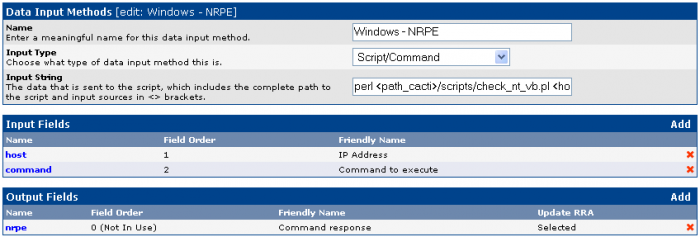

[[[Configuration de Cacti](configuration@do=backlink.html)]]

[wiki monitoring-fr.org](../start.html "[ALT+H]")

-   [Accueil](../index.html "Cliquez pour revenir |  l'accueil")
-   [Blog](http://www.monitoring-fr.org "Blog & News")
-   [Forums](http://forums.monitoring-fr.org "Forums")
-   [Doc](http://doc.monitoring-fr.org "Doc")
-   [Forge](https://github.com/monitoring-fr "Forge")

Vous êtes ici: [Accueil](../start.html "start") »
[Cacti](start.html "cacti:start") » [Configuration de
Cacti](configuration.html "cacti:configuration")

### Table des matières {.toggle}

-   [Configuration de Cacti](configuration.html#configuration-de-cacti)
    -   [Principes](configuration.html#principes)
    -   [NRPE utilisé en Data Input
        Method](configuration.html#nrpe-utilise-en-data-input-method)

Configuration de Cacti {#configuration-de-cacti .sectionedit1}
======================

Principes {#principes .sectionedit2}
---------

Pour pouvoir tracer les graphiques, Cacti est organisé comme suit :

-   Data Input Methods : Permet d’indiquer à Cacti quel moyen utiliser
    pour récupérer les données à grapher. Ce moyen est soit un
    script/commande stocké sur le serveur soit un check SNMP.
-   Data Source : Permet de spécifier la source à utiliser pour grapher.
    S’appuie sur un Data Input Method pour avoir un moyen de récupérer
    ces données. Stocke les données récupérées dans un fichier rrdtool.

NRPE utilisé en Data Input Method {#nrpe-utilise-en-data-input-method .sectionedit3}
---------------------------------

NRPE, l’agent de Nagios peut être utilisé depuis Cacti pour récupérer
les valeurs à stocker dans les rrd. Cacti va appeler l’éxecutable
check\_nrpe. Un démon NRPE doit bien sûr être installé sur le serveur où
l’on veut récupérer des données à grapher.

L’exemple ci-dessous illustre cette configuration. On renseigne au
niveau cacti un chemin vers un script/command situé dans le dossier des
scripts de cacti qui est un appel écrit en perl vers check\_nrpe à qui
on passe deux arguments. \<host\> correspond à l’adresse IP du serveur à
checker et \<command\> correspond à la commande/script à éxecuter sur le
serveur distant. Cette commande est en fait un alias renseigné dans le
fichier de configuration du démon NRPE distant pointant vers un script
bash/perl/VB/PHP… Le nombre d’arguments que l’on peut passer par cette
méthode est en théorie “infini”.

~~~~ {.code}
perl <path_cacti>/scripts/check_nt_vb.pl <host> <command>
~~~~

Ci-dessous le contenu du script check\_nt\_vb.pl. Les arguments saisis
dans Cacti sous forme \<host\> et \<command\> se retrouve renvoyé au
check\_nrpe de Nagios sous forme \$ARGV[0], \$ARGV[1]

~~~~ {.code}
#!/usr/bin/perl

$response=`/usr/local/nagios/libexec/check/check_nrpe -H $ARGV[0] -c $ARGV[1]`;
print "$response";
~~~~

Cependant, il faut utiliser côté nrpe de la machine distante des scripts
prévus pour renvoyer des valeurs exploitables par Cacti; les scripts
prévus pour Nagios ne sont pas utilisables. Là où un script Nagios
renvoie un état et éventuellement des valeurs, un script Cacti doit
renvoyer exclusivement des valeurs qui seront stockées dans un fichier
rrdtool.

Une solution possible pour utiliser un script valable pour Cacti et
Nagios est d’utiliser des scripts compatibles perfparse et le script
[n2rrd](http://n2rrd.diglinks.com/cgi-bin/trac.cgi "http://n2rrd.diglinks.com/cgi-bin/trac.cgi")
qui permet au script Nagios d’aller renseigner lui-même le fichier rrd.
Une seule mesure est donc prise sur la machine distante pour renvoyer
les valeurs d’état et de graphes.

SOMMAIRE {#sommaire .sectionedit1}
--------

**[Accueil](../start.html "start")**

**[Supervision](../supervision/start.html "supervision:start")**

-   [Nagios](../nagios/start.html "nagios:start")
-   [Centreon](../centreon/start.html "centreon:start")
-   [Shinken](../shinken/start.html "shinken:start")
-   [Zabbix](../zabbix/start.html "zabbix:start")
-   [OpenNMS](../opennms/start.html "opennms:start")
-   [EyesOfNetwork](../eyesofnetwork/start.html "eyesofnetwork:start")
-   [Groundwork](../groundwork/start.html "groundwork:start")
-   [Zenoss](../zenoss/start.html "zenoss:start")
-   [Vigilo](../vigilo/start.html "vigilo:start")
-   [Icinga](../icinga/start.html "icinga:start")
-   [Cacti](start.html "cacti:start")
-   [Ressenti
    utilisateur](../supervision/eue/start.html "supervision:eue:start")
-   [Ressenti utilisateur avec
    sikuli](../sikuli/eue/start.html "sikuli:eue:start")

**[Hypervision](../hypervision/start.html "hypervision:start")**

-   [Canopsis](../canopsis/start.html "canopsis:start")

**[Sécurité](../securite/start.html "securite:start")**

**[Infrastructure](../infra/start.html "infra:start")**

**[Développement](../dev/start.html "dev:start")**

Cacti {#cacti .sectionedit1}
-----

-   [Configuration de Cacti](configuration.html "cacti:configuration")
-   [Installation Cacti sur RedHat
    9](redhat-install.html "cacti:redhat-install")
-   [Installation de Cacti
    Windows](windows-install.html "cacti:windows-install")
-   [Installation de Cacti sur
    Ubuntu](ubuntu-install.html "cacti:ubuntu-install")

-   [Afficher le texte
    source](configuration@do=edit&rev=0.html "Afficher le texte source [V]")
-   [Anciennes
    révisions](configuration@do=revisions.html "Anciennes révisions [O]")
-   [Derniers
    changements](configuration@do=recent.html "Derniers changements [R]")
-   [Liens vers cette
    page](configuration@do=backlink.html "Liens vers cette page")
-   [Gestionnaire de
    médias](configuration@do=media.html "Gestionnaire de médias")
-   [Index](configuration@do=index.html "Index [X]")
-   [Connexion](configuration@do=login&sectok=6bca6bdf16f8880de3d6d3649db89a26.html "Connexion")
-   [Haut de page](configuration.html#dokuwiki__top "Haut de page [T]")

cacti/configuration.txt · Dernière modification: 2013/03/29 09:39
(modification externe)

