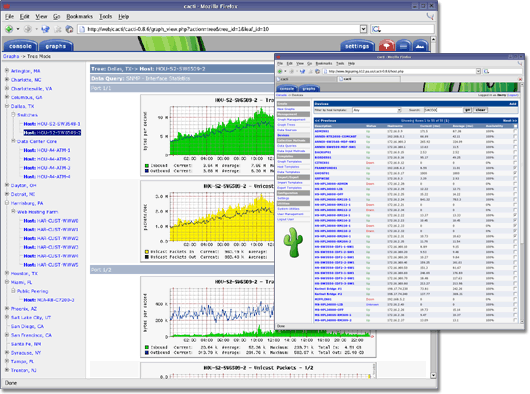

Cacti est un logiciel de supervision (dit de « capacity planning ») basé
sur RRDtool permettant de surveiller l’activité de son architecture
informatique à partir de graphiques quotidiens, hebdomadaires, mensuels
et annuels.

Cette solution n’est donc pas destinée à alerter en temps réel sur les
dysfonctionnements d’un système mais bien de proposer une vision dans le
temps de l’évolution d’indicateurs matériels et logiciels (trafic
réseau, occupation des disques, temps de réponse, etc…).

  **Rôle**        **Nom**
  --------------- ------------------------------------------------------------------------------------------------------------------------------------------
  **Rédacteur**   [Olivier JAN](http://www.monitoring-fr.org/community/members/olivier-jan/ "http://www.monitoring-fr.org/community/members/olivier-jan/")

Caractéristiques {#caracteristiques .sectionedit3}
----------------

Cacti est une interface de présentation (frontend) complète à RRDTool,
il stocke toute l’information nécessaire pour créer des graphiques et
pour les peupler avec des données dans une base de données MySQL. Le
frontend est complètement écrit PHP. Il supporte également SNMP et tend
à se substituer à MRTG pour créer des graphiques.

Cacti permet d’alimenter les graphiques à partir de n’importe quel
script / command externe.

Une fois qu’un ou plusieurs points d’émission de données sont définis,
un graphique de RRDTool peut être créé en utilisant les données. Cacti
vous permet de créer presque n’importe quel graphique en utilisant tous
les types de graphique de RRDTool et fonctions standards de
consolidation, mais aussi de présentation. Cacti offre également une
gestion d’utilisateurs qui permet à chacun la possibilité de
personnaliser l’interface mais aussi de limiter l’accès.

-   [Site Officiel](http://www.cacti.net/ "http://www.cacti.net/")
-   [Introduction Cacti au format
    OpenOffice](../assets/media/cacti/20050627_introduction_cacti.sxw "cacti:20050627_introduction_cacti.sxw")

Présentation de RRDtool {#presentation-de-rrdtool .sectionedit4}
-----------------------

Le programme RRDtool a été développé par Tobias Etiker dès 1995. Il est
librement téléchargeable sur le site suivant :
[http://people.ee.ethz.ch/\~oetiker/webtools/rrdtool/](http://people.ee.ethz.ch/~oetiker/webtools/rrdtool/ "http://people.ee.ethz.ch/~oetiker/webtools/rrdtool/").

RRD est l’acronyme de Round Robin Database, qui peut se traduire par «
base de données cyclique ». Ce mécanisme permet de stocker des données
dans des fichiers de taille invariante, définie à la création, par un
mécanisme de pile LILO (Last In Last Out). Un fichier RRD peut contenir
plusieurs RRA (Round Robin Archive) qui correspondent aux différents
cycles de conservation des données (jour, semaine, mois, année, etc.).

Une fois les données collectées, RRDtool fournit des outils permettant
de générer des graphiques hautement personnalisables, retraitant les
données à la volée.

Installation {#installation .sectionedit5}
------------

### Pré-requis {#pre-requis .sectionedit6}

Évidemment un serveur LAMP (Linux, Apache, Mysql, php4) et phpmyadmin
(optionnel). Pour ce qui est des autres dépendances :

-   rrdtool
-   net-snmp

Note : en ce qui concerne les personnes qui utilise les modules php4, il
ne vaut surtout pas oublié d’installer le module php4-session.

Configuration {#configuration .sectionedit7}
-------------

-   [Configuration de Cacti](configuration.html "cacti:configuration")

La configuration pour Apache

~~~
Alias /cacti /usr/share/cacti/site

<DirectoryMatch /usr/share/cacti/site>
        Options +FollowSymLinks
        AllowOverride None
        order allow,deny
        allow from all
        <IfModule mod_php4.c>
                AddType application/x-httpd-php .php
                php_flag magic_quotes_gpc Off
                php_flag short_open_tag On
                php_flag register_globals Off
                php_flag register_argc_argv On
                php_flag track_vars On
                # this setting is necessary for some locales
                php_value mbstring.func_overload 0
                php_value include_path .

                DirectoryIndex index.php
        </IfModule>
</DirectoryMatch>
~~~

Cacti sur le web {#cacti-sur-le-web .sectionedit8}
----------------

-   [Le sites des utilisateurs de cacti avec des
    plug-ins](http://cactiusers.org/ "http://cactiusers.org/")
-   [Liste des plug
    Cacti](http://www.debianhelp.co.uk/cactiplugins.htm "http://www.debianhelp.co.uk/cactiplugins.htm")
-   [Utiliser Cacti avec
    RRDTool](http://docs.cacti.net/node/75 "http://docs.cacti.net/node/75")
-   [Liste templates et
    scripts](http://forums.cacti.net/about15067.html "http://forums.cacti.net/about15067.html")

Cacti sur le wiki monitoring-fr {#cacti-sur-le-wiki-monitoring-fr .sectionedit9}
-------------------------------

-   [Configuration de Cacti](configuration.html "cacti:configuration")
-   [Installation Cacti sur RedHat
    9](redhat-install.html "cacti:redhat-install")
-   [Installation de Cacti
    Windows](windows-install.html "cacti:windows-install")
-   [Installation de Cacti sur
    Ubuntu](ubuntu-install.html "cacti:ubuntu-install")

-   [Nagios
    Intégration](../nagios/integration/npc.html "nagios:integration:npc")