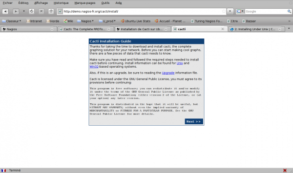
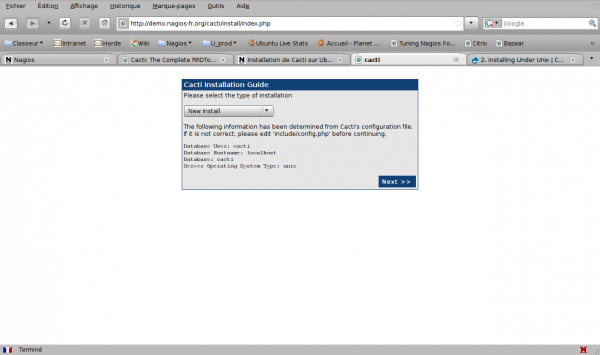
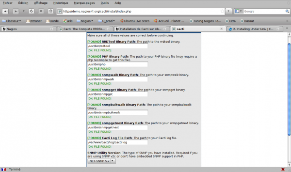

Vous devez déjà avoir un serveur LAMP fonctionnel pour effectuer cette
installation.

Cacti a besoin des paquets Ubuntu rrdtool, php5, php5-mysql, php5-cli,
snmp. La mémoire pour PHP5 est de 128 Mo recommandée à modifier dans
/etc/php5/apache2/php.ini

~~~
wget http://www.cacti.net/downloads/cacti-0.8.7b.tar.gz
tar xzf cacti-0.8.7b.tar.gz
sudo mv cacti-0.8.7b.tar.gz /var/www/cacti
cd /var/www/cacti
sudo chown -R www-data:www-data /var/ww/cacti
~~~

Créer la base de données et le compte associé sur MySQL

~~~ {.code .sql}
CREATE USER 'cacti'@'localhost' IDENTIFIED BY '****************';
 
GRANT USAGE ON * . * TO 'cacti'@'localhost' IDENTIFIED BY '****************' WITH MAX_QUERIES_PER_HOUR 0 MAX_CONNECTIONS_PER_HOUR 0 MAX_UPDATES_PER_HOUR 0 MAX_USER_CONNECTIONS 0 ;
 
CREATE DATABASE IF NOT EXISTS `cacti` ;
 
GRANT ALL PRIVILEGES ON `cacti` . * TO 'cacti'@'localhost';
~~~

Injecter le dump de la base dans la base ainsi créée.

~~~
mysql -u root -p cacti < cacti.sql
~~~

Editer le fichier include/config.php pour y renseigner les paramètres de
connexion à la base de données.

~~~
$database_type = "mysql";
$database_default = "cacti";
$database_hostname = "localhost";
$database_username = "cactiuser";
$database_password = "cactipass";
$database_port = "3306";
~~~

Il ne reste plus qu’à se rendre sur /cacti/install/ en se connectant au
serveur sur lequel Cacti est installé et de répondre aux quelques écrans
proposés.

Premier écran d’installation

Nouvelle installation

Tout est en place au niveau des programmes externes dont a besoin Cacti
pour fonctionner.

Il est maintenant possible de se connecter sur l’interface de Cacti avec
**admin** comme identifiant et **cacti** comme mot de passe. Il vous est
demandé de le changer immédiatemment après.

Pour finir, exécuter le poller toutes les 5 minutes par exemple avec une
tâche cron.

~~~
sudo nano /etc/cron.d/cacti
~~~

Y mettre cette ligne

~~~
*/5 * * * * www-data php /var/www/cacti/poller.php > /dev/null 2>&1
~~~