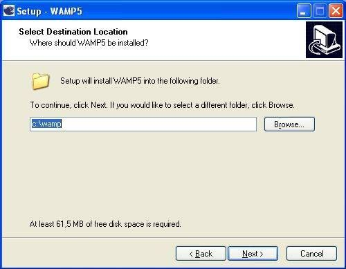
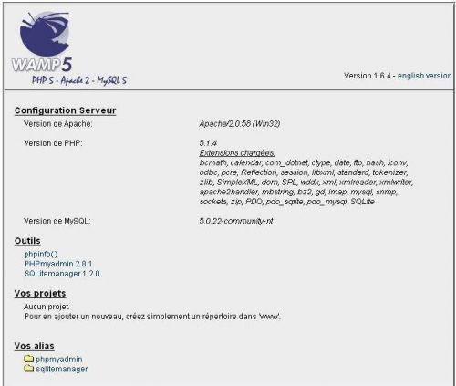
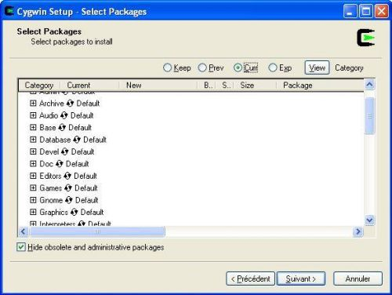
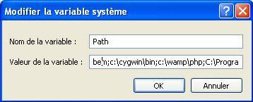
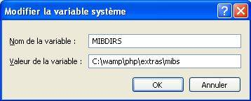
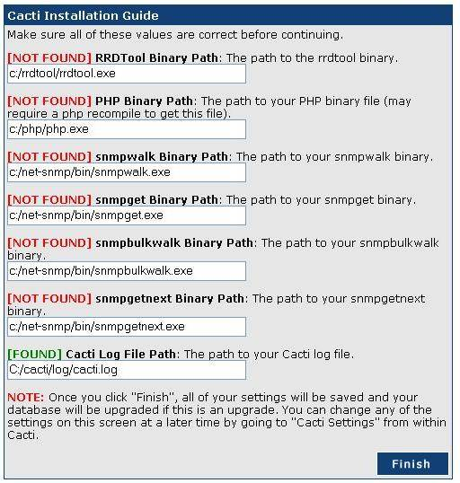

Versions des logiciels utilisées {#versions-des-logiciels-utilisees .sectionedit2}
--------------------------------

-   wamp5\_1.6.4a
-   cygwin\_1.5.21-1
-   cacti-0.8.6h + patches officiels
-   cacti-cactid-0.8.6g-cygwin-1.5.20
-   rrdtool-1.2.15-cygwin-1.5.20

Installation de WAMP {#installation-de-wamp .sectionedit3}
--------------------

WAMP est l’acronyme de Windows Apache MySQL PHP. Il permet d’installer
de façon graphique en une seule opération l’ensemble des logiciels
nécessaires à faire fonctionner cacti. Il est de plus régulièrement mis
à jour et installe des versions récentes de chacun des composants.

-   [Télécharger](http://www.wampserver.com/download.php "http://www.wampserver.com/download.php")
    la dernière version de WAMP
-   Lancer l’installeur et choisir le répertoire par défaut *c:\\wamp*
    pour l’installation.

-   Lancer wamp et [se connecter](http://localhost "http://localhost")
    sur l’interface d’administration pour tester l’installation

Installation de Cygwin {#installation-de-cygwin .sectionedit4}
----------------------

-   [Télécharger](http://www.cygwin.com "http://www.cygwin.com") la
    dernière version de Cygwin
-   Lancer setup.exe et choisir le répertoire par défaut *c:\\cygwin*
    pour l’installation
-   Choisissez un mirroir proche de votre lieu et sélectionner les
    paquets suivants dans l’écran de sélection

~~~
Base (tout)
Libs
   libart_lgpl
   libfreetype26
   libpng12
   zlib
Perl (tout)
Utils
   patch
Web
   wget
~~~

-   Dans panneau de configuration –\> Système –\> Onglet Avancé –\>,
    ajouter *c:\\cygwin\\bin* comme variable d’environnement

Installation de Cacti {#installation-de-cacti .sectionedit5}
---------------------

-   [Télécharger](http://cacti.net/download_cacti.php "http://cacti.net/download_cacti.php")
    la dernière version de Cacti
-   [Télécharger](http://cacti.net/download_patches.php "http://cacti.net/download_patches.php")
    les derniers patches officiels pour cacti
-   [Télécharger](http://cacti.net/cactid_download.php "http://cacti.net/cactid_download.php")
    la dernière version de Cacti-Cactid
-   [Télécharger](http://www.cacti.net/downloads/rrdtool/win32/ "http://www.cacti.net/downloads/rrdtool/win32/")
    la dernière version de RRDTools pour Cygwin
-   Décompresser cacti.zip dans *c:\\cacti*
-   Appliquer les patches aux sources en utilisant cygwin. Les commandes
    ci-dessous sont celles pour notre version; elles peuvent différer
    suivant la version de cacti installée.

~~~
cd c:/cacti
wget http://www.cacti.net/downloads/patches/0.8.6h/fix_search_session_clear_issue.patch
wget http://www.cacti.net/downloads/patches/0.8.6h/fix_sql_syntax_related_to_default_rra_id.patch
wget http://www.cacti.net/downloads/patches/0.8.6h/nth_percentile_empty_return_set_issue.patch
wget http://www.cacti.net/downloads/patches/0.8.6h/mysql_5x_strict.patch
wget http://www.cacti.net/downloads/patches/0.8.6h/database_autoincrement_corruption.patch
patch -p1 -N < fix_search_session_clear_issue.patch
patch -p1 -N < fix_sql_syntax_related_to_default_rra_id.patch
patch -p1 -N < nth_percentile_empty_return_set_issue.patch
patch -p1 -N < mysql_5x_strict.patch
patch -p1 -N < database_autoincrement_corruption.patch
chmod -R 755 c:/cacti
~~~

-   Décompresser Cacti-cactid.zip dans *c:\\cacti*
-   Décompresser RRDTools.zip dans *c:\\cacti\\rrdt*
-   Supprimer les dll présents dans ces deux répertoires puisque nous
    utilisons Cygwin.

### Configuration Apache 2 pour Cacti {#configuration-apache-2-pour-cacti .sectionedit6}

-   Editer le fichier *c:\\wamp\\Apache2\\conf\\httpd.conf* et ajouter
    en bas

~~~
Alias "/cacti" "c:/cacti/"
<directory "c:/cacti">
AllowOverride All
#Order allow,deny
Allow from all
</directory>
~~~

### Configuration MySQL 5 pour Cacti {#configuration-mysql-5-pour-cacti .sectionedit7}

-   Dans un shell Cygwin, définir un mot de passe pour l’utilisateur
    root

~~~
cd c:/wamp/mysql/bin
mysqladmin --user=root password somepassword
mysqladmin --user=root --password reload
~~~

-   Créer la base de données MySQL:

~~~
mysqladmin --user=root --password create cacti
~~~

-   Importer la base par défaut de cacti:

~~~
mysql --user=root --password cacti < c:\cacti\cacti.sql
~~~

-   Créer un utilisateur cactiuser et un mot de passe MySQL.

~~~ {.code .sql}
mysql --user=root --password mysql
GRANT ALL ON cacti.* TO cactiuser@localhost IDENTIFIED BY 'cactipw';
FLUSH privileges;
~~~

### Configuration PHP 5 pour Cacti {#configuration-php-5-pour-cacti .sectionedit8}

-   Editer le fichier *C:\\wamp\\Apache2\\bin\\php.ini* et décommenter,
    modifier les lignes suivantes au besoin :

~~~ {.code .php}
extension_dir = "c:\wamp\php\ext"
extension=php_mysql.dll
extension=php_snmp.dll
extension=php_sockets.dll
cgi.force_redirect = 0
file_uploads = On
~~~

-   Dans panneau de configuration –\> Système –\> Onglet Avancé –\>
    Variables d’environnement, éditer et/ou ajouter les variables
    d’environnement suivantes:

~~~
MIBS=ALL
MIBSDIR=C:\wamp\php\extras\mibs
PHPRC=c:\wamp\php
Path=c:\wamp\php;
~~~

Le chemin d’accès à PHP dans la variable Path est à ajouter aux valeurs
déjà définies. Les valeurs existantes sont conservées.

### Configuration Cacti {#configuration-cacti .sectionedit9}

-   Editer le fichier *c:\\cacti\\include\\config.php* et spécifier les
    paramètres de connexion à la base MySQL

~~~ {.code .php}
$database_default = "cacti";
$database_hostname = "localhost";
$database_username = "cactiuser";
$database_password = "pwd";
~~~

-   Se connecter à
    [Cacti](http://localhost/cacti "http://localhost/cacti") avec un
    navigateur pour terminer la configuration
-   Renseigner les chemins d’accès pour refleter l’installation
    effectuée

-   Dans l’interface de Cacti, aller sur Console –\> Settings –\> Paths
    et renseigner le champ RRDTool Default Font Path avec la valeur
    *c:/WINDOWS/Fonts/ARIAL.TTF*
-   Dans panneau de configuration –\> Tâches planifiées –\> Créer une
    tâche planifiée, créer une tâche s’exécutant toutes les 5 mn 24/24h
    7/7j avec la commande *C:\\wamp\\php\\php.exe c:\\cacti\\poller.php*
-   Tester cette commande dans l’invite de commandes. La sortie devrait
    ressembler à ce qui suit:

~~~
OK u:0.00 s:0.06 r:1.32
OK u:0.00 s:0.06 r:1.32
OK u:0.00 s:0.16 r:2.59
OK u:0.00 s:0.17 r:2.62
09/04/2006 04:57:12 PM - SYSTEM STATS: Time:4.7272 Method:cmd.php Processes:1 Threads:N/A Hosts:1 HostsPerProcess:2 DataSources:4 RRDsProcessed:2
~~~

Cacti est désormais prêt à fonctionner

Crédits - Révisions {#credits-revisions .sectionedit10}
-------------------