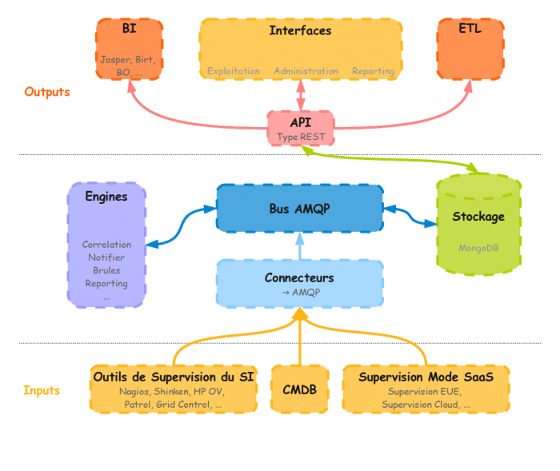

En cours de rédaction…

Documentation rédigée pour une version stable de Canopsis.

Sur cette page, nous allons présenter et décrire comment Canopsis
fonctionne, avec ses différentes interactions et son architecture. Le
tout illustré par des schémas afin d’essayer d’en faciliter la
compréhension.

Cette page a été rédigée par :

  **Rôle**              **Nom**
  --------------------- ---------------------------------------------------------------------------------------------------------------------------------------------------------
  **Rédacteur**         [Ludovic VALENTIN](http://www.monitoring-fr.org/community/members/ludovic-valentin/ "http://www.monitoring-fr.org/community/members/ludovic-valentin/")
  **Contributeur(s)**   William PAIN, Olivier JAN, Romuald FRONTEAU

Composants {#composants .sectionedit3}
----------

### AMQP {#amqp .sectionedit4}

L’[AMQP](http://www.amqp.org/ "http://www.amqp.org/")
est un protocole de message inter-applicatifs qui a pour but de
standardiser les formats de messages entre les différentes applications
dans une couche de transport normalisée. Des éditeurs comme IBM qui
utilise déjà depuis quelques années cette technologie avec Websphere MQ,
ex-MQSeries se trouve aujourd’hui en concurrence avec ce protocole
ouvert. Il est beaucoup utilisé dans les projets de grandes envergures
où le nombre de messages transitant est pharamineux (ex : ERP,
transaction bancaire, …).

### MongoDB {#mongodb .sectionedit5}

[MongoDB](http://www.mongodb.org "http://www.mongodb.org")
est une base NoSQL classée dans la catégorie des technologies Big Data.
Issues des problématiques du Web 2.0 (Moteur de recherche, réseaux
sociaux, …), les bases Big Data sont prévues pour stocker des Pétaoctets
de données sans problématique de restitution.

### ExtJS {#extjs .sectionedit6}

[ExtJS](http://www.sencha.com/products/extjs "http://www.sencha.com/products/extjs")
est une API de type REST beaucoup utilisée dans le cadre du web 2.0. Il
possède l’avantage de très bien s’associer dans la combinaison MongoDB
–\> JSON –\> EXTJS.

### Python {#python .sectionedit7}

Le coeur de la solution est
développé en [Python](http://www.python.org/ "http://www.python.org/")
car ce langage de programmation a su faire ces preuves, il est simple à
prendre en main et il possède une multitude de librairies. Et ça tombe
bien, il y en a pour AMQP, json, Mongo ce qui permet de simplifier le
dialogue des différentes briques de l’architecture … On retrouve encore
ce désir de simplicité …

Interactions {#interactions .sectionedit8}
------------

Architecture {#architecture .sectionedit9}
------------

