Cette page se base sur la documentation de Centreon :

[http://en.doc.centreon.com/Setup:Centos/Fedora/RHEL/fr](http://en.doc.centreon.com/Setup:Centos/Fedora/RHEL/fr "http://en.doc.centreon.com/Setup:Centos/Fedora/RHEL/fr")

Installation des pré-requis {#installation-des-pre-requis .sectionedit2}
---------------------------

### Installation du dépôt "RPM forge" {#installation-du-depot-rpm-forge .sectionedit3}

Nous allons ajouter aux sources de dépôt celui de RPMForge pour éviter
quelques désagréments de compilation (par exemple RRDTool n’est pas
disponible sur les dépôts officiels).

Dans un terminal, exécutez les commandes suivantes :

~~~
 
# wget http://apt.sw.be/redhat/el5/en/i386/RPMS.dag/rpmforge-release-0.3.6-1.el5.rf.i386.rpm
# rpm --import http://dag.wieers.com/rpm/packages/RPM-GPG-KEY.dag.txt
# rpm -Uvh rpmforge-release-0.3.6-1.el5.rf.i386.rpm
~~~

### Installation des dépendances {#installation-des-dependances .sectionedit4}

Concernant les packages nécessaires pour l’installation de Centreon,
vous allez être servi.

~~~
# yum install httpd gd fontconfig-devel libjpeg-devel libpng-devel gd-devel perl-GD perl-Config-IniFiles perl-DBI perl-DBD-MySQL openssl-devel mysql-server mysql-devel php php-mysql php-gd php-ldap php-xml rrdtool perl-rrdtool perl-RRD-Simple perl-Crypt-DES perl-Digest-SHA1 perl-Digest-HMAC net-snmp-utils perl-Socket6 perl-IO-Socket-INET6 net-snmp net-snmp-libs php-snmp dmidecode lm_sensors perl-Net-SNMP net-snmp-perl mailx postfix fping graphviz cpp gcc gcc-c++ libstdc++ glib2-devel libtool-ltdl-devel
~~~

### Installation de PEAR {#installation-de-pear .sectionedit5}

Le package “pear” et certaines de ces dépendances sont utiles au bon
fonctionnement de Centreon. **Pear ne doit être installé que sur le
Centreon Central si vous êtes dans le cas d’une architecture
distribuée.**

~~~
# yum install php-pear
~~~

Si vous possédez un proxy, il faut paramétrer pear pour qu’il puisse
sortir sur le web.

~~~
# pear config-set http_proxy http://my_proxy:port_my_proxy
~~~

Maintenant, installons les dépendances de pear (ceci va prendre un peu
de temps. C’est pire quand vous ne pouvez pas sortir sur le web)

~~~
# pear channel-update pear.php.net
# pear upgrade pear
# pear upgrade-all
# pear install SOAP Validate XML_RPC
# pear install DB DB_DataObject DB_DataObject_FormBuilder
# pear install Archive_Tar Auth_SASL Console_Getopt Date
# pear install HTML_Common HTML_QuickForm 
# pear install HTML_QuickForm_advmultiselect HTML_Table
# pear install HTTP_Request Image_GraphViz Log MDB2
# pear install Net_Ping Net_SMTP Net_Socket Net_Traceroute Net_URL
# pear install Structures_Graph
~~~

**Bien faire attention au installation, parfois certaines tombent en
failed. Utilisez l’option -f pour les installer de force**

### Mysql {#mysql .sectionedit6}

Nous allons ajouter un mot de passe à l’utilisateur root pour plus de
sécurité :

~~~
# /etc/init.d/mysqld start
# /usr/bin/mysqladmin -u root password 'mot_de_passe'
~~~

Installation de Nagios 3.x {#installation-de-nagios-3x .sectionedit7}
--------------------------

**Pour l’installation de Nagios 3.x, se référer la page du Wiki
[Installation de Nagios 3.x sur CentOS
5.3](../nagios/nagios-centos-install.html "nagios:nagios-centos-install")**

Installation des plugins Nagios {#installation-des-plugins-nagios .sectionedit8}
-------------------------------

**Pour installer les plugins Nagios, veuillez vous référer à la page du
Wiki
[installation-des-plugins-nagios](../nagios/nagios-centos-install.html#installation-des-plugins-nagios "nagios:nagios-centos-install")**

Installation de NDOUtils v 1.4b7 {#installation-de-ndoutils-v-14b7 .sectionedit9}
--------------------------------

**Lien vers l’installation de NDOutils :
[[http://wiki.monitoring-fr.org/nagios/addons/ndoutils]](../nagios/addons/ndoutils].html "http://wiki.monitoring-fr.org/nagios/addons/ndoutils]")**

Nous allons récupérer la version 1.4 bêta 7 car la bêta 8 n’est pas
encore inscrite comme supportable sur nagios.org.

~~~
# wget http://sourceforge.net/projects/nagios/files/ndoutils-1.x/ndoutils-1.4b7.tar.gz/download
# tar xzf ndoutils-1.4b7
# cd ndoutils-1.4b7
~~~

-   **Compilation & Installation**

~~~
# ./configure --prefix=/usr/local/nagios --enable-mysql --disable-pgsql --with-ndo2db-user=nagios --with-ndo2db-group=nagios

# make
~~~

Ensuite on copie les fichiers du module ndo dans l’arborescence Nagios

~~~
# cp ./src/ndomod-3x.o /usr/local/nagios/bin/ndomod.o
# cp ./src/ndo2db-3x /usr/local/nagios/bin/ndo2db
# cp ./config/ndo2db.cfg /usr/local/nagios/etc/
# cp ./config/ndomod.cfg /usr/local/nagios/etc/
~~~

On affecte les bons droits pour Nagios

~~~
# chmod 774 /usr/local/nagios/bin/ndo*
# chown nagios:nagios /usr/local/nagios/bin/ndo*
~~~

#### Création du script d'init ndo2db {#creation-du-script-d-init-ndo2db}

Cette étape n’est à réaliser que sur le serveur central. En effet, il
s’agit de configurer l’agent ndo2db qui va recevoir les informations des
modules ndomod afin de les enregistrer en base MySQL :

1.  copier le fichier daemon-init.in en ndo2db:

~~~
# cp /root/ndoutils-1.5.2/daemon-init.in /etc/init.d/ndo2db
~~~

1.  ajouter le script dans les programmes de démarrage automatiques :

~~~
# /sbin/chkconfig --add ndo2db 
# chmod +x /etc/init.d/ndo2db
~~~

Installation Centreon 2.1 {#installation-centreon-21 .sectionedit10}
-------------------------

**ASTUCE :**

**Pour éviter d’avoir à saisir à chaque fois les chemins**

**\# export PATH=“\$PATH:/opt/nagios/bin/“**

### Récupération des sources {#recuperation-des-sources .sectionedit11}

Nous allons télécharger la dernière mouture de centreon.

~~~
# wget http://download.centreon.com/centreon/centreon-2.1.1.tar.gz
# tar -xvzf centreon-2.1.1.tar.gz
# cd centreon-2.1.1
~~~

### Installation {#installation .sectionedit12}

Passons le fichier /etc/sudoers en écriture car le script d’installation
de centreon va le modifier.

~~~
# chmod +w /etc/sudoers
~~~

Nous allons lancer le script d’installation de centreon.

**ASTUCE :**

**Il faut savoir que dans la version 2.1, Merethis a mis en place un
système de fichiers templates pour automatiser votre installation (vos
propres chemins pré-définis)**

**Ceci peut faire gagner un temps fou en les rentrant à l’avance.**

**Je vous invite à aller voir comment faire :**

**[Utiliser des templates d'installation
Centreon](http://fr.doc.centreon.com/Setup:HowToUseTemplateWithInstallCentreon2/fr "http://fr.doc.centreon.com/Setup:HowToUseTemplateWithInstallCentreon2/fr")**

~~~
# ./install.sh -i
~~~

~~~
This General Public License does not permit incorporating your program into
proprietary programs.  If your program is a subroutine library, you may
consider it more useful to permit linking proprietary applications with the
library.  If this is what you want to do, use the GNU Library General
Public License instead of this License.

Do you accept GPL license ?
[y/n], default to [n]:
> y
------------------------------------------------------------------------
    Please choose what you want to install
------------------------------------------------------------------------

Do you want to install : Centreon Web Front
[y/n], default to [n]:
> y

Do you want to install : Centreon CentCore
[y/n], default to [n]:
> y

Do you want to install : Centreon Nagios Plugins
[y/n], default to [n]:
> y

Do you want to install : Centreon Snmp Traps process
[y/n], default to [n]:
> y

------------------------------------------------------------------------
    Start CentWeb Installation
------------------------------------------------------------------------

Where is your Centreon directory?
default to [/usr/local/centreon]
> 

Where is your Centreon log directory
default to [/usr/local/centreon/log]
> 

Where is your Centreon etc directory
default to [/etc/centreon]
> /usr/local/centreon/etc

Do you want me to create this directory ? [/usr/local/centreon/etc]
[y/n], default to [n]:
> y
Path /usr/local/centreon/etc                                     OK

Where is your Centreon generation_files directory?
default to [/usr/local/centreon]
> 

Where is your Centreon variable library directory?
default to [/var/lib/centreon]
> /usr/local/centreon/var/lib

Do you want me to create this directory ? [/usr/local/centreon/var/lib]
[y/n], default to [n]:
> y
Path /usr/local/centreon/var/lib                                 OK

Where is your CentPlugins Traps binary
default to [/usr/local/centreon/bin]
> 
~~~

**ASTUCE :**

**Pour la partie suivante, il se peut que le chemin change. Je vous
conseille donc de faire la commande dans un autre terminal :**

~~~
locate RRDs.pm

locate PEAR.php
~~~

~~~
Where is the RRD perl module installed [RRDs.pm]
default to [/usr/lib/perl5/RRDs.pm]
> /usr/lib/perl5/vendor_perl/5.8.8/i386-linux-thread-multi/RRDs.pm
Path /usr/lib/perl5/vendor_perl/5.8.8/i386-linux-thread-mulOK
/usr/bin/rrdtool                                           OK
/bin/mail                                                  OK

Where is PEAR [PEAR.php] 
default to [/usr/share/php/PEAR.php]
> /usr/share/pear/PEAR.php
Path /usr/share/pear                                       OK

Where is installed Nagios ?
default to [/usr/local/nagios]
> 

Where is your nagios config directory
default to [/usr/local/nagios/etc]
> 

Where is your Nagios var directory ?
default to [/usr/local/nagios/var]
> 

Where is your Nagios plugins (libexec) directory ?
default to [/usr/local/nagios/libexec]
> 

Where is your Nagios image directory ?
default to [/usr/local/nagios/share/images/logos]
> 
Path /usr/local/nagios/share/images/logos                  OK
/usr/local/nagios/bin//nagiostats                          OK
p1_file : /usr/local/nagios/bin/p1.pl                      OK
/usr/bin/php                                               OK
/usr/bin/perl                                              OK
Finding Apache group :                                     apache
Finding Apache user :                                      apache
Finding Nagios user :                                      nagios
Finding Nagios group :                                     nagios
/usr/local/nagios/bin//ndomod.o                            OK

------------------------------------------------------------------------
    Configure Sudo
------------------------------------------------------------------------

Where is sudo configuration file
default to [/etc/sudoers]
> /etc/sudoers
/etc/sudoers                                               OK
Nagios init script                                         OK
Your sudo is not configured

Do you want me to configure your sudo ? (WARNING) 
[y/n], default to [n]:
> y
Configuring Sudo                                           OK
I think you'll have a problem with
'Default requiretty' in sudo file
Press enter to continue.

For security policy, your sudo's
configuration would only run when the user is logged into a real tty. Please adjust your configuration by commenting 'Defaults requiretty' line in your configuration file.                                                WARNING

------------------------------------------------------------------------
    Configure Apache server
------------------------------------------------------------------------

Do you want to add Centreon Apache sub configuration file ?
[y/n], default to [n]:
> y
Create '/etc/httpd/conf.d/centreon.conf'                   OK
Configuring Apache                                         OK

Do you want to reload your Apache ?
[y/n], default to [n]:
> y
Reloading Apache service                                   OK
Preparing Centreon temporary files
Change right on /usr/local/centreon/log                    OK
Change right on /usr/local/centreon/etc                    OK
Change right on /usr/local/nagios/share/images/logos       OK
Install nagios documentation                               OK
Change macros for insertBaseConf.sql                       OK
Change macros for php files
Change macros for php files                                OK
Change right on /usr/local/nagios/etc                      OK
Copy CentWeb in system directory
Install CentWeb (web front of centreon)                    OK
Install libraries                                          OK
Copying libinstall                                         OK
Change macros for centreon.cron                            OK
Install Centreon cron.d file                               OK
Change macros for archiveDayLog                            OK
Change macros for centAcl.php                              OK
Install cron directory                                     OK

------------------------------------------------------------------------
Pear Modules
------------------------------------------------------------------------
Check PEAR modules
PEAR                            1.4.9       1.4.9          OK
DB                              1.7.6       1.7.13         OK
DB_DataObject                   1.8.4       1.8.12         OK
DB_DataObject_FormBuilder       1.0.0RC4    1.0.0          OK
MDB2                            2.0.0       2.4.1          OK
Date                            1.4.6       1.4.7          OK
HTML_Common                     1.2.2       1.2.5          OK
HTML_QuickForm                  3.2.5       3.2.11         OK
HTML_QuickForm_advmultiselect   1.1.0       1.5.1          OK
HTML_Table                      1.6.1       1.8.2          OK
Archive_Tar                     1.1         1.3.3          OK
Auth_SASL                       1.0.1       1.0.3          OK
Console_Getopt                  1.2         1.2.3          OK
Net_SMTP                        1.2.8       1.3.3          OK
Net_Socket                      1.0.1       1.0.9          OK
Net_Traceroute                  0.21        0.21.1         OK
Net_Ping                        2.4.1       2.4.4          OK
Validate                        0.6.2       0.8.2          OK
XML_RPC                         1.4.5       1.5.2          OK
SOAP                            0.10.1      0.12.0         OK
Log                             1.9.11      1.11.5         OK
All PEAR modules                                           OK

------------------------------------------------------------------------
        Centreon Post Install
------------------------------------------------------------------------
Create /usr/local/centreon/www/install/install.conf.php    OK
Create /usr/local/centreon/etc/instCentWeb.conf            OK

------------------------------------------------------------------------
    Start CentStorage Installation
------------------------------------------------------------------------
Where is your Centreon Run Dir directory?
default to [/var/run/centreon]
> /usr/local/centreon/var/run

Where is your CentStorage binary directory
default to [/opt/centreon/bin]
> 
Path /usr/local/centreon/bin                               OK

Where is your CentStorage RRD directory
default to [/var/lib/centreon]
> /usr/local/centreon/var/rrd

Path /usr/local/centreon/var/rrd                           OK
Finding Nagios group :                                     nagios
Finding Nagios user :                                      nagios
Preparing Centreon temporary files
/tmp/centreon-setup exists, it will be moved...
install www/install/createTablesCentstorage.sql            OK
Creating Centreon Directory '/usr/local/centreon/var/rrd/status' OK
Creating Centreon Directory '/usr/local/centreon/var/rrd/metrics'OK
Change macros for centstorage binary                       OK
Install CentStorage binary                                 OK
Install library for centstorage                            OK
Change right : /usr/local/centreon/var/r                   OK
Change macros for centstorage init script                  OK
Do you want me to install CentStorage init script ?
[y/n], default to [n]:
> y
CentStorage init script installed                          OK

Do you want me to install CentStorage run level ?
[y/n], default to [n]:
> y
Change macros for logAnalyser                              OK
Install logAnalyser                                        OK
Change macros for nagiosPerfTrace                          OK
Install nagiosPerfTrace                                    OK
Change macros for purgeLogs                                OK
Install purgeLogs                                          OK
Change macros for purgeCentstorage                         OK
Install purgeCentstorage                                   OK
Change macros for centreonPurge.sh                         OK
Install centreonPurge.sh                                   OK
Change macros for centstorage.cron                         OK
Install CentStorage cron                                   OK
Create /usr/local/centreon/etc/instCentStorage.conf        OK

------------------------------------------------------------------------
    Start CentCore Installation
------------------------------------------------------------------------

Where is your CentCore binary directory
default to [/usr/local/centreon/bin]
>
Path /usr/local/centreon/bin                               OK
/usr/bin/ssh                                               OK
/usr/bin/scp                                               OK
Finding Nagios group :                                     nagios
Finding Nagios user :                                      nagios
Preparing Centreon temporary files
/tmp/centreon-setup exists, it will be moved...
Change CentCore Macro                                      OK
Copy CentCore in binary directory                          OK
Change right : /usr/local/centreon/var/run                 OK
Change right : /usr/local/centreon/var/lib                 OK
Replace CentCore init script Macro                         OK

Do you want me to install CentCore init script ?
[y/n], default to [n]:
>y

CentCore init script installed                             OK

Do you want me to install CentCore run level ?
[y/n], default to [n]:
> y
Create /usr/local/centreon/etc/instCentCore.conf           OK

------------------------------------------------------------------------
    Start CentPlugins Installation
------------------------------------------------------------------------

Where is your CentPlugins lib directory
default to [/var/lib/centreon/centplugins]
> /usr/local/centreon/centplugins

Do you want me to create this directory ? [/usr/local/centreon/centplugins]
[y/n], default to [n]:
> y
Path /usr/local/centreon/centplugins                       OK
Finding Nagios user :                                      nagios
Finding Nagios group :                                     nagios
Preparing Centreon temporary files
/tmp/centreon-setup exists, it will be moved...
Change macros for CentPlugins                              OK
Installing the plugins                                     OK
Change right on centreon.conf                              OK
CentPlugins is installed

------------------------------------------------------------------------
    Start CentPlugins Traps Installation
------------------------------------------------------------------------

Where is your SNMP configuration directory
default to [/etc/snmp]
>
Where is your SNMPTT binaries directory
default to [/usr/local/centreon/bin/]
> 
/usr/local/centreon/bin                                    OK
Finding Nagios group :                                     nagios
Finding Apache user :                                      apache
Preparing Centreon temporary files
/tmp/centreon-setup exists, it will be moved...
Change macros for CentPluginsTraps                         OK
Installing the plugins Trap binaries                       OK
Backup all your snmp files                                 OK
Change macros for snmptrapd.conf                           OK
Change macros for snmptt.ini                               OK
Install : snmptrapd.conf                                   OK
Install : snmp.conf                                        OK
Install : snmptt.ini                                       OK
Install : snmptt                                           OK
Install : snmpttconvertmib                                 OK
Create /usr/local/centreon/etc/instCentPlugins.conf        OK
###############################################################################
#                                                                             #
#                 Go to the URL : http://your-server/centreon/                #
#                            to finish the setup                              #
#                                                                             #
#                  Report bugs at http://forge.centreon.com                   #
#                                                                             #
#                         Thanks for using Centreon.                          #
#                          -----------------------                            #
#                        Contact : [email protected]
/*  */!function(){try{var t="currentScript"in document?document.currentScript:function(){for(var t=document.getElementsByTagName("script"),e=t.length;e--;)if(t[e].getAttribute("cf-hash"))return t[e]}();if(t&&t.previousSibling){var e,r,n,i,c=t.previousSibling,a=c.getAttribute("data-cfemail");if(a){for(e="",r=parseInt(a.substr(0,2),16),n=2;a.length-n;n+=2)i=parseInt(a.substr(n,2),16)^r,e+=String.fromCharCode(i);e=document.createTextNode(e),c.parentNode.replaceChild(e,c)}}}catch(u){}}();/*  */                         #
#                          http://www.centreon.com                            #
#                                                                             #
###############################################################################
~~~

Pour finir, redémarrez apache

~~~
service httpd restart
~~~

Éditez le fichier « /etc/sudoers » afin de commenter la ligne 56 :

~~~
# Defaults    requiretty
~~~

Supprimez les droits d’écriture sur /etc/sudoers

~~~
# chmod -w /etc/sudoers
~~~

#### Partie Web

Il nous reste encore la partie Web à paramétrer.

Une fois la partie de l’installation en ligne de commande finie,
centreon est accessible via l’url : <http://IP_SERV_CENTREON/centreon>

Vous devrez terminer la configuration de Centreon via la partie Web.

[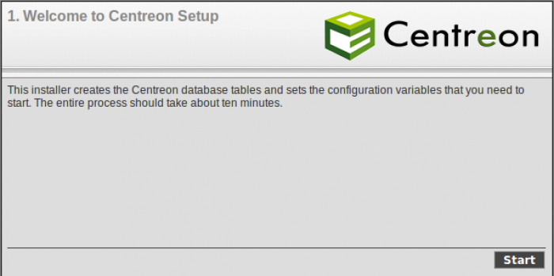](../_detail/powered/centreon/centreon_debut_config.png@id=centreon%253Acentreon-centos-install.html "powered:centreon:centreon_debut_config.png")

Vous allez devoir accepter les termes de licence

[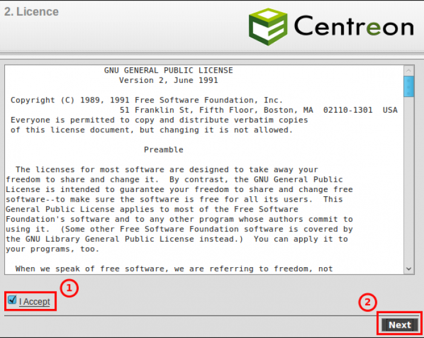](../_detail/powered/centreon/centreon_accept_licence.png@id=centreon%253Acentreon-centos-install.html "powered:centreon:centreon_accept_licence.png")

Ensuite, quelques valeurs d’environnement à vérifier pour que centreon
communique bien avec Nagios.

[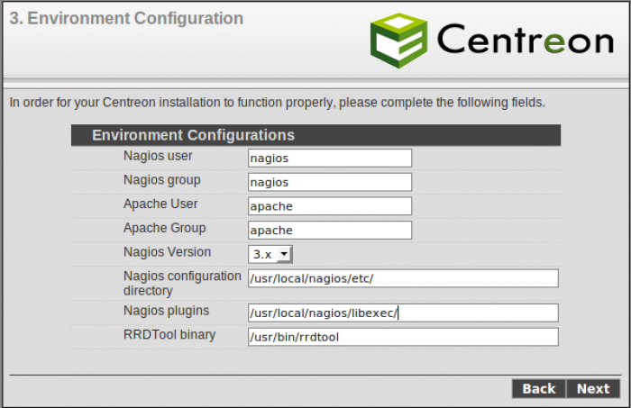](../_detail/powered/centreon/centreon_env_config.png@id=centreon%253Acentreon-centos-install.html "powered:centreon:centreon_env_config.png")

Centreon vérifie les dépendances PHP pour son bon fonctionnement

[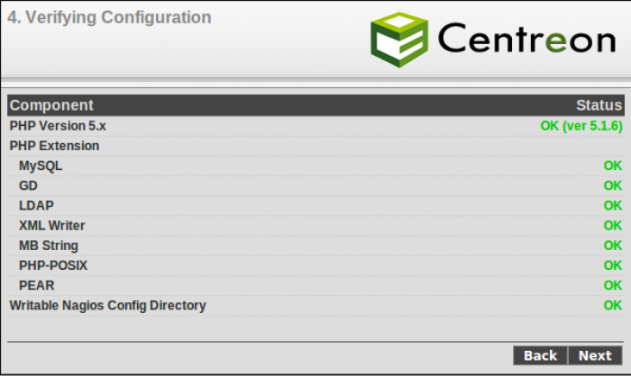](../_detail/powered/centreon/centreon_php_verif.png@id=centreon%253Acentreon-centos-install.html "powered:centreon:centreon_php_verif.png")

Centreon vérifie aussi les dépendances de PEAR

[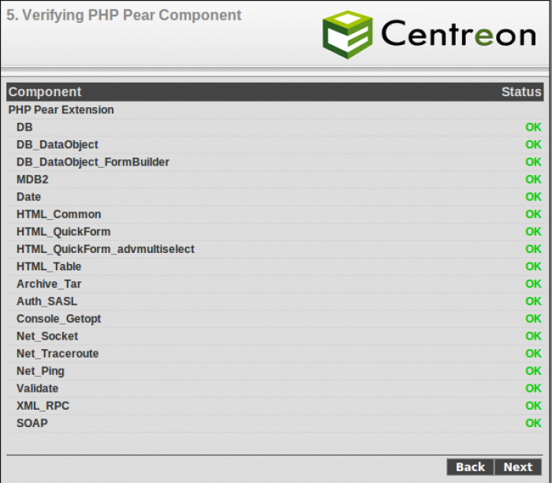](../_detail/powered/centreon/centreon_verif_pear.png@id=centreon%253Acentreon-centos-install.html "powered:centreon:centreon_verif_pear.png")

Il vous faut donner les informations de base de données pour que
centreon puisse les créer ensuite.

[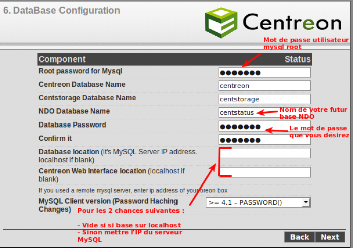](../_detail/powered/centreon/centreon_config_db.png@id=centreon%253Acentreon-centos-install.html "powered:centreon:centreon_config_db.png")

Centreon va contrôler MySQL

[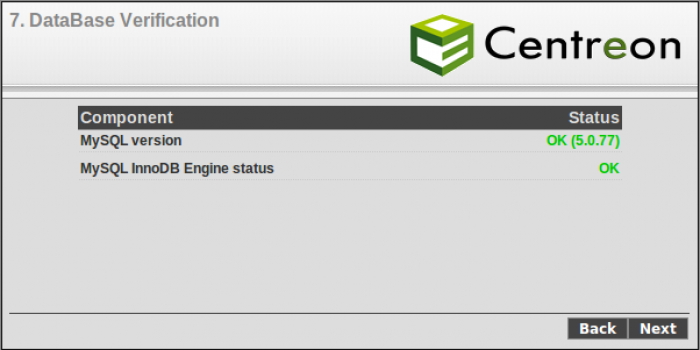](../_detail/powered/centreon/centreon_verif_mysql.png@id=centreon%253Acentreon-centos-install.html "powered:centreon:centreon_verif_mysql.png")

Vous allez devoir configurer l’accès de l’admin de Centreon

[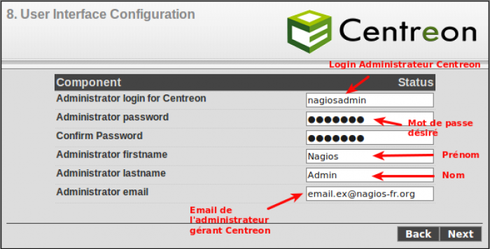](../_detail/powered/centreon/centreon_acces_admin.png@id=centreon%253Acentreon-centos-install.html "powered:centreon:centreon_acces_admin.png")

Vous allez devoir choisir si la gestion des accès se fait par LDAP ou
pas. (nous avons choisi “non”, mais c’est à votre bon vouloir)

[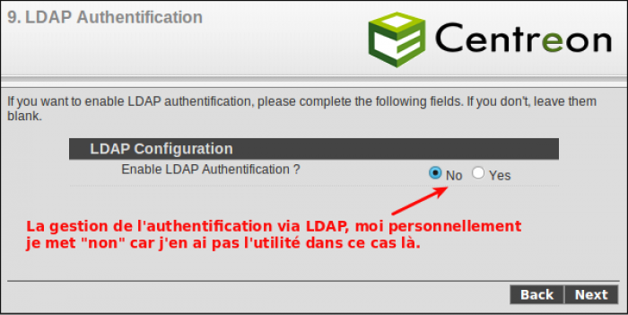](../_detail/powered/centreon/centreon_config_ldap.png@id=centreon%253Acentreon-centos-install.html "powered:centreon:centreon_config_ldap.png")

Centreon vérifie s’il a bien accès à ses fichiers de configuration

[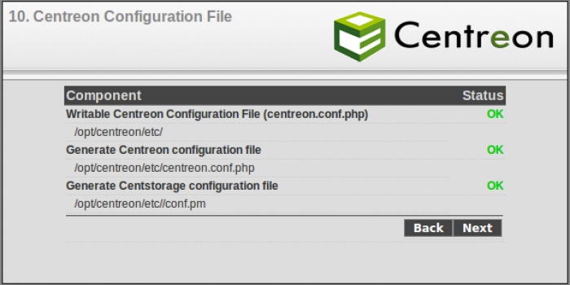](../_detail/powered/centreon/centreon_verif_fichier.png@id=centreon%253Acentreon-centos-install.html "powered:centreon:centreon_verif_fichier.png")

Centreon va créer les bases de données ainsi que celle NDO

**Dernières nouveautés de la 2.1 car en 2.0 il fallait encore créer la
base NDO soit même**

[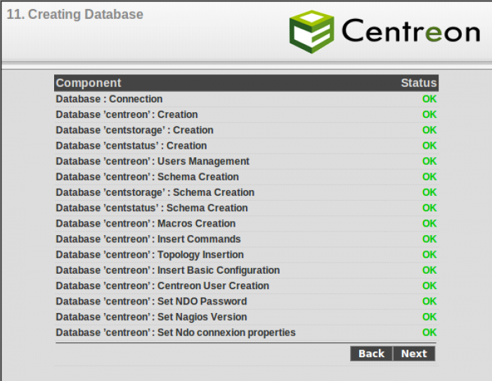](../_detail/powered/centreon/centreon_creation_db.png@id=centreon%253Acentreon-centos-install.html "powered:centreon:centreon_creation_db.png")

Et voilà la partie de l’installation Web est terminée.

[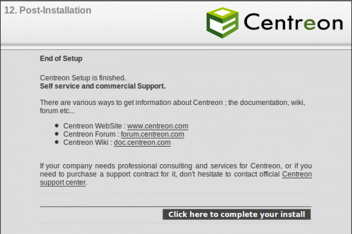](../_detail/powered/centreon/centreon_fin_setup.png@id=centreon%253Acentreon-centos-install.html "powered:centreon:centreon_fin_setup.png")

### Configuration de SNMP {#configuration-de-snmp .sectionedit13}

Éditez le fichier de configuration de snmpd pour ajouter la communauté «
votre\_communauté » :

~~~
# cp /etc/snmp/snmpd.conf /etc/snmp/snmpd.conf.origin
# rm /etc/snmp/snmpd.conf   
# vi /etc/snmp/snmpd.conf
~~~

et ajoutez la ligne suivante à la fin du fichier :

~~~
rocommunity votre_communauté
~~~

Pour que les check\_snmp fonctionnent, il faut modifier le fichier
/etc/snmp/snmpd.conf pour avoir :

~~~
#       sec.name  source          community
#com2sec paranoid  default         public
com2sec readonly  default         public
#com2sec readwrite default         private
~~~

Enfin, il faut ouvrir le port udp 161 sur chaque collecteur que l’on
veut surveiller. Avant la ligne

~~~
-A RH-Firewall-1-INPUT -j REJECT --reject-with icmp-host-prohibited
~~~

ajouter :

~~~
-A RH-Firewall-1-INPUT -p udp -m udp --dport 161 -j ACCEPT
~~~

Redémarrer le service iptables pour prendre en compte la modification,
ainsi que le service snmpd :

~~~
# /etc/init.d/iptables restart
# /etc/init.d/snmpd restart
~~~

### Ajout de services au démarrage {#ajout-de-services-au-demarrage .sectionedit14}

Sur les collecteurs :

~~~
# /sbin/chkconfig --level 35 snmpd on
# /sbin/chkconfig --level 35 snmptrapd on
# /sbin/chkconfig --level 35 nagios on
# /sbin/chkconfig --level 01246 nagios off
~~~

Sur le serveur central :

~~~
# /sbin/chkconfig --level 35 snmpd on
# /sbin/chkconfig --level 35 ndo2db on 
# /sbin/chkconfig --level 01246 ndo2db off 
# /sbin/chkconfig --level 35 nagios on
# /sbin/chkconfig --level 01246 nagios off
# /sbin/chkconfig --level 35 httpd on
# /sbin/chkconfig --level 35 mysqld on
~~~

**Penser à démarrer dans l’ordre :**

1.  NDO
2.  Nagios
3.  Centcore (si architecture en distribuée)
4.  Centstorage