[[[Installation de Centreon Enterprise
Server](centreon-enterprise-server@do=backlink.html)]]

[wiki monitoring-fr.org](../start.html "[ALT+H]")

-   [Accueil](../index.html "Cliquez pour revenir |  l'accueil")
-   [Blog](http://www.monitoring-fr.org "Blog & News")
-   [Forums](http://forums.monitoring-fr.org "Forums")
-   [Doc](http://doc.monitoring-fr.org "Doc")
-   [Forge](https://github.com/monitoring-fr "Forge")

Vous êtes ici: [Accueil](../start.html "start") »
[Centreon](start.html "centreon:start") » [Installation de Centreon
Enterprise
Server](centreon-enterprise-server.html "centreon:centreon-enterprise-server")

### Table des matières {.toggle}

-   [Installation de Centreon Enterprise
    Server](centreon-enterprise-server.html#installation-de-centreon-enterprise-server)
    -   [Ressources](centreon-enterprise-server.html#ressources)
    -   [Introduction](centreon-enterprise-server.html#introduction)
    -   [Installation du serveur
        Central](centreon-enterprise-server.html#installation-du-serveur-central)
    -   [Post
        installation](centreon-enterprise-server.html#post-installation)
        -   [Mysql](centreon-enterprise-server.html#mysql)
        -   [Réseau](centreon-enterprise-server.html#reseau)
        -   [Modification des
            dépots](centreon-enterprise-server.html#modification-des-depots)

  **Rôle**       **Nom**
  -------------- ----------------
  **Créateur**   David GUENAULT

Installation de Centreon Enterprise Server {#installation-de-centreon-enterprise-server .sectionedit2}
==========================================

Ressources {#ressources .sectionedit3}
----------

-   L’ISO d’installation :
    [http://www.centreon.com/fr/Centreon-Enterprise-Server/telechargements-de-ces.html](http://www.centreon.com/fr/Centreon-Enterprise-Server/telechargements-de-ces.html "http://www.centreon.com/fr/Centreon-Enterprise-Server/telechargements-de-ces.html")
-   Les documentations :
    [http://www.centreon.com/fr/Centreon-Enterprise-Server/documentation-ces.html](http://www.centreon.com/fr/Centreon-Enterprise-Server/documentation-ces.html "http://www.centreon.com/fr/Centreon-Enterprise-Server/documentation-ces.html")

Introduction {#introduction .sectionedit4}
------------

Centreon Enterprise Server (CES) est une distribution linux (basée sur
centos un fork de red hat enterprise server) permettant de facilement
installer Centreon et ses dépendances.

CES est livré en plusieurs versions mais nous nous intéresseront à la
version Libre (version standard). Au niveau logiciel on se retrouve avec
:

-   Centreon
-   Nagios
-   Nagios Plugins
-   NdoUtils
-   NRPE
-   NSCA
-   Une sélection de plugins additionnels (voir la liste ci dessous)

CES permet de gérer au choix un serveur de supervision complet, un
système distribué avec serveur central et satellites. Au lancement de la
machine, il suffit de saisir central ou poller pour installer un serveur
central ou un serveur satellite.

Installation du serveur Central {#installation-du-serveur-central .sectionedit5}
-------------------------------

Après avoir récupéré l’ISO d’installation, il suffit de suivre les
menus.

[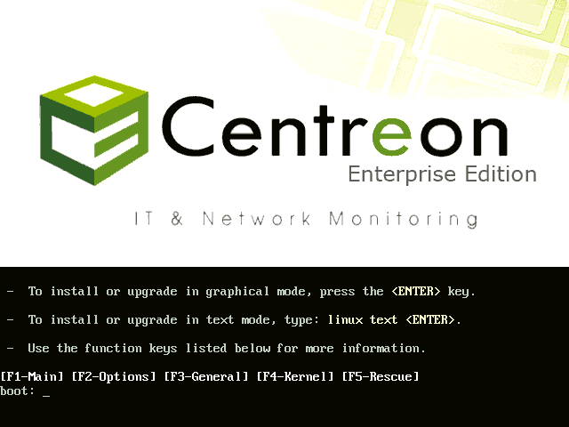](../_detail/centreon/ces/centreon-enterprise-server-en-fonction-oracle-vm-virtualbox_002.png@id=centreon%253Acentreon-enterprise-server.html "centreon:ces:centreon-enterprise-server-en-fonction-oracle-vm-virtualbox_002.png")

[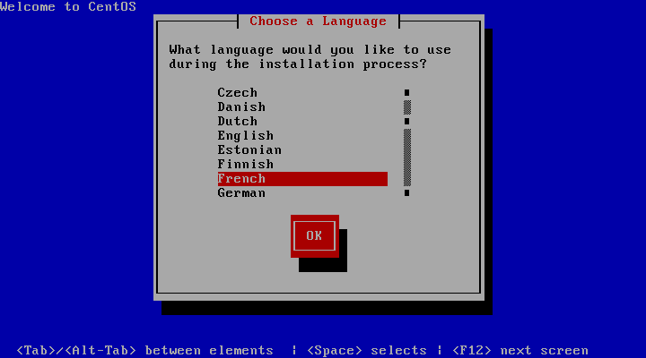](../_detail/centreon/ces/centreon-enterprise-server-en-fonction-oracle-vm-virtualbox_003.png@id=centreon%253Acentreon-enterprise-server.html "centreon:ces:centreon-enterprise-server-en-fonction-oracle-vm-virtualbox_003.png")

[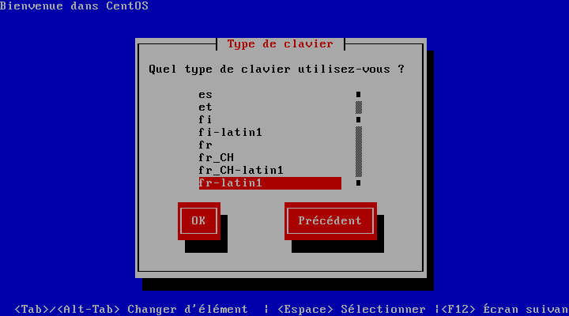](../_detail/centreon/ces/centreon-enterprise-server-en-fonction-oracle-vm-virtualbox_004.png@id=centreon%253Acentreon-enterprise-server.html "centreon:ces:centreon-enterprise-server-en-fonction-oracle-vm-virtualbox_004.png")

[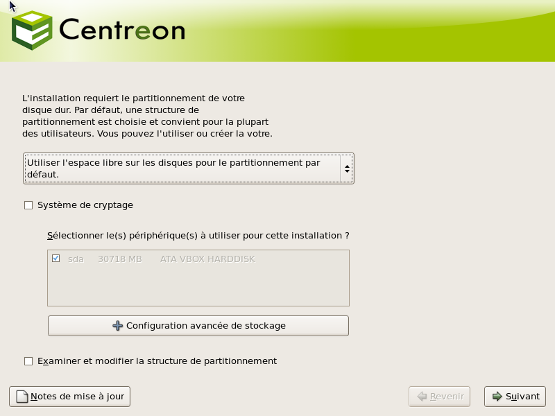](../_detail/centreon/ces/centreon-enterprise-server-en-fonction-oracle-vm-virtualbox_005.png@id=centreon%253Acentreon-enterprise-server.html "centreon:ces:centreon-enterprise-server-en-fonction-oracle-vm-virtualbox_005.png")

[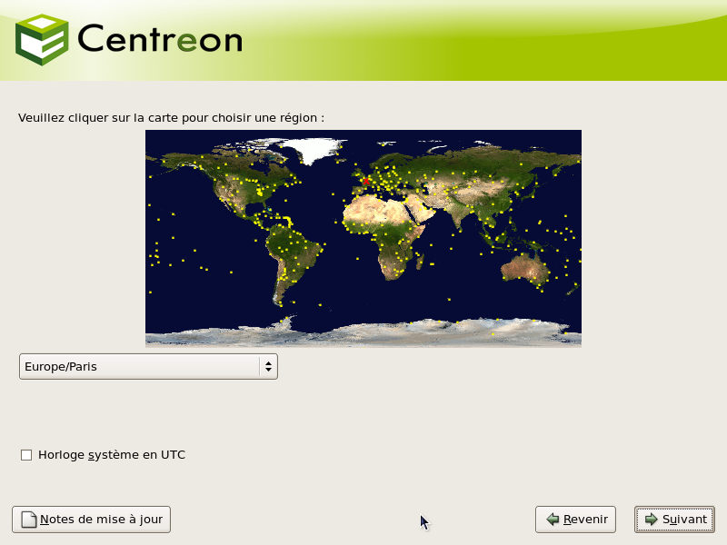](../_detail/centreon/ces/centreon-enterprise-server-en-fonction-oracle-vm-virtualbox_006.png@id=centreon%253Acentreon-enterprise-server.html "centreon:ces:centreon-enterprise-server-en-fonction-oracle-vm-virtualbox_006.png")

[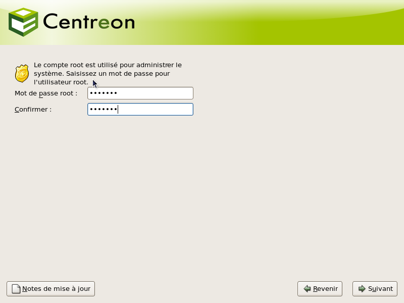](../_detail/centreon/ces/centreon-enterprise-server-en-fonction-oracle-vm-virtualbox_007.png@id=centreon%253Acentreon-enterprise-server.html "centreon:ces:centreon-enterprise-server-en-fonction-oracle-vm-virtualbox_007.png")

[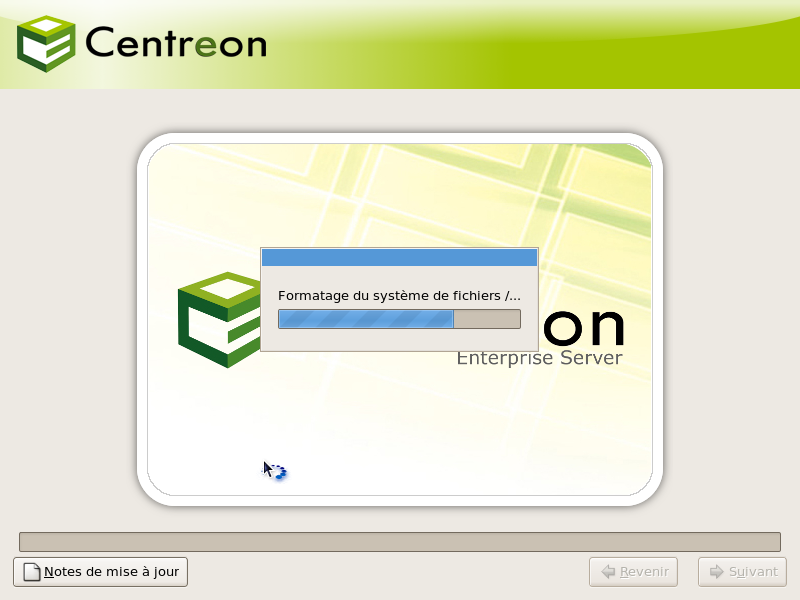](../_detail/centreon/ces/centreon-enterprise-server-en-fonction-oracle-vm-virtualbox_008.png@id=centreon%253Acentreon-enterprise-server.html "centreon:ces:centreon-enterprise-server-en-fonction-oracle-vm-virtualbox_008.png")

[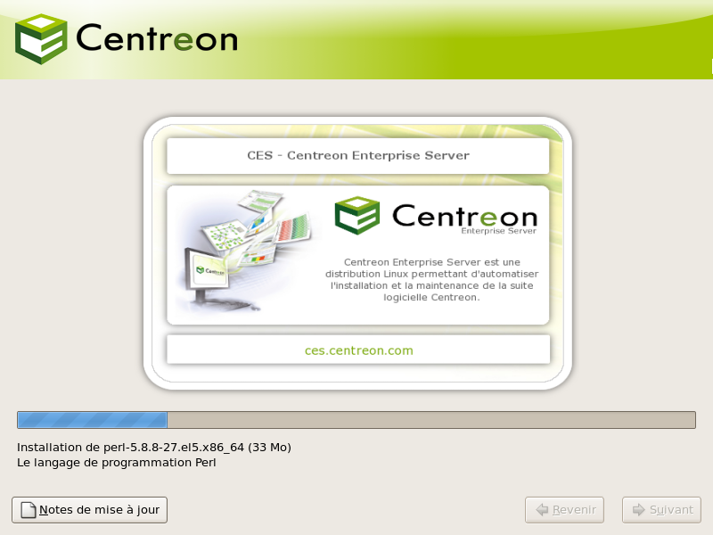](../_detail/centreon/ces/centreon-enterprise-server-en-fonction-oracle-vm-virtualbox_009.png@id=centreon%253Acentreon-enterprise-server.html "centreon:ces:centreon-enterprise-server-en-fonction-oracle-vm-virtualbox_009.png")

[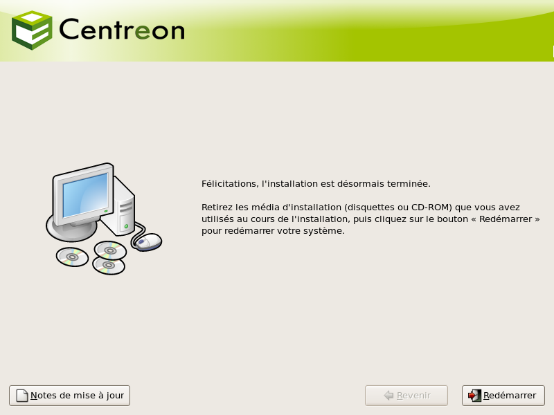](../_detail/centreon/ces/centreon-enterprise-server-en-fonction-oracle-vm-virtualbox_010.png@id=centreon%253Acentreon-enterprise-server.html "centreon:ces:centreon-enterprise-server-en-fonction-oracle-vm-virtualbox_010.png")

Voila l’installation est terminée pour le serveur central.

Post installation {#post-installation .sectionedit6}
-----------------

### Mysql {#mysql .sectionedit7}

Changement du mot de passe root de mysql

~~~~ {.code}
mysqladmin -u root password '*******'
~~~~

### Réseau {#reseau .sectionedit8}

Par défaut le réseau est configuré en DHCP. Si vous utilisez un adresse
IP fixe, il suffit de se logger en root et de taper setup.

[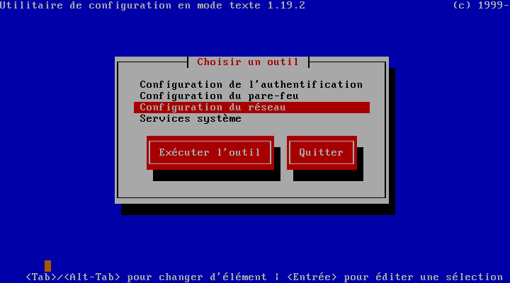](../_detail/centreon/ces/centreon-enterprise-server-en-fonction-oracle-vm-virtualbox_012.png@id=centreon%253Acentreon-enterprise-server.html "centreon:ces:centreon-enterprise-server-en-fonction-oracle-vm-virtualbox_012.png")

[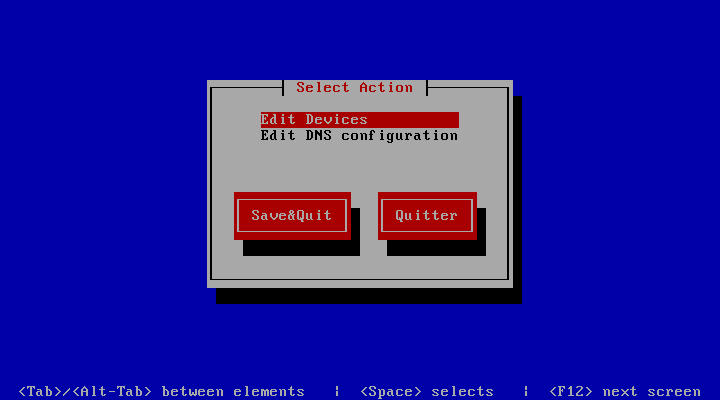](../_detail/centreon/ces/centreon-enterprise-server-en-fonction-oracle-vm-virtualbox_013.png@id=centreon%253Acentreon-enterprise-server.html "centreon:ces:centreon-enterprise-server-en-fonction-oracle-vm-virtualbox_013.png")

[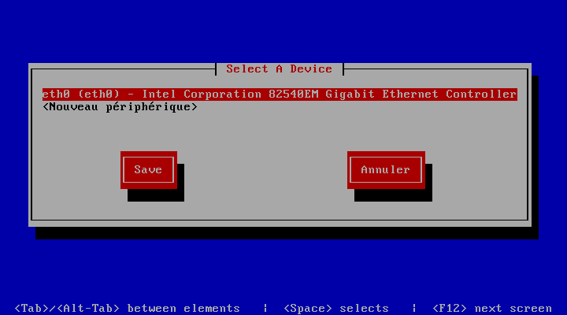](../_detail/centreon/ces/centreon-enterprise-server-en-fonction-oracle-vm-virtualbox_014.png@id=centreon%253Acentreon-enterprise-server.html "centreon:ces:centreon-enterprise-server-en-fonction-oracle-vm-virtualbox_014.png")

[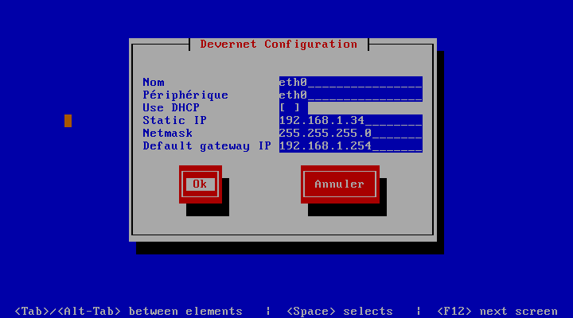](../_detail/centreon/ces/centreon-enterprise-server-en-fonction-oracle-vm-virtualbox_015.png@id=centreon%253Acentreon-enterprise-server.html "centreon:ces:centreon-enterprise-server-en-fonction-oracle-vm-virtualbox_015.png")

[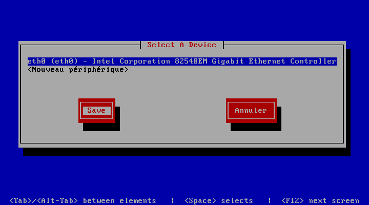](../_detail/centreon/ces/centreon-enterprise-server-en-fonction-oracle-vm-virtualbox_016.png@id=centreon%253Acentreon-enterprise-server.html "centreon:ces:centreon-enterprise-server-en-fonction-oracle-vm-virtualbox_016.png")

[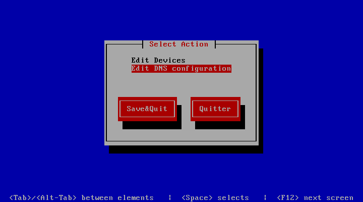](../_detail/centreon/ces/centreon-enterprise-server-en-fonction-oracle-vm-virtualbox_017.png@id=centreon%253Acentreon-enterprise-server.html "centreon:ces:centreon-enterprise-server-en-fonction-oracle-vm-virtualbox_017.png")

[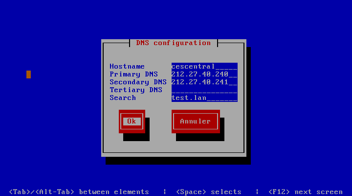](../_detail/centreon/ces/centreon-enterprise-server-en-fonction-oracle-vm-virtualbox_018.png@id=centreon%253Acentreon-enterprise-server.html "centreon:ces:centreon-enterprise-server-en-fonction-oracle-vm-virtualbox_018.png")

[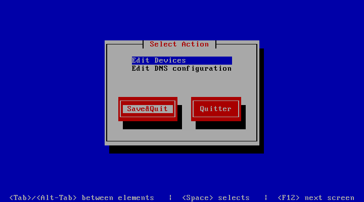](../_detail/centreon/ces/centreon-enterprise-server-en-fonction-oracle-vm-virtualbox_019.png@id=centreon%253Acentreon-enterprise-server.html "centreon:ces:centreon-enterprise-server-en-fonction-oracle-vm-virtualbox_019.png")

[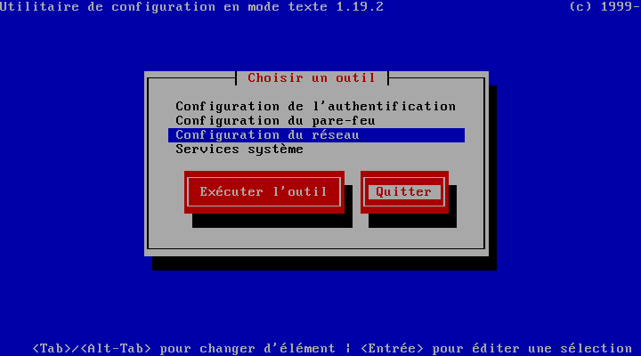](../_detail/centreon/ces/centreon-enterprise-server-en-fonction-oracle-vm-virtualbox_020.png@id=centreon%253Acentreon-enterprise-server.html "centreon:ces:centreon-enterprise-server-en-fonction-oracle-vm-virtualbox_020.png")

### Modification des dépots {#modification-des-depots .sectionedit9}

Personnellement j’aime bien avoir à ma disposition des dépôts me
permettant d’installer les logiciels additionnels dont j’ai besoin. Les
dépots de la distribution ne me fournissent pas l’intégralité des
logiciels dont j’ai besoin

Cela n’est pas recommandé et peut casser votre distribution !

Il suffit de rajouter le dépôt rpmforge centos adéquat. Tout d’abord
nous devons determiner sur quelle version de centos repose Centreon
Enterprise Server. un petit coup de **uname -r** nous renvois
2.6.18-194.3.1.**el5**. C’est donc une centos 5. Pour ma part j’ai chois
une architecture 64bits donc mon dépot devra être de type x86\_64. Un
petit tour sur le wiki rpm forge
([http://rpmrepo.org/RPMforge/Using](http://rpmrepo.org/RPMforge/Using "http://rpmrepo.org/RPMforge/Using"))
me permet de selectionner le paquet rpm qui me rajoutera les dépôts
nécessaires :

~~~~ {.code}
rpm -Uvh http://packages.sw.be/rpmforge-release/rpmforge-release-0.5.2-2.el5.rf.x86_64.rpm
~~~~

SOMMAIRE {#sommaire .sectionedit1}
--------

**[Accueil](../start.html "start")**

**[Supervision](../supervision/start.html "supervision:start")**

-   [Nagios](../nagios/start.html "nagios:start")
-   [Centreon](start.html "centreon:start")
-   [Shinken](../shinken/start.html "shinken:start")
-   [Zabbix](../zabbix/start.html "zabbix:start")
-   [OpenNMS](../opennms/start.html "opennms:start")
-   [EyesOfNetwork](../eyesofnetwork/start.html "eyesofnetwork:start")
-   [Groundwork](../groundwork/start.html "groundwork:start")
-   [Zenoss](../zenoss/start.html "zenoss:start")
-   [Vigilo](../vigilo/start.html "vigilo:start")
-   [Icinga](../icinga/start.html "icinga:start")
-   [Cacti](../cacti/start.html "cacti:start")
-   [Ressenti
    utilisateur](../supervision/eue/start.html "supervision:eue:start")
-   [Ressenti utilisateur avec
    sikuli](../sikuli/eue/start.html "sikuli:eue:start")

**[Hypervision](../hypervision/start.html "hypervision:start")**

-   [Canopsis](../canopsis/start.html "canopsis:start")

**[Sécurité](../securite/start.html "securite:start")**

**[Infrastructure](../infra/start.html "infra:start")**

**[Développement](../dev/start.html "dev:start")**

Centreon {#centreon .sectionedit1}
--------

-   [Documentation Technique sur
    Centreon](centreon-doc-technique.html "centreon:centreon-doc-technique")
-   [Installation MKLivestatus & Intégration dans
    Centreon](mklivestatus-install-integration-centreon.html "centreon:mklivestatus-install-integration-centreon")
-   [Installation Nagios / Centreon sur RedHat
    EL](centreon-redhat-install.html "centreon:centreon-redhat-install")
-   [Installation de Centreon 2.1 sur CentOS
    5.3](centreon-centos-install.html "centreon:centreon-centos-install")
-   [Installation de Centreon 2.2 sur Ubuntu Server
    10.04](centreon-ubuntu-install.html "centreon:centreon-ubuntu-install")
-   [Installation de Centreon Enterprise
    Server](centreon-enterprise-server.html "centreon:centreon-enterprise-server")
-   [Installation de Shinken sur Centreon Enterprise
    Server](centreon-enterprise-server-shinken.html "centreon:centreon-enterprise-server-shinken")
-   [Installation du patch multi-broker pour
    Centreon](multi-broker-patch-install.html "centreon:multi-broker-patch-install")
-   [Intégrer Nagvis dans
    Centreon](integration-nagvis.html "centreon:integration-nagvis")
-   [Manuel d'utilisation
    Centreon](manuel-utilisation/start.html "centreon:manuel-utilisation:start")
-   [Nagios Centreon
    part1](nagios-centreon-part1.html "centreon:nagios-centreon-part1")
-   [Nagios Centreon
    part2](nagios-centreon-part2.html "centreon:nagios-centreon-part2")
-   [Présentation de l'interface Centreon 2.1 et de son
    utilisation](centreon-interface-utilisation.html "centreon:centreon-interface-utilisation")
-   [Superviser le spanning-tree sous
    Centreon/Nagios](superviser-spanning-tree.html "centreon:superviser-spanning-tree")
-   [Superviser un Autocom OXE V9.x Alcatel-Lucent sous
    Centreon/Nagios](superviser-oxe-alcatel.html "centreon:superviser-oxe-alcatel")
-   [Tableau de correspondance des
    plugins](tableau-correspondance-plugins.html "centreon:tableau-correspondance-plugins")

-   [Afficher le texte
    source](centreon-enterprise-server@do=edit&rev=0.html "Afficher le texte source [V]")
-   [Anciennes
    révisions](centreon-enterprise-server@do=revisions.html "Anciennes révisions [O]")
-   [Derniers
    changements](centreon-enterprise-server@do=recent.html "Derniers changements [R]")
-   [Liens vers cette
    page](centreon-enterprise-server@do=backlink.html "Liens vers cette page")
-   [Gestionnaire de
    médias](centreon-enterprise-server@do=media.html "Gestionnaire de médias")
-   [Index](centreon-enterprise-server@do=index.html "Index [X]")
-   [Connexion](centreon-enterprise-server@do=login&sectok=6bca6bdf16f8880de3d6d3649db89a26.html "Connexion")
-   [Haut de
    page](centreon-enterprise-server.html#dokuwiki__top "Haut de page [T]")

centreon/centreon-enterprise-server.txt · Dernière modification:
2013/03/29 09:39 (modification externe)

