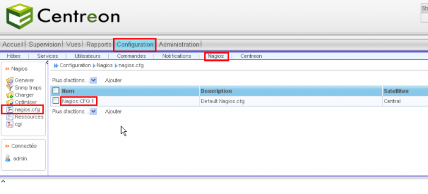
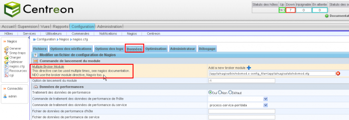

[[[Installation du patch multi-broker pour
Centreon](multi-broker-patch-install@do=backlink.html)]]

[wiki monitoring-fr.org](../start.html "[ALT+H]")

-   [Accueil](../index.html "Cliquez pour revenir |  l'accueil")
-   [Blog](http://www.monitoring-fr.org "Blog & News")
-   [Forums](http://forums.monitoring-fr.org "Forums")
-   [Doc](http://doc.monitoring-fr.org "Doc")
-   [Forge](https://github.com/monitoring-fr "Forge")

Vous êtes ici: [Accueil](../start.html "start") »
[Centreon](start.html "centreon:start") » [Installation du patch
multi-broker pour
Centreon](multi-broker-patch-install.html "centreon:multi-broker-patch-install")

### Table des matières {.toggle}

-   [Installation du patch multi-broker pour
    Centreon](multi-broker-patch-install.html#installation-du-patch-multi-broker-pour-centreon)
-   [Source du patch](multi-broker-patch-install.html#source-du-patch)
-   [Centreon version
    2.1.5](multi-broker-patch-install.html#centreon-version-215)
    -   [Installation](multi-broker-patch-install.html#installation)
    -   [Configuration dans
        Centreon](multi-broker-patch-install.html#configuration-dans-centreon)
-   [Centreon version 2.1.6 à
    2.1.9](multi-broker-patch-install.html#centreon-version-216-a-219)
    -   [Récupération des
        patchs](multi-broker-patch-install.html#recuperation-des-patchs)
    -   [Création de la table dans la base
        centreon](multi-broker-patch-install.html#creation-de-la-table-dans-la-base-centreon)
    -   [Application des
        patchs](multi-broker-patch-install.html#application-des-patchs)
-   [Centreon version
    2.2+](multi-broker-patch-install.html#centreon-version-22)

Installation du patch multi-broker pour Centreon {#installation-du-patch-multi-broker-pour-centreon .sectionedit1}
================================================

Source du patch {#source-du-patch .sectionedit2}
===============

-   Ce patch est hébergé dans la forge Centreon. Vous pouvez donc vous
    référer a cette page pour le suivi :
    [http://forge.centreon.com/issues/show/1635](http://forge.centreon.com/issues/show/1635 "http://forge.centreon.com/issues/show/1635")

Centreon version 2.1.5 {#centreon-version-215 .sectionedit3}
======================

Installation {#installation .sectionedit4}
------------

Récupérer le patch multi Broker sur la forge de Centreon et décompresser
la source.

~~~ {.code .bash}
cd /tmp
wget http://forge.centreon.com/attachments/646/centreon-2.1.5_multibroker001.patch.zip
unzip centreon-2.1.5_multibroker001.patch.zip -d ./centreon-multi-broker
~~~

Pour l’installation de ce patch, il faut créer un table supplémentaire
dans la base de donnée “Centreon” grâce à la requête suivante :

~~~ {.code .bash}
mysql -h <hote_mysql> -ucentreon -p -D centreon
~~~

~~~
CREATE TABLE IF NOT EXISTS `cfg_nagios_bkmod` (
`bkmod_id` int(11) NOT NULL AUTO_INCREMENT,
`nagios_id` int(11) DEFAULT NULL,
`broker_module` varchar(255) DEFAULT NULL,
PRIMARY KEY (`bkmod_id`)
) ENGINE=InnoDB DEFAULT CHARSET=utf8 AUTO_INCREMENT=1 ;
~~~

Nous allons exporter de broker\_module pour chaque config de nagios vers
la nouvelle table:

~~~
INSERT INTO `cfg_nagios_bkmod` (nagios_id, broker_module)
SELECT nagios_id, broker_module
FROM cfg_nagios;
~~~

Ensuite, nous allons passer le patch dans le répertoire Centreon comme
ci-dessous :

~~~ {.code .bash}
cd /usr/local/centreon
 
patch -p1 < /tmp/centreon-multi-broker/centreon-2.1.5_multibroker001.patch
 
 
patching file www/include/configuration/configGenerate/genNagiosCFG-DEBUG.php
patching file www/include/configuration/configGenerate/genNagiosCFG.php
patching file www/include/configuration/configNagios/DB-Func.php
patching file www/include/configuration/configNagios/formNagios.ihtml
patching file www/include/configuration/configNagios/formNagios.php
patching file www/include/configuration/configNagios/makeJS_formNagios.php
~~~

Configuration dans Centreon {#configuration-dans-centreon .sectionedit5}
---------------------------

Dans Centreon, allez dans **Configuration –\> Nagios –\> nagios.cfg** et
éditer le *Nagios CFG 1* :

On voit bien sur notre page de configuration le champ Multi Broker a été
ajouté.

Centreon version 2.1.6 à 2.1.9 {#centreon-version-216-a-219 .sectionedit6}
==============================

Récupération des patchs {#recuperation-des-patchs .sectionedit7}
-----------------------

~~~ {.code .bash}
cd /tmp
wget http://forge.centreon.com/attachments/694/centreon-2.1.6_multibroker002.tar.zip
wget http://forge.centreon.com/attachments/695/centreon-2.1.6_multibroker002_To_003.tar
unzip centreon-2.1.6_multibroker002.tar.zip
tar xvf centreon-2.1.6_multibroker002.tar
tar xvf centreon-2.1.6_multibroker002_To_003.tar
~~~

Création de la table dans la base centreon {#creation-de-la-table-dans-la-base-centreon .sectionedit8}
------------------------------------------

on parle ici de la base contenant la configuration centreon

~~~
mysql -h localhost -u root -p centreon
~~~

~~~ {.code .sql}
CREATE TABLE IF NOT EXISTS `cfg_nagios_bkmod` (
`bkmod_id` int(11) NOT NULL AUTO_INCREMENT,
`nagios_id` int(11) DEFAULT NULL,
`broker_module` varchar(255) DEFAULT NULL,
PRIMARY KEY (`bkmod_id`)
) ENGINE=InnoDB DEFAULT CHARSET=utf8 AUTO_INCREMENT=1 ;
 
INSERT INTO `cfg_nagios_bkmod` (nagios_id, broker_module)
SELECT nagios_id, broker_module
FROM cfg_nagios;
 
exit;
~~~

Application des patchs {#application-des-patchs .sectionedit9}
----------------------

il faut recopier les patchs à la racine du répertoire d’installation de
Centreon. Dans cet exemple ce sera **/opt/centreon**. Cet exemple est a
adapter à votre ‘layout’ d’installation.

~~~ {.code .bash}
cd /opt/centreon
cp /tmp/centreon-2.1.6_multibroker002.patch ./
cp /tmp/centreon-2.1.6_multibroker002_To_003.patch ./
patch -p1 < centreon-2.1.6_multibroker002.patch
patch -p1 < centreon-2.1.6_multibroker002_To_003.patch
~~~

Centreon version 2.2+ {#centreon-version-22 .sectionedit10}
=====================

Depuis la version 2.2 le patch est intégré dans Centreon

SOMMAIRE {#sommaire .sectionedit1}
--------

**[Accueil](../start.html "start")**

**[Supervision](../supervision/start.html "supervision:start")**

-   [Nagios](../nagios/start.html "nagios:start")
-   [Centreon](start.html "centreon:start")
-   [Shinken](../shinken/start.html "shinken:start")
-   [Zabbix](../zabbix/start.html "zabbix:start")
-   [OpenNMS](../opennms/start.html "opennms:start")
-   [EyesOfNetwork](../eyesofnetwork/start.html "eyesofnetwork:start")
-   [Groundwork](../groundwork/start.html "groundwork:start")
-   [Zenoss](../zenoss/start.html "zenoss:start")
-   [Vigilo](../vigilo/start.html "vigilo:start")
-   [Icinga](../icinga/start.html "icinga:start")
-   [Cacti](../cacti/start.html "cacti:start")
-   [Ressenti
    utilisateur](../supervision/eue/start.html "supervision:eue:start")
-   [Ressenti utilisateur avec
    sikuli](../sikuli/eue/start.html "sikuli:eue:start")

**[Hypervision](../hypervision/start.html "hypervision:start")**

-   [Canopsis](../canopsis/start.html "canopsis:start")

**[Sécurité](../securite/start.html "securite:start")**

**[Infrastructure](../infra/start.html "infra:start")**

**[Développement](../dev/start.html "dev:start")**

Centreon {#centreon .sectionedit1}
--------

-   [Documentation Technique sur
    Centreon](centreon-doc-technique.html "centreon:centreon-doc-technique")
-   [Installation MKLivestatus & Intégration dans
    Centreon](mklivestatus-install-integration-centreon.html "centreon:mklivestatus-install-integration-centreon")
-   [Installation Nagios / Centreon sur RedHat
    EL](centreon-redhat-install.html "centreon:centreon-redhat-install")
-   [Installation de Centreon 2.1 sur CentOS
    5.3](centreon-centos-install.html "centreon:centreon-centos-install")
-   [Installation de Centreon 2.2 sur Ubuntu Server
    10.04](centreon-ubuntu-install.html "centreon:centreon-ubuntu-install")
-   [Installation de Centreon Enterprise
    Server](centreon-enterprise-server.html "centreon:centreon-enterprise-server")
-   [Installation de Shinken sur Centreon Enterprise
    Server](centreon-enterprise-server-shinken.html "centreon:centreon-enterprise-server-shinken")
-   [Installation du patch multi-broker pour
    Centreon](multi-broker-patch-install.html "centreon:multi-broker-patch-install")
-   [Intégrer Nagvis dans
    Centreon](integration-nagvis.html "centreon:integration-nagvis")
-   [Manuel d'utilisation
    Centreon](manuel-utilisation/start.html "centreon:manuel-utilisation:start")
-   [Nagios Centreon
    part1](nagios-centreon-part1.html "centreon:nagios-centreon-part1")
-   [Nagios Centreon
    part2](nagios-centreon-part2.html "centreon:nagios-centreon-part2")
-   [Présentation de l'interface Centreon 2.1 et de son
    utilisation](centreon-interface-utilisation.html "centreon:centreon-interface-utilisation")
-   [Superviser le spanning-tree sous
    Centreon/Nagios](superviser-spanning-tree.html "centreon:superviser-spanning-tree")
-   [Superviser un Autocom OXE V9.x Alcatel-Lucent sous
    Centreon/Nagios](superviser-oxe-alcatel.html "centreon:superviser-oxe-alcatel")
-   [Tableau de correspondance des
    plugins](tableau-correspondance-plugins.html "centreon:tableau-correspondance-plugins")

-   [Afficher le texte
    source](multi-broker-patch-install@do=edit&rev=0.html "Afficher le texte source [V]")
-   [Anciennes
    révisions](multi-broker-patch-install@do=revisions.html "Anciennes révisions [O]")
-   [Derniers
    changements](multi-broker-patch-install@do=recent.html "Derniers changements [R]")
-   [Liens vers cette
    page](multi-broker-patch-install@do=backlink.html "Liens vers cette page")
-   [Gestionnaire de
    médias](multi-broker-patch-install@do=media.html "Gestionnaire de médias")
-   [Index](multi-broker-patch-install@do=index.html "Index [X]")
-   [Connexion](multi-broker-patch-install@do=login&sectok=6bca6bdf16f8880de3d6d3649db89a26.html "Connexion")
-   [Haut de
    page](multi-broker-patch-install.html#dokuwiki__top "Haut de page [T]")

centreon/multi-broker-patch-install.txt · Dernière modification:
2013/03/29 09:39 (modification externe)

