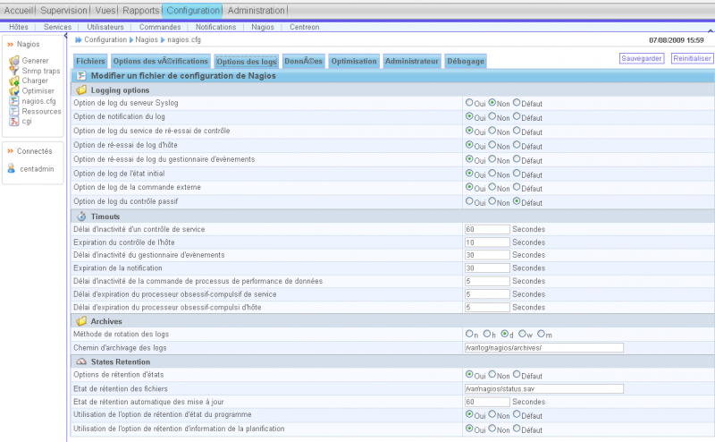
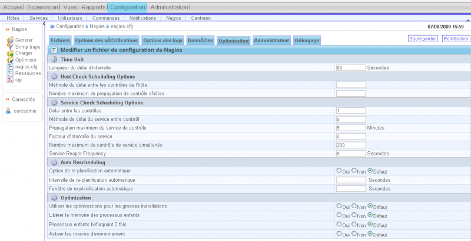
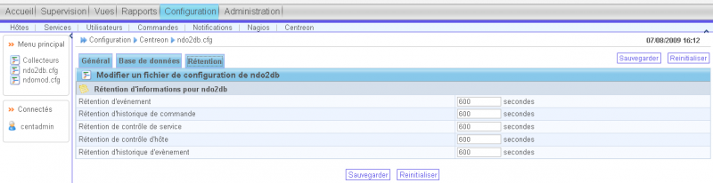

[[[Nagios Centreon part2](nagios-centreon-part2@do=backlink.html)]]

[wiki monitoring-fr.org](../start.html "[ALT+H]")

-   [Accueil](../index.html "Cliquez pour revenir |  l'accueil")
-   [Blog](http://www.monitoring-fr.org "Blog & News")
-   [Forums](http://forums.monitoring-fr.org "Forums")
-   [Doc](http://doc.monitoring-fr.org "Doc")
-   [Forge](https://github.com/monitoring-fr "Forge")

Vous êtes ici: [Accueil](../start.html "start") »
[Centreon](start.html "centreon:start") » [Nagios Centreon
part2](nagios-centreon-part2.html "centreon:nagios-centreon-part2")

### Table des matières {.toggle}

-   [Nagios Centreon
    part2](nagios-centreon-part2.html#nagios-centreon-part2)
-   [Centreon](nagios-centreon-part2.html#centreon)
    -   [Pré-requis](nagios-centreon-part2.html#pre-requis)
        -   [Dépendances requises
            LAMP](nagios-centreon-part2.html#dependances-requises-lamp)
        -   [Bibliothèques
            nécessaires](nagios-centreon-part2.html#bibliotheques-necessaires)
        -   [Dépendances Système
            requises](nagios-centreon-part2.html#dependances-systeme-requises)
        -   [Installer les modules PHP pear
            suivants](nagios-centreon-part2.html#installer-les-modules-php-pear-suivants)
    -   [Installation](nagios-centreon-part2.html#installation)
    -   [Explication précises des interactions entre les différents
        services](nagios-centreon-part2.html#explication-precises-des-interactions-entre-les-differents-services)
    -   [Configuration basique de Nagios et Centreon pour
        commencer](nagios-centreon-part2.html#configuration-basique-de-nagios-et-centreon-pour-commencer)
        -   [Configuration basique de l'accès à la base
            ndoutils](nagios-centreon-part2.html#configuration-basique-de-l-acces-a-la-base-ndoutils)
        -   [Configuration basique de
            Nagios](nagios-centreon-part2.html#configuration-basique-de-nagios)
        -   [Passer au
            français](nagios-centreon-part2.html#passer-au-francais)
    -   [Inventaire des configurations à
        réaliser](nagios-centreon-part2.html#inventaire-des-configurations-a-realiser)
    -   [Architectures d'hôtes
        Nagios](nagios-centreon-part2.html#architectures-d-hotes-nagios)
    -   [Architecture des services mise en
        place](nagios-centreon-part2.html#architecture-des-services-mise-en-place)
        -   [Au niveau serveurs
            Windows](nagios-centreon-part2.html#au-niveau-serveurs-windows)
        -   [Au niveau serveurs
            Linux](nagios-centreon-part2.html#au-niveau-serveurs-linux)
        -   [Au niveau serveurs
            ESX](nagios-centreon-part2.html#au-niveau-serveurs-esx)
        -   [Au niveau des
            routeurs](nagios-centreon-part2.html#au-niveau-des-routeurs)
        -   [Au niveau des
            switchs](nagios-centreon-part2.html#au-niveau-des-switchs)
        -   [Eléments
            divers](nagios-centreon-part2.html#elements-divers)
        -   [Intervalles de
            check](nagios-centreon-part2.html#intervalles-de-check)
        -   [Supervision locale du serveur
            Nagios](nagios-centreon-part2.html#supervision-locale-du-serveur-nagios)
    -   [Graphiques sous
        Centreon](nagios-centreon-part2.html#graphiques-sous-centreon)
    -   [Notifications](nagios-centreon-part2.html#notifications)
    -   [Méthode de création de
        commandes](nagios-centreon-part2.html#methode-de-creation-de-commandes)
    -   [Erreures connues](nagios-centreon-part2.html#erreures-connues)
-   [Sauvegarde
    centreon](nagios-centreon-part2.html#sauvegarde-centreon)
-   [Restaurer la base de données
    nagios](nagios-centreon-part2.html#restaurer-la-base-de-donnees-nagios)
-   [Rotation des logs](nagios-centreon-part2.html#rotation-des-logs)

Nagios Centreon part2 {#nagios-centreon-part2 .sectionedit1}
=====================

**Suite de la documentation de mise en place de Nagios et Centreon. La
première partie est [Nagios Centreon
part1](nagios-centreon-part1.html "centreon:nagios-centreon-part1").**

Centreon {#centreon .sectionedit2}
========

Pré-requis {#pre-requis .sectionedit3}
----------

### Dépendances requises LAMP {#dependances-requises-lamp .sectionedit4}

-   httpd
-   httpd-manual
-   mysql
-   mysql-server
-   mysql-devel
-   php
-   gd
-   gd-devel
-   rrdtool
-   net-snmp

Normalement, on a juste ca à faire par rapport à ce qui est déjà
installé.

~~~
yum install rrdtool
~~~

### Bibliothèques nécessaires {#bibliotheques-necessaires .sectionedit5}

-   php-mysql
-   php-pear
-   php-snmp
-   php-posix
-   libgd2
-   gd-devel
-   libpng
-   libpng-devel
-   perl-config-IniFiles
-   perl-Crypt-DES
-   perl-Digest-HMAC
-   perl-Digest-SHA1
-   perl-GD
-   perl-IO-Socket-INET6
-   perl-Net-SNMP
-   perl-rrdtool
-   perl-Socket6

La commande pour installer cette liste.

~~~
yum install php-mysql php-pear php-snmp php-posix php-ldap gd-devel libpng libpng-devel perl-Config-IniFiles perl-Crypt-DES perl-Digest-HMAC perl-Digest-SHA1 perl-GD perl-IO-Socket-INET6 perl-Net-SNMP perl-rrdtool perl-Socket6
~~~

### Dépendances Système requises {#dependances-systeme-requises .sectionedit6}

-   sudo
-   make
-   gcc

La commande pour installer cette liste.

~~~
yum install sudo make gcc
~~~

### Installer les modules PHP pear suivants {#installer-les-modules-php-pear-suivants .sectionedit7}

-   php-pear-DB
-   php-pear-DB-DataObject
-   php-pear-DB-DataObject-FormBuilder
-   php-pear-MDB2
-   php-pear-Date
-   php-pear-Numbers-Roman
-   php-pear-Numbers-Words
-   php-pear-HTML-Common
-   php-pear-HTML-QuickForm
-   php-pear-HTML-QuickForm-advmultiselect
-   php-pear-HTML-Table
-   php-pear-Archive\_Tar
-   php-pear-Auth-SASL
-   php-pear-Console\_Getopt
-   php-pear-HTTP
-   php-pear-Image-Canvas
-   php-pear-Image-Color
-   php-pear-Image-Graph
-   php-pear-Image-GraphViz
-   php-pear-Mail
-   php-pear-Mail-Mime
-   php-pear-Net-SMTP
-   php-pear-Net-Socket
-   php-pear-Net-Traceroute
-   php-pear-Net-Ping
-   php-pear-Validate
-   php-pear-XML\_RPC
-   php-pear-SOAP

La commande pour installer cette liste.

~~~
yum install php-mysql php-pear php-snmp php-gd gd gd-devel libpng libpng-devel perl-Config-IniFiles perl-Crypt-DES perl-Digest-HMAC perl-Digest-SHA1 perl-GD perl-IO-Socket-INET6 perl-Net-SNMP perl-rrdtool perl-Socket6 php-pear-DB php-pear-DB-DataObject php-pear-DB-DataObject-FormBuilder php-pear-MDB2 php-pear-Date php-pear-Numbers-Roman php-pear-Numbers-Words php-pear-HTML-Common php-pear-HTML-QuickForm php-pear-HTML-QuickForm-advmultiselect php-pear-HTML-Table php-pear-Archive-Tar php-pear-Auth-SASL php-pear-Console-Getopt php-pear-HTTP php-pear-Image-Canvas php-pear-Image-Color php-pear-Image-Graph php-pear-Image-GraphViz php-pear-Mail php-pear-Mail-Mime php-pear-Net-SMTP php-pear-Net-Socket php-pear-Net-Traceroute php-pear-Net-Ping php-pear-Validate php-pear-XML-RPC php-pear-SOAP
~~~

Après recherche, je me suis rendu compte que les classes sont toutes
positionnées dans `/usr/share/pear` et que les classes relatives à ces
trois paquets sont en faite installées et fournit par le paquet
`php-pear`.

Après un premier test de l’installation de centreon, 2.0.2, j’ai
remarqué qu’il manquait un paquet et qu’un autre n’était pas en version
suffisante. Un check est de toute façon réalisé en fin d’installation.
Il a fallu dans mon cas, mettre à jour la version de php-pear à une
version supérieure à la 1.5.0 or le dépôt epel fournit la 1.4.9!
Récupérer le rpm et mettre à jour avec la commande suivante.

~~~
rpm -Uvh php-pear-1.8.1-1.el5.remi.noarch.rpm
~~~

La même chose a été réalisée pour le paquet php-pear-Log préalablement
récupéré en rpm.

~~~
yum install php-pear-Log-1.11.3-1.el5.noarch.rpm
~~~

Localiser les librairies nécessaires à Centreon.

~~~
updatedb
locate RRDs.pm
/usr/lib/perl5/vendor_perl/5.8.8/i386-linux-thread-multi/RRDs.pm

locate PEAR.php
/usr/share/pear/PEAR.php
~~~

Conserver dans un coin ces deux chemins, ils seront demandés à
l’installation.

Installation {#installation .sectionedit8}
------------

Lancer l’installation de Centreon.

~~~
[root@NOMSERVEUR centreon-2.0.2]# ./install.sh -i
###############################################################################
#                                                                             #
#                         Centreon (www.centreon.com)                         #
#                          Thanks for using Centreon                          #
#                                                                             #
#                                    v2.0.2                                   #
#                                                                             #
#                             [email protected]
/*  */!function(){try{var t="currentScript"in document?document.currentScript:function(){for(var t=document.getElementsByTagName("script"),e=t.length;e--;)if(t[e].getAttribute("cf-hash"))return t[e]}();if(t&&t.previousSibling){var e,r,n,i,c=t.previousSibling,a=c.getAttribute("data-cfemail");if(a){for(e="",r=parseInt(a.substr(0,2),16),n=2;a.length-n;n+=2)i=parseInt(a.substr(n,2),16)^r,e+=String.fromCharCode(i);e=document.createTextNode(e),c.parentNode.replaceChild(e,c)}}}catch(u){}}();/*  */                         #
#                                                                             #
#                   Make sure you have installed and configured               #
#                   sudo - sed - php - apache - rrdtool - mysql               #
#                                                                             #
###############################################################################
------------------------------------------------------------------------
        Checking all needed binaries
------------------------------------------------------------------------
rm                                                         OK
cp                                                         OK
mv                                                         OK
/bin/chmod                                                 OK
/bin/chown                                                 OK
echo                                                       OK
more                                                       OK
mkdir                                                      OK
find                                                       OK
/bin/grep                                                  OK
/bin/cat                                                   OK
/bin/sed                                                   OK

You will now read Centreon Licence.
        Press enter to continue.
                    GNU GENERAL PUBLIC LICENSE
                       Version 2, June 1991

 Copyright (C) 1989, 1991 Free Software Foundation, Inc.
                       51 Franklin St, Fifth Floor, Boston, MA  02110-1301  USA
 Everyone is permitted to copy and distribute verbatim copies
 of this license document, but changing it is not allowed.

[...]

  <signature of Ty Coon>, 1 April 1989
  Ty Coon, President of Vice

This General Public License does not permit incorporating your program into
proprietary programs.  If your program is a subroutine library, you may
consider it more useful to permit linking proprietary applications with the
library.  If this is what you want to do, use the GNU Library General
Public License instead of this License.

Do you accept GPL license ?
[y/n], default to [n]:
> y
------------------------------------------------------------------------
        Please choose what you want to install
------------------------------------------------------------------------

Do you want to install : Centreon Web Front
[y/n], default to [n]:
> y

Do you want to install : Centreon CentCore
[y/n], default to [n]:
> y

Do you want to install : Centreon Nagios Plugins
[y/n], default to [n]:
> y

Do you want to install : Centreon Snmp Traps process
[y/n], default to [n]:
> y
------------------------------------------------------------------------
        Start CentWeb Installation
------------------------------------------------------------------------

Where is your Centreon directory?
default to [/usr/local/centreon]
>

Do you want me to create this directory ? [/usr/local/centreon]
[y/n], default to [n]:
> y
Path /usr/local/centreon                                   OK

Where is your Centreon log directory
default to [/usr/local/centreon/log]
> /var/log/centreon

Do you want me to create this directory ? [/var/log/centreon]
[y/n], default to [n]:
> y
Path /var/log/centreon                                     OK

Where is your Centreon etc directory
default to [/etc/centreon]
>

Do you want me to create this directory ? [/etc/centreon]
[y/n], default to [n]:
> y
Path /etc/centreon                                         OK

Where is your Centreon generation_files directory?
default to [/usr/local/centreon]
>
Path /usr/local/centreon                                   OK

Where is your Centreon variable library directory?
default to [/var/lib/centreon]
>

Do you want me to create this directory ? [/var/lib/centreon]
[y/n], default to [n]:
> y
Path /var/lib/centreon                                     OK

Where is the RRD perl module installed [RRDs.pm]
default to [/usr/lib/perl5/RRDs.pm]
> /usr/lib/perl5/vendor_perl/5.8.8/i386-linux-thread-multi/RRDs.pm
Path /usr/lib/perl5/vendor_perl/5.8.8/i386-linux-thread-mulOK
/usr/bin/rrdtool                                           OK
/bin/mail                                                  OK

Where is PEAR [PEAR.php]
default to [/usr/share/php/PEAR.php]
> /usr/share/pear/PEAR.php
Path /usr/share/pear                                       OK

Where is installed Nagios ?
default to [/usr/local/nagios]
> /usr/share/nagios
Path /usr/share/nagios                                     OK

Where is your nagios config directory
default to [/usr/local/nagios/etc]
> /etc/nagios
Path /etc/nagios                                           OK

Where is your Nagios var directory ?
default to [/usr/local/nagios/var]
> /var/nagios
Path /var/nagios                                           OK

Where is your Nagios plugins (libexec) directory ?
default to [/usr/local/nagios/libexec]
> /usr/lib/nagios/plugins
Path /usr/libexec                                          OK
/usr/bin/nagios                                            OK

Where is your Nagios image directory ?
default to [/usr/local/nagios/share/images/logos]
> /usr/share/nagios/images/logos
Path /usr/share/nagios/images/logos            OK
/usr/bin/nagiostats                                        OK
p1_file : /usr/bin/p1.pl                                   OK
/usr/bin/php                                               OK
/usr/bin/perl                                              OK

Where is your CentPlugins Traps binary
default to [/usr/local/centreon/bin]
> /usr/bin
Path /usr/bin                                              OK
Finding Apache group :                                     apache
Finding Apache user :                                      apache
Finding Nagios user :                                      nagios
Finding Nagios group :                                     nagios

Where is your NDO ndomod binary ?
default to [/usr/sbin/ndomod.o]
> /usr/libexec/ndomod-3x.o
/usr/libexec/ndomod-3x.o                                       OK
------------------------------------------------------------------------
        Configure Sudo
------------------------------------------------------------------------

Where is sudo configuration file
default to [/etc/sudoers]
>
/etc/sudoers                                               OK
Nagios init script                                         OK
Your sudo is not configured

Do you want me to configure your sudo ? (WARNING)
[y/n], default to [n]:
> y
Configuring Sudo                                           OK
I think you'll have a problem with
'Default requiretty' in sudo file
Press enter to continue.

For security policy, your sudo's
configuration would only run when the user is logged into a real tty. Please adjust your configuration by commenting 'Defaults requiretty' line in your configuration file.                                             WARNING
------------------------------------------------------------------------
        Configure Apache server
------------------------------------------------------------------------

Do you want to add Centreon Apache sub configuration file ?
[y/n], default to [n]:
> y
Create '/etc/httpd/conf.d/centreon.conf'                   OK
Configuring Apache                                         OK

Do you want to reload your Apache ?
[y/n], default to [n]:
> y
Reloading Apache service                                   OK
Preparing Centreon temporary files
Change right on /var/log/centreon                          OK
Change right on /etc/centreon                              OK
Change right on /usr/share/nagios/images                   OK
Install nagios documentation                               OK
Change macros for insertBaseConf.sql                       OK
Change macros for php files
Change macros for php files                                OK
Change right on /etc/nagios                                OK
Copy CentWeb in system directory
Install CentWeb (web front of centreon)                    OK
Install libraries                                          OK
Change macros for centreon.cron                            OK
Install Centreon cron.d file                               OK
Change macros for archiveDayLog                            OK
Change macros for centAcl.php                              OK
Install cron directory                                     OK
Pear Modules
Check PEAR modules
PEAR                            1.5.0       1.8.1          OK
DB                              1.7.6       1.7.13         OK
DB_DataObject                   1.8.4       1.8.8          OK
DB_DataObject_FormBuilder       1.0.0RC4    1.0.0RC7       OK
MDB2                            2.0.0       2.4.1          OK
Date                            1.4.6       1.4.7          OK
HTML_Common                     1.2.2       1.2.5          OK
HTML_QuickForm                  3.2.5       3.2.10         OK
HTML_QuickForm_advmultiselect   1.1.0       1.4.1          OK
HTML_Table                      1.6.1       1.7.5          OK
Archive_Tar                     1.1         1.3.3          OK
Auth_SASL                       1.0.1       1.0.2          OK
Console_Getopt                  1.2         1.2.3          OK
Net_SMTP                        1.2.8       1.3.2          OK
Net_Socket                      1.0.1       1.0.8          OK
Net_Traceroute                  0.21        0.21.1         OK
Net_Ping                        2.4.1       2.4.3          OK
Validate                        0.6.2       0.8.1          OK
XML_RPC                         1.4.5       1.5.1          OK
SOAP                            0.10.1      0.11.0         OK
Log                             1.9.11      1.11.3         OK
All PEAR modules                                           OK
------------------------------------------------------------------------
                Centreon Post Install
------------------------------------------------------------------------

Create /usr/local/centreon/www/install/install.conf.php    OK
Create /etc/centreon/instCentWeb.conf                      OK
------------------------------------------------------------------------
        Start CentStorage Installation
------------------------------------------------------------------------

Where is your Centreon Run Dir directory?
default to [/var/run/centreon]
>

Do you want me to create this directory ? [/var/run/centreon]
[y/n], default to [n]:
> y
Path /var/run/centreon                                     OK

Where is your CentStorage binary directory
default to [/usr/local/centreon/bin]
> /usr/bin
Path /usr/bin                                              OK

Where is your CentStorage RRD directory
default to [/var/lib/centreon]
>
Path /var/lib/centreon                                     OK
Finding Nagios group :                                     nagios
Finding Nagios user :                                      nagios
Preparing Centreon temporary files
/tmp/centreon-setup exists, it will be moved...
install www/install/createTablesCentstorage.sql            OK
Creating Centreon Directory '/var/lib/centreon/status'     OK
Creating Centreon Directory '/var/lib/centreon/metrics'    OK
Change macros for centstorage binary                       OK
Install CentStorage binary                                 OK
Install library for centstorage                            OK
Change right : /var/run/centreon                           OK
Change macros for centstorage init script                  OK

Do you want me to install CentStorage init script ?
[y/n], default to [n]:
> y
CentStorage init script installed                          OK

Do you want me to install CentStorage run level ?
[y/n], default to [n]:
> y
Change macros for logAnalyser                              OK
Install logAnalyser                                        OK
Change macros for nagiosPerfTrace                          OK
Install nagiosPerfTrace                                    OK
Change macros for centstorage.cron                         OK
Install CentStorage cron                                   OK
Create /etc/centreon/instCentStorage.conf                  OK
------------------------------------------------------------------------
        Start CentCore Installation
------------------------------------------------------------------------

Where is your CentCore binary directory
default to [/usr/local/centreon/bin]
> /usr/bin
Path /usr/bin                                              OK
/usr/bin/ssh                                               OK
/usr/bin/scp                                               OK
Finding Nagios group :                                     nagios
Finding Nagios user :                                      nagios
Preparing Centreon temporary files
/tmp/centreon-setup exists, it will be moved...
Change CentCore Macro                                      OK
Copy CentCore in binary directory                          OK
Change right : /var/run/centreon                           OK
Change right : /var/lib/centreon                           OK
Replace CentCore init script Macro                         OK

Do you want me to install CentCore init script ?
[y/n], default to [n]:
> y
CentCore init script installed                             OK

Do you want me to install CentCore run level ?
[y/n], default to [n]:
> y
Create /etc/centreon/instCentCore.conf                     OK
------------------------------------------------------------------------
        Start CentPlugins Installation
------------------------------------------------------------------------

Where is your CentPlugins lib directory
default to [/var/lib/centreon/centplugins]
>

Do you want me to create this directory ? [/var/lib/centreon/centplugins]
[y/n], default to [n]:
> y
Path /var/lib/centreon/centplugins                         OK
Finding Nagios user :                                      nagios
Finding Nagios group :                                     nagios
Preparing Centreon temporary files
/tmp/centreon-setup exists, it will be moved...
Change macros for CentPlugins                              OK
Installing the plugins                                     OK
Change right on centreon.conf                              OK
CentPlugins is installed
------------------------------------------------------------------------
        Start CentPlugins Traps Installation
------------------------------------------------------------------------

Where is your SNMP configuration directory
default to [/etc/snmp]
>
/etc/snmp                                                  OK

Where is your SNMPTT binaries directory
default to [/usr/local/centreon/bin/]
> /usr/bin
/usr/bin                                                   OK
Finding Nagios group :                                     nagios
Finding Apache user :                                      apache
Preparing Centreon temporary files
/tmp/centreon-setup exists, it will be moved...
Change macros for CentPluginsTraps                         OK
Installing the plugins Trap binaries                       OK
Backup all your snmp files                                 OK
Change macros for snmptrapd.conf                           OK
Change macros for snmptt.ini                               OK
Install : snmptrapd.conf                                   OK
Install : snmp.conf                                        OK
Install : snmptt.ini                                       OK
Install : snmptt                                           OK
Install : snmpttconvertmib                                 OK
Create /etc/centreon/instCentPlugins.conf                  OK
###############################################################################
#                                                                             #
#      Go to the URL : http://your-server/centreon/                           #
#                       to finish the setup                                   #
#                                                                             #
#                    Report bugs at http://trac.centreon.com                  #
#                                                                             #
#                           Thanks for using Centreon.                        #
#                             -----------------------                         #
#                        Contact : [email protected]
/*  */!function(){try{var t="currentScript"in document?document.currentScript:function(){for(var t=document.getElementsByTagName("script"),e=t.length;e--;)if(t[e].getAttribute("cf-hash"))return t[e]}();if(t&&t.previousSibling){var e,r,n,i,c=t.previousSibling,a=c.getAttribute("data-cfemail");if(a){for(e="",r=parseInt(a.substr(0,2),16),n=2;a.length-n;n+=2)i=parseInt(a.substr(n,2),16)^r,e+=String.fromCharCode(i);e=document.createTextNode(e),c.parentNode.replaceChild(e,c)}}}catch(u){}}();/*  */                         #
#                            http://www.centreon.com                          #
#                                                                             #
###############################################################################
~~~

Reste à configurer le fichier sudoers pour qu’il fonctionne avec
Centreon.

~~~
chmod u+w /etc/sudoers
vi /etc/sudoers
~~~

Commenter “Defaults requiretty” dans /etc/sudoers (mettez un \# devant)

~~~
chmod -w /etc/sudoers
~~~

Qu’est-ce que c’est que ce fichier sudoers ? Le fichier sudoers permet
d’autoriser un utilisateur de base à réaliser des commandes qui sont
normalement autorisés uniquement à root. Lors de l’installation de
Centreon, le fichier de configuration sudoers est configuré
automatiquement afin que centreon puisse réaliser des commandes de
redémarrage des services nagios sans mot de passe root à renseigner.

Lancer l’interface web
[http://serveur.domaine.local/centreon](http://serveur.domaine.local/centreon "http://serveur.domaine.local/centreon")
afin de finaliser l’installation.

Suivre les différents écrans et adapter en fonction de votre
architecture.

Activer la connexion LDAP si vous êtes en environnement Active Directory
ou OpenLDAP. Sachez cependant qu’il y a de forte chance que la connexion
LDAP ne fonctionne pas au démarrage. On aura la possibilité de le
paramétrer par la suite via l’interface Web.

Finir l’installation par la création de la base de données ndo à l’aide
du script prévu à cet effet dans centreon.

~~~
# mysql -u root -p
 mysql> CREATE DATABASE `ndo` DEFAULT CHARACTER SET utf8 COLLATE utf8_general_ci;
 mysql> exit
# mysql -u root -p ndo < /root/centreon-2.0.2/www/install/createNDODB.sql
# mysql -u root -p
 mysql> GRANT SELECT , INSERT , UPDATE , DELETE ON `ndo` . * TO 'centreon'@'localhost';
 mysql> exit
~~~

La procédure d’installation est terminée. Il faut maintenant configurer
les différents éléments afin de les faire interagir ensemble.

Explication précises des interactions entre les différents services {#explication-precises-des-interactions-entre-les-differents-services .sectionedit9}
-------------------------------------------------------------------

Centreon dispose de sa propre base de données (son nom est centreon) qui
stocke les informations qu’on renseigne dans l’interface (nouvel hôte,
nouveau groupe, nouvelles commandes, nouveaux services,…).

Après chaque modification, il faut exporter la configuration. Cette
manipulation écrase les fichiers de configuration de Nagios (dans
/etc/nagios) avec les dernières modifications réalisées sur l’interface
Centreon.

NDOUtils est un module officiel de Nagios qui est à l’écoute des
événements de Nagios. C’est NDOMOD qui intercepte ces mises à jour afin
de pourvoir les stocker en base de données. Directement après l’export
sur l’interface Centreon de la configuration Nagios (et du redémarrage
de Nagios), NDOUtils intercepte ces informations et met à jour la base
de données nommée ndo.

Schéma des interactions Nagios-NDOUtils.

Cette base de données contient toutes les informations des hôtes, de
leurs status… Elle est constamment renseignée.

Les informations que Centreon affiche dans la page d’accueil, dans
l’onglet supervision sont issues de la base ndo. C’est aussi pour cette
raison que les informations récolté par [Extension Mozilla Firefox :
Nagios
Checker](../nagios/mise-en-place-complete-nagios-sur-rhel-5.4/nagios-checker.html "nagios:mise-en-place-complete-nagios-sur-rhel-5.4:nagios-checker")
et Centreon doivent être exactement les mêmes.

Centreon fournit la possibilité de créer des graphiques sur des services
particuliers et des rapports en fonction des données de supervision
présentent dans la base de données ndo.

Centreon sert donc à la visualisation des informations, à la génération
de la configuration Nagios avec une véritable interface complète, à la
possibilité d’extraire des informations à l’aide de rapports. Nagios
réalise le travail d’investigation sur les serveurs, éléments réseaux…
les données qu’il récupère sont exploitable par Centreon à travers ses
rapports grâce au travail d’NDOUtils.

Schéma récapitulatif des interactions entre les services.

Ordre des services au démarrage

-   MySQL : on commence toujours par la base de données
-   Centcore
-   Centstorage
-   Ndoutils : très important de le lancer avant Nagios sinon le système
    est complètement incohérent.
-   Nagios
-   Apache : pour pouvoir accéder à l’interface web.

Les services sont correctement configurés pour démarrer dans le bon
ordre. Du coup, il est tout à fait possible de rebooter la machine sans
se poser de questions.

Configuration basique de Nagios et Centreon pour commencer {#configuration-basique-de-nagios-et-centreon-pour-commencer .sectionedit10}
----------------------------------------------------------

### Configuration basique de l'accès à la base ndoutils {#configuration-basique-de-l-acces-a-la-base-ndoutils .sectionedit11}

Si vous lancez l’interface web de Centreon
([http://serveur.domaine.local/centreon](http://serveur.domaine.local/centreon "http://serveur.domaine.local/centreon"))
vous devriez avoir un message d’erreur concernant ndoutils.
Effectivement Centreon n’est pas configuré correctement pour accéder à
la base ndo.

Configuration \> Centreon \> ndo2db.cfg \> Général. Utiliser un socket
tcp simplifie la gestion des fichiers de socket. J’ai déjà rencontré un
conflit de dossier qui était utilisé pour le socket de Nagios et de
ndoutils. De ce fait les permissions étaient mauvaises et entrainaient
des plantages. Le socket TCP est plus simple puisque c’est de l’écoute
sur un port.

Les données sont envoyées dans le socket et transmis dans la BD MySQL.

Configuration \> Centreon \> ndo2db.cfg \> Base de données. Information
standard d’accès à une base de données à renseigner avec les bonnes
valeurs.

Configuration \> Centreon \> ndo2db.cfg \> Retention. 600 secondes (10
minutes) est une bonne valeur.

Configuration \> Nagios \> Nagios.cfg \> Fichiers \> Fichier de verrou
/var/run/nagios.pid à la place de la valeur /var/nagios/nagios.lock
Sinon le serveur Nagios ne peut plus s’arrêter correctement avec la
commande /etc/init.d/nagios stop parce que le fichier de pid n’est pas
trouvé. Il est donc incapable de savoir si le serveur est lancé ou non
au moment de la commande.

Configuration \> Nagios \> Nagios.cfg \> Données
event\_broker\_options=-1 broker\_module=/usr/libexec/ndomod-3x.o
config\_file=/etc/nagios/ndomod.cfg = utilise le module ndomod avec le
fichier de configuration passé en paramètre. Attention tout tient sur
une seule ligne pour la directive broker\_module.

### Configuration basique de Nagios {#configuration-basique-de-nagios .sectionedit12}

Générer la configuration Nagios. Configuration \> Nagios \> Générer.
Tout cocher et générer la configuration Nagios.

Cocher les options suivantes.

-   Generate Configuration Files
-   Include Comments
-   Run Nagios debug (-v)
-   Move Export Files
-   Restart Nagios

Erreurs logiques.

~~~
Error Contact 'admin' has no service notification commands defined!
Error Contact 'admin' has no host notification commands defined! 
~~~

Modifier les notifications basique de l’utilisateur adminitrateur dans
Configuration \> Users Ajouter au compte centadmin les informations
suivantes.

-   Hosts Notification Options : Down Unreachable Recovery Flapping
    Downtime Scheduled
-   Host Notification Period : 24×7
-   Host Notification Commands : host-notify-by-email

-   Services Notification Options : Warning Unknown Critical Recovery
    Flapping Downtime Scheduled
-   Services Notification Period : 24×7
-   Services Notification Commands : host-notify-by-email

Sauvegarder et regénérer la configuration Nagios. On doit ne pas avoir
d’erreurs.

~~~
Nagios 3.0.6
Copyright (c) 1999-2008 Ethan Galstad (http://www.nagios.org)
Last Modified: 12-01-2008
License: GPL

Reading configuration data...

Running pre-flight check on configuration data...

Checking services...
Checked 4 services.
Checking hosts...
Checked 1 hosts.
Checking host groups...
Checked 1 host groups.
Checking service groups...
Checked 0 service groups.
Checking contacts...
Checked 2 contacts.
Checking contact groups...
Checked 1 contact groups.
Checking service escalations...
Checked 0 service escalations.
Checking service dependencies...
Checked 0 service dependencies.
Checking host escalations...
Checked 0 host escalations.
Checking host dependencies...
Checked 0 host dependencies.
Checking commands...
Checked 54 commands.
Checking time periods...
Checked 5 time periods.
Checking for circular paths between hosts...
Checking for circular host and service dependencies...
Checking global event handlers...
Checking obsessive compulsive processor commands...
Checking misc settings...Cocher les options suivantes.

Total Warnings: 0
Total Errors: 0

Things look okay - No serious problems were detected during the pre-flight check

Centreon : All configuration files copied with success. Running configuration check...done.
Stopping nagios: .done.
Starting nagios: done. 

Total Warnings: 0
Total Errors: 0

Things look okay - No serious problems were detected during the pre-flight check

Centreon : All configuration files copied with success. Running configuration check...done.
Stopping nagios: .done.
Starting nagios: done. 
~~~

Ceci génère toute la configuration dans `/etc/nagios`.

Centreon fonctionne plutôt bien à ce moment précis mais il reste encore
de la route.

On passe au français et on continue tout de suite après avec
l’inventaire des configurations.

### Passer au français {#passer-au-francais .sectionedit13}

Télécharger le pack français.
[http://www.centreon.com/fr/Centreon/language-packs.html](http://www.centreon.com/fr/Centreon/language-packs.html "http://www.centreon.com/fr/Centreon/language-packs.html")

La documentation d’installation
[http://en.doc.centreon.com/Setup:Language](http://en.doc.centreon.com/Setup:Language "http://en.doc.centreon.com/Setup:Language")

Mettre le système en ISO-8859-1. Ceci est très important car sinon
Centreon génère une configuration Nagios avec des accents erronées. Du
coup tous les services qui contenaient des accents dans leurs
configurations ne pouvaient fonctionner normalement car les accents
n’étaient pas interprétés!

~~~
/etc/sysconfig/i18n
LANG="fr_FR"
SUPPORTED="en_US.UTF-8:en_US:en:fr_FR.UTF-8:fr_FR:fr:fr_FR.ISO-8859-1:fr_FR.ISO-8859-15"
SYSFONT="latarcyrheb-sun16"
~~~

Rebooter pour prendre en compte.

#### Installation Traduction Française {#installation-traduction-francaise}

##### Pré-requis {#pre-requis1}

Le paquet suivant est nécessaire au bon fonctionnement des traductions
de Centreon: gettext

Installer gettext.

~~~
yum install gettext
~~~

##### Mise en place du fichier de traduction

Pour les commandes suivantes nous considèrerons que Centreon est
installé dans `/usr/local/centreon` , les commandes suivantes sont
adapter en fonction de répertoire d’installation de Centreon.

Création du répertoire et copie du fichier de traduction :

~~~
mkdir -p /usr/local/centreon/www/locale/`locale | grep LC_MESSAGES | cut -d \" -f 2`/LC_MESSAGES
cp LC_MESSAGES/messages.mo /usr/local/centreon/www/locale/`locale | grep LC_MESSAGES | cut -d \" -f 2`/LC_MESSAGES/
~~~

En clair sans traduction automatique du charset avec des commandes (si
vous le connaissez avec locale charmap).

~~~
mkdir /usr/local/centreon/www/locale/fr_FR.ISO-8859-1/
mkdir /usr/local/centreon/www/locale/fr_FR.ISO-8859-1/LC_MESSAGES/
~~~

Ajout des droits pour l’utilisateur Apache :

~~~
chown -R apache.apache /usr/local/centreon/www/locale/fr_FR.ISO-8859-1/
~~~

Modifier le charset par défaut d’Apache à l’aide de la directive
`AddDefaultCharset ISO-8859-1` dans `/etc/httpd/conf/httpd.conf`.

Redémarrage d’Apache.

~~~
/etc/init.d/httpd restart
~~~

La traduction mise en place devrait apparaître dans la configuration des
utilisateurs. Configuration \> Utilisateurs \> centadmin \> Langue par
défaut.

Inventaire des configurations à réaliser {#inventaire-des-configurations-a-realiser .sectionedit14}
----------------------------------------

Vérifier la configuration de Centreon telle qu’elle est configurée sur
les screenshots suivants.

Dans l’onglet Configuration, on a accès à plusieurs sous-onglets (Hôtes,
Services, Utilisateurs…). Pour configurer Nagios et Centreon, on a
besoin uniquement des informations contenues dans les deux derniers
onglets Nagios et Centreon sous l’onglet Configuration et des onglets
sous Administration. Tous les autres onglets seront traités dans les
parties suivantes. **Je vais lister tous les écrans de configurations de
Centreon et commenter les éléments importants afin de pouvoir
directement utiliser Centreon et du coup Nagios dans toutes leurs
possibilités.**

Configuration \> Nagios \> Snmp traps. Rien de spécial à faire ici, on
ne se sert pas de trap SNMP.

Configuration \> Nagios \> Charger. On peut par ce menu importer une
configuration Nagios existante dans Centreon. Ceci m’a été utile lors du
passage de Nagios à Centreon.

Configuration \> Nagios \> Optimiser. La possibilité d’exporter les
fichiers de configurations de Nagios. On fait des sauvegarde donc je ne
l’ai pas utilisé.

Configuration \> Nagios \> nagios.cfg \> Fichiers. Éléments principaux
de configuration de Nagios. Fichier de log très important pour que
ndoutils récupère les informations : /var/log/nagios/nagios.log. Fichier
de verrou très important : /var/run/nagios.pid à la place de la valeur
/var/nagios/nagios.lock Sinon le serveur Nagios ne peut plus s’arrêter
correctement avec la commande /etc/init.d/nagios stop parce que le
fichier de pid n’est pas trouvé. Il est donc incapable de savoir si le
serveur est lancé ou non au moment de la commande.

Configuration \> Nagios \> nagios.cfg \> Options des vérifications.
Paramétrer comme suit.

Configuration \> Nagios \> nagios.cfg \> Options des logs. Paramétrer
comme suit.

Configuration \> Nagios \> nagios.cfg \> Données. Informations NDO très
importantes à renseigner pour que NDOutils réceptionne les informations
de Nagios.

~~~
event_broker_options=-1
broker_module=/usr/libexec/ndomod-3x.o config_file=/etc/nagios/ndomod.cfg
 = utilise le module ndomod avec le fichier de configuration passé en paramètre.
~~~

Attention tout tient sur une seule ligne pour la directive
broker\_module. C’est cette configuration qui fait qu’NDOUtils est au
courant des moindres modifications de la configuration Nagios et les
stocke dans la base de données.

Configuration \> Nagios \> nagios.cfg \> Optimisation. La directive :
nombre maximum de contrôle de services simultanés ou en anglais
max\_concurrent\_checks est une valeur extrêmement importante. Par
défaut elle est à 200 et chargeait le serveur de supervision à 3, 4, 5,
6… de load. Aujourd’hui pour 1040 services, on est à 1 ou 2 de load,
uniquement en limitant le nombre de vérifications simultanées.

~~~
max_concurrent_checks = nombre_de_services / fréquence_des_checks en secondes 
4 min * 60 = 240 secondes
1040 services / 240 sec = 4,334

On peut mettre 4 ou 5 services simultanément.

3 min * 60 = 180
1040 services / 180 sec = 5,778
On peut mettre 6 services simultanément.
~~~

Pour avoir une suggestion sur la valeur `max_concurrent_checks` à mettre
pour taper la commande suivante.

~~~
nagios -s /etc/nagios/nagios.cfg
PERFORMANCE SUGGESTIONS
--------------------------
* Value for 'max_concurrent_checks' option should be >= 59
~~~

Le problème avec ce calcul est que les graphiques ne sont plus générés.
Cette valeur a une incidence sur le nombre de checks et lorsque la
charge est supérieure, des requêtes sont ignorées. Si le nombre de check
est insuffisant, dans `/var/log/nagios/nagios.log` on voit le message
suivant.

~~~
[1249903293] Max concurrent service checks (8) has been reached.  Delaying further checks until previous checks are complete...
~~~

En général, ce sont les graphiques qui ne sont pas bien générés. C’est
ce symptôme qui m’a permis de me rendre compte que cette valeur a des
implications sur les graphiques. Si on a le message précédent, il faut
absolument vérifier la bonne génération des graphiques et monter la
valeur.

Configuration \> Nagios \> nagios.cfg \> Administrateur. Paramétrer
comme suit.

Configuration \> Nagios \> nagios.cfg \> Débogage. Paramétrer comme suit
et si la situation est stabilisée, on peut limiter les logs afin de
désengorger les fichiers de logs. Dans tout les cas, cela ne génère pas
trop de trafic.

Configuration \> Nagios \> Resources. Définition des variables
d’environnement. La première est utilisée pour l’emplacement des plugins
Nagios et les autres, je les ai utilisés pour définir les communautés
SNMP des différents types de matériels.

Configuration \> Nagios \> cgi. Paramétrer comme suit.

Configuration \> Centreon \> Collecteurs. Paramétrer comme suit.

Configuration \> Centreon \> nod2db.cfg \> Général. Utiliser le socket
TCP. On peut aussi utiliser le socket Unix.

Configuration \> Centreon \> nod2db.cfg \> Base de données. Informations
hyper importantes d’accès à la base de données ndo.

Configuration \> Centreon \> nod2db.cfg \> Rétention. Délais de
rétention des évènements et contrôles des services.

Configuration \> Centreon \> ndomod.cfg. Utiliser un socket TCP. On peut
aussi utiliser un socket Unix.

Administration \> Options \> Options \> Centreon.

Administration \> Options \> Options \> Nagios.

Administration \> Options \> Options \> Couleurs, je passe!

Administration \> Options \> Options \> SNMP.

Administration \> Options \> LDAP.

Administration \> Options \> Options \> RRDTool.

Administration \> Options \> Options \> Débogage.

Administration \> Options \> Options \> CSS, je passe!

Administration \> Options \> CentStorage \> Options.

Administration \> Options \> CentStorage \> Gérer.

Administration \> Options \> Média, je saute, il n’y a absolument rien.

Administration \> Options \> Mon compte.

Administration \> ACL \> Menus Access.

Administration \> ACL \> Resources Access.

Administration \> ACL \> Access Groups.

Administration \> Base de données.

Administration \> Sessions.

Administration \> Etat du serveur.

Administration \> A propos.

Avec cette configuration, vous avez Nagios-Centreon d’opérationnel. Il
faut maintenant lui donner à manger! Nous allons ajouter des hôtes des
services…

Architectures d'hôtes Nagios {#architectures-d-hotes-nagios .sectionedit15}
----------------------------

Un hôte au sens Nagios est un éléments qui sera contrôlé. Cela peut être
un routeur, un serveur ou une sonde de température, bref n’importe quoi
qui dispose d’une adresse IP. Ces hôtes sont regroupés dans des groupes
d’hôtes afin de les organiser. Un hôte demande un nombre assez important
d’informations obligatoires. Pour éviter d’avoir à les entrer à chaque
création d’hôte, il y des modèles (ou template) qui sont déjà configurés
et qu’on utilise lors de la création d’un hôte afin d’hériter de ses
propriétés. Grâce à l’utilisation de templates, on simplifie énormément
la création d’un hôte puisqu’elle se résume à un nom, une description et
une adresse IP. L’utilisation des templates permet aussi de pouvoir
changer l’intervalle de check de 3 minutes à 5 minutes en ne changeant
que la configuration du template et non pas de chacun des hôtes
individuellement et aussi d’entrer directement en fonction du type
d’hôte la communauté SNMP associée (réseau, serveurs ou sécurité).

Le schéma suivant permet de se représenter l’architecture des hôtes.
Prenons en exemple les serveurs Windows physiques. On créé un hôte qui
est une machine Windows physique et on utilise le template tmp-win-ph.
Notre hôte récupère les informations du template.

Ensuite, on lui ajoute une relation en le rendant membre du groupe
grp-win-ph qui regroupe les serveurs physique Windows. Tout ce qu’il y a
au-dessus correspond aux services. L’architecture des hôtes est
intimement lié à l’architecture des services. Nous verrons pourquoi tout
de suite après. Néanmoins, sans réellement parler de services, notre
nouvelle hôte en dispose pourtant d’un. Il dispose d’un service qui
effectue un ping régulièrement afin de savoir si l’hôte est allumé.
C’est ce service qui nous alerte lorsque la machine est tombée. La
régularité de check de ce service est définit dans le template. La
dernière chose à savoir pour le mécanisme de template est qu’un hôte qui
hérite des valeurs d’un template peut tout de même spécifier une valeur
différente à un champ et c’est celle de l’hôte qui primera sur celle du
template. Concrètement on est fasse à un mécanisme d’héritage issu de la
programmation « objet ».

Architecture des services mise en place {#architecture-des-services-mise-en-place .sectionedit16}
---------------------------------------

Pour superviser les hôtes, on utilise en premier lieu le ping. Il n’y a
donc pas de considération SNMP. Par défaut un service Nagios nommé
check\_host\_alive permet de réaliser ce travail de pings réguliers afin
de savoir si la machine répond ou non. Cette fonction par défaut est
utilisé pour tout les éléments (serveurs, routeurs…). Ensuite viennent
s’ajouter les services déclarés dont voici un explicatif de
l’architecture.

Au niveau de Nagios, on créé des commandes basés sur un plugin Nagios
qui n’est ni plus ni moins qu’un script perl avec des options à lui
passer. Exemple de commande nommé check\_lin\_storage pour superviser
les espaces disques.

~~~
$USER1$/check_snmp_storage.pl -H $HOSTADDRESS$ -C $ARG1$ $ARG2$ -m $ARG3$ -w $ARG4$ -c $ARG5$ -f
~~~

Une fois la commande créée, il faut créer un service qui s’appuie sur
notre nouvelle commande. Ce service va en fait contenir uniquement les
paramètres qu’on va passer à la commande. Ils seront passé dans les
`$ARGX$` avec X pour le numéro de l’argument. Les paramètres qu’on passe
à la commande permette de sélectionner tel ou tel matériel ou
informations qu’on cherche à remonter. Exemple de paramètres associés à
la commande check\_lin\_storage. Ils sont toujours séparés par des ”!”.

~~~
!$USER2$!--v2c!"^/$|tmp|usr|var|data"!85!95
~~~

Le service étant opérationnel, il nous reste une seule chose à faire,
ajoute le service à un hôte ou un groupe d’hôte. Pour cela, tout est
question de portée. Si le service va fonctionner sur tout un groupe
d’hôtes, alors il faut le faire plutôt que d’ajouter ce service
individuellement à chaque hôte concernés.

Pour les services CPU ou Load, Mémoire, Disques, Uptime, les commandes
fonctionnent toutes sur chaque environnement. J’ai donc simplement
appliqué ces services sur les groupes de machines.

La seule réelle exception est la supervision des interfaces réseaux. Les
interfaces ne sont pas les mêmes sur tout les serveurs. Néanmoins,
beaucoup de serveurs ont quand même des cartes identiques. Ce que je
veux dire c’est qu’il y a suffisamment de cas spécifiques pour
s’alarmer!

Mais pas de panique, les services de cartes réseaux qui sont associés à
des hôtes sont applicables facilement. Grâce à des listes, on peut
appliquer en une seule fois un service à n’importe quels hôtes. Il faut
simplement tester le script sur les machines concernées pour vérifier
son bon fonctionnement.

J’utilise comme critère le nom de la carte réseau pour réceptionner les
informations des cartes que je veux surveiller. Si le nom de la carte
change, il faut essayer par expression régulière de sélectionner la ou
les cartes qu’on veut sélectionner. Sinon, on est obligé de créer deux
services ce qui est lourd comme conception.

Le schéma montre pour chaque type d’éléments, dans l’ordre, un groupe de
services, des services, un groupe d’hôtes, l’hôte lui-même et un
template d’hôte. Il y a une hiérarchie différente entre les serveurs
physiques et virtuels. Cette séparation sert justement à séparer les
services convenablement et créer une logique. Le groupe de service n’a
pas d’intérêt particulier. Ils servent à rassembler les services
logiquement mais ne sont pas très important. On pourrait même les
oublier et ne pas s’en servir. Ensuite on voit les services qui sont,
par une flèche, associés à un groupe d’hôtes. Ceci permet d’appliquer
ces services non pas à une machine mais à toutes les machines qui font
parties du groupe.

Les services, tout comme les hôtes ont eux aussi leurs templates mais je
n’utilise que le template par défaut nommé generic-service. De ce fait
si on veut changer l’intervalle de check de tout les services on le
change dans le template mais on ne peut le faire que pour un groupe de
service définit. Ceci est toujours possible si on créé d’autres
templates mais j’ai laissé comme ca car cela convient.

Cf. documentation
[creation-commandes-services](http://wiki.monitoring-fr.org/powered/centreon/creation-commandes-services "powered:centreon:creation-commandes-services")
pour plus de précision concernant la création de commandes.

### Au niveau serveurs Windows {#au-niveau-serveurs-windows .sectionedit17}

Le CPU, la mémoire physique et virtuelle, les disques et l’uptime ne
pose pas de problème pour TOUS les serveurs Windows physiques ou
virtuels. Il n’y a que les cartes réseaux qui sont traitées à part à
l’aide de services par hôtes et non sur un groupe entier puisqu’ils ne
peuvent s’appliquer. J’ai créé divers services en fonction des noms des
cartes réseaux afin de récupérer le trafic des cartes.

### Au niveau serveurs Linux {#au-niveau-serveurs-linux .sectionedit18}

Le Load, la mémoire physique et virtuelle, les disques et l’uptime ne
pose pas de problème pour TOUS les serveurs Linux physiques ou virtuels.
Pour les cartes réseaux, il n’y a aucun problème non plus parce que les
cartes réseaux ne peuvent s’appeller qu’eth0 ou bond0. Il n’y a pas
d’autres cas à gérer ce qui simplifie énormément.

### Au niveau serveurs ESX {#au-niveau-serveurs-esx .sectionedit19}

Le Load, la mémoire physique et virtuelle, les disques, les cartes
réseaux (car sont toutes les mêmes) et l’uptime ne pose pas de problème
pour TOUS les serveurs ESX physiques.

### Au niveau des routeurs {#au-niveau-des-routeurs .sectionedit20}

Pour les routeurs, le service de ping et le service d’interface réseau
sont commun à tous les routeurs notamment grâce à un parc de routeur
homogène et une expression régulière qui récupère uniquement la liste
des interfaces intéressantes.

### Au niveau des switchs {#au-niveau-des-switchs .sectionedit21}

Il a été définit pour les switchs HP de ne superviser que leur état : si
ils pinguent ou pas. Aucun autre service n’est ajouté pour ces éléments.

### Eléments divers {#elements-divers .sectionedit22}

Le template tmp-divers et le groupe grp-divers regroupent les éléments
que nous voulons uniquement pinger sans services particuliers.

### Intervalles de check {#intervalles-de-check .sectionedit23}

Les services que nous avons définies s’appuient tous sur le template
generic-service. J’ai modifié l’intervalle de vérification à 3 minutes
pour les hôtes et les services

### Supervision locale du serveur Nagios {#supervision-locale-du-serveur-nagios .sectionedit24}

La supervision du serveur Nagios-Centreon est réalisé de manière séparée
par rapport aux autres serveurs mais est basé sur les mêmes principes.

Le serveur NOMSERVEUR est positionné dans un groupe à part avec des
services à part. Néanmoins les services sont les mêmes que pour un
serveur Linux (Load, RAM, Disque…).

Graphiques sous Centreon {#graphiques-sous-centreon .sectionedit25}
------------------------

Nagios Statistics accessible dans le menu d’acceuil ne fonctionnera pas
comme cela sans mettre à jour les chemins. Plusieurs possibilité s’offre
à nous, la plus simple est de créer un lien symbolique du dossier par
défaut `/var/lib/centreon/nagios-perf` vers le dossier dans le disque
additionnel utilisé pour stocker toutes les informations qui évoluent en
taille `/data/rrdtool/nagios-perf/`

~~~
cd /var/lib/centreon
ln -s /data/rrdtool/nagios-perf/ ./nagios-perf
~~~

De cette manière les graphiques rrdtool ne pourront pas saturer le
disque du système.

~~~
chown nagios:nagios /usr/bin/nagiostats
~~~

On ne devrait plus avoir d’erreurs dans
`/var/log/centreon/nagiosPerfTrace.log`.

Pour que les graphiques fonctionnent sous Centreon, le seul pré-requis
est de disposer d’un plugin qui est capable de produire un résultat
compatible perfparse. Par défaut tout les plugins qui se nomment
check\_centreon… sont compatibles perfparse. Les autres scripts
présentent tous l’option mais il faut le spécifier en général avec
l’option “f”.

~~~
./check_snmp_netint.pl -H 172.20.50.126 -C COMMUNAUTE_RESEAU --v2c -n "FastEthernet0/0|FastEthernet0$|Ethernet1/0" -f -k -Y -w 600,600 -c 1000,1000

Ethernet1/0:UP (2.6KBps/2.6KBps):(1 UP): OK |  'Ethernet1/0_in_Bps'=2627;614400;1024000; 'Ethernet1/0_out_Bps'=2681;614400;1024000;
~~~

Les informations situées après le caractère “|” sont les informations
qui seront utilisées pour produire le graphique associé. Après un peu de
temps, on doit trouver le service qui s’ajoute dans l’onglet Vues \> le
groupe de l’élément \> l’élément.

L’outil qui se charge des graphique est CentStorage, il peut être
intéressant de le surveiller en cas de problème.

Pour vider des graphiques et repartir de zéro, c’est possible, il suffit
de se diriger dans Administration \> Options \> CentStorage \> Gérer, de
sélectionner les informations qu’on souhaite et de choisir vider toutes
les données du service. Il peut être intéressant aussi simplement de
régénérer la base.

Notifications {#notifications .sectionedit26}
-------------

J’ai paramétré tout les templates d’hôtes et de services afin que les
notifications par mails ne soient envoyé qu’une seule fois. C’est
l’option notification\_interval positionnée à 0 qui permet de régler
cette possibilité. La boîte mail de supervision a bénéficié de règles
associées au profil de la boîte afin de séparer les différents types de
mail envoyé par Nagios dans différents dossiers.

-   WARNING
-   CRITICAL et DOWN
-   UNKNOWN
-   OK et UP

Cette mise en place a été faite sur une boîte au lettre Outlook basé sur
un serveur Exchange. On peut réaliser le même chose avec d’autres
serveurs de messagerie afin de créer des règles serveurs associées à la
boîte. C’est plus intéressant que des règles associées à un profil parce
qu’il faut que ce profil soit actif pour que les règles soient
exécutées.

Ainsi, si on veut obtenir les informations critiques, on n’a uniquement
à consulter le dossier CRITICAL et DOWN sans se poser de questions.

Méthode de création de commandes {#methode-de-creation-de-commandes .sectionedit27}
--------------------------------

Cf. documentation
[creation-commandes-services](http://wiki.monitoring-fr.org/powered/centreon/creation-commandes-services "powered:centreon:creation-commandes-services").

Erreures connues {#erreures-connues .sectionedit28}
----------------

~~~
no usable data on file 
~~~

Classique lors de l’ajout d’un élément. Il faut attendre un peu que le
fichier situé dans `/tmp` soit créé.

Pour le script `check_snmp_netint.pl` ou `check_centreon_snmp_trafic`
pour la supervision des interfaces réseaux, il y a un fichier généré par
interface. Il faut qu’ils disposent des bonnes permissions. Par défaut
elles sont bien appliquées mais si on fait le test de la commande en
root dans une session putty, le fichier est créé avec les propriétés de
root. Du coup, le compte nagios n’accède pas au fichier en émettant une
erreur. Pour remédier à cela utiliser chown ou lancer les commandes avec
le compte nagios.

~~~
chown nagios:nagios /tmp/tmp_Nagios_int.172.25.48.126.Ethernet1_0
chmod 664 /tmp/tmp_Nagios*
~~~

Les graphiques ne fonctionnent plus. Vérifier dans le log
`/var/log/nagios/nagios.log` que le message suivant ne s’affiche pas.

~~~
[1249903343] Max concurrent service checks (8) has been reached.  Delaying further checks until previous checks are complete...
~~~

Si c’est le cas, monter la valeur maximum de check en parallèle dans
Configuration \> Nagios \> nagios.cfg \> Optimization \> Nombre maximum
de contrôle de service simultanés .

Sauvegarde centreon {#sauvegarde-centreon .sectionedit29}
===================

Sauvegarde tout les soirs. Un script exécuté par cron est lancé avant
sauvegarde pour arrêter les services et un autre pour les relancer à la
fin.

Au passage du script d’arrêt, un dump de la base de données est créé
ainsi qu’une vérification et une optimisation de base.

Restaurer la base de données nagios {#restaurer-la-base-de-donnees-nagios .sectionedit30}
===================================

Reprendre les dumps sauvegardés.

~~~
gunzip dmpinfo20090618.sql.gz dmpmysql20090618.sql.gz dmpnagios20090618.sql.gz
~~~

~~~
mysql -u root -p < dmpmysql20090618.sql
mysql -u root -p < dmpinfo20090618.sql
mysql -u root -p < dmpnagios20090618.sql
~~~

Faire de même avec les autres bases.

Rotation des logs {#rotation-des-logs .sectionedit31}
=================

~~~
vi /etc/logrotate.d/services-nagios
~~~

~~~
/var/log/nagios/*.log {
    daily
    rotate 1
    size=1M
    compress
    dateext
    missingok
    notifempty
}

/var/log/centreon/*.log {
    daily
    rotate 1
    size=1M
    compress
    dateext
    missingok
    notifempty
}

/var/nagios/host-perfdata {
    daily
    rotate 1
    size=1M
    compress
    dateext
    missingok
    notifempty
}
~~~

SOMMAIRE {#sommaire .sectionedit1}
--------

**[Accueil](../start.html "start")**

**[Supervision](../supervision/start.html "supervision:start")**

-   [Nagios](../nagios/start.html "nagios:start")
-   [Centreon](start.html "centreon:start")
-   [Shinken](../shinken/start.html "shinken:start")
-   [Zabbix](../zabbix/start.html "zabbix:start")
-   [OpenNMS](../opennms/start.html "opennms:start")
-   [EyesOfNetwork](../eyesofnetwork/start.html "eyesofnetwork:start")
-   [Groundwork](../groundwork/start.html "groundwork:start")
-   [Zenoss](../zenoss/start.html "zenoss:start")
-   [Vigilo](../vigilo/start.html "vigilo:start")
-   [Icinga](../icinga/start.html "icinga:start")
-   [Cacti](../cacti/start.html "cacti:start")
-   [Ressenti
    utilisateur](../supervision/eue/start.html "supervision:eue:start")
-   [Ressenti utilisateur avec
    sikuli](../sikuli/eue/start.html "sikuli:eue:start")

**[Hypervision](../hypervision/start.html "hypervision:start")**

-   [Canopsis](../canopsis/start.html "canopsis:start")

**[Sécurité](../securite/start.html "securite:start")**

**[Infrastructure](../infra/start.html "infra:start")**

**[Développement](../dev/start.html "dev:start")**

Centreon {#centreon .sectionedit1}
--------

-   [Documentation Technique sur
    Centreon](centreon-doc-technique.html "centreon:centreon-doc-technique")
-   [Installation MKLivestatus & Intégration dans
    Centreon](mklivestatus-install-integration-centreon.html "centreon:mklivestatus-install-integration-centreon")
-   [Installation Nagios / Centreon sur RedHat
    EL](centreon-redhat-install.html "centreon:centreon-redhat-install")
-   [Installation de Centreon 2.1 sur CentOS
    5.3](centreon-centos-install.html "centreon:centreon-centos-install")
-   [Installation de Centreon 2.2 sur Ubuntu Server
    10.04](centreon-ubuntu-install.html "centreon:centreon-ubuntu-install")
-   [Installation de Centreon Enterprise
    Server](centreon-enterprise-server.html "centreon:centreon-enterprise-server")
-   [Installation de Shinken sur Centreon Enterprise
    Server](centreon-enterprise-server-shinken.html "centreon:centreon-enterprise-server-shinken")
-   [Installation du patch multi-broker pour
    Centreon](multi-broker-patch-install.html "centreon:multi-broker-patch-install")
-   [Intégrer Nagvis dans
    Centreon](integration-nagvis.html "centreon:integration-nagvis")
-   [Manuel d'utilisation
    Centreon](manuel-utilisation/start.html "centreon:manuel-utilisation:start")
-   [Nagios Centreon
    part1](nagios-centreon-part1.html "centreon:nagios-centreon-part1")
-   [Nagios Centreon
    part2](nagios-centreon-part2.html "centreon:nagios-centreon-part2")
-   [Présentation de l'interface Centreon 2.1 et de son
    utilisation](centreon-interface-utilisation.html "centreon:centreon-interface-utilisation")
-   [Superviser le spanning-tree sous
    Centreon/Nagios](superviser-spanning-tree.html "centreon:superviser-spanning-tree")
-   [Superviser un Autocom OXE V9.x Alcatel-Lucent sous
    Centreon/Nagios](superviser-oxe-alcatel.html "centreon:superviser-oxe-alcatel")
-   [Tableau de correspondance des
    plugins](tableau-correspondance-plugins.html "centreon:tableau-correspondance-plugins")

-   [Afficher le texte
    source](nagios-centreon-part2@do=edit&rev=0.html "Afficher le texte source [V]")
-   [Anciennes
    révisions](nagios-centreon-part2@do=revisions.html "Anciennes révisions [O]")
-   [Derniers
    changements](nagios-centreon-part2@do=recent.html "Derniers changements [R]")
-   [Liens vers cette
    page](nagios-centreon-part2@do=backlink.html "Liens vers cette page")
-   [Gestionnaire de
    médias](nagios-centreon-part2@do=media.html "Gestionnaire de médias")
-   [Index](nagios-centreon-part2@do=index.html "Index [X]")
-   [Connexion](nagios-centreon-part2@do=login&sectok=6bca6bdf16f8880de3d6d3649db89a26.html "Connexion")
-   [Haut de
    page](nagios-centreon-part2.html#dokuwiki__top "Haut de page [T]")

centreon/nagios-centreon-part2.txt · Dernière modification: 2013/03/29
09:39 (modification externe)

