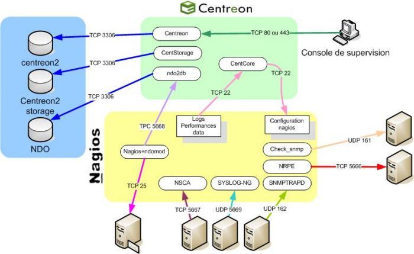

[[[Centreon](start@do=backlink.html)]]

[wiki monitoring-fr.org](../start.html "[ALT+H]")

-   [Accueil](../index.html "Cliquez pour revenir |  l'accueil")
-   [Blog](http://www.monitoring-fr.org "Blog & News")
-   [Forums](http://forums.monitoring-fr.org "Forums")
-   [Doc](http://doc.monitoring-fr.org "Doc")
-   [Forge](https://github.com/monitoring-fr "Forge")

Vous êtes ici: [Accueil](../start.html "start") »
[Centreon](start.html "centreon:start")

### Table des matières {.toggle}

-   [Centreon](start.html#centreon)
    -   [Présentation](start.html#presentation)
        -   [Schéma Fonctionnel](start.html#schema-fonctionnel)
    -   [Documentation](start.html#documentation)
        -   [Chapitre 1 -
            Installation](start.html#chapitre-1-installation)
        -   [Chapitre 2 - Interface
            Web](start.html#chapitre-2-interface-web)
        -   [Chapitre 3 - Prise en
            main](start.html#chapitre-3-prise-en-main)
        -   [Chapitre 4 - Partie
            Technique](start.html#chapitre-4-partie-technique)
        -   [Chapitre 4 -
            Suppléments](start.html#chapitre-4-supplements)

Centreon {#centreon .sectionedit1}
========

Ce dossier a été réalisé avec l’aide de :

  **Rôle**            **Nom**
  ------------------- ---------------------------------------------------
  **Créateur**        Romuald FRONTEAU
  **Contributeurs**   Romain BERTHAUD, David GUENAULT, Ludovic VALENTIN

Certaines des pages ressemblent énormément à celle de la documentation
officielle pour les raisons suivantes :

1.  La rédaction de ces pages est déjà pour un but personnel (doit
    installer un centreon sur RedHat)
2.  Certains internautes se plaignent du manque de documentation de
    Centreon et d’autres souffrent de la difficulté d’installation de
    celui-ci quand on est novice. Je veux tout d’abord démontrer que la
    documentation de Merethis est correcte (si différence il y a, nous
    nous rapprocherons d’eux pour leur faire part des points obscurs)
3.  J’aimerais faire de ces pages, non pas qu’un simple article sur
    Centreon mais creuser un peu plus en profondeur son principe de
    fonctionnement, comment l’utiliser, etc…

Présentation {#presentation .sectionedit3}
------------

[Centreon](http://www.centreon.com/ "http://www.centreon.com/") est
**LE** dérivé français de Nagios de référence développé par la société
Merethis. Il s’agit d’une couche applicative Web venant se greffer à
Nagios pour offrir une administration moins rudimentaire (évite les
fichiers de configuration et les lignes de commandes brute). L’équipe de
chez Merethis est avant-gardiste et a inspiré pour certains points les
lignes directrices de la communauté. C’est un produit très complet et
son interface le rend très professionnel aux yeux des dirigeants.

### Schéma Fonctionnel {#schema-fonctionnel .sectionedit4}

-   **Principe de fonctionnement**

Le schéma ci-dessous montre comment Centreon et Nagios intéragissent
l’un avec l’autre.

-   **Gestion des flux**

Le schéma ci-dessous montre les protocoles et flux utilisés par les
différents éléments qui compose une supervision Centreon / Nagios

Documentation {#documentation .sectionedit5}
-------------

### Chapitre 1 - Installation {#chapitre-1-installation .sectionedit6}

**[Installation de Centreon sur Centos
5.3](centreon-centos-install.html "centreon:centreon-centos-install")**

**[Installation de Centreon sur RedHat
5](centreon-redhat-install.html "centreon:centreon-redhat-install")**

**[Installation de Centreon sur Ubuntu
Server](centreon-ubuntu-install.html "centreon:centreon-ubuntu-install")**

**[Installation de Centreon Enterprise
Server](centreon-enterprise-server.html "centreon:centreon-enterprise-server")**

### Chapitre 2 - Interface Web {#chapitre-2-interface-web .sectionedit7}

**[2.1 -
Accueil](manuel-utilisation/start.html#accueil "centreon:manuel-utilisation:start")**

1.  **[Tactical
    Overview](manuel-utilisation/start.html#tactical-overview "centreon:manuel-utilisation:start")**
2.  **[Santé
    Globale](manuel-utilisation/start.html#sante-globale "centreon:manuel-utilisation:start")**
3.  **[Statistique de
    Nagios](manuel-utilisation/start.html#statistique-de-nagios "centreon:manuel-utilisation:start")**

**[2.2 -
Supervision](manuel-utilisation/start.html#supervision "centreon:manuel-utilisation:start")**

1.  **[Les
    Hôtes](manuel-utilisation/start.html#les-hotes "centreon:manuel-utilisation:start")**
2.  **[Les
    Services](manuel-utilisation/start.html#les-services "centreon:manuel-utilisation:start")**
3.  **[Les journaux
    d'évènements](manuel-utilisation/start.html#les-journaux-d-evenements "centreon:manuel-utilisation:start")**

**[2.3 -
Vues](manuel-utilisation/start.html#vues "centreon:manuel-utilisation:start")**

**[2.4 -
Rapport](manuel-utilisation/start.html#rapport "centreon:manuel-utilisation:start")**

**[2.5 -
Configuration](manuel-utilisation/start.html#configuration "centreon:manuel-utilisation:start")**

1.  **[Hôtes](manuel-utilisation/start.html#hotes "centreon:manuel-utilisation:start")**
2.  **[Services](manuel-utilisation/start.html#services "centreon:manuel-utilisation:start")**
3.  **[Utilisateurs](manuel-utilisation/start.html#utilisateurs "centreon:manuel-utilisation:start")**
4.  **[Commandes](manuel-utilisation/start.html#commandes "centreon:manuel-utilisation:start")**
5.  **[Notifications](manuel-utilisation/start.html#notifications "centreon:manuel-utilisation:start")**
6.  **[Nagios](manuel-utilisation/start.html#nagios "centreon:manuel-utilisation:start")**
7.  **[Centreon](manuel-utilisation/start.html#centreon "centreon:manuel-utilisation:start")**

**[2.6 -
Administration](manuel-utilisation/start.html#administration "centreon:manuel-utilisation:start")**

1.  **[Options](manuel-utilisation/start.html#options "centreon:manuel-utilisation:start")**
2.  **[Modules](manuel-utilisation/start.html#modules "centreon:manuel-utilisation:start")**
3.  **[ACL](manuel-utilisation/start.html#acl "centreon:manuel-utilisation:start")**
4.  **[Base de
    données](manuel-utilisation/start.html#base-de-donnees "centreon:manuel-utilisation:start")**
5.  **[Sessions](manuel-utilisation/start.html#sessions "centreon:manuel-utilisation:start")**
6.  **[Etat du
    Serveur](manuel-utilisation/start.html#etat-du-serveur "centreon:manuel-utilisation:start")**
7.  **[A
    propos](manuel-utilisation/start.html#a-propos "centreon:manuel-utilisation:start")**

* * * * *

### Chapitre 3 - Prise en main {#chapitre-3-prise-en-main .sectionedit8}

**[3.1 - Ajout d'un
hôte](manuel-utilisation/start.html#ajout-d-un-hote "centreon:manuel-utilisation:start")**

**[3.2 - Ajout d'un groupe
d'hôtes](manuel-utilisation/start.html#ajout-d-un-groupe-d-hotes "centreon:manuel-utilisation:start")**

**[3.3 - Ajout d'une
Commande](manuel-utilisation/start.html#ajout-d-une-commande "centreon:manuel-utilisation:start")**

**[3.4 - Ajout d'un
service](manuel-utilisation/start.html#ajout-d-un-service "centreon:manuel-utilisation:start")**

**[3.5 - Suppression d'un
service](manuel-utilisation/start.html#suppression-d-un-service "centreon:manuel-utilisation:start")**

**[3.6 - Paramétrage d’un compte utilisateur en lecture
seule](manuel-utilisation/start.html#parametrage-d-un-compte-utilisateur-en-lecture-seule "centreon:manuel-utilisation:start")**

**[3.7 - Personnaliser l'apparence des
courbes](manuel-utilisation/start.html#personnaliser-l-apparence-des-courbes "centreon:manuel-utilisation:start")**

### Chapitre 4 - Partie Technique {#chapitre-4-partie-technique .sectionedit9}

**[Installation du patch Multi Broker pour
Centreon](multi-broker-patch-install.html "centreon:multi-broker-patch-install")**

**[Installation de MKLiveStatus et Intégration dans
Centreon](mklivestatus-install-integration-centreon.html "centreon:mklivestatus-install-integration-centreon")**

**[Documentation Technique sur
Centreon](centreon-doc-technique.html "centreon:centreon-doc-technique")**

**[Superviser le Spanning Tree avec
Centreon](superviser-spanning-tree.html "centreon:superviser-spanning-tree")**
\

**[Intégrer Nagvis dans
Centreon](integration-nagvis.html "centreon:integration-nagvis")** \

**[Superviser un OXE Alcatel-Lucent avec
Centreon](superviser-oxe-alcatel.html "centreon:superviser-oxe-alcatel")**

### Chapitre 4 - Suppléments {#chapitre-4-supplements .sectionedit10}

**[La supervision en général sur le wiki
Monitoring-fr](../supervision/start.html "supervision:start")**

-   [Commandes pour la
    supervision](../supervision/commands.html "supervision:commands")
-   [Dstat](../supervision/dstat.html "supervision:dstat")
-   [Installer ou activer
    SNMP](../supervision/snmp-install.html "supervision:snmp-install")
-   [Mode actif](../supervision/actif.html "supervision:actif")
-   [Mode passif](../supervision/passif.html "supervision:passif")
-   [Ntop](../supervision/ntop/start.html "supervision:ntop:start")
-   [Panorama](../supervision/links.html "supervision:links")
-   [RRDTool](../supervision/rrdtool.html "supervision:rrdtool")
-   [SNMP](../supervision/snmp.html "supervision:snmp")
-   [Supervision Hardware
    IPMI](../supervision/ipmi.html "supervision:ipmi")
-   [Supervision du ressenti
    utilisateur](../supervision/eue/start.html "supervision:eue:start")
-   [Tableaux récapitulatifs des différents fichiers
    importants](../supervision/important-files.html "supervision:important-files")

**[Présentation de l'interface Centreon 2.1 et de son
utilisation](centreon-interface-utilisation.html "centreon:centreon-interface-utilisation")**

**[Tableau de correspondance des
plugins](tableau-correspondance-plugins.html "centreon:tableau-correspondance-plugins")**

SOMMAIRE {#sommaire .sectionedit1}
--------

**[Accueil](../start.html "start")**

**[Supervision](../supervision/start.html "supervision:start")**

-   [Nagios](../nagios/start.html "nagios:start")
-   [Centreon](start.html "centreon:start")
-   [Shinken](../shinken/start.html "shinken:start")
-   [Zabbix](../zabbix/start.html "zabbix:start")
-   [OpenNMS](../opennms/start.html "opennms:start")
-   [EyesOfNetwork](../eyesofnetwork/start.html "eyesofnetwork:start")
-   [Groundwork](../groundwork/start.html "groundwork:start")
-   [Zenoss](../zenoss/start.html "zenoss:start")
-   [Vigilo](../vigilo/start.html "vigilo:start")
-   [Icinga](../icinga/start.html "icinga:start")
-   [Cacti](../cacti/start.html "cacti:start")
-   [Ressenti
    utilisateur](../supervision/eue/start.html "supervision:eue:start")
-   [Ressenti utilisateur avec
    sikuli](../sikuli/eue/start.html "sikuli:eue:start")

**[Hypervision](../hypervision/start.html "hypervision:start")**

-   [Canopsis](../canopsis/start.html "canopsis:start")

**[Sécurité](../securite/start.html "securite:start")**

**[Infrastructure](../infra/start.html "infra:start")**

**[Développement](../dev/start.html "dev:start")**

Centreon {#centreon .sectionedit1}
--------

-   [Documentation Technique sur
    Centreon](centreon-doc-technique.html "centreon:centreon-doc-technique")
-   [Installation MKLivestatus & Intégration dans
    Centreon](mklivestatus-install-integration-centreon.html "centreon:mklivestatus-install-integration-centreon")
-   [Installation Nagios / Centreon sur RedHat
    EL](centreon-redhat-install.html "centreon:centreon-redhat-install")
-   [Installation de Centreon 2.1 sur CentOS
    5.3](centreon-centos-install.html "centreon:centreon-centos-install")
-   [Installation de Centreon 2.2 sur Ubuntu Server
    10.04](centreon-ubuntu-install.html "centreon:centreon-ubuntu-install")
-   [Installation de Centreon Enterprise
    Server](centreon-enterprise-server.html "centreon:centreon-enterprise-server")
-   [Installation de Shinken sur Centreon Enterprise
    Server](centreon-enterprise-server-shinken.html "centreon:centreon-enterprise-server-shinken")
-   [Installation du patch multi-broker pour
    Centreon](multi-broker-patch-install.html "centreon:multi-broker-patch-install")
-   [Intégrer Nagvis dans
    Centreon](integration-nagvis.html "centreon:integration-nagvis")
-   [Manuel d'utilisation
    Centreon](manuel-utilisation/start.html "centreon:manuel-utilisation:start")
-   [Nagios Centreon
    part1](nagios-centreon-part1.html "centreon:nagios-centreon-part1")
-   [Nagios Centreon
    part2](nagios-centreon-part2.html "centreon:nagios-centreon-part2")
-   [Présentation de l'interface Centreon 2.1 et de son
    utilisation](centreon-interface-utilisation.html "centreon:centreon-interface-utilisation")
-   [Superviser le spanning-tree sous
    Centreon/Nagios](superviser-spanning-tree.html "centreon:superviser-spanning-tree")
-   [Superviser un Autocom OXE V9.x Alcatel-Lucent sous
    Centreon/Nagios](superviser-oxe-alcatel.html "centreon:superviser-oxe-alcatel")
-   [Tableau de correspondance des
    plugins](tableau-correspondance-plugins.html "centreon:tableau-correspondance-plugins")

-   [Afficher le texte
    source](start@do=edit&rev=0.html "Afficher le texte source [V]")
-   [Anciennes
    révisions](start@do=revisions.html "Anciennes révisions [O]")
-   [Derniers
    changements](start@do=recent.html "Derniers changements [R]")
-   [Liens vers cette
    page](start@do=backlink.html "Liens vers cette page")
-   [Gestionnaire de
    médias](start@do=media.html "Gestionnaire de médias")
-   [Index](start@do=index.html "Index [X]")
-   [Connexion](start@do=login&sectok=6bca6bdf16f8880de3d6d3649db89a26.html "Connexion")
-   [Haut de page](start.html#dokuwiki__top "Haut de page [T]")

centreon/start.txt · Dernière modification: 2013/03/29 09:39
(modification externe)

