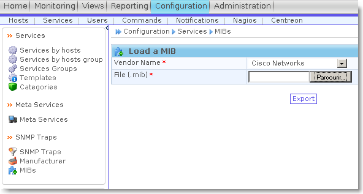

[[[Superviser le spanning-tree sous
Centreon/Nagios](superviser-spanning-tree@do=backlink.html)]]

[wiki monitoring-fr.org](../start.html "[ALT+H]")

-   [Accueil](../index.html "Cliquez pour revenir |  l'accueil")
-   [Blog](http://www.monitoring-fr.org "Blog & News")
-   [Forums](http://forums.monitoring-fr.org "Forums")
-   [Doc](http://doc.monitoring-fr.org "Doc")
-   [Forge](https://github.com/monitoring-fr "Forge")

Vous êtes ici: [Accueil](../start.html "start") »
[Centreon](start.html "centreon:start") » [Superviser le spanning-tree
sous
Centreon/Nagios](superviser-spanning-tree.html "centreon:superviser-spanning-tree")

### Table des matières {.toggle}

-   [Superviser le spanning-tree sous
    Centreon/Nagios](superviser-spanning-tree.html#superviser-le-spanning-tree-sous-centreonnagios)
    -   [Configuration du switch
        Cisco](superviser-spanning-tree.html#configuration-du-switch-cisco)
    -   [Configuration du serveur
        Centreon/Nagios](superviser-spanning-tree.html#configuration-du-serveur-centreonnagios)
        -   [Configuration des Mibs et Traps
            SNMP](superviser-spanning-tree.html#configuration-des-mibs-et-traps-snmp)
        -   [Création du service passif afin de prendre en compte le
            Traps](superviser-spanning-tree.html#creation-du-service-passif-afin-de-prendre-en-compte-le-traps)
        -   [Création du service actif permettant de controler l'état
            STP de
            l'interface](superviser-spanning-tree.html#creation-du-service-actif-permettant-de-controler-l-etat-stp-de-l-interface)

Superviser le spanning-tree sous Centreon/Nagios {#superviser-le-spanning-tree-sous-centreonnagios .sectionedit1}
================================================

Contribution : — *[Pascal
Martin](../cdn-cgi/l/email-protection.html#496f6a317f2d726f6a317f78726f6a317f70726f6a317f2a726f6a317d79726f6a317e79726f6a317f2d726f6a317f78726f6a317e7b726f6a317e7d726f6a317f70X;n.net "mail@pmartin.net")
2010/05/05 12:03*

Le but de ce Tuto est de faire remonter au serveur Centreon/Nagios un
changement de SpanningTree sur le réseau et de vérifier l’etat des
interfaces (au sens STP : blocking, Forwarding…)

Configuration du switch Cisco {#configuration-du-switch-cisco .sectionedit2}
-----------------------------

Activation d’un Spanning-tree MST:

~~~
spanning-tree mode mst
spanning-tree extend system-id
!
spanning-tree mst configuration
 name instance_mst1
 revision 1
~~~

Configuration SNMP du switch (à adapter avec votre communauté SNMP et
l’adresse IP de votre serveur):

~~~
snmp-server community macommunauteSNMP RO
snmp-server enable traps bridge newroot topologychange
snmp-server host @ip_ServeurNagios macommunauteSNMP
~~~

Configuration du serveur Centreon/Nagios {#configuration-du-serveur-centreonnagios .sectionedit3}
----------------------------------------

### Configuration des Mibs et Traps SNMP {#configuration-des-mibs-et-traps-snmp .sectionedit4}

Considérons que snmpd est correctement configuré sur le serveur.

-   Copier la Mib BRIDGE-MIB.my dans le répertoire des mibs
    (Généralement **/usr/local/share/snmp/mibs/**).
-   Puis effectuer l’import de la mib BRIDGE-MIB.my sous Centreon afin
    de traduire les traps **Menu Configuration/Services/MIBS** :

-   Nous constatons bien la prise en charge de 2 traps dont
    **TopologyChange** :

-   Nous pouvons modifier la sortie du trap TopologyChange afin que le
    message remonté dans Centreon soit plus parlant (Output
    Message)**Menu Configuration/Services/SNMP traps** :

-   Générer les fichiers de configuration des snmpTraps **Menu
    Configuration/Nagios/Snmp traps**

### Création du service passif afin de prendre en compte le Traps {#creation-du-service-passif-afin-de-prendre-en-compte-le-traps .sectionedit5}

-   Créer un nouveau service **Menu Configuration/Services/Add**

Onglet Service Configuration:

-   Dans l’onglet Relations, attribuer le service à un equipement
    configuré correctement et selectionner le trap qui nous interresse:

-   Dans l’onglet Data Processing, on pourra parametrer un Freshness
    Threshold:

### Création du service actif permettant de controler l'état STP de l'interface {#creation-du-service-actif-permettant-de-controler-l-etat-stp-de-l-interface .sectionedit6}

-   Tout d’abord nous allons créer une nouvelle commande de check **Menu
    Configuration/Commandes**

~~~
$ARG1$ = Communauté
$ARG2$ = version snmp
$ARG3$ = Numero de l'interface ( index)
$ARG4$ = Etat warning désiré (1=disabled 2=blocking 3=listening 4=learning 5=forwarding 6=broken) 
$ARG5$ = Etat Critique désiré (1=disabled 2=blocking 3=listening 4=learning 5=forwarding 6=broken)
~~~

-   Puis enfin créer le service actif utilisant cette commande de Check.
    Ce service sera biensûr à rattacher un équipement réseau.

SOMMAIRE {#sommaire .sectionedit1}
--------

**[Accueil](../start.html "start")**

**[Supervision](../supervision/start.html "supervision:start")**

-   [Nagios](../nagios/start.html "nagios:start")
-   [Centreon](start.html "centreon:start")
-   [Shinken](../shinken/start.html "shinken:start")
-   [Zabbix](../zabbix/start.html "zabbix:start")
-   [OpenNMS](../opennms/start.html "opennms:start")
-   [EyesOfNetwork](../eyesofnetwork/start.html "eyesofnetwork:start")
-   [Groundwork](../groundwork/start.html "groundwork:start")
-   [Zenoss](../zenoss/start.html "zenoss:start")
-   [Vigilo](../vigilo/start.html "vigilo:start")
-   [Icinga](../icinga/start.html "icinga:start")
-   [Cacti](../cacti/start.html "cacti:start")
-   [Ressenti
    utilisateur](../supervision/eue/start.html "supervision:eue:start")
-   [Ressenti utilisateur avec
    sikuli](../sikuli/eue/start.html "sikuli:eue:start")

**[Hypervision](../hypervision/start.html "hypervision:start")**

-   [Canopsis](../canopsis/start.html "canopsis:start")

**[Sécurité](../securite/start.html "securite:start")**

**[Infrastructure](../infra/start.html "infra:start")**

**[Développement](../dev/start.html "dev:start")**

Centreon {#centreon .sectionedit1}
--------

-   [Documentation Technique sur
    Centreon](centreon-doc-technique.html "centreon:centreon-doc-technique")
-   [Installation MKLivestatus & Intégration dans
    Centreon](mklivestatus-install-integration-centreon.html "centreon:mklivestatus-install-integration-centreon")
-   [Installation Nagios / Centreon sur RedHat
    EL](centreon-redhat-install.html "centreon:centreon-redhat-install")
-   [Installation de Centreon 2.1 sur CentOS
    5.3](centreon-centos-install.html "centreon:centreon-centos-install")
-   [Installation de Centreon 2.2 sur Ubuntu Server
    10.04](centreon-ubuntu-install.html "centreon:centreon-ubuntu-install")
-   [Installation de Centreon Enterprise
    Server](centreon-enterprise-server.html "centreon:centreon-enterprise-server")
-   [Installation de Shinken sur Centreon Enterprise
    Server](centreon-enterprise-server-shinken.html "centreon:centreon-enterprise-server-shinken")
-   [Installation du patch multi-broker pour
    Centreon](multi-broker-patch-install.html "centreon:multi-broker-patch-install")
-   [Intégrer Nagvis dans
    Centreon](integration-nagvis.html "centreon:integration-nagvis")
-   [Manuel d'utilisation
    Centreon](manuel-utilisation/start.html "centreon:manuel-utilisation:start")
-   [Nagios Centreon
    part1](nagios-centreon-part1.html "centreon:nagios-centreon-part1")
-   [Nagios Centreon
    part2](nagios-centreon-part2.html "centreon:nagios-centreon-part2")
-   [Présentation de l'interface Centreon 2.1 et de son
    utilisation](centreon-interface-utilisation.html "centreon:centreon-interface-utilisation")
-   [Superviser le spanning-tree sous
    Centreon/Nagios](superviser-spanning-tree.html "centreon:superviser-spanning-tree")
-   [Superviser un Autocom OXE V9.x Alcatel-Lucent sous
    Centreon/Nagios](superviser-oxe-alcatel.html "centreon:superviser-oxe-alcatel")
-   [Tableau de correspondance des
    plugins](tableau-correspondance-plugins.html "centreon:tableau-correspondance-plugins")

-   [Afficher le texte
    source](superviser-spanning-tree@do=edit&rev=0.html "Afficher le texte source [V]")
-   [Anciennes
    révisions](superviser-spanning-tree@do=revisions.html "Anciennes révisions [O]")
-   [Derniers
    changements](superviser-spanning-tree@do=recent.html "Derniers changements [R]")
-   [Liens vers cette
    page](superviser-spanning-tree@do=backlink.html "Liens vers cette page")
-   [Gestionnaire de
    médias](superviser-spanning-tree@do=media.html "Gestionnaire de médias")
-   [Index](superviser-spanning-tree@do=index.html "Index [X]")
-   [Connexion](superviser-spanning-tree@do=login&sectok=6bca6bdf16f8880de3d6d3649db89a26.html "Connexion")
-   [Haut de
    page](superviser-spanning-tree.html#dokuwiki__top "Haut de page [T]")

centreon/superviser-spanning-tree.txt · Dernière modification:
2013/03/29 09:39 (modification externe)

