[[[Interface Web de
EyesOfNetwork](eyesofnetwork-interface@do=backlink.html)]]

[wiki monitoring-fr.org](../start.html "[ALT+H]")

-   [Accueil](../index.html "Cliquez pour revenir |  l'accueil")
-   [Blog](http://www.monitoring-fr.org "Blog & News")
-   [Forums](http://forums.monitoring-fr.org "Forums")
-   [Doc](http://doc.monitoring-fr.org "Doc")
-   [Forge](https://github.com/monitoring-fr "Forge")

Vous êtes ici: [Accueil](../start.html "start") »
[Présentation](start.html "eyesofnetwork:start") » [Interface Web de
EyesOfNetwork](eyesofnetwork-interface.html "eyesofnetwork:eyesofnetwork-interface")

### Table des matières {.toggle}

-   [Interface Web de
    EyesOfNetwork](eyesofnetwork-interface.html#interface-web-de-eyesofnetwork)
    -   [Onglet
        Disponibilités](eyesofnetwork-interface.html#onglet-disponibilites)
        -   [Vue Globale](eyesofnetwork-interface.html#vue-globale)
        -   [Cartographie](eyesofnetwork-interface.html#cartographie)
        -   [Evènements](eyesofnetwork-interface.html#evenements)
        -   [Incidents](eyesofnetwork-interface.html#incidents)
    -   [Onglet
        Capacités](eyesofnetwork-interface.html#onglet-capacites)
    -   [Onglet
        Production](eyesofnetwork-interface.html#onglet-production)
    -   [Onglet Rapports](eyesofnetwork-interface.html#onglet-rapports)
        -   [Évènements](eyesofnetwork-interface.html#evenements1)
        -   [Disponibilités](eyesofnetwork-interface.html#disponibilites)
        -   [Capacités](eyesofnetwork-interface.html#capacites)
    -   [Onglet
        Administration](eyesofnetwork-interface.html#onglet-administration)
        -   [Généralités](eyesofnetwork-interface.html#generalites)
        -   [Ged](eyesofnetwork-interface.html#ged)
        -   [Nagios](eyesofnetwork-interface.html#nagios)
        -   [Cartographie](eyesofnetwork-interface.html#cartographie1)

Interface Web de EyesOfNetwork {#interface-web-de-eyesofnetwork .sectionedit1}
==============================

On remarquera au premier coup d’oeil que l’interface de EON est vraiment
pas mal du tout, déjà que son installation est plus que simple. Le fait
que de bons outils y soit greffés font de lui un bon “couteau suisse”.
L’interface n’est pas super classe mais ne soyons pas difficile, ils ne
sont qu’à la version 1.2.

L’interface se découpe en 7 onglets principal mais seulement 5 nous
intéresse :

-   Disponibilités
-   Capacités
-   Production
-   Rapports
-   Administration

Nous allons vous les présenter un par un. Nous sauterons certaines
fonctionnalités qui ne présentent pas un grand intérêt.

La connexion à l’interface se fait via un navigateur à l’url suivante :

<http://ip_serv_EON>

utilisateur : admin

mdp : admin

Ce tutoriel a été réalisé par :

  **Rôle**        **Nom**
  --------------- ------------------
  **Rédacteur**   Romuald FRONTEAU

Onglet Disponibilités {#onglet-disponibilites .sectionedit3}
---------------------

Cet onglet est la vue globale de EON. On y retrouve toutes informations
liés à cet outil de supervision (monitoring, cartographie, ect ….)

### Vue Globale {#vue-globale .sectionedit4}

-   **Tableau de bord**

Il s’agit d’une vue récapitulative de l’état de santé du S.I supervisés

[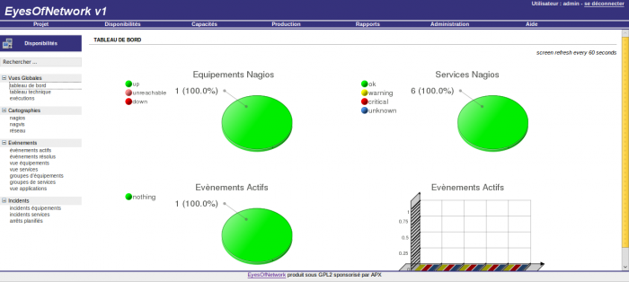](../_detail/eon-tableau_bord.png@id=eyesofnetwork%253Aeyesofnetwork-interface.html "eon-tableau_bord.png")

-   **Tableau technique**

Il s’agit tout bonnement du tactical Overview de nagios

[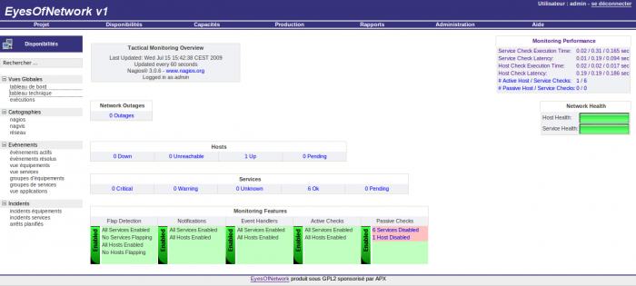](../_detail/eon-tactical_overview.png@id=eyesofnetwork%253Aeyesofnetwork-interface.html "eon-tactical_overview.png")

### Cartographie {#cartographie .sectionedit5}

-   **Nagios**

Il s’agit du statusmap de nagios

[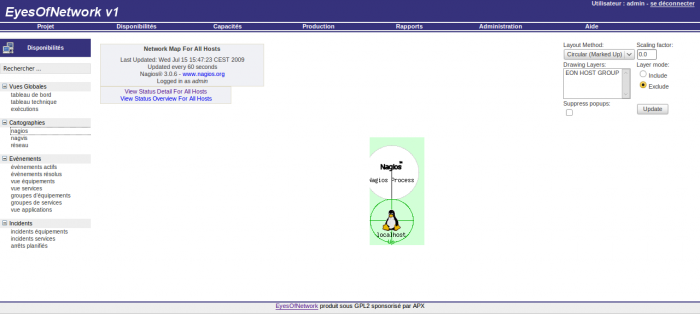](../_detail/eon-statusmap.png@id=eyesofnetwork%253Aeyesofnetwork-interface.html "eon-statusmap.png")

-   **Nagvis**

Il s’agit de la vue globale de nagvis

[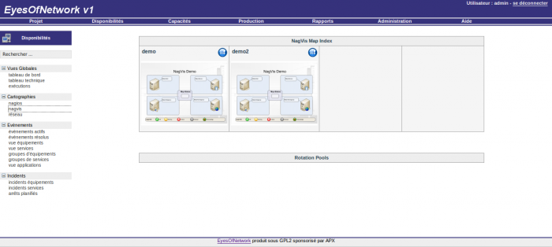](../_detail/eon-nagvis.png@id=eyesofnetwork%253Aeyesofnetwork-interface.html "eon-nagvis.png")

-   **Réseau**

Il s’agit de l’addons weathermap (utilitaire servant à réaliser des
cartographies du réseaux) derrière

[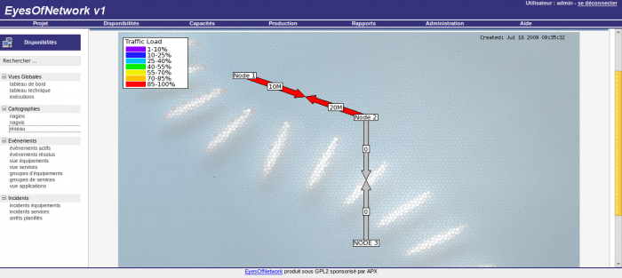](../_detail/eon-weathermap.png@id=eyesofnetwork%253Aeyesofnetwork-interface.html "eon-weathermap.png")

### Evènements {#evenements .sectionedit6}

-   **Évènements actif**

Il s’agit d’un dérivé de l’eventlog de nagios. Il permet d’afficher les
évènements en cours.

-   **Évènements résolus**

Il s’agit d’un dérivé de l’eventlog de nagios. Il permet d’afficher le
début et la fin d’un problème.

[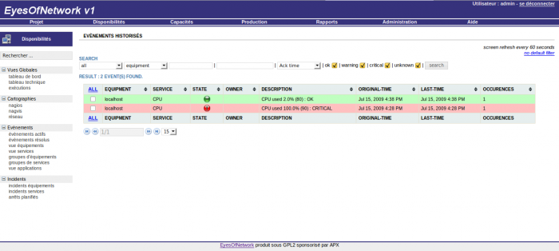](../_detail/eon-event_resolu.png@id=eyesofnetwork%253Aeyesofnetwork-interface.html "eon-event_resolu.png")

-   **Vue équipements**

Il s’agit de la vue des hôtes de nagios

[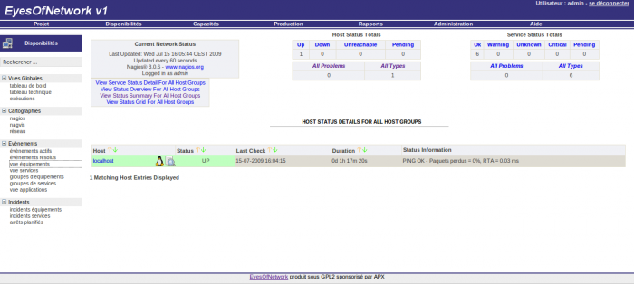](../_detail/eon-vue_host.png@id=eyesofnetwork%253Aeyesofnetwork-interface.html "eon-vue_host.png")

-   **Vue services**

Il s’agit de la vue des services de nagios

[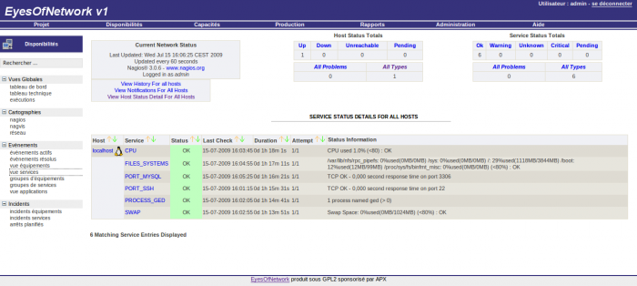](../_detail/eon-vue_services.png@id=eyesofnetwork%253Aeyesofnetwork-interface.html "eon-vue_services.png")

-   **groupes d’équipements**

Il s’agit de la vue des groupes d’hôtes

[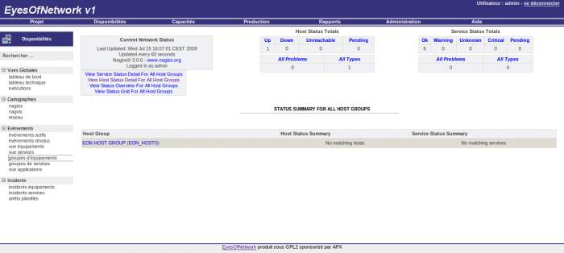](../_detail/eon-vue_hostgroup.png@id=eyesofnetwork%253Aeyesofnetwork-interface.html "eon-vue_hostgroup.png")

-   **groupes de services**

Il s’agit de la vue des groupes de services

[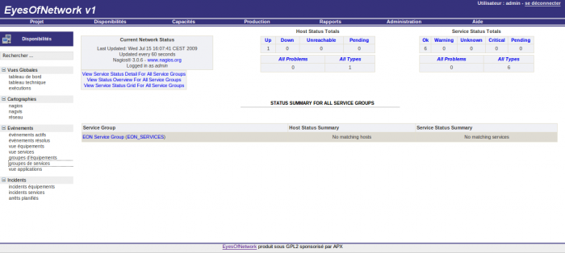](../_detail/eon-vue_servicegroups.png@id=eyesofnetwork%253Aeyesofnetwork-interface.html "eon-vue_servicegroups.png")

-   **Vue applications**

Il s’agit d’une vue vraiment pas mal, elle regroupe des services par
types d’applications

[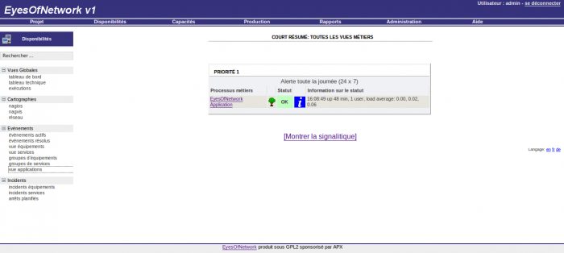](../_detail/eon-vue_applicative_metier.png@id=eyesofnetwork%253Aeyesofnetwork-interface.html "eon-vue_applicative_metier.png")

### Incidents {#incidents .sectionedit7}

-   **Incidents équipements**

Il s’agit d’un filtre permettant de voir tous les problèmes sur les
hôtes en cours

-   **Incidents services**

Il s’agit d’un filtre permettant de voir tous les problèmes sur les
services en cours

-   **Arrêts planifiés**

Correspond à la vue Downtime de nagios

Onglet Capacités {#onglet-capacites .sectionedit8}
----------------

Cet onglet correspond à la fonction métrologique de l’outil.

-   **par équipement**

[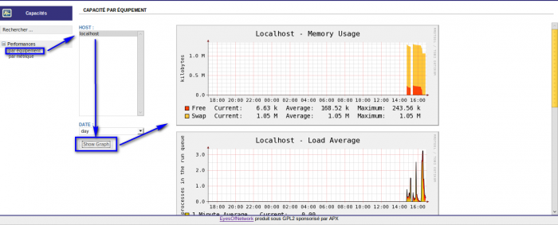](../_detail/eon-perf_equip.png@id=eyesofnetwork%253Aeyesofnetwork-interface.html "eon-perf_equip.png")

-   **par métrique**

[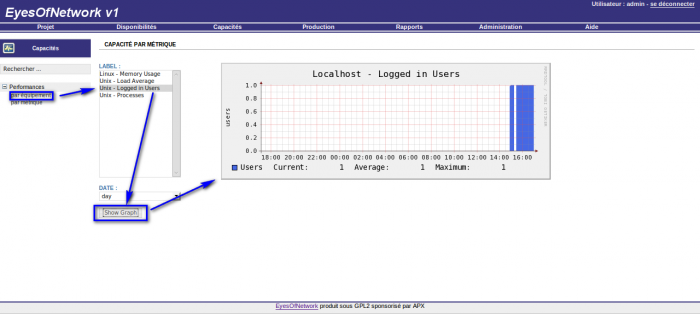](../_detail/eon-perf_metrique.png@id=eyesofnetwork%253Aeyesofnetwork-interface.html "eon-perf_metrique.png")

Onglet Production {#onglet-production .sectionedit9}
-----------------

Je pense que cet onglet est en cours de développement mais s’annonce
très prometteur. A première vue, il permettrait d’accéder à votre
machine (ssh, telnet, rdp, vnc, ….) directement via l’outil
EyesOfNetwork.

-   **équipements**

Permet d’utiliser les outils ci-dessus énoncés pour les machines
supervisées

[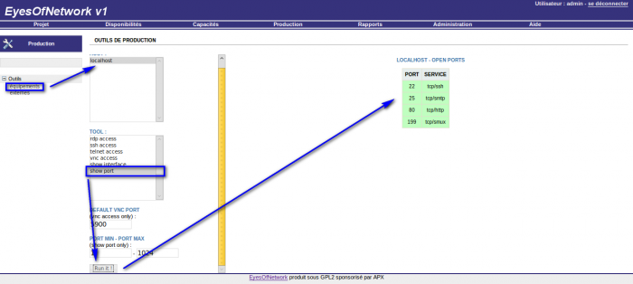](../_detail/eon-production_supervision.png@id=eyesofnetwork%253Aeyesofnetwork-interface.html "eon-production_supervision.png")

-   **externes**

Permet d’utiliser les outils ci-dessus énoncés pour une IP.

[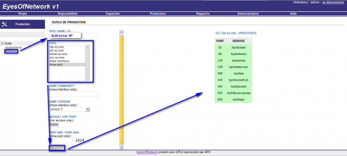](../_detail/eon-production_externes.png@id=eyesofnetwork%253Aeyesofnetwork-interface.html "eon-production_externes.png")

Onglet Rapports {#onglet-rapports .sectionedit10}
---------------

Que dire sur cet onglet, à part qu’il est très réussi et très prometteur
lui aussi pour un outil qui n’est qu’à ça version 1.2.

### Évènements {#evenements1 .sectionedit11}

-   **volume d’incidents**

[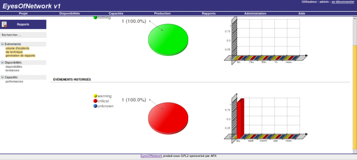](../_detail/eon-volume_incidents.png@id=eyesofnetwork%253Aeyesofnetwork-interface.html "eon-volume_incidents.png")

-   **sla technique**

[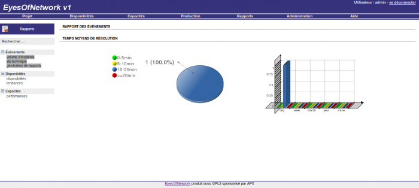](../_detail/eon-sla_technique.png@id=eyesofnetwork%253Aeyesofnetwork-interface.html "eon-sla_technique.png")

-   **génération de rapports**

j’adore cette fonctionnalité très particulièrement, utile pour donner un
rapport vite fait à votre DSI qui ne voit que par Word.

[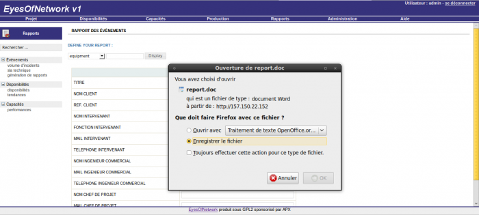](../_detail/eon-gen_rapport.png@id=eyesofnetwork%253Aeyesofnetwork-interface.html "eon-gen_rapport.png")

### Disponibilités {#disponibilites .sectionedit12}

-   **disponibilités**

Il s’agit de la vue du rapport de disponibilité de nagios

[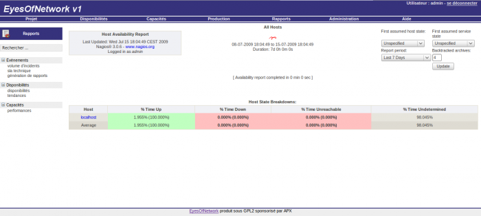](../_detail/eon-rapport_dispo.png@id=eyesofnetwork%253Aeyesofnetwork-interface.html "eon-rapport_dispo.png")

-   **tendances**

Il s’agit de la vue du rapport des tendances de nagios

[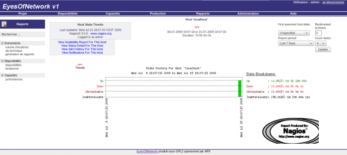](../_detail/eon-rapport_tendances.png@id=eyesofnetwork%253Aeyesofnetwork-interface.html "eon-rapport_tendances.png")

### Capacités {#capacites .sectionedit13}

-   **Performances**

[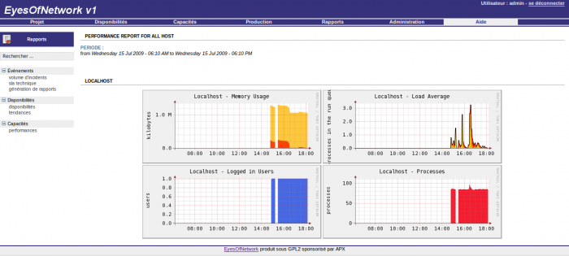](../_detail/eon-rapport_perf.png@id=eyesofnetwork%253Aeyesofnetwork-interface.html "eon-rapport_perf.png")

Onglet Administration {#onglet-administration .sectionedit14}
---------------------

Cet onglet est réservé à l’administration général de EON et des addons
qui y sont greffés.

### Généralités {#generalites .sectionedit15}

-   authentification

Dans cette vue, vous aurez le choix de gérer vos connexion à EON soit
via la base mysql ou via un annuaire LDAP

[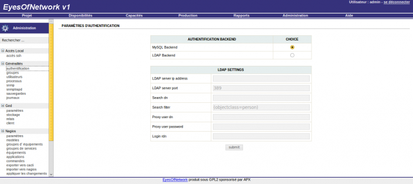](../_detail/eon-admin_auth.png@id=eyesofnetwork%253Aeyesofnetwork-interface.html "eon-admin_auth.png")

-   groupes

Dans cette vue, vous pourrez gérer des groupes d’utilisateurs pour
l’interface EON

-   utilisateurs

Dans cette vue, vous pourrez gérer les utilisateurs pour l’interface EON

-   processus

Dans cette vue, vous pourrez gérer vos processus et voir dans quel état
ils sont

[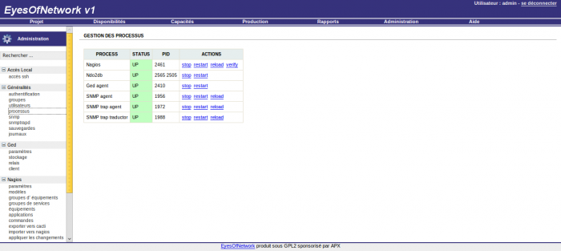](../_detail/eon-admin_processus.png@id=eyesofnetwork%253Aeyesofnetwork-interface.html "eon-admin_processus.png")

-   snmp

Dans cette vue, vous avez accès à la configuration de snmp

-   snmptrapd

Dans cette vue, vous avez accès à la configuration de snmptrapd

-   journaux

Dans cette vue, vous avez accès au journal des connexions utilisateurs à
l’interface

### Ged {#ged .sectionedit16}

Dans ce menu, vous aurez accès à la configuration de logiciel GED

### Nagios {#nagios .sectionedit17}

-   paramètres

[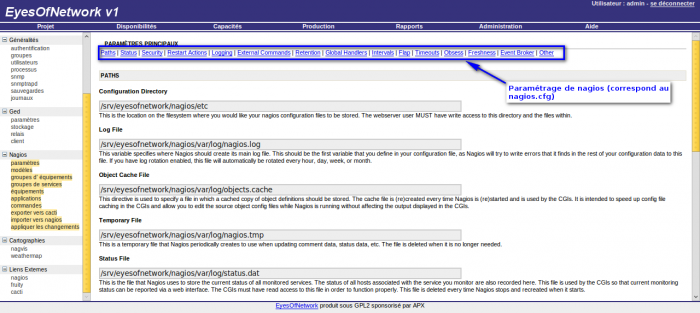](../_detail/eon-nagios_param.png@id=eyesofnetwork%253Aeyesofnetwork-interface.html "eon-nagios_param.png")

-   modèles

Vous pourrez créer vos templates d’hôtes et de services ici (correspond
au templates.cfg)

[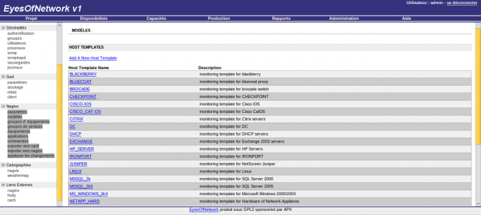](../_detail/eon-nagios_template.png@id=eyesofnetwork%253Aeyesofnetwork-interface.html "eon-nagios_template.png")

-   groupes d’ équipements

Gestion des groupes d’hôtes (correspond à hostgroups.cfg)

-   groupes de services

Gestion des groupes de services

-   équipements

[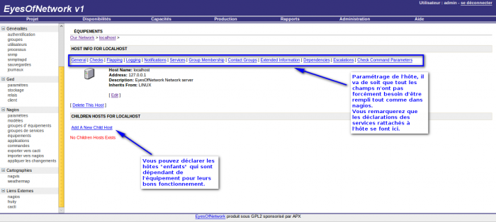](../_detail/eon-nagios_equipement.png@id=eyesofnetwork%253Aeyesofnetwork-interface.html "eon-nagios_equipement.png")

-   applications

Cette vue est lié à GED et permet de gérer la vue application métier vu
ci-dessus dan “l’Onglet Dsiponibilités”

-   commandes

Dans cette vue, vous pourrez créer vos commandes de check (correspond au
commands.cfg). Y a des commandes de déclarer par défaut vraiment pas mal
à première vue.

### Cartographie {#cartographie1 .sectionedit18}

-   nagvis

C’est nagvis intégré dans l’interface de EON. Pour comment gérer nagvis,
veuillez vous référer
[nagvis](http://wiki.monitoring-fr.org/addons/nagvis "addons:nagvis")

-   weathermap

C’est weather intégré dans l’interface EON. La gestion de la
configuration de la cartographie weathermap se fera ici.

En attendant, un article de Wiki Nagios-fr.org sur le sujet
phpWeathermap, je vous envoie à lire ceci pour un peu mieux comprendre
comment ça fonctione.

[Des cartes Réseaux comme chez
Free](http://www.paperblog.fr/575571/des-cartes-reseaux-comme-chez-free/ "http://www.paperblog.fr/575571/des-cartes-reseaux-comme-chez-free/")

[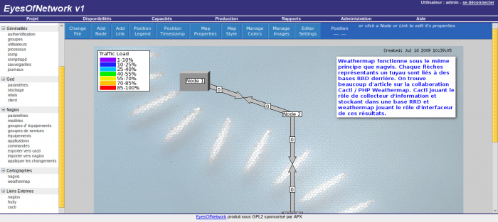](../_detail/eon-admin_weathermap.png@id=eyesofnetwork%253Aeyesofnetwork-interface.html "eon-admin_weathermap.png")

SOMMAIRE {#sommaire .sectionedit1}
--------

**[Accueil](../start.html "start")**

**[Supervision](../supervision/start.html "supervision:start")**

-   [Nagios](../nagios/start.html "nagios:start")
-   [Centreon](../centreon/start.html "centreon:start")
-   [Shinken](../shinken/start.html "shinken:start")
-   [Zabbix](../zabbix/start.html "zabbix:start")
-   [OpenNMS](../opennms/start.html "opennms:start")
-   [EyesOfNetwork](start.html "eyesofnetwork:start")
-   [Groundwork](../groundwork/start.html "groundwork:start")
-   [Zenoss](../zenoss/start.html "zenoss:start")
-   [Vigilo](../vigilo/start.html "vigilo:start")
-   [Icinga](../icinga/start.html "icinga:start")
-   [Cacti](../cacti/start.html "cacti:start")
-   [Ressenti
    utilisateur](../supervision/eue/start.html "supervision:eue:start")
-   [Ressenti utilisateur avec
    sikuli](../sikuli/eue/start.html "sikuli:eue:start")

**[Hypervision](../hypervision/start.html "hypervision:start")**

-   [Canopsis](../canopsis/start.html "canopsis:start")

**[Sécurité](../securite/start.html "securite:start")**

**[Infrastructure](../infra/start.html "infra:start")**

**[Développement](../dev/start.html "dev:start")**

EyesOfNetwork {#eyesofnetwork .sectionedit1}
-------------

-   [Installation de
    EyesOfNetwork](eyesofnetwork-iso-install.html "eyesofnetwork:eyesofnetwork-iso-install")
-   [Interface Web de
    EyesOfNetwork](eyesofnetwork-interface.html "eyesofnetwork:eyesofnetwork-interface")

-   [Afficher le texte
    source](eyesofnetwork-interface@do=edit&rev=0.html "Afficher le texte source [V]")
-   [Anciennes
    révisions](eyesofnetwork-interface@do=revisions.html "Anciennes révisions [O]")
-   [Derniers
    changements](eyesofnetwork-interface@do=recent.html "Derniers changements [R]")
-   [Liens vers cette
    page](eyesofnetwork-interface@do=backlink.html "Liens vers cette page")
-   [Gestionnaire de
    médias](eyesofnetwork-interface@do=media.html "Gestionnaire de médias")
-   [Index](eyesofnetwork-interface@do=index.html "Index [X]")
-   [Connexion](eyesofnetwork-interface@do=login&sectok=6bca6bdf16f8880de3d6d3649db89a26.html "Connexion")
-   [Haut de
    page](eyesofnetwork-interface.html#dokuwiki__top "Haut de page [T]")

eyesofnetwork/eyesofnetwork-interface.txt · Dernière modification:
2013/03/29 09:39 (modification externe)

