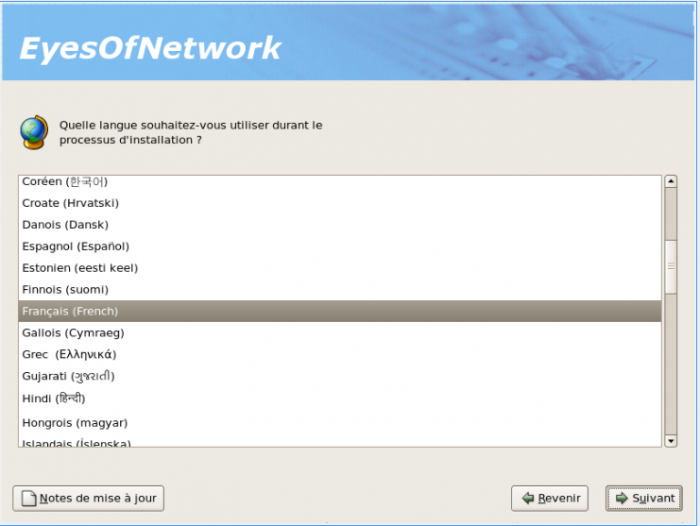
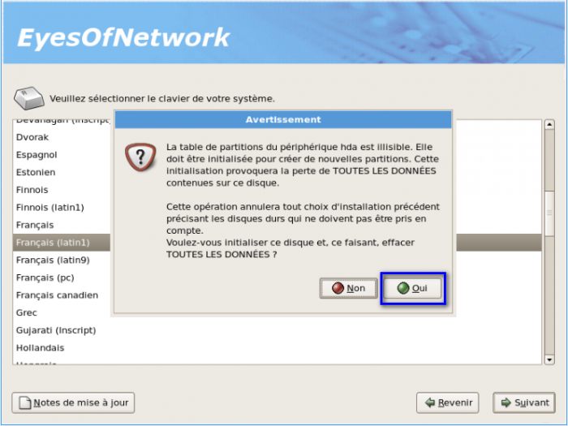
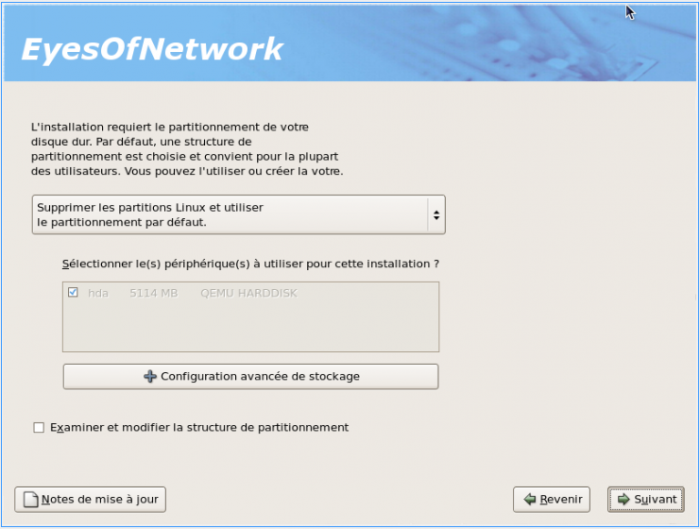
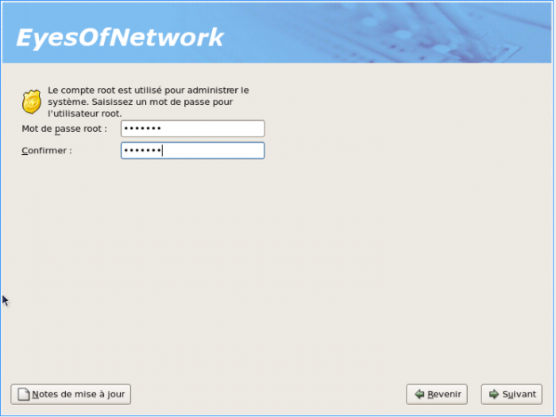
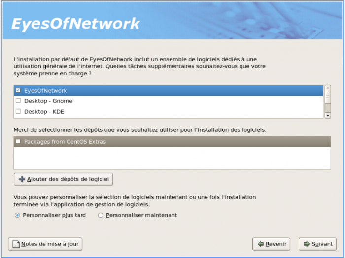
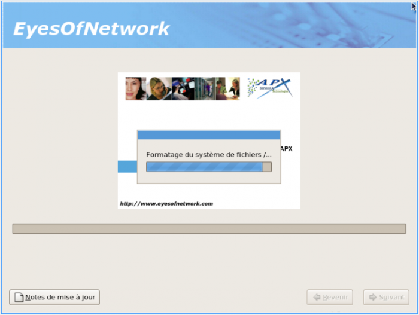

[[[Installation de
EyesOfNetwork](eyesofnetwork-iso-install@do=backlink.html)]]

[wiki monitoring-fr.org](../start.html "[ALT+H]")

-   [Accueil](../index.html "Cliquez pour revenir |  l'accueil")
-   [Blog](http://www.monitoring-fr.org "Blog & News")
-   [Forums](http://forums.monitoring-fr.org "Forums")
-   [Doc](http://doc.monitoring-fr.org "Doc")
-   [Forge](https://github.com/monitoring-fr "Forge")

Vous êtes ici: [Accueil](../start.html "start") »
[Présentation](start.html "eyesofnetwork:start") » [Installation de
EyesOfNetwork](eyesofnetwork-iso-install.html "eyesofnetwork:eyesofnetwork-iso-install")

### Table des matières {.toggle}

-   [Installation de
    EyesOfNetwork](eyesofnetwork-iso-install.html#installation-de-eyesofnetwork)

Installation de EyesOfNetwork {#installation-de-eyesofnetwork .sectionedit1}
=============================

Tutoriel sur l’installation de EyesOfNetwork.

Ce tutoriel a été réalisé par :

  **Rôle**        **Nom**
  --------------- ------------------
  **Rédacteur**   Romuald FRONTEAU

EON n’est installable que sur Centos via un format ISO. Vous avez le
choix entre le CD (645M, EON + dépendances) ou le dvd (3.7G, EON +
dépendances + tout CentOS). Personnellement, on a pris le dvd comme ça
on manquera de rien.

Pour commencer insérer votre cd ou dvd dans votre lecteur et c’est
parti.

-   Faire Suivant

-   Choisir la langue, dans notre cas Français et faire suivant

-   Choisir le clavier et faire suivant

-   Ensuite, il vous demande de formater le disque (nous mettons « oui »
    car notre machine est vierge)

-   Sur l’image ci-dessous, vous pouvez choisir la manière dont vous
    allez gérer votre espace disque (pour notre cas, ce sera une
    installation par défaut)

-   Confirmation de votre choix

-   Paramétrage du réseau, Pour le DHCP, seulement faire suivant :

-   Fuseau Horaire

-   Mot de passe du compte root

-   Dans notre cas, juste EyesOfNetwork nous intéresse, nous ne désirons
    aucune couche graphique

-   Faire Suivant

-   Démarrage de l’installation

-   Redémarrage

SOMMAIRE {#sommaire .sectionedit1}
--------

**[Accueil](../start.html "start")**

**[Supervision](../supervision/start.html "supervision:start")**

-   [Nagios](../nagios/start.html "nagios:start")
-   [Centreon](../centreon/start.html "centreon:start")
-   [Shinken](../shinken/start.html "shinken:start")
-   [Zabbix](../zabbix/start.html "zabbix:start")
-   [OpenNMS](../opennms/start.html "opennms:start")
-   [EyesOfNetwork](start.html "eyesofnetwork:start")
-   [Groundwork](../groundwork/start.html "groundwork:start")
-   [Zenoss](../zenoss/start.html "zenoss:start")
-   [Vigilo](../vigilo/start.html "vigilo:start")
-   [Icinga](../icinga/start.html "icinga:start")
-   [Cacti](../cacti/start.html "cacti:start")
-   [Ressenti
    utilisateur](../supervision/eue/start.html "supervision:eue:start")
-   [Ressenti utilisateur avec
    sikuli](../sikuli/eue/start.html "sikuli:eue:start")

**[Hypervision](../hypervision/start.html "hypervision:start")**

-   [Canopsis](../canopsis/start.html "canopsis:start")

**[Sécurité](../securite/start.html "securite:start")**

**[Infrastructure](../infra/start.html "infra:start")**

**[Développement](../dev/start.html "dev:start")**

EyesOfNetwork {#eyesofnetwork .sectionedit1}
-------------

-   [Installation de
    EyesOfNetwork](eyesofnetwork-iso-install.html "eyesofnetwork:eyesofnetwork-iso-install")
-   [Interface Web de
    EyesOfNetwork](eyesofnetwork-interface.html "eyesofnetwork:eyesofnetwork-interface")

-   [Afficher le texte
    source](eyesofnetwork-iso-install@do=edit&rev=0.html "Afficher le texte source [V]")
-   [Anciennes
    révisions](eyesofnetwork-iso-install@do=revisions.html "Anciennes révisions [O]")
-   [Derniers
    changements](eyesofnetwork-iso-install@do=recent.html "Derniers changements [R]")
-   [Liens vers cette
    page](eyesofnetwork-iso-install@do=backlink.html "Liens vers cette page")
-   [Gestionnaire de
    médias](eyesofnetwork-iso-install@do=media.html "Gestionnaire de médias")
-   [Index](eyesofnetwork-iso-install@do=index.html "Index [X]")
-   [Connexion](eyesofnetwork-iso-install@do=login&sectok=6bca6bdf16f8880de3d6d3649db89a26.html "Connexion")
-   [Haut de
    page](eyesofnetwork-iso-install.html#dokuwiki__top "Haut de page [T]")

eyesofnetwork/eyesofnetwork-iso-install.txt · Dernière modification:
2013/03/29 09:39 (modification externe)

