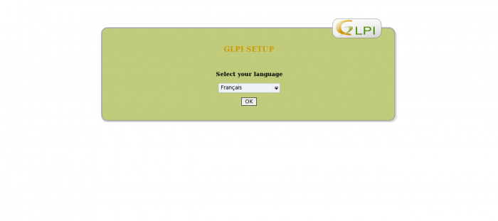
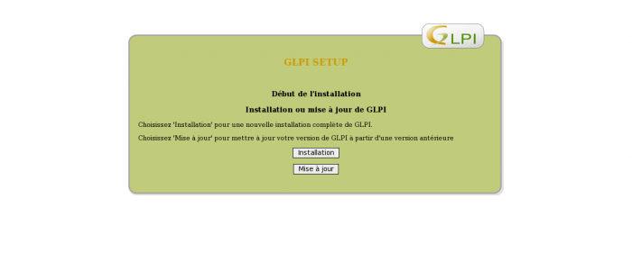
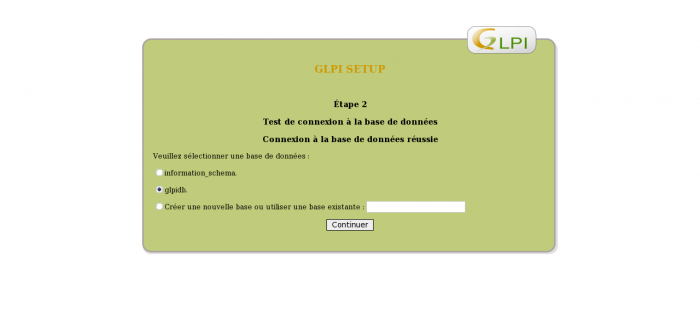
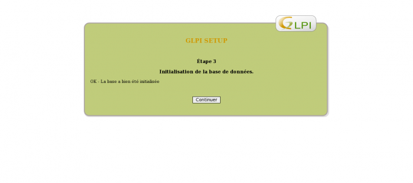
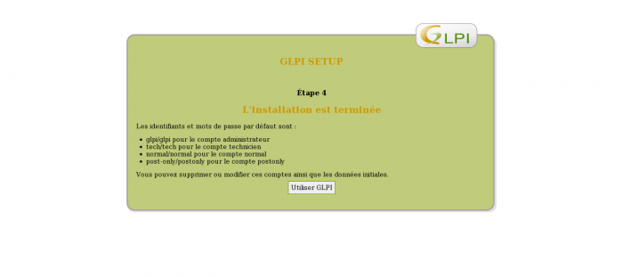

[[[Installation de GLPI sur
Ubuntu](glpi-ubuntu-install@do=backlink.html)]]

[wiki monitoring-fr.org](../../start.html "[ALT+H]")

-   [Accueil](../../index.html "Cliquez pour revenir |  l'accueil")
-   [Blog](http://www.monitoring-fr.org "Blog & News")
-   [Forums](http://forums.monitoring-fr.org "Forums")
-   [Doc](http://doc.monitoring-fr.org "Doc")
-   [Forge](https://github.com/monitoring-fr "Forge")

Vous êtes ici: [Accueil](../../start.html "start") »
[Infrastructure](../start.html "infra:start") »
[GLPI](start.html "infra:glpi:start") » [Installation de GLPI sur
Ubuntu](glpi-ubuntu-install.html "infra:glpi:glpi-ubuntu-install")

### Table des matières {.toggle}

-   [Installation de GLPI sur
    Ubuntu](glpi-ubuntu-install.html#installation-de-glpi-sur-ubuntu)
    -   [Pré-requis](glpi-ubuntu-install.html#pre-requis)
    -   [Installation](glpi-ubuntu-install.html#installation)
        -   [Création de la base de
            données](glpi-ubuntu-install.html#creation-de-la-base-de-donnees)
        -   [Téléchargement de
            GLPI](glpi-ubuntu-install.html#telechargement-de-glpi)
        -   [Vérification
            PHP](glpi-ubuntu-install.html#verification-php)
        -   [Installation de
            GLPI](glpi-ubuntu-install.html#installation-de-glpi)

Installation de GLPI sur Ubuntu {#installation-de-glpi-sur-ubuntu .sectionedit1}
===============================

Tutoriel rédigé pour une version Ubuntu 0.04 LTS et GLPI 0.72/0.78.

Ce tutoriel a été réalisé par :

  **Rôle**        **Nom**
  --------------- ---------------------------------------------------------------------------------------------------------------------------------------------------------
  **Rédacteur**   [Ludovic VALENTIN](http://www.monitoring-fr.org/community/members/ludovic-valentin/ "http://www.monitoring-fr.org/community/members/ludovic-valentin/")

Pré-requis {#pre-requis .sectionedit3}
----------

Installation des dépendances requises à la mise en place de GLPI :

~~~~ {.code}
$ sudo apt-get update
$ sudo apt-get upgrade
$ sudo apt-get install wget man vim build-essential checkinstall apache2 libapache2-mod-php5 php5 php5-mysql php5-curl mysql-server php5-imap php5-ldap php5-gd
~~~~

Installation {#installation .sectionedit4}
------------

### Création de la base de données {#creation-de-la-base-de-donnees .sectionedit5}

~~~~ {.code}
$ sudo mysql -u root -p
> create database glpidb character set utf8;
> grant all privileges on glpidb.* to glpi@localhost identified by 'glpi';
> exit
~~~~

### Téléchargement de GLPI {#telechargement-de-glpi .sectionedit6}

~~~~ {.code}
$ sudo cd /tmp
$ sudo wget https://forge.indepnet.net/attachments/download/812/glpi-0.78.3.tar.gz
$ sudo tar -zxf glpi-0.78.3.tar.gz -C /var/www
$ sudo chown -R www-data /var/www/glpi
~~~~

### Vérification PHP {#verification-php .sectionedit7}

~~~~ {.code}
$ sudo grep –I memory_limit /etc/php5/apache2/php.ini
memory_limit=64
$ sudo grep –I mysql.so /etc/php5/conf.d/mysql.ini
extension=mysql.so
$ sudo /etc/init.d/apache2 restart
~~~~

### Installation de GLPI {#installation-de-glpi .sectionedit8}

L’installation de GLPI se fait depuis un navigateur internet :

<http://votre_adresse_ip/glpi>

Choix de la langue d’installation de GLPI :

Acceptation de la licence de GLPI :

Choix de l’installation (ou de la mise à jour selon les besoins) :

Vérification des pré-requis nécessaires à l’installation de GLPI (en cas
de non-conformité, il faut installer ou paramétrer les dépendances
requises) :

Configuration des paramètres de connexion à la base de données (voir
précédemment lors de la création de la base de données) :

Sélection de la base de données de GLPI (ou bien en créer une nouvelle)
:

Test de la base de données GLPI avec les paramètres spécifiés auparavant
:

Fin de l’installation :

Redirection sur la page d’authentification de GLPI, il faut alors
utiliser les paramètres de connexion indiqués précedement (« étape 4 »
de l’installation de GLPI) :

SOMMAIRE {#sommaire .sectionedit1}
--------

**[Accueil](../../start.html "start")**

**[Supervision](../../supervision/start.html "supervision:start")**

-   [Nagios](../../nagios/start.html "nagios:start")
-   [Centreon](../../centreon/start.html "centreon:start")
-   [Shinken](../../shinken/start.html "shinken:start")
-   [Zabbix](../../zabbix/start.html "zabbix:start")
-   [OpenNMS](../../opennms/start.html "opennms:start")
-   [EyesOfNetwork](../../eyesofnetwork/start.html "eyesofnetwork:start")
-   [Groundwork](../../groundwork/start.html "groundwork:start")
-   [Zenoss](../../zenoss/start.html "zenoss:start")
-   [Vigilo](../../vigilo/start.html "vigilo:start")
-   [Icinga](../../icinga/start.html "icinga:start")
-   [Cacti](../../cacti/start.html "cacti:start")
-   [Ressenti
    utilisateur](../../supervision/eue/start.html "supervision:eue:start")
-   [Ressenti utilisateur avec
    sikuli](../../sikuli/eue/start.html "sikuli:eue:start")

**[Hypervision](../../hypervision/start.html "hypervision:start")**

-   [Canopsis](../../canopsis/start.html "canopsis:start")

**[Sécurité](../../securite/start.html "securite:start")**

**[Infrastructure](../start.html "infra:start")**

**[Développement](../../dev/start.html "dev:start")**

Gestion des infrastructures {#gestion-des-infrastructures .sectionedit1}
---------------------------

-   [Chef](../chef.html "infra:chef")
-   [GLPI](start.html "infra:glpi:start")
-   [Graylog2](../graylog2.html "infra:graylog2")
-   [Installation de Job
    Scheduler](../jobscheduler.html "infra:jobscheduler")
-   [Installation de archipel sous ubuntu
    10.10](../archipel.html "infra:archipel")
-   [Installation de sikuli IDE sous Ubuntu
    10.10](../sikuli.html "infra:sikuli")
-   [Knockd](../knockd.html "infra:knockd")
-   [Logstash](../logstash.html "infra:logstash")
-   [Mise en place d'un système de contrôle de version GIT sous unbuntu
    server 10.10](../git.html "infra:git")
-   [Partage de session terminal avec
    Screen](../screen.html "infra:screen")
-   [Postfix](../postfix.html "infra:postfix")
-   [Zimbra](../zimbra.html "infra:zimbra")

-   [Afficher le texte
    source](glpi-ubuntu-install@do=edit&rev=0.html "Afficher le texte source [V]")
-   [Anciennes
    révisions](glpi-ubuntu-install@do=revisions.html "Anciennes révisions [O]")
-   [Derniers
    changements](glpi-ubuntu-install@do=recent.html "Derniers changements [R]")
-   [Liens vers cette
    page](glpi-ubuntu-install@do=backlink.html "Liens vers cette page")
-   [Gestionnaire de
    médias](glpi-ubuntu-install@do=media.html "Gestionnaire de médias")
-   [Index](glpi-ubuntu-install@do=index.html "Index [X]")
-   [Connexion](glpi-ubuntu-install@do=login&sectok=6bca6bdf16f8880de3d6d3649db89a26.html "Connexion")
-   [Haut de
    page](glpi-ubuntu-install.html#dokuwiki__top "Haut de page [T]")

infra/glpi/glpi-ubuntu-install.txt · Dernière modification: 2013/03/29
09:39 (modification externe)

