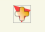
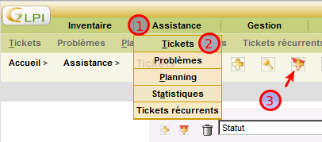
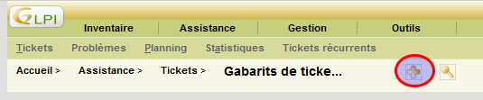
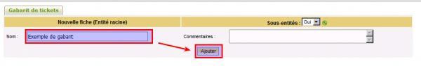

Les gabarits de tickets {#les-gabarits-de-tickets .sectionedit2}
-----------------------

Les gabarits de tickets permettent de préparer des modèles de tickets
avec les caractéristiques suivantes :

-   Spécification des champs obligatoires
-   Préremplissage des champs du formulaire
-   Masquage de certains champs

La création de gabarit est accessible à partir du chemin suivant :
**Assistance → Tickets → Icône Gabarit**

Une fois positionné dans l’écran de gestion des gabarits, il suffit de
cliquer sur le bouton d’ajout (+)

C’est une procédure classique de création dans GLPI (Nommage et
commentaire puis paramétrage)

