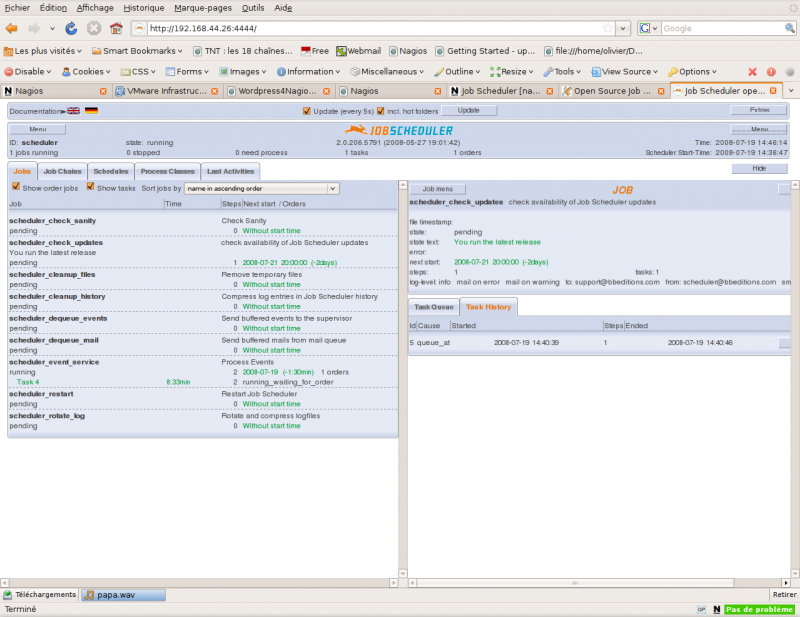
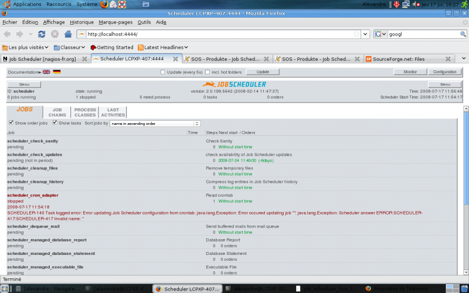

[[[Installation de Job Scheduler](jobscheduler@do=backlink.html)]]

[wiki monitoring-fr.org](../start.html "[ALT+H]")

-   [Accueil](../index.html "Cliquez pour revenir |  l'accueil")
-   [Blog](http://www.monitoring-fr.org "Blog & News")
-   [Forums](http://forums.monitoring-fr.org "Forums")
-   [Doc](http://doc.monitoring-fr.org "Doc")
-   [Forge](https://github.com/monitoring-fr "Forge")

Vous êtes ici: [Accueil](../start.html "start") »
[Infrastructure](start.html "infra:start") » [Installation de Job
Scheduler](jobscheduler.html "infra:jobscheduler")

### Table des matières {.toggle}

-   [Installation de Job
    Scheduler](jobscheduler.html#installation-de-job-scheduler)
    -   [Pré-requis](jobscheduler.html#pre-requis)
    -   [Sans interface
        graphique](jobscheduler.html#sans-interface-graphique)
    -   [Avec l'interface
        graphique](jobscheduler.html#avec-l-interface-graphique)
    -   [Commandes utiles](jobscheduler.html#commandes-utiles)
    -   [Autres](jobscheduler.html#autres)

Installation de Job Scheduler {#installation-de-job-scheduler .sectionedit1}
=============================

[Job
Scheduler](http://jobscheduler.sourceforge.net/ "http://jobscheduler.sourceforge.net/")
est l’une des seules sinon la seule application Open Source que je
connaisse qui permette de faire de l’ordonnancement de production
informatique. Même si la notion d’ordonnancement peut sembler redondante
du fait que Nagios est avant tout un ordonnanceur dédié à la
supervision, l’idée est de voir ce qu’apporte logiciel dédié à cette
tâche en utilisation avec Nagios, ce [mode étant
prévu](http://jobscheduler.sourceforge.net/osource_scheduler_solutions_network_stack_en.htm#nagios_stack "http://jobscheduler.sourceforge.net/osource_scheduler_solutions_network_stack_en.htm#nagios_stack")
par les concepteurs de Job Scheduler.

Le principe de base de Job Scheduler est d’automatiser l’exécution de
tâches simples ou complexes. Son intégration dans Nagios est des plus
intéressant. En effet deux utilisations sont envisageables:

-   Vérification qu’une tâche Job Scheduler a bien été effectuée
-   Lancement d’une tâche (job) pour relancer un service, optimiser
    l’information reçu sur une erreur (diagnostique), etc

Ce tutoriel a été réalisé par :

  **Rôle**        **Nom**
  --------------- ------------------
  **Rédacteur**   Romuald FRONTEAU

Pré-requis {#pre-requis .sectionedit3}
----------

Bien que le site officiel possède les documentations adéquates pour ce
genre de tâche, certaines informations viennent à manquer, comme par
exemple la liste exaustive des pré-requis. En effet lors du
téléchargement sur sourceforge, vous pouvez choisir une version adaptée
à votre OS. Chaque version à sa documentation, mais un détail clair des
pré-requis serait, dans certains cas, à rappeler:

-   GNU Compiler gcc minimum version 4.1.2
-   gdb (GNU Make Debugger)
-   Java SDK minimum version 1.4, 1.5
-   Bzip2 ou tar
-   Perl 5.8.0 – 5.8.8 (Pour l’utilisation de l’API Perl)
-   ant et javadoc (documentation de l’API JAVA)
-   unixODBC-devel (files sql.h and sqlext.h)
-   zlib-devel
-   gcc41-32bit and libstdc++41-devel-32bit (Requis si vous compilez sur
    un x86\_64 Linux system pour un 32-bit system)
-   binutils (version correspondant à votre gcc)
-   lex (Linux; flex), ar
-   SGBD (Dans notre cas mysql-server)
-   PHP5 et PHP5-mysql
-   Apaches2
-   Un serveur SMTP sous la main.
-   Un driver OBDC pour votre SGBD.

Pour ceux qui mettent régulièrement à jour leur OS, la majeur partie de
ces pré-requis sera déjà fournis.

Sans interface graphique {#sans-interface-graphique .sectionedit4}
------------------------

J’ai procédé à l’installation sans interface de configuration, dite
“installation batch” sur une Ubuntu Jeos 8.0.4. Installation d’une JRE.
Cette machine possède déjà une base Apache,MySQL5,PHP5 installée.

~~~~ {.code}
sudo apt-get install sun-java6-jre
~~~~

Ensuite, récupération et décompression du driver [JDBC
MySQL5](http://dev.mysql.com/downloads/connector/j/5.1.html "http://dev.mysql.com/downloads/connector/j/5.1.html").
Je l’installe pour ma part dans */usr/local/lib*. Ce chemin est à
renseigner comme quelques autres paramètres dans le fichier
scheduler\_install.xml qui est appelé comme fichier de configuration de
l’installation. Reste à éditer ce fichier. Voici les options que j’ai
modifié pour que l’installation se déroule sans faute ensuite
^[1)](jobscheduler.html#fn__1)^.

Ajout par Pierre-Yves :

J’ai du pour ma part créer l’utilisateur MySQL et la base de données
scheduler au préalable.

~~~~ {.code}
mysql -u root -p
CREATE USER 'scheduler'@'localhost' IDENTIFIED BY 'Votre_Mot_De_Passe';
GRANT USAGE ON * . * TO 'scheduler'@'localhost' IDENTIFIED BY '***' WITH MAX_QUERIES_PER_HOUR 0 MAX_CONNECTIONS_PER_HOUR 0 MAX_UPDATES_PER_HOUR 0 MAX_USER_CONNECTIONS 0 ;
CREATE DATABASE IF NOT EXISTS `scheduler` ;
GRANT ALL PRIVILEGES ON `scheduler` . * TO 'scheduler'@'localhost';
~~~~

~~~~ {.code}
            <installpath>/opt/scheduler</installpath>
            <entry key="mailTo" value="sysop@localhost"/>
            <entry key="databaseCreate" value="on"/>
            <entry key="databaseHost" value="localhost"/>
            <entry key="databasePort" value="3306"/>
            <entry key="databaseSchema" value="scheduler"/>
            <entry key="databaseUser" value="scheduler"/>
            <entry key="databasePassword" value="scheduler"/>
            <entry key="connector" value="/usr/local/lib/mysql-connector/mysql-connector-java-5.1.6-bin.jar"/>
            <entry key="cron_changeuser" value="sudo"/>
            <entry key="cron_changecommand" value="sudo"/>
~~~~

Le connecteur JDBC est déplacé au moment de l’installation dans le
répertoire lib relatif au répertoire d’installation
^[2)](jobscheduler.html#fn__2)^.

Lancer l’installation avec cette commande

~~~~ {.code}
sudo java -jar scheduler_linux32.jar scheduler_install.xml
~~~~

Une fois terminée, il est possible de se connecter sur l’interface web
port 4444 par défaut.

Avec l'interface graphique {#avec-l-interface-graphique .sectionedit5}
--------------------------

Pour installer Job scheduler avec l’interface graphique, veuillez tout
d’abord vous munir des sources disponibles sur
[sourceforge](http://downloads.sourceforge.net/jobscheduler/scheduler_linux.1.3.4.tar.gz?modtime=1205423568&big_mirror=0 "http://downloads.sourceforge.net/jobscheduler/scheduler_linux.1.3.4.tar.gz?modtime=1205423568&big_mirror=0"),
dans leur version Linux. Commençons l’installation:

~~~~ {.code}
tar xvf scheduler_linux.1.3.4.tar.gz
~~~~

Les fichiers extraits sont les suivants

~~~~ {.code}
scheduler_linux32.jar
install_scheduler.txt
scheduler_installation_de.pdf
scheduler_installation_en.pdf
scheduler_install.xml
~~~~

Le fichier important dans ce cas est scheduler\_linux.jar. Avant de
poursuivre, veillez bien à ce que vos pré requis soient installé, que
votre serveur sgdb soit installé avec une base de créée, et que vous
savez ou se trouve son driver ODBC.

~~~~ {.code}
java -jar scheduler_linux32.jar
~~~~

Je vous fais grâce des différents écrans, et ne vous communique que les
éléments de configurations que j’ai renseigné:

-   Une fois que vous avez choisit la langue d’exécution de job
    scheduler, reste à lui spécifier l’endroit ou il va s’installer.
    Malgrés sont intéraction avec Apache, il n’est pas nécessaire de
    l’installé dans /var/www ou de déplacer la partie web de Job
    Scheduler dans ce répertoire. Nous allons donc l’installer dans
    /usr/local/scheduler; l’installeur nous créra directement le
    répertoire “scheduler”.
-   Les renseignements pas défaut pour :Scheduler ID, Host, TCP Port,
    UDP Port et Allowed host; sont très bien, ne les changer par mais
    retenez les.
-   L’utilisation de Job scheduler peut entrer en conflit avec un autre
    exécuteur de tâche. Je vous conseil de définir l’appli en tant que
    “Standalone”.
-   La partie smtp est l’une des plus importante et intéressante de
    cette installeur. Veuillez donc entrer une adresse d’un serveur
    smtp, ainsi qu’une adresse de réception et un compte de connexion au
    serveur smtp. Si vous faite l’impasse sur cette aspect, je vous
    recommande de déterminer un endroit ou seront stocké les différents
    mails à envoyer. Pour nous /usr/local/scheduler/mails .
-   Pour la configuration de mysql, veuillez vous munir des informations
    de connexion à votre serveur mysql fraîchement installé (cf
    pré-requis). Gardez bien les numéros de port par défault, en
    fonction de votre sgbd (3306 pour mysql).
-   Dernière étape, celle du driver OBDC. Renseignez les chemin d’accète
    à l’archive .jar et passez à l’écran suivant.

Une fois installé, ouvrez votre navigateur à la page
<http://localhost:4444> et voici votre affichage:

Commandes utiles {#commandes-utiles .sectionedit6}
----------------

Il n’y a pas de /etc/init.d/jobscheduler pour démarrer et arrêter Job
scheduler. Pour le démarrage de Job Scheduler:

~~~~ {.code}
LCPXP-407:~/scheduler$ sudo ./bin/jobscheduler.sh start
~~~~

Pour l’arrêt de Job Scheduler

~~~~ {.code}
LCPXP-407:~/scheduler$ sudo ./bin/jobscheduler.sh stop
~~~~

Pour le redémarrage de Job Scheduler

~~~~ {.code}
LCPXP-407:~/scheduler$ sudo ./bin/jobscheduler.sh restart
~~~~

Autres {#autres .sectionedit7}
------

**[Intégrer Job Scheduler à
Nagios](../nagios/integration/jobscheduler.html "nagios:integration:jobscheduler")**

^[1)](jobscheduler.html#fnt__1)^ le reste est garder aux valeurs par
défaut

^[2)](jobscheduler.html#fnt__2)^ */opt/scheduler/lib* dans mon cas

SOMMAIRE {#sommaire .sectionedit1}
--------

**[Accueil](../start.html "start")**

**[Supervision](../supervision/start.html "supervision:start")**

-   [Nagios](../nagios/start.html "nagios:start")
-   [Centreon](../centreon/start.html "centreon:start")
-   [Shinken](../shinken/start.html "shinken:start")
-   [Zabbix](../zabbix/start.html "zabbix:start")
-   [OpenNMS](../opennms/start.html "opennms:start")
-   [EyesOfNetwork](../eyesofnetwork/start.html "eyesofnetwork:start")
-   [Groundwork](../groundwork/start.html "groundwork:start")
-   [Zenoss](../zenoss/start.html "zenoss:start")
-   [Vigilo](../vigilo/start.html "vigilo:start")
-   [Icinga](../icinga/start.html "icinga:start")
-   [Cacti](../cacti/start.html "cacti:start")
-   [Ressenti
    utilisateur](../supervision/eue/start.html "supervision:eue:start")
-   [Ressenti utilisateur avec
    sikuli](../sikuli/eue/start.html "sikuli:eue:start")

**[Hypervision](../hypervision/start.html "hypervision:start")**

-   [Canopsis](../canopsis/start.html "canopsis:start")

**[Sécurité](../securite/start.html "securite:start")**

**[Infrastructure](start.html "infra:start")**

**[Développement](../dev/start.html "dev:start")**

Gestion des infrastructures {#gestion-des-infrastructures .sectionedit1}
---------------------------

-   [Chef](chef.html "infra:chef")
-   [GLPI](glpi/start.html "infra:glpi:start")
-   [Graylog2](graylog2.html "infra:graylog2")
-   [Installation de Job
    Scheduler](jobscheduler.html "infra:jobscheduler")
-   [Installation de archipel sous ubuntu
    10.10](archipel.html "infra:archipel")
-   [Installation de sikuli IDE sous Ubuntu
    10.10](sikuli.html "infra:sikuli")
-   [Knockd](knockd.html "infra:knockd")
-   [Logstash](logstash.html "infra:logstash")
-   [Mise en place d'un système de contrôle de version GIT sous unbuntu
    server 10.10](git.html "infra:git")
-   [Partage de session terminal avec
    Screen](screen.html "infra:screen")
-   [Postfix](postfix.html "infra:postfix")
-   [Zimbra](zimbra.html "infra:zimbra")

-   [Afficher le texte
    source](jobscheduler@do=edit&rev=0.html "Afficher le texte source [V]")
-   [Anciennes
    révisions](jobscheduler@do=revisions.html "Anciennes révisions [O]")
-   [Derniers
    changements](jobscheduler@do=recent.html "Derniers changements [R]")
-   [Liens vers cette
    page](jobscheduler@do=backlink.html "Liens vers cette page")
-   [Gestionnaire de
    médias](jobscheduler@do=media.html "Gestionnaire de médias")
-   [Index](jobscheduler@do=index.html "Index [X]")
-   [Connexion](jobscheduler@do=login&sectok=6bca6bdf16f8880de3d6d3649db89a26.html "Connexion")
-   [Haut de page](jobscheduler.html#dokuwiki__top "Haut de page [T]")

infra/jobscheduler.txt · Dernière modification: 2013/03/29 09:39
(modification externe)

