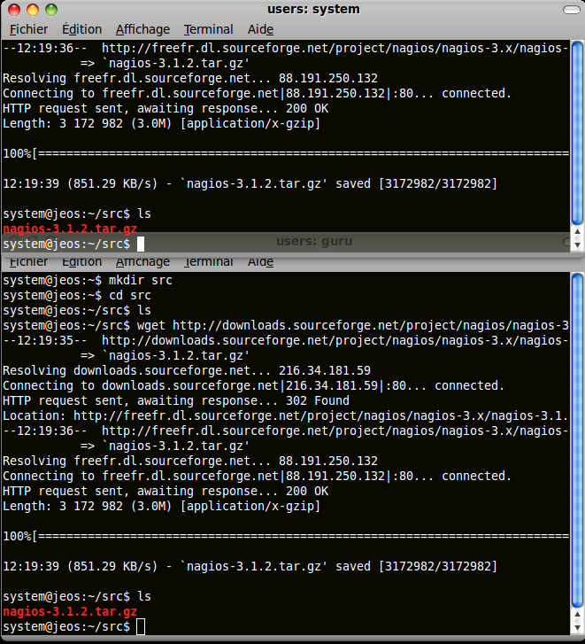

[[[Partage de session terminal avec Screen](screen@do=backlink.html)]]

[wiki monitoring-fr.org](../start.html "[ALT+H]")

-   [Accueil](../index.html "Cliquez pour revenir |  l'accueil")
-   [Blog](http://www.monitoring-fr.org "Blog & News")
-   [Forums](http://forums.monitoring-fr.org "Forums")
-   [Doc](http://doc.monitoring-fr.org "Doc")
-   [Forge](https://github.com/monitoring-fr "Forge")

Vous êtes ici: [Accueil](../start.html "start") »
[Infrastructure](start.html "infra:start") » [Partage de session
terminal avec Screen](screen.html "infra:screen")

### Table des matières {.toggle}

-   [Partage de session terminal avec
    Screen](screen.html#partage-de-session-terminal-avec-screen)
    -   [Installation de Screen](screen.html#installation-de-screen)
    -   [Démarrage d'une session
        partagée](screen.html#demarrage-d-une-session-partagee)
    -   [Connexion à une session
        partagée](screen.html#connexion-a-une-session-partagee)

Partage de session terminal avec Screen {#partage-de-session-terminal-avec-screen .sectionedit1}
=======================================

Il est fréquent lorsque l’on fait du télésupport ou de la téléformation
d’avoir besoin de partager un écran ^[1)](screen.html#fn__1)^ ou plus
simplement une session terminal. Le fait de partager uniquement la
session terminal évite d’avoir recours à un partage d’écran complet et
peut fonctionner sur les réseaux bas débit. [GNU
Screen](http://www.gnu.org/software/screen/ "http://www.gnu.org/software/screen/")
permet, entre autres, de faire ce genre d’opérations et c’est lui que
nous allons utilisé.

Ce tutoriel a été fait sur Ubuntu Hardy Heron 8.04.3 et il est plus ou
moins la traduction de [cette
page](http://ubuntuforums.org/showthread.php?t=299286 "http://ubuntuforums.org/showthread.php?t=299286").
L’exemple ci-dessous est donné pour un élève souhaitant que son
professeur puisse voir en temps réel ce qu’il tape et que celui-ci
puisse également intervenir. C’est donc une session partagée en écriture
pour les deux rôles que nous allons décrire. L’élève a pour identifiant
system et le professeur guru. Il faut installer screen sur la machine de
l’élève.

Installation de Screen {#installation-de-screen .sectionedit2}
----------------------

Un simple aptitude install suffit

~~~~ {.code .bash}
sudo aptitude install screen
~~~~

Dans notre contexte, il faut positionner le bit setuid sur screen et
donner les droits nécessaires sur le fichier */var/run/screen*.

~~~~ {.code .bash}
sudo chmod +s /usr/bin/screen
sudo chmod 755 /var/run/screen
~~~~

La dernière manipulation n’est peut-être pas très heureuse en termes de
sécurité mais nous sommes dans un contexte de formation, donc pas de
paranoïa excessive 

Installation terminée 

Démarrage d'une session partagée {#demarrage-d-une-session-partagee .sectionedit3}
--------------------------------

Sur la machine de l’élève, il faut lancer une session screen en donnant
avec le paramètre -S un nom de session

~~~~ {.code .bash}
screen -S screen-test
~~~~

Il faut maintenant rendre cette session multi utilisateurs

Toutes les commandes screen sont à précéder de CTRL-A. Rien ne se passe
à l’écran mais screen attend vos commandes commençant par ”:”
^[2)](screen.html#fn__2)^

~~~~ {.code}
CTRL-A
:multiuser on
~~~~

Il reste à autoriser le professeur (guru) à se connecter sur cette
session

~~~~ {.code}
CTRL-A
:acladd guru
~~~~

Connexion à une session partagée {#connexion-a-une-session-partagee .sectionedit4}
--------------------------------

Après avoir vérifié que l’élève vous a bien autorisé comme indiqué
ci-dessus, il ne reste plus qu’à se connecter sur sa machine avec
l’identifiant du professeur soit guru.

~~~~ {.code}
ssh [email protected]
/*  */!function(){try{var t="currentScript"in document?document.currentScript:function(){for(var t=document.getElementsByTagName("script"),e=t.length;e--;)if(t[e].getAttribute("cf-hash"))return t[e]}();if(t&&t.previousSibling){var e,r,n,i,c=t.previousSibling,a=c.getAttribute("data-cfemail");if(a){for(e="",r=parseInt(a.substr(0,2),16),n=2;a.length-n;n+=2)i=parseInt(a.substr(n,2),16)^r,e+=String.fromCharCode(i);e=document.createTextNode(e),c.parentNode.replaceChild(e,c)}}}catch(u){}}();/*  */
~~~~

Il ne reste plus qu’à se connecter sur la session partagée par l’élève.

~~~~ {.code}
screen -x system/screen-test
~~~~

L’écran ci-dessous montre un exemple de partage avec le terminal de
l’élève et du professeur superposé. Tout ce qui est tapé dans l’un ou
l’autre est répercuté simultanément sur l’autre.

^[1)](screen.html#fnt__1)^ vnc ou nxmachine font ce genre de choses

^[2)](screen.html#fnt__2)^ un peu à la façon de vi

SOMMAIRE {#sommaire .sectionedit1}
--------

**[Accueil](../start.html "start")**

**[Supervision](../supervision/start.html "supervision:start")**

-   [Nagios](../nagios/start.html "nagios:start")
-   [Centreon](../centreon/start.html "centreon:start")
-   [Shinken](../shinken/start.html "shinken:start")
-   [Zabbix](../zabbix/start.html "zabbix:start")
-   [OpenNMS](../opennms/start.html "opennms:start")
-   [EyesOfNetwork](../eyesofnetwork/start.html "eyesofnetwork:start")
-   [Groundwork](../groundwork/start.html "groundwork:start")
-   [Zenoss](../zenoss/start.html "zenoss:start")
-   [Vigilo](../vigilo/start.html "vigilo:start")
-   [Icinga](../icinga/start.html "icinga:start")
-   [Cacti](../cacti/start.html "cacti:start")
-   [Ressenti
    utilisateur](../supervision/eue/start.html "supervision:eue:start")
-   [Ressenti utilisateur avec
    sikuli](../sikuli/eue/start.html "sikuli:eue:start")

**[Hypervision](../hypervision/start.html "hypervision:start")**

-   [Canopsis](../canopsis/start.html "canopsis:start")

**[Sécurité](../securite/start.html "securite:start")**

**[Infrastructure](start.html "infra:start")**

**[Développement](../dev/start.html "dev:start")**

Gestion des infrastructures {#gestion-des-infrastructures .sectionedit1}
---------------------------

-   [Chef](chef.html "infra:chef")
-   [GLPI](glpi/start.html "infra:glpi:start")
-   [Graylog2](graylog2.html "infra:graylog2")
-   [Installation de Job
    Scheduler](jobscheduler.html "infra:jobscheduler")
-   [Installation de archipel sous ubuntu
    10.10](archipel.html "infra:archipel")
-   [Installation de sikuli IDE sous Ubuntu
    10.10](sikuli.html "infra:sikuli")
-   [Knockd](knockd.html "infra:knockd")
-   [Logstash](logstash.html "infra:logstash")
-   [Mise en place d'un système de contrôle de version GIT sous unbuntu
    server 10.10](git.html "infra:git")
-   [Partage de session terminal avec
    Screen](screen.html "infra:screen")
-   [Postfix](postfix.html "infra:postfix")
-   [Zimbra](zimbra.html "infra:zimbra")

-   [Afficher le texte
    source](screen@do=edit&rev=0.html "Afficher le texte source [V]")
-   [Anciennes
    révisions](screen@do=revisions.html "Anciennes révisions [O]")
-   [Derniers
    changements](screen@do=recent.html "Derniers changements [R]")
-   [Liens vers cette
    page](screen@do=backlink.html "Liens vers cette page")
-   [Gestionnaire de
    médias](screen@do=media.html "Gestionnaire de médias")
-   [Index](screen@do=index.html "Index [X]")
-   [Connexion](screen@do=login&sectok=6bca6bdf16f8880de3d6d3649db89a26.html "Connexion")
-   [Haut de page](screen.html#dokuwiki__top "Haut de page [T]")

infra/screen.txt · Dernière modification: 2013/03/29 09:39 (modification
externe)

