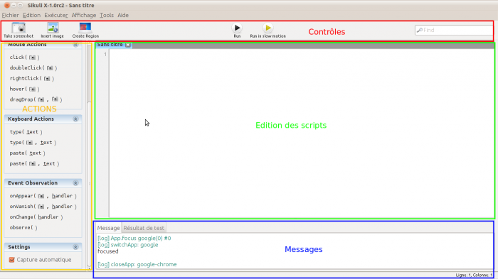

[[[Installation de sikuli IDE sous Ubuntu
10.10](sikuli@do=backlink.html)]]

[wiki monitoring-fr.org](../start.html "[ALT+H]")

-   [Accueil](../index.html "Cliquez pour revenir |  l'accueil")
-   [Blog](http://www.monitoring-fr.org "Blog & News")
-   [Forums](http://forums.monitoring-fr.org "Forums")
-   [Doc](http://doc.monitoring-fr.org "Doc")
-   [Forge](https://github.com/monitoring-fr "Forge")

Vous êtes ici: [Accueil](../start.html "start") »
[Infrastructure](start.html "infra:start") » [Installation de sikuli IDE
sous Ubuntu 10.10](sikuli.html "infra:sikuli")

### Table des matières {.toggle}

-   [Installation de sikuli IDE sous Ubuntu
    10.10](sikuli.html#installation-de-sikuli-ide-sous-ubuntu-1010)
-   [Téléchargement](sikuli.html#telechargement)
-   [Prérequis](sikuli.html#prerequis)
-   [Installation](sikuli.html#installation)
-   [Introduction au scripting avec
    sikuli](sikuli.html#introduction-au-scripting-avec-sikuli)
    -   [Exploration de l'éditeur](sikuli.html#exploration-de-l-editeur)
    -   [Création du premier
        script](sikuli.html#creation-du-premier-script)

Installation de sikuli IDE sous Ubuntu 10.10 {#installation-de-sikuli-ide-sous-ubuntu-1010 .sectionedit1}
============================================

Sikuli est une application permettant de piloter des applications
graphiques au travers de scripts et de capture d’écran. Cette
application rentre dans la catégorie de la supervision du ressenti
utilisateur.

Téléchargement {#telechargement .sectionedit2}
==============

-   [http://sikuli.org/download.shtml\#linux](http://sikuli.org/download.shtml#linux "http://sikuli.org/download.shtml#linux")

Prérequis {#prerequis .sectionedit3}
=========

Sous Ubuntu 10.04 et 10.10 la libcv est passée en version 4. Il faudra
donc la recompiler sur ces plateformes.

Vous aurez besoin d’installer une machine virtuelle java. Il est
préférable d’utiliser une version sun/oracle de la machine virtuelle
java.

~~~~ {.code}
# Ubuntu
sudo apt-get install wmctrl libcv2.1 libcvaux2.1 libhighgui2.1
~~~~

Installation {#installation .sectionedit4}
============

Il suffit d’extraire le contenu de l’archive zip puis de lancer le
script **sikuli-ide** situé dans le répertoire
Sikuli-X-1.0rc2-linux/Sikuli-IDE

Introduction au scripting avec sikuli {#introduction-au-scripting-avec-sikuli .sectionedit5}
=====================================

Exploration de l'éditeur {#exploration-de-l-editeur .sectionedit6}
------------------------

Comme on peut le voir L’éditeur de scripts Sikuli est très simple. Pour
autant, simple ne veut pas dire simpliste. L’interface est divisée en 4
zones principales (en fait 5 mais nous en discuterons plus tard).

Création du premier script {#creation-du-premier-script .sectionedit7}
--------------------------

Pour débuter vous n’avez pas besoin de savoir programmer. L’ide est
suffisamment intuitif pour produire des scripts simples.

SOMMAIRE {#sommaire .sectionedit1}
--------

**[Accueil](../start.html "start")**

**[Supervision](../supervision/start.html "supervision:start")**

-   [Nagios](../nagios/start.html "nagios:start")
-   [Centreon](../centreon/start.html "centreon:start")
-   [Shinken](../shinken/start.html "shinken:start")
-   [Zabbix](../zabbix/start.html "zabbix:start")
-   [OpenNMS](../opennms/start.html "opennms:start")
-   [EyesOfNetwork](../eyesofnetwork/start.html "eyesofnetwork:start")
-   [Groundwork](../groundwork/start.html "groundwork:start")
-   [Zenoss](../zenoss/start.html "zenoss:start")
-   [Vigilo](../vigilo/start.html "vigilo:start")
-   [Icinga](../icinga/start.html "icinga:start")
-   [Cacti](../cacti/start.html "cacti:start")
-   [Ressenti
    utilisateur](../supervision/eue/start.html "supervision:eue:start")
-   [Ressenti utilisateur avec
    sikuli](../sikuli/eue/start.html "sikuli:eue:start")

**[Hypervision](../hypervision/start.html "hypervision:start")**

-   [Canopsis](../canopsis/start.html "canopsis:start")

**[Sécurité](../securite/start.html "securite:start")**

**[Infrastructure](start.html "infra:start")**

**[Développement](../dev/start.html "dev:start")**

Gestion des infrastructures {#gestion-des-infrastructures .sectionedit1}
---------------------------

-   [Chef](chef.html "infra:chef")
-   [GLPI](glpi/start.html "infra:glpi:start")
-   [Graylog2](graylog2.html "infra:graylog2")
-   [Installation de Job
    Scheduler](jobscheduler.html "infra:jobscheduler")
-   [Installation de archipel sous ubuntu
    10.10](archipel.html "infra:archipel")
-   [Installation de sikuli IDE sous Ubuntu
    10.10](sikuli.html "infra:sikuli")
-   [Knockd](knockd.html "infra:knockd")
-   [Logstash](logstash.html "infra:logstash")
-   [Mise en place d'un système de contrôle de version GIT sous unbuntu
    server 10.10](git.html "infra:git")
-   [Partage de session terminal avec
    Screen](screen.html "infra:screen")
-   [Postfix](postfix.html "infra:postfix")
-   [Zimbra](zimbra.html "infra:zimbra")

-   [Afficher le texte
    source](sikuli@do=edit&rev=0.html "Afficher le texte source [V]")
-   [Anciennes
    révisions](sikuli@do=revisions.html "Anciennes révisions [O]")
-   [Derniers
    changements](sikuli@do=recent.html "Derniers changements [R]")
-   [Liens vers cette
    page](sikuli@do=backlink.html "Liens vers cette page")
-   [Gestionnaire de
    médias](sikuli@do=media.html "Gestionnaire de médias")
-   [Index](sikuli@do=index.html "Index [X]")
-   [Connexion](sikuli@do=login&sectok=6bca6bdf16f8880de3d6d3649db89a26.html "Connexion")
-   [Haut de page](sikuli.html#dokuwiki__top "Haut de page [T]")

infra/sikuli.txt · Dernière modification: 2013/03/29 09:39 (modification
externe)

