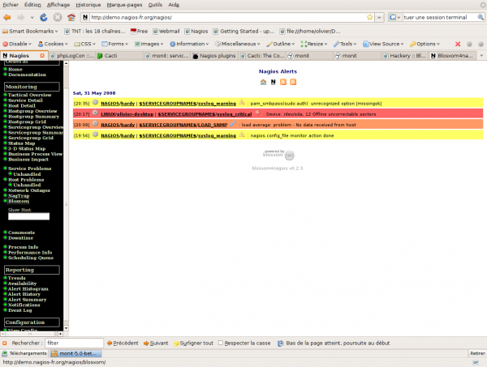

[[[Blosxom4nagios](../nagios/integration/blosxom4nagios@do=backlink.html)]]

[wiki monitoring-fr.org](../start.html "[ALT+H]")

-   [Accueil](../index.html "Cliquez pour revenir |  l'accueil")
-   [Blog](http://www.monitoring-fr.org "Blog & News")
-   [Forums](http://forums.monitoring-fr.org "Forums")
-   [Doc](http://doc.monitoring-fr.org "Doc")
-   [Forge](https://github.com/monitoring-fr "Forge")

Vous êtes ici: [Accueil](../start.html "start") »
[Nagios](../nagios/start.html "nagios:start") » [Nagios
Integration](../nagios/integration/start.html "nagios:integration:start")
»
[Blosxom4nagios](blosxom4nagios.html "nagios:integration:blosxom4nagios")

### Table des matières {.toggle}

-   [Blosxom4nagios](blosxom4nagios.html#blosxom4nagios)
    -   [Installation](blosxom4nagios.html#installation)
        -   [Configuration
            Apache](blosxom4nagios.html#configuration-apache)
    -   [Intégration dans
        Nagios](blosxom4nagios.html#integration-dans-nagios)

Blosxom4nagios {#blosxom4nagios .sectionedit1}
==============

[Blosxom4nagios](http://www.openfusion.net/blosxom/blosxom4nagios "http://www.openfusion.net/blosxom/blosxom4nagios")
est une version de blosxom spécialement modifiée pour fonctionner avec
Nagios. Ce logiciel permet de récupérer les lnotifications ou les
event\_handlers de Nagios dans une arborescence html de type blog. J’ai
suivi une démarche un peu identique avec l’essai
[Dokuwiki](../nagios/event_handlers.html "nagios:event_handlers"). Le
bénéfice supplémentaire est d’avoir à disposition via son intermédiaire
des flux rss et atom pour les notifications Nagios.

Ce tutoriel a été réalisé par :

  **Rôle**        **Nom**
  --------------- -------------
  **Rédacteur**   Olivier JAN

Installation {#installation .sectionedit3}
------------

S’assurer d’avoir les modules Perl CPAN non standards suivants :

-   Filter::Simple
-   Logger::Syslog

Ensuite la séquence traditionnel d’installation

~~~~ {.code}
http://www.openfusion.com.au/labs/dist/blosxom4nagios-0.2.3.tar.gz
tar xzf blosxom4nagios-0.2.3.tar.gz
sudo mv blosxom4nagios-0.2.3 ./blosxom
cd blosxom
./bin/setup
cd ../
sudo mv blosxom /usr/local/
sudo chown -R nagios:nagcmd /usr/local/blosxom
~~~~

Quelques réglages et le lien de apache2 vers le fichier de configuration
de blosxom4nagios pour Apache.

~~~~ {.code}
cd /etc/apache2/conf.d
sudo ln -s /usr/local/blosxom/config/blosxom4nagios.conf
sudo /etc/init.d/apache2 restart
sudo chgrp www-data /usr/local/blosxom/state
sudo chmod g+ws /usr/local/blosxom/state
~~~~

blosxom est livré pour fonctionner dans /var/log/nagios ce qui n’est pas
de mon goût et je préfère l’avoir dans /usr/local/blosxom. Il faut donc
modifier les fichiers suivants pour y remplacer le chemin
/var/log/nagios par /usr/local.

-   /usr/local/blosxom/config/blosxom.cfg
-   /usr/local/blosxom/config/blosxom4nagios.cfg
-   /usr/local/blosxom/config/commands\_blosxom.cfg

### Configuration Apache {#configuration-apache .sectionedit4}

~~~~ {.code}
# Subsection blosxom using CGI
AddHandler cgi-script .cgi
Alias /nagios/blosxom/themes /usr/local/blosxom/themes
Alias /nagios/blosxom/images /usr/local/blosxom/images
Alias /nagios/blosxom /usr/local/blosxom/cgi
<Directory /usr/local/blosxom/cgi>
  Options +Indexes
  DirectoryIndex blosxom.cgi
  RewriteEngine on
  RewriteCond %{REQUEST_FILENAME} !-f
  RewriteCond %{REQUEST_FILENAME} !-d
  RewriteCond %{REQUEST_URI} ^/nagios/blosxom
  RewriteRule ^(.*)$ /nagios/blosxom/blosxom.cgi/$1 [L,QSA]
  RewriteCond %{REQUEST_FILENAME} !-f
  RewriteCond %{REQUEST_FILENAME} !-d
  RewriteCond %{REQUEST_URI} ^/blosxom
  RewriteRule ^(.*)$ /blosxom/blosxom.cgi/$1 [L,QSA]
  <FilesMatch "\.cgi$">
    Options +ExecCGI
  </FilesMatch>
</Directory>
<Location /nagios/blosxom>
  SetEnv BLOSXOM_CONFIG_DIR /usr/local/blosxom/config
</Location>
~~~~

Intégration dans Nagios {#integration-dans-nagios .sectionedit5}
-----------------------

Ajouter la directive du fichier dans nagios.cfg

~~~~ {.code}
cfg_file=/usr/local/blosxom/config/commands_blosxom.cfg
~~~~

Définition du contact dans Nagios

~~~~ {.code}
  define contact{
        contact_name                    nagios
        alias                           Nagios Admin
        service_notification_period     24x7
        host_notification_period        24x7
        service_notification_options    w,u,c,r
        host_notification_options       d,u,r
        service_notification_commands   notify-via-blosxom
        host_notification_commands      host-notify-via-blosxom
        email                           [email protected]
/*  */!function(){try{var t="currentScript"in document?document.currentScript:function(){for(var t=document.getElementsByTagName("script"),e=t.length;e--;)if(t[e].getAttribute("cf-hash"))return t[e]}();if(t&&t.previousSibling){var e,r,n,i,c=t.previousSibling,a=c.getAttribute("data-cfemail");if(a){for(e="",r=parseInt(a.substr(0,2),16),n=2;a.length-n;n+=2)i=parseInt(a.substr(n,2),16)^r,e+=String.fromCharCode(i);e=document.createTextNode(e),c.parentNode.replaceChild(e,c)}}}catch(u){}}();/*  */
        }
~~~~

Une fois installé, les notifications arrivent directement dans blosxom.

SOMMAIRE {#sommaire .sectionedit1}
--------

**[Accueil](../start.html "start")**

**[Supervision](../supervision/start.html "supervision:start")**

-   [Nagios](../nagios/start.html "nagios:start")
-   [Centreon](../centreon/start.html "centreon:start")
-   [Shinken](../shinken/start.html "shinken:start")
-   [Zabbix](../zabbix/start.html "zabbix:start")
-   [OpenNMS](../opennms/start.html "opennms:start")
-   [EyesOfNetwork](../eyesofnetwork/start.html "eyesofnetwork:start")
-   [Groundwork](../groundwork/start.html "groundwork:start")
-   [Zenoss](../zenoss/start.html "zenoss:start")
-   [Vigilo](../vigilo/start.html "vigilo:start")
-   [Icinga](../icinga/start.html "icinga:start")
-   [Cacti](../cacti/start.html "cacti:start")
-   [Ressenti
    utilisateur](../supervision/eue/start.html "supervision:eue:start")
-   [Ressenti utilisateur avec
    sikuli](../sikuli/eue/start.html "sikuli:eue:start")

**[Hypervision](../hypervision/start.html "hypervision:start")**

-   [Canopsis](../canopsis/start.html "canopsis:start")

**[Sécurité](../securite/start.html "securite:start")**

**[Infrastructure](../infra/start.html "infra:start")**

**[Développement](../dev/start.html "dev:start")**

Nagios Integration {#nagios-integration .sectionedit1}
------------------

-   [Blosxom4nagios](blosxom4nagios.html "nagios:integration:blosxom4nagios")
-   [Collectd](../nagios/integration/collectd.html "nagios:integration:collectd")
-   [Incron &
    LoggedFS](../nagios/integration/incron.html "nagios:integration:incron")
-   [Intégration de Prelude-IDS à
    Nagios](../nagios/integration/prelude.html "nagios:integration:prelude")
-   [Intégrer Job Scheduler à
    Nagios](../nagios/integration/jobscheduler.html "nagios:integration:jobscheduler")
-   [Monit](../nagios/integration/monit.html "nagios:integration:monit")
-   [Nagios Plugin for
    Cacti](../nagios/integration/npc.html "nagios:integration:npc")
-   [Nmon](../nagios/integration/nmon.html "nagios:integration:nmon")
-   [OSSEC](../nagios/integration/ossec.html "nagios:integration:ossec")
-   [Octopussy](../nagios/integration/8pussy.html "nagios:integration:8pussy")
-   [Rsyslog](../nagios/integration/rsyslog.html "nagios:integration:rsyslog")
-   [SEC](../nagios/integration/sec.html "nagios:integration:sec")
-   [SmokePing](../nagios/integration/smokeping.html "nagios:integration:smokeping")
-   [Webinject](../nagios/integration/webinject.html "nagios:integration:webinject")
-   [Wordpress4nagios](wordpress.html "nagios:integration:wordpress")

-   [Afficher le texte
    source](../nagios/integration/blosxom4nagios@do=edit&rev=0.html "Afficher le texte source [V]")
-   [Anciennes
    révisions](../nagios/integration/blosxom4nagios@do=revisions.html "Anciennes révisions [O]")
-   [Derniers
    changements](../nagios/integration/blosxom4nagios@do=recent.html "Derniers changements [R]")
-   [Liens vers cette
    page](../nagios/integration/blosxom4nagios@do=backlink.html "Liens vers cette page")
-   [Gestionnaire de
    médias](../nagios/integration/blosxom4nagios@do=media.html "Gestionnaire de médias")
-   [Index](../nagios/integration/blosxom4nagios@do=index.html "Index [X]")
-   [Connexion](../nagios/integration/blosxom4nagios@do=login&sectok=6bca6bdf16f8880de3d6d3649db89a26.html "Connexion")
-   [Haut de page](blosxom4nagios.html#dokuwiki__top "Haut de page [T]")

nagios/integration/blosxom4nagios.txt · Dernière modification:
2013/03/29 09:39 (modification externe)

