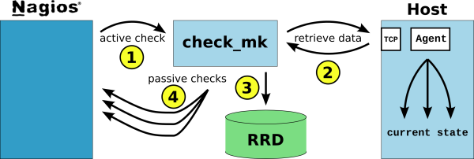

[[[check\_mk](start@do=backlink.html)]]

[wiki monitoring-fr.org](../../../start.html "[ALT+H]")

-   [Accueil](../../../index.html "Cliquez pour revenir |  l'accueil")
-   [Blog](http://www.monitoring-fr.org "Blog & News")
-   [Forums](http://forums.monitoring-fr.org "Forums")
-   [Doc](http://doc.monitoring-fr.org "Doc")
-   [Forge](https://github.com/monitoring-fr "Forge")

Vous êtes ici: [Accueil](../../../start.html "start") »
[Nagios](../../start.html "nagios:start") » [Nagios
Addons](../start.html "nagios:addons:start") »
[check\_mk](start.html "nagios:addons:check_mk:start")

### Table des matières {.toggle}

-   [check\_mk](start.html#check_mk)
    -   [Documentation](start.html#documentation)

check\_mk {#check_mk .sectionedit1}
=========

L’approche habituelle pour intégrer des contrôles d’hôtes et de services
à Nagios est d’appeler des petits programmes externes (“plugins”) à
intervalles réguliers. Dans le cas de la supervision d’un système
d’exploitation, le plugin contacte un démon distant qui tourne sur la
machine cible pour récupérer un indicateur. Cet indicateur peut donner
la valeur d’une partition spécifique, d’une interface réseau ou
simplement la quantité de mémoire utilisée. Les démons de supervision
les plus utilisés pour surveiller un hôte Linux/UNIX avec Nagios sont
NRPE et dans une moindre mesure SSH et SNMP.

[check\_mk](http://mathias-kettner.de/check_mk.html "http://mathias-kettner.de/check_mk.html")
utilise une approche différente; avec quelques avantages cruciaux.
L’idée de base de check\_mk est de récupérer **toutes** les informations
d’un hôte en **une seule fois**. Pour chaque hôte à surveiller,
check\_mk est appelé par Nagios une seule fois par période de temps (une
minute par exemple). Il contacte un démon appelé mknagios sur la machine
cible. Celui-ci expose toutes les informations pertinentes pour cet
hôte, indépendamment de ce qu’il a à contrôler et des indicateurs
demandés. **Ce démon n’a pas besoin de paramètre et ne requiert aucune
configuration**.

check\_mk traite alors ces informations et extrait tous les indicateurs
qui ont été configurés pour la supervision, les compare aux seuils
configurés (la configuration est faite dans un fichier check\_mk.cfg sur
le serveur Nagios). Il envoie ensuite les résultats (OK/WARNING/CRITICAL
et les performance data si applicable) à Nagios via un contrôle passif
de service. Nagios traite ces résultats passifs comme si c’étaient des
résultats actifs.

Documentation {#documentation .sectionedit2}
-------------

A construire

**[Installation de
check\_mk](../../../addons/check_mk/check_mk-install.html "addons:check_mk:check_mk-install")**

**[mk\_livestatus](../../../addons/check_mk/livestatus.html "addons:check_mk:livestatus")**

SOMMAIRE {#sommaire .sectionedit1}
--------

**[Accueil](../../../start.html "start")**

**[Supervision](../../../supervision/start.html "supervision:start")**

-   [Nagios](../../start.html "nagios:start")
-   [Centreon](../../../centreon/start.html "centreon:start")
-   [Shinken](../../../shinken/start.html "shinken:start")
-   [Zabbix](../../../zabbix/start.html "zabbix:start")
-   [OpenNMS](../../../opennms/start.html "opennms:start")
-   [EyesOfNetwork](../../../eyesofnetwork/start.html "eyesofnetwork:start")
-   [Groundwork](../../../groundwork/start.html "groundwork:start")
-   [Zenoss](../../../zenoss/start.html "zenoss:start")
-   [Vigilo](../../../vigilo/start.html "vigilo:start")
-   [Icinga](../../../icinga/start.html "icinga:start")
-   [Cacti](../../../cacti/start.html "cacti:start")
-   [Ressenti
    utilisateur](../../../supervision/eue/start.html "supervision:eue:start")
-   [Ressenti utilisateur avec
    sikuli](../../../sikuli/eue/start.html "sikuli:eue:start")

**[Hypervision](../../../hypervision/start.html "hypervision:start")**

-   [Canopsis](../../../canopsis/start.html "canopsis:start")

**[Sécurité](../../../securite/start.html "securite:start")**

**[Infrastructure](../../../infra/start.html "infra:start")**

**[Développement](../../../dev/start.html "dev:start")**

Nagios Addons {#nagios-addons .sectionedit1}
-------------

-   [Lilac
    Platform](../lilac-platform.html "nagios:addons:lilac-platform")
-   [Merlin](../../../addons/merlin.html "nagios:addons:merlin")
-   [NConf](../nconf.html "nagios:addons:nconf")
-   [NDOUtils](../ndoutils.html "nagios:addons:ndoutils")
-   [NSClient++](../nsclient.html "nagios:addons:nsclient")
-   [NagTrap](../../../addons/nagtrap.html "nagios:addons:nagtrap")
-   [NagVis](../nagvis/start.html "nagios:addons:nagvis:start")
-   [Nagios Business Process
    Addon](../nagios-business-process-addons.html "nagios:addons:nagios-business-process-addons")
-   [NagiosDigger](../nagiosdigger.html "nagios:addons:nagiosdigger")
-   [NagiosGrapher](../nagiosgrapher.html "nagios:addons:nagiosgrapher")
-   [NagiosQL](../nagiosql.html "nagios:addons:nagiosql")
-   [Netways Grapher
    V2](../netways-grapher-v2.html "nagios:addons:netways-grapher-v2")
-   [Ninja](../ninja.html "nagios:addons:ninja")
-   [PNP4Nagios](../pnp/start.html "nagios:addons:pnp:start")
-   [Protocole NRPE](../nrpe.html "nagios:addons:nrpe")
-   [Protocole NSCA](../nsca.html "nagios:addons:nsca")
-   [Setup distribué avec
    Mod\_Gearman](../mod_gearman.html "nagios:addons:mod_gearman")
-   [Vautour Style](../vautour-style.html "nagios:addons:vautour-style")
-   [check\_mk](start.html "nagios:addons:check_mk:start")
-   [omd Open Monitoring Distribution](../omd.html "nagios:addons:omd")

-   [Afficher le texte
    source](start@do=edit&rev=0.html "Afficher le texte source [V]")
-   [Anciennes
    révisions](start@do=revisions.html "Anciennes révisions [O]")
-   [Derniers
    changements](start@do=recent.html "Derniers changements [R]")
-   [Liens vers cette
    page](start@do=backlink.html "Liens vers cette page")
-   [Gestionnaire de
    médias](start@do=media.html "Gestionnaire de médias")
-   [Index](start@do=index.html "Index [X]")
-   [Connexion](start@do=login&sectok=6bca6bdf16f8880de3d6d3649db89a26.html "Connexion")
-   [Haut de page](start.html#dokuwiki__top "Haut de page [T]")

nagios/addons/check\_mk/start.txt · Dernière modification: 2013/03/29
09:39 (modification externe)

