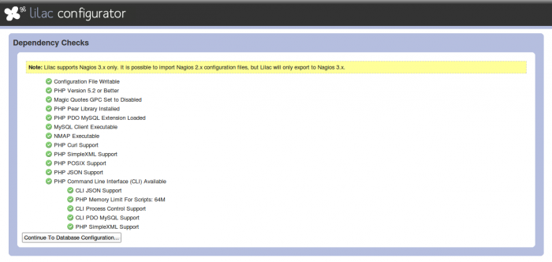
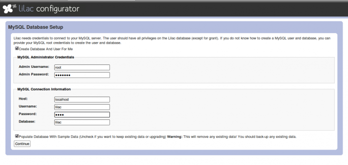
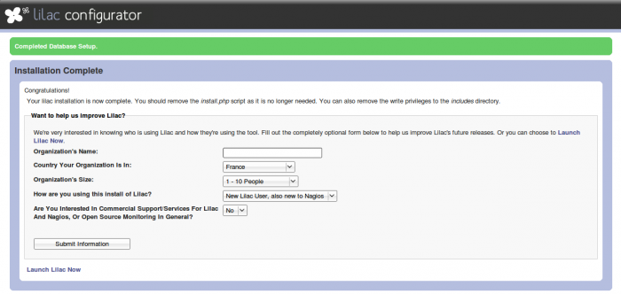
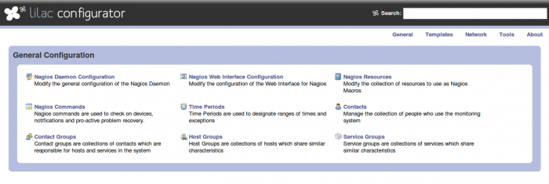

[[[Lilac Platform](lilac-platform@do=backlink.html)]]

[wiki monitoring-fr.org](../../start.html "[ALT+H]")

-   [Accueil](../../index.html "Cliquez pour revenir |  l'accueil")
-   [Blog](http://www.monitoring-fr.org "Blog & News")
-   [Forums](http://forums.monitoring-fr.org "Forums")
-   [Doc](http://doc.monitoring-fr.org "Doc")
-   [Forge](https://github.com/monitoring-fr "Forge")

Vous êtes ici: [Accueil](../../start.html "start") »
[Nagios](../start.html "nagios:start") » [Nagios
Addons](start.html "nagios:addons:start") » [Lilac
Platform](lilac-platform.html "nagios:addons:lilac-platform")

### Table des matières {.toggle}

-   [Lilac Platform](lilac-platform.html#lilac-platform)
    -   [Installation](lilac-platform.html#installation)
    -   [Configuration](lilac-platform.html#configuration)

Lilac Platform {#lilac-platform .sectionedit1}
==============

La [Plateforme
Lilac](http://www.lilacplatform.com/ "http://www.lilacplatform.com/")
est une collection d’outils conçus pour améliorer les application open
source de supervision, écrit par Lila Networks. Le premier outil paru
est le Lilac Configurator conçu pour assurer la configuration de Nagios.
Le code de base de Lilac Configurator est basé sur celui du défunt
projet Fruity. Les principales fonctionnalités sont les suivantes:

-   Support des périodes de temps de Nagios 3
-   Supporte l’héritage multiple de gabarits
-   Des gabarits d’hôtes capables de recevoir de services, des
    dépendances et des escalades
-   Un outil d’import qui peut importer les configurations Nagios
    existantes ainsi que les imports d’installation Fruity
-   Export avec contrôle de cohérence des fichiers générés ainsi que la
    sauvegarde des fichiers existants
-   Outil d’auto-découverte pour ajouter rapidement l’infrastructure à
    superviser dans votre installation Nagios

Installation {#installation .sectionedit2}
------------

La dernière version du code source est à télécharger sur le [site de
Lilac
Platform](http://www.lilacplatform.com/downloads "http://www.lilacplatform.com/downloads").

Il y a quelques pré-requis qu’il est facile de satisfaire

~~~ {.code .bash}
sudo apt-get install php5-curl php-pear php5-cli php5-mysql
~~~

Ensuite, c’est une simple décompression de l’archive récupérée et
déplacement des fichiers dans un répertoire servi par le serveur web.

~~~ {.code .bash}
tar -xzf lilac-1.0.2.tar.gz
sudo mv lilac-1.0.2 /var/www/lilac
~~~

le reste se passe directement depuis l’installeur web
[http://nagios/lilac/install.php](http://nagios/lilac/install.php "http://nagios/lilac/install.php")

Ce premier écran permet de vérifier la conformité de votre installation
php par rapport aux pré-requis de Lilac.

Ce deuxième écran permet de préciser les réglages à utiliser pour la
base de données dont a besoin Lilac Configurator.

le script est capable de créer la base de données et l’utilisateur
afférent.

Le dernier écran permet simplement d’envoyer quelques informations à
l’éditeur à des fins de statistiques. C’est optionnel et il est tout à
fait possible de se rendre sur l’installation ainsi terminée par le lien
“Launch Lilac Now”.

L’installation à proprement parlé est terminée. Il reste à voir la
configuration.

Configuration {#configuration .sectionedit3}
-------------

 A continuer…

SOMMAIRE {#sommaire .sectionedit1}
--------

**[Accueil](../../start.html "start")**

**[Supervision](../../supervision/start.html "supervision:start")**

-   [Nagios](../start.html "nagios:start")
-   [Centreon](../../centreon/start.html "centreon:start")
-   [Shinken](../../shinken/start.html "shinken:start")
-   [Zabbix](../../zabbix/start.html "zabbix:start")
-   [OpenNMS](../../opennms/start.html "opennms:start")
-   [EyesOfNetwork](../../eyesofnetwork/start.html "eyesofnetwork:start")
-   [Groundwork](../../groundwork/start.html "groundwork:start")
-   [Zenoss](../../zenoss/start.html "zenoss:start")
-   [Vigilo](../../vigilo/start.html "vigilo:start")
-   [Icinga](../../icinga/start.html "icinga:start")
-   [Cacti](../../cacti/start.html "cacti:start")
-   [Ressenti
    utilisateur](../../supervision/eue/start.html "supervision:eue:start")
-   [Ressenti utilisateur avec
    sikuli](../../sikuli/eue/start.html "sikuli:eue:start")

**[Hypervision](../../hypervision/start.html "hypervision:start")**

-   [Canopsis](../../canopsis/start.html "canopsis:start")

**[Sécurité](../../securite/start.html "securite:start")**

**[Infrastructure](../../infra/start.html "infra:start")**

**[Développement](../../dev/start.html "dev:start")**

Nagios Addons {#nagios-addons .sectionedit1}
-------------

-   [Lilac Platform](lilac-platform.html "nagios:addons:lilac-platform")
-   [Merlin](../../addons/merlin.html "nagios:addons:merlin")
-   [NConf](nconf.html "nagios:addons:nconf")
-   [NDOUtils](ndoutils.html "nagios:addons:ndoutils")
-   [NSClient++](nsclient.html "nagios:addons:nsclient")
-   [NagTrap](../../addons/nagtrap.html "nagios:addons:nagtrap")
-   [NagVis](nagvis/start.html "nagios:addons:nagvis:start")
-   [Nagios Business Process
    Addon](nagios-business-process-addons.html "nagios:addons:nagios-business-process-addons")
-   [NagiosDigger](nagiosdigger.html "nagios:addons:nagiosdigger")
-   [NagiosGrapher](nagiosgrapher.html "nagios:addons:nagiosgrapher")
-   [NagiosQL](nagiosql.html "nagios:addons:nagiosql")
-   [Netways Grapher
    V2](netways-grapher-v2.html "nagios:addons:netways-grapher-v2")
-   [Ninja](ninja.html "nagios:addons:ninja")
-   [PNP4Nagios](pnp/start.html "nagios:addons:pnp:start")
-   [Protocole NRPE](nrpe.html "nagios:addons:nrpe")
-   [Protocole NSCA](nsca.html "nagios:addons:nsca")
-   [Setup distribué avec
    Mod\_Gearman](mod_gearman.html "nagios:addons:mod_gearman")
-   [Vautour Style](vautour-style.html "nagios:addons:vautour-style")
-   [check\_mk](check_mk/start.html "nagios:addons:check_mk:start")
-   [omd Open Monitoring Distribution](omd.html "nagios:addons:omd")

-   [Afficher le texte
    source](lilac-platform@do=edit&rev=0.html "Afficher le texte source [V]")
-   [Anciennes
    révisions](lilac-platform@do=revisions.html "Anciennes révisions [O]")
-   [Derniers
    changements](lilac-platform@do=recent.html "Derniers changements [R]")
-   [Liens vers cette
    page](lilac-platform@do=backlink.html "Liens vers cette page")
-   [Gestionnaire de
    médias](lilac-platform@do=media.html "Gestionnaire de médias")
-   [Index](lilac-platform@do=index.html "Index [X]")
-   [Connexion](lilac-platform@do=login&sectok=6bca6bdf16f8880de3d6d3649db89a26.html "Connexion")
-   [Haut de page](lilac-platform.html#dokuwiki__top "Haut de page [T]")

nagios/addons/lilac-platform.txt · Dernière modification: 2013/03/29
09:39 (modification externe)

