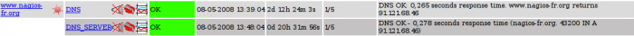

[[[NagiosGrapher](nagiosgrapher@do=backlink.html)]]

[wiki monitoring-fr.org](../../start.html "[ALT+H]")

-   [Accueil](../../index.html "Cliquez pour revenir |  l'accueil")
-   [Blog](http://www.monitoring-fr.org "Blog & News")
-   [Forums](http://forums.monitoring-fr.org "Forums")
-   [Doc](http://doc.monitoring-fr.org "Doc")
-   [Forge](https://github.com/monitoring-fr "Forge")

Vous êtes ici: [Accueil](../../start.html "start") »
[Nagios](../start.html "nagios:start") » [Nagios
Addons](start.html "nagios:addons:start") »
[NagiosGrapher](nagiosgrapher.html "nagios:addons:nagiosgrapher")

### Table des matières {.toggle}

-   [NagiosGrapher](nagiosgrapher.html#nagiosgrapher)

NagiosGrapher {#nagiosgrapher .sectionedit1}
=============

NagiosGrapher est certainement le module de génération de graphes le
plus populaire pour Nagios en attendant la montée en puissance de PNP à
l’approche de la version 1.0. Il est cependant plus difficile à
installer et appréhender que PNP. C’est un programme écrit en Perl. Il
est par contre intéressant dans certaines installations où les plugins
exécutant les contrôles ne sont pas écrits en respectant les
recommandations. NagiosGrapher sait en effet récupérer les valeurs de
performance dans la première partie de la sortie d’un contrôle; celle
avant le symbole du tube. Il y arrive en utilisant des expressions
régulières Perl (regexp). La contrepartie est que les valeurs relevées
sont moins précises que celles fournies après le symbole du tube.

Pour pouvoir être installé, NagiosGrapher nécessite un nombre non
négligeable de modules Perl dont la liste est heureusement fournie.

~~~~ {.code}
CGI 
CGI::Carp 
Calendar::Simple 
Carp        
Data::Dumper 
File::Basename 
File::Copy 
GD 
IO::Handle 
Image::Magick 
RRDs 
Storable 
Time::HiRes 
Time::Local 
URI::Escape
~~~~

Après avoir récupéré les sources de NagiosGrapher sur
[sourceforge.net](http://sourceforge.net/projects/nagiosgrapher/ "http://sourceforge.net/projects/nagiosgrapher/"),
il faut les décompresser et passer la commande

~~~~ {.code}
autoconf 
~~~~

Ceci génère un fichier configure qu’il faut alors appeler

~~~~ {.code}
configure 
~~~~

Configure renverra des erreurs si les dépendances de modules Perl ne
sont pas satisfaites. Pour connaître le nom des module qu’il manque, il
est possible de taper

~~~~ {.code}
make testdeps 
~~~~

Si vous êtes sur une distribution de type Debian comme notre Ubuntu,
vous pouvez installer l’ensemble de ces modules Perl avec la commande
apt-get suivante

~~~~ {.code}
apt-get install autoconf rrdtool perl perl-base perl-modules libcalendar-simple-perl libgd-gd2-perl perlmagick librrds-perl liburi-perl 
~~~~

Après avoir contrôlé que nous disposons de tous les modules nécessaires,
un simple make install suffit

~~~~ {.code}
make install 
~~~~

NagiosGrapher est alors installé en /usr/local/nagios/contrib. Les
fichiers de configuration sont eux installés dans
/usr/local/nagios/etc/ngraph.d. NagiosGrapher possède plusieurs modes de
fonctionnement quand il s’agit de traiter les données. Il peut
travailler à partir d’un fichier à plat, un fichier de pipe ou en réseau
grâce à un écho UDP. La première chose à faire est donc de choisir la
méthode qui sera utilisée pour traiter les données. De ce choix dépend
la configuration qu’il faut appliquer à Nagios. Pour notre exemple, nous
allons prendre le mode par défaut qui est le mode fichier à plat. Nous
somme alors dans la cas vu plus haut de service\_perfdata\_file. Nous
allons donc ajouter ces lignes dans nagios.cfg pour passer dans ce cas.

~~~~ {.code}
    cfg_dir=/usr/local/nagios/etc/serviceext 
    process_performance_data=1 
    service_perfdata_file=/usr/local/nagios/var/service-perfdata 
    service_perfdata_file_template=$HOSTNAME$   $SERVICEDESC$   $SERVICEOUTPUT$ $SERVICEPERFDATA$   $TIMET$ 
    service_perfdata_file_mode=a 
    service_perfdata_file_processing_interval=30 
    service_perfdata_file_processing_command=process-service-perfdata-file
~~~~

L’ensemble des explications ayant été donnée plus haut, la seule
directive à expliquer reste cfg\_dir=/usr/local/nagios/etc/serviceext .
NagiosGrapher stocke dans ce répertoire les définitions d’informations
étendues de services dont un exemple ci-dessous

~~~~ {.code}
# ExtInfo for www.cms-fr.net, DNS_SERVER 
define serviceextinfo{ 
        host_name               www.cms-fr.net 
        icon_image               dot.png' alt="" border="0"></a><A TARGET="_blank" HREF="graphs.cgi?host=www.cms-fr.net&service=DNS_SERVER"><img src="nagios/images/logos/graph.png"
        service_description     DNS_SERVER 
}
~~~~

Cette information permet d’avoir dans l’interface web de Nagios une
icône affichée auprès des services possédant des graphiques de tendance.
C’est pourquoi nous avons ajouté la directive cfg\_dir supplémentaire de
façon à ce que ces définitions soient prise en compte par Nagios.

L’icône à gauche de l’état OK indique la présence d’un graphique de
tendance pour le service. Un clic sur cette icône affiche le graphique
correspondant.

Maintenant que le fichier nagios.cfg est configuré, il reste à créer la
commande process-service-perfdata-file . Nous écrivons donc le contenu
suivant dans un fichier process-service-perfdata-file .cfg.

~~~~ {.code}
    define command{ 
            command_name process-service-perfdata-file 
            command_line mv /usr/local/nagios/var/service-perfdata /usr/local/nagios/var/service-perfdata.$TIMET$ 
            }
~~~~

Comme nous le supposions dans les explications plus haut, la commande
est un simple déplacement du fichier suffixé de la date et heure au
format epoch. Le rôle de Nagios se termine ici. Ce qui suit ce
déplacement est le travail de NagiosGrapher.

 A compléter par la
configuration de nagiosgrapher

Il existe beaucoup d’autres modules de génération de graphiques pour
Nagios. Des plus anciens, perfparse au plus récent StoreMe du projet
Vigilo. Il n’est pas possible de tous les aborder dans le cadre de cette
ouvrage d’autant que les différences sont parfois minimes. Il reste
néanmoins possible de distinguer NagiosGraph, réputé mais plus trop mis
à jour et dont la notoriété va minimisante. N2RRD (Nagios To RRD) est un
cas à part puisqu’il ne propose pas d’interface de consultation,
laissant ce soin à des outils spécialisés comme Cacti ou Drraw. Sans
oublier la “bombe” à venir quand le projet sera plus avancée et qui
n’est autre que le successeur de NagiosGrapher; à savoir [NetWays
Grapher](https://www.nagiosforge.org/gf/project/netwaysgrapher/ "https://www.nagiosforge.org/gf/project/netwaysgrapher/")

SOMMAIRE {#sommaire .sectionedit1}
--------

**[Accueil](../../start.html "start")**

**[Supervision](../../supervision/start.html "supervision:start")**

-   [Nagios](../start.html "nagios:start")
-   [Centreon](../../centreon/start.html "centreon:start")
-   [Shinken](../../shinken/start.html "shinken:start")
-   [Zabbix](../../zabbix/start.html "zabbix:start")
-   [OpenNMS](../../opennms/start.html "opennms:start")
-   [EyesOfNetwork](../../eyesofnetwork/start.html "eyesofnetwork:start")
-   [Groundwork](../../groundwork/start.html "groundwork:start")
-   [Zenoss](../../zenoss/start.html "zenoss:start")
-   [Vigilo](../../vigilo/start.html "vigilo:start")
-   [Icinga](../../icinga/start.html "icinga:start")
-   [Cacti](../../cacti/start.html "cacti:start")
-   [Ressenti
    utilisateur](../../supervision/eue/start.html "supervision:eue:start")
-   [Ressenti utilisateur avec
    sikuli](../../sikuli/eue/start.html "sikuli:eue:start")

**[Hypervision](../../hypervision/start.html "hypervision:start")**

-   [Canopsis](../../canopsis/start.html "canopsis:start")

**[Sécurité](../../securite/start.html "securite:start")**

**[Infrastructure](../../infra/start.html "infra:start")**

**[Développement](../../dev/start.html "dev:start")**

Nagios Addons {#nagios-addons .sectionedit1}
-------------

-   [Lilac Platform](lilac-platform.html "nagios:addons:lilac-platform")
-   [Merlin](../../addons/merlin.html "nagios:addons:merlin")
-   [NConf](nconf.html "nagios:addons:nconf")
-   [NDOUtils](ndoutils.html "nagios:addons:ndoutils")
-   [NSClient++](nsclient.html "nagios:addons:nsclient")
-   [NagTrap](../../addons/nagtrap.html "nagios:addons:nagtrap")
-   [NagVis](nagvis/start.html "nagios:addons:nagvis:start")
-   [Nagios Business Process
    Addon](nagios-business-process-addons.html "nagios:addons:nagios-business-process-addons")
-   [NagiosDigger](nagiosdigger.html "nagios:addons:nagiosdigger")
-   [NagiosGrapher](nagiosgrapher.html "nagios:addons:nagiosgrapher")
-   [NagiosQL](nagiosql.html "nagios:addons:nagiosql")
-   [Netways Grapher
    V2](netways-grapher-v2.html "nagios:addons:netways-grapher-v2")
-   [Ninja](ninja.html "nagios:addons:ninja")
-   [PNP4Nagios](pnp/start.html "nagios:addons:pnp:start")
-   [Protocole NRPE](nrpe.html "nagios:addons:nrpe")
-   [Protocole NSCA](nsca.html "nagios:addons:nsca")
-   [Setup distribué avec
    Mod\_Gearman](mod_gearman.html "nagios:addons:mod_gearman")
-   [Vautour Style](vautour-style.html "nagios:addons:vautour-style")
-   [check\_mk](check_mk/start.html "nagios:addons:check_mk:start")
-   [omd Open Monitoring Distribution](omd.html "nagios:addons:omd")

-   [Afficher le texte
    source](nagiosgrapher@do=edit&rev=0.html "Afficher le texte source [V]")
-   [Anciennes
    révisions](nagiosgrapher@do=revisions.html "Anciennes révisions [O]")
-   [Derniers
    changements](nagiosgrapher@do=recent.html "Derniers changements [R]")
-   [Liens vers cette
    page](nagiosgrapher@do=backlink.html "Liens vers cette page")
-   [Gestionnaire de
    médias](nagiosgrapher@do=media.html "Gestionnaire de médias")
-   [Index](nagiosgrapher@do=index.html "Index [X]")
-   [Connexion](nagiosgrapher@do=login&sectok=6bca6bdf16f8880de3d6d3649db89a26.html "Connexion")
-   [Haut de page](nagiosgrapher.html#dokuwiki__top "Haut de page [T]")

nagios/addons/nagiosgrapher.txt · Dernière modification: 2013/03/29
09:39 (modification externe)

