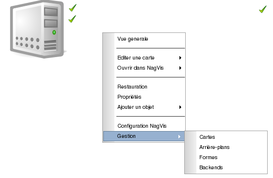
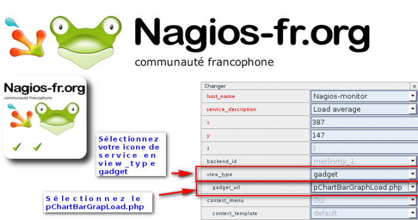
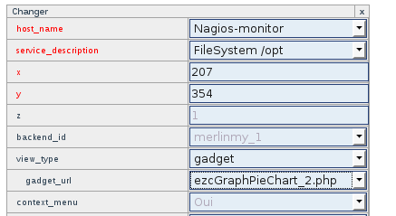
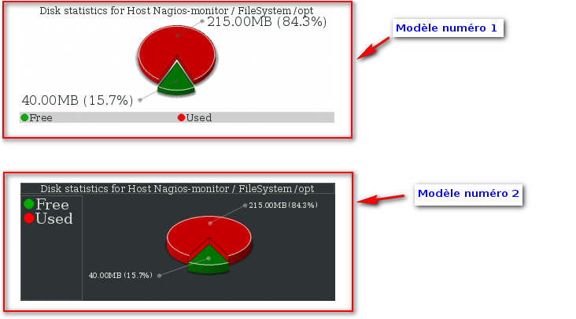
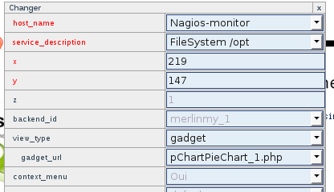

[[[Customization de NagVis](customisation-nagvis@do=backlink.html)]]

[wiki monitoring-fr.org](../../../start.html "[ALT+H]")

-   [Accueil](../../../index.html "Cliquez pour revenir |  l'accueil")
-   [Blog](http://www.monitoring-fr.org "Blog & News")
-   [Forums](http://forums.monitoring-fr.org "Forums")
-   [Doc](http://doc.monitoring-fr.org "Doc")
-   [Forge](https://github.com/monitoring-fr "Forge")

Vous êtes ici: [Accueil](../../../start.html "start") »
[Nagios](../../start.html "nagios:start") » [Nagios
Addons](../start.html "nagios:addons:start") »
[NagVis](start.html "nagios:addons:nagvis:start") » [Customization de
NagVis](customisation-nagvis.html "nagios:addons:nagvis:customisation-nagvis")

### Table des matières {.toggle}

-   [Customization de
    NagVis](customisation-nagvis.html#customization-de-nagvis)
    -   [En ligne de commande comme l'exemple qui va suivre
        :](customisation-nagvis.html#en-ligne-de-commande-comme-l-exemple-qui-va-suivre)
    -   [Par l'interface
        Web](customisation-nagvis.html#par-l-interface-web)
    -   [Gadgets](customisation-nagvis.html#gadgets)
    -   [Rotation des
        cartes](customisation-nagvis.html#rotation-des-cartes)

Customization de NagVis {#customization-de-nagvis .sectionedit1}
=======================

Cette partie va expliquer comment importer des éléments dans NagVis. Il
y a 2 méthodes possible :

En ligne de commande comme l'exemple qui va suivre : {#en-ligne-de-commande-comme-l-exemple-qui-va-suivre .sectionedit2}
----------------------------------------------------

-   **Pour les icônes**

~~~
wget http://switch.dl.sourceforge.net/sourceforge/nagvis/NagVis-Iconset-Lemon-02.tar.gz

tar zxvf NagVis-Iconset-Lemon-02.tar.gz

cd lemon/nagvis/nagvis/images/iconsets

cp * /usr/local/nagios/share/nagvis/nagvis/images/iconsets/

chown -R www-data:www-data /usr/local/nagios/share/nagvis/
~~~

-   **Pour les formes**

~~~
wget http://switch.dl.sourceforge.net/sourceforge/nagvis/NagVis-Shapes-Server-Dropline.tar.gz

tar zxvf NagVis-Shapes-Server-Dropline.tar.gz

cd shapes_dropline

cp * /usr/local/nagios/share/nagvis/nagvis/images/shapes/

chown -R www-data:www-data /usr/local/nagios/share/nagvis/
~~~

-   **Pour les templates (skins)**

~~~
wget http://dfn.dl.sourceforge.net/sourceforge/nagvis/NagVis-Template-Darkglass-0.4.tar.gz

tar zxvf NagVis-Template-Darkglass-0.4.tar.gz

cd darkglass

cp -r nagvis /usr/local/nagios/share/nagvis/

chown -R www-data:www-data /usr/local/nagios/share/nagvis/
~~~

Voilà avec un peu de tuning, votre Nagvis pourra paraître plus sexy

Par l'interface Web {#par-l-interface-web .sectionedit3}
-------------------

Vous voulez importer une image dans NagVis, voici la manipulation :

Après il suffit de mettre votre image sur votre carte et le tour est
joué.

Gadgets {#gadgets .sectionedit4}
-------

**ATTENTION: Ces gadgets sont explicables que pour le type de service
dont ils sont prévus.**

Trois gadgets sont actuellement sortis pour NagVis 1.4.1. Nous allons
vous expliquer comment les installer et les appliquer à votre carte.

-   **pChartBarGraph**

~~~
wget http://www.nagvis.org/sites/default/files/NagVis-Gadget-pChartBarGraphLoad-0.1.tgz

tar -xvzf NagVis-Gadget-pChartBarGraphLoad-0.1.tgz

cd gadget-pChartBarGraphLoad-0.1/nagvis/nagvis/gadgets

cp -r * /usr/local/nagios/share/nagvis/nagvis/gadgets/

chown -R www-data:www-data /usr/local/nagios/share/nagvis/
~~~

Sur l’interface Web, il faudra choisir un “icône de service” et lui
mettre la propriété “Gadget” au lieu de “Icon”.

Voilà le rendu :

-   **ezcGraphPieChar**

~~~
wget http://www.nagvis.org/sites/default/files/NagVis-Gadget-ezcGraphPieChart-0.1.tgz

tar -xvzf NagVis-Gadget-ezcGraphPieChart-0.1.tgz

cd gadget-ezcGraphPieChart-0.1/nagvis/nagvis/gadgets

cp -r * /usr/local/nagios/share/nagvis/nagvis/gadgets/

chown -R www-data:www-data /usr/local/nagios/share/nagvis/
~~~

Sur l’interface Web, il faudra choisir un “icône de service” et lui
mettre la propriété “Gadget” au lieu de “Icon”.

Voilà le rendu :

-   **pChartPieChart**

~~~
wget http://www.nagvis.org/sites/default/files/NagVis-Gadget-pChartPieChart-0.1.tgz

tar -xvzf NagVis-Gadget-pChartPieChart-0.1.tgz

cd gadget-pChartPieChart-0.1/nagvis/nagvis/gadgets

cp -r * /usr/local/nagios/share/nagvis/nagvis/gadgets/

chown -R www-data:www-data /usr/local/nagios/share/nagvis/
~~~

Sur l’interface Web, il faudra choisir un “icône de service” et lui
mettre la propriété “Gadget” au lieu de “Icon”.

Voilà le rendu :

Rotation des cartes {#rotation-des-cartes .sectionedit5}
-------------------

Pour pouvoir réaliser une rotation de vos différentes cartes NagVis, il
faut paramétrer une balise de rotation dans le fichier nagvis.ini.php
comme le modèle ci-dessous :

~~~
[rotation_test1]
rotationid="test1"
; These steps are rotated. The "Demo2:" is a label which is being displayed in
; the index pages rotation list.
maps="Ma_Carte1:carte1,Ma_Carte2:carte2"
; rotation interval (seconds)
interval=15
~~~

Description

rotationid

C’est l’identifiant correspondant à votre cycle de rotation

maps

Ce sont la liste des cartes que vous désirez voir dans votre cycle\
 La syntaxe est composé de
maps=”\<label\_carte1\>:\<nom\_de\_la\_carte1\>,\<label\_carte2\>:\<nom\_de\_la\_carte2\>,…”

interval

L’intervalle de rotation des cartes

Votre test est accessible à l’url suivante :
[http://IP\_SERV\_NAGIOS/nagvis/nagvis/index.php?rotation=test1](http://IP_SERV_NAGIOS/nagvis/nagvis/index.php?rotation=test1 "http://IP_SERV_NAGIOS/nagvis/nagvis/index.php?rotation=test1")

SOMMAIRE {#sommaire .sectionedit1}
--------

**[Accueil](../../../start.html "start")**

**[Supervision](../../../supervision/start.html "supervision:start")**

-   [Nagios](../../start.html "nagios:start")
-   [Centreon](../../../centreon/start.html "centreon:start")
-   [Shinken](../../../shinken/start.html "shinken:start")
-   [Zabbix](../../../zabbix/start.html "zabbix:start")
-   [OpenNMS](../../../opennms/start.html "opennms:start")
-   [EyesOfNetwork](../../../eyesofnetwork/start.html "eyesofnetwork:start")
-   [Groundwork](../../../groundwork/start.html "groundwork:start")
-   [Zenoss](../../../zenoss/start.html "zenoss:start")
-   [Vigilo](../../../vigilo/start.html "vigilo:start")
-   [Icinga](../../../icinga/start.html "icinga:start")
-   [Cacti](../../../cacti/start.html "cacti:start")
-   [Ressenti
    utilisateur](../../../supervision/eue/start.html "supervision:eue:start")
-   [Ressenti utilisateur avec
    sikuli](../../../sikuli/eue/start.html "sikuli:eue:start")

**[Hypervision](../../../hypervision/start.html "hypervision:start")**

-   [Canopsis](../../../canopsis/start.html "canopsis:start")

**[Sécurité](../../../securite/start.html "securite:start")**

**[Infrastructure](../../../infra/start.html "infra:start")**

**[Développement](../../../dev/start.html "dev:start")**

Nagios Addons {#nagios-addons .sectionedit1}
-------------

-   [Lilac
    Platform](../lilac-platform.html "nagios:addons:lilac-platform")
-   [Merlin](../../../addons/merlin.html "nagios:addons:merlin")
-   [NConf](../nconf.html "nagios:addons:nconf")
-   [NDOUtils](../ndoutils.html "nagios:addons:ndoutils")
-   [NSClient++](../nsclient.html "nagios:addons:nsclient")
-   [NagTrap](../../../addons/nagtrap.html "nagios:addons:nagtrap")
-   [NagVis](start.html "nagios:addons:nagvis:start")
-   [Nagios Business Process
    Addon](../nagios-business-process-addons.html "nagios:addons:nagios-business-process-addons")
-   [NagiosDigger](../nagiosdigger.html "nagios:addons:nagiosdigger")
-   [NagiosGrapher](../nagiosgrapher.html "nagios:addons:nagiosgrapher")
-   [NagiosQL](../nagiosql.html "nagios:addons:nagiosql")
-   [Netways Grapher
    V2](../netways-grapher-v2.html "nagios:addons:netways-grapher-v2")
-   [Ninja](../ninja.html "nagios:addons:ninja")
-   [PNP4Nagios](../pnp/start.html "nagios:addons:pnp:start")
-   [Protocole NRPE](../nrpe.html "nagios:addons:nrpe")
-   [Protocole NSCA](../nsca.html "nagios:addons:nsca")
-   [Setup distribué avec
    Mod\_Gearman](../mod_gearman.html "nagios:addons:mod_gearman")
-   [Vautour Style](../vautour-style.html "nagios:addons:vautour-style")
-   [check\_mk](../check_mk/start.html "nagios:addons:check_mk:start")
-   [omd Open Monitoring Distribution](../omd.html "nagios:addons:omd")

-   [Afficher le texte
    source](customisation-nagvis@do=edit&rev=0.html "Afficher le texte source [V]")
-   [Anciennes
    révisions](customisation-nagvis@do=revisions.html "Anciennes révisions [O]")
-   [Derniers
    changements](customisation-nagvis@do=recent.html "Derniers changements [R]")
-   [Liens vers cette
    page](customisation-nagvis@do=backlink.html "Liens vers cette page")
-   [Gestionnaire de
    médias](customisation-nagvis@do=media.html "Gestionnaire de médias")
-   [Index](customisation-nagvis@do=index.html "Index [X]")
-   [Connexion](customisation-nagvis@do=login&sectok=6bca6bdf16f8880de3d6d3649db89a26.html "Connexion")
-   [Haut de
    page](customisation-nagvis.html#dokuwiki__top "Haut de page [T]")

nagios/addons/nagvis/customisation-nagvis.txt · Dernière modification:
2013/03/29 09:39 (modification externe)

