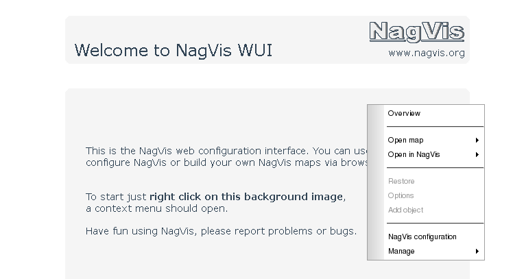

Cette documentation n’est plus à jour.

Pré-requis {#pre-requis .sectionedit2}
----------

Certains des pré-requis n’est plus utile si vous les avez déjà récupérer
pour l’installation d’un autre addons à Nagios. Graphviz a son
importance, il servira à la fonction “automap” implanté depuis la
version 1.3 de nagvis.

~~~
sudo apt-get install apache2 libapache2-mod-php5 php5-gd php5-mysql graphviz
~~~

Il faut savoir aussi que nagvis s’appuie sur une base SQL comme NDO ou
tout récemment Merlin. Donc il est bon d’avoir assez au préalable une de
ces deux bases.

Pour Merlin :

[Installation
Merlin](../../../addons/merlin.html "http://wiki.monitoring-fr.org/addons/merlin")

Pour NDO (article sur NDOUtils par encore écrit par Nagios-fr) :

[Article Installation Centreon
NicoLargo](http://blog.nicolargo.com/2009/01/le-serveur-de-supervision-libre-part-3.html "http://blog.nicolargo.com/2009/01/le-serveur-de-supervision-libre-part-3.html")

Installation {#installation .sectionedit3}
------------

Nous allons récupérer la dernière version de nagvis puis exploiter les
sources pour les greffer à notre nagios.

~~~
wget http://kent.dl.sourceforge.net/sourceforge/nagvis/nagvis-1.4.1.tar.gz

tar -xvzf nagvis-1.4.1.tar.gz

mv nagvis-1.4.1 nagvis

cd /usr/local/nagios/share/nagvis

cp etc/nagvis.ini.php-sample etc/nagvis.ini.php
~~~

Configuration {#configuration .sectionedit4}
-------------

Nous allons paramétrer nagvis pour pouvoir dialoguer avec la base de
données. Ce paramétrage se trouve dans le fichier
/usr/local/nagios/share/nagvis/etc/nagvis.ini.php.

**Pour Merlin :**

~~~
language="fr_FR"
backend="merlinmy_1"

[backend_merlinmy_1]
backendid="merlinmy_1"
; type of backend - MUST be set
backendtype="merlinmy"
; hostname for Merlin db
dbhost="localhost"
; portname for Merlin db
dbport=3306
; database name for Merlin db
dbname="nom_base_merlin"
; username for Merlin db
dbuser="user_merlin"
; password for Merlin db
dbpass="mot_de_passe_merlin"
; maximum delay of the Merlin Database in seconds
maxtimewithoutupdate=180
; path to the cgi-bin of this backend
htmlcgi="/nagios/cgi-bin"
~~~

Pour NDO :

A venir 

Nous allons changer les droits sur les fichiers de NagVis pour que le
serveur Apache y accèdent comme il faut.

~~~
    chown -R www-data:www-data /usr/local/nagios/share/nagvis/

    chmod 664 /usr/local/nagios/share/nagvis/etc/nagvis.ini.php

    chmod 775 /usr/local/nagios/share/nagvis/nagvis/images/maps

    chmod 664 /usr/local/nagios/share/nagvis/nagvis/images/maps/*

    chmod 775 /usr/local/nagios/share/nagvis/etc/maps

    chmod 664 /usr/local/nagios/share/nagvis/etc/maps/*

    chmod 775 /usr/local/nagios/share/nagvis/var

    chmod 664 /usr/local/nagios/share/nagvis/var/*
~~~

On peut enfin accéder à l’interface web de NagVis via l’adresse suivante
:

[http://ip\_votre\_serv\_nagios/nagios/nagvis/config.php](http://ip_votre_serv_nagios/nagios/nagvis/config.php "http://ip_votre_serv_nagios/nagios/nagvis/config.php")

