[[[Manuel d'utilisation de
NagVis](nagvis-manuel-utilisation@do=backlink.html)]]

[wiki monitoring-fr.org](../../../start.html "[ALT+H]")

-   [Accueil](../../../index.html "Cliquez pour revenir |  l'accueil")
-   [Blog](http://www.monitoring-fr.org "Blog & News")
-   [Forums](http://forums.monitoring-fr.org "Forums")
-   [Doc](http://doc.monitoring-fr.org "Doc")
-   [Forge](https://github.com/monitoring-fr "Forge")

Vous êtes ici: [Accueil](../../../start.html "start") »
[Nagios](../../start.html "nagios:start") » [Nagios
Addons](../start.html "nagios:addons:start") »
[NagVis](start.html "nagios:addons:nagvis:start") » [Manuel
d'utilisation de
NagVis](nagvis-manuel-utilisation.html "nagios:addons:nagvis:nagvis-manuel-utilisation")

### Table des matières {.toggle}

-   [Manuel d'utilisation de
    NagVis](nagvis-manuel-utilisation.html#manuel-d-utilisation-de-nagvis)
    -   [Référentiel](nagvis-manuel-utilisation.html#referentiel)
    -   [Ce qu'il faut
        savoir](nagvis-manuel-utilisation.html#ce-qu-il-faut-savoir)
    -   [Comment utiliser NagVis
        ?](nagvis-manuel-utilisation.html#comment-utiliser-nagvis)
        -   [Accéder à
            l'interface](nagvis-manuel-utilisation.html#acceder-a-l-interface)
        -   [Création d'une
            carte](nagvis-manuel-utilisation.html#creation-d-une-carte)
        -   [Ajouter des éléments à une
            carte](nagvis-manuel-utilisation.html#ajouter-des-elements-a-une-carte)
        -   [Importation de contenu pour
            NagVis](nagvis-manuel-utilisation.html#importation-de-contenu-pour-nagvis)

Manuel d'utilisation de NagVis {#manuel-d-utilisation-de-nagvis .sectionedit1}
==============================

Ceci est un manuel d’utilisation de NagVis pour vous aider à
l’appréhension de son interface et de son fonctionnement. Vous pouvez
très bien le compléter.

Ce manuel a été réalisé sur une version 1.4.3 de NagVis.

Référentiel {#referentiel .sectionedit2}
-----------

Le référentiel permet de lister certaines url bien pratique pour aider à
l’appréhension de NagVis.

Obtenir Nagvis :

[http://www.nagvis.org/downloads](http://www.nagvis.org/downloads "http://www.nagvis.org/downloads")

Téléchargement de contenu pour NagVis :

[http://exchange.nagvis.org/exchange](http://exchange.nagvis.org/exchange "http://exchange.nagvis.org/exchange")

Documentation sur NagVis :

[http://docs.nagvis.org/1.4/en\_US/index.html](http://docs.nagvis.org/1.4/en_US/index.html "http://docs.nagvis.org/1.4/en_US/index.html")

Ce qu'il faut savoir {#ce-qu-il-faut-savoir .sectionedit3}
--------------------

Nagvis est installé dans /usr/local/nagios/share.

L’architecture du répertoire de Nagvis se compose de la façon suivante:

-   nagvis/etc/maps/ → Localisation de la configuration des cartes

-   nagvis/etc/nagvis.ini.php → Fichier de configuration générale de
    NagVis

-   nagvis/nagvis/images/ → Localisation des formes, images de fond pour
    les cartes, les icônes…

-   nagvis/nagvis/gadgets/ → Localisation des gadgets

-   nagvis/nagvis/templates/ → Localisation des templates pour
    l’interface Web.

Comment utiliser NagVis ? {#comment-utiliser-nagvis .sectionedit4}
-------------------------

### Accéder à l'interface {#acceder-a-l-interface .sectionedit5}

NagVis est accessible via l’url suivante :
<http://IP_SERV_NAGIOS/nagios/nagvis/>

L’explorer vous demandera un login et mot de passe. Ce sont les mêmes
que votre serveur Nagios puisque l’on cherche à entrer dans la partie
*/usr/local/nagios/share* de votre serveur.

Vous arriverez sur une page comme ci-dessous:

[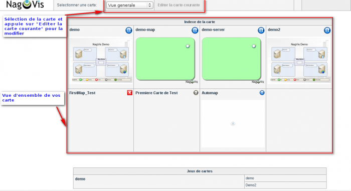](../../../_detail/addons/addons/nagvis/nagvis-overview.png@id=nagios%253Aaddons%253Anagvis%253Anagvis-manuel-utilisation.html "addons:addons:nagvis:nagvis-overview.png")

### Création d'une carte {#creation-d-une-carte .sectionedit6}

#### Graphiquement

Pour créer une carte dans Nagvis, il faut accéder au WUI soit par l’url:

[http://IP\_SERV\_NAGIOS/nagios/nagvis/wui/index.php](http://IP_SERV_NAGIOS/nagios/nagvis/wui/index.php "http://IP_SERV_NAGIOS/nagios/nagvis/wui/index.php")

Ensuite, faire un clic-droit → Gestion → Cartes

[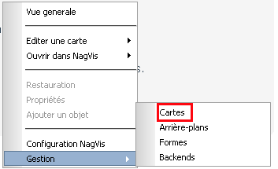](../../../_detail/addons/nagvis/menu_gestion_cartes.png@id=nagios%253Aaddons%253Anagvis%253Anagvis-manuel-utilisation.html "addons:nagvis:menu_gestion_cartes.png")

Vous pourrez ensuite gérer vos cartes existantes ou en créer des
nouvelles comme ci-dessous :

[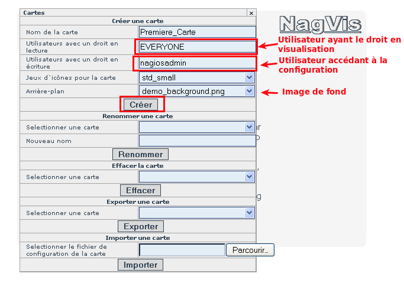](../../../_detail/addons/nagvis/creation_map.png@id=nagios%253Aaddons%253Anagvis%253Anagvis-manuel-utilisation.html "addons:nagvis:creation_map.png")

En ne mettant pas d’image de fond, on se retrouve avec une carte vierge
(page blanche).

L’équivalence en fichier de configuration de notre carte
(nagvis/etc/maps/Premiere\_Carte.cfg) :

~~~
define global { 
allowed_for_config=nagiosadmin 
allowed_user=EVERYONE 
iconset=std_small 
}
~~~

#### Manuellement

Pour ceux qui ne connaisse pas NagVis, le plus simple est de se faire la
main sur une carte de test. Alors pour votre première carte, vous allez
devoir opérer de la manière suivante :

~~~
cd /usr/local/nagios/share/nagvis/etc/maps

cp __automap.cfg Toute_premiere_fois.cfg

chown -R www-data:www-data /usr/local/nagios/share/nagvis/
~~~

Le format d’un fichier de map peut se trouver sur la [Doc de
NagVis](http://docs.nagvis.org/1.4/en_US/index.html "http://docs.nagvis.org/1.4/en_US/index.html")

~~~
vi Toute_premiere_fois.cfg

define global {
alias=Premiere Carte de Test
allowed_user=EVERYONE
allowed_for_config=nagiosadmin
iconset=std_small
#map_image=
hover_childs_sort=s
hover_childs_order=asc
}
~~~

Il s’agit du minimum pour avoir une carte vierge. Après tout ce que vous
allez faire sur la WUI ira écrire dans ce fichier (fond de carte, tous
les hôtes, etc ….). Maintenant, jouons un peu avec notre première map.

### Ajouter des éléments à une carte {#ajouter-des-elements-a-une-carte .sectionedit7}

Maintenant que nous avons notre carte, il va falloir y ajouter des
éléments dessus pour que notre carte de supervision prenne forme.

Nous possédons déjà par défaut d’un panel d’élément que Nagvis nous
propose:

-   Icône

-   Ligne

-   Spéciale

Les icônes et les lignes nous proposent de relier l’élément que l’on va
choisir à :

-   Un hôte

-   Un service

-   Un groupe d’hôtes (hostgroup dans nagios)

-   Un groupe de service (servicegroup dans nagios)

-   Une carte (icône résumant le status globale de la carte et servant
    de lien vers celle-ci)

On va ajouter 2 éléments par exemple à notre carte; un service et un
groupe d’hôtes. Pour les ajouter il faut procéder de la manière
suivante:

Passer en édition de votre carte soit via un clic-droit (dans le WUI) →
Editer une carte → Sélectionner votre Carte

[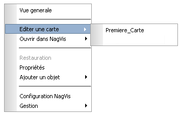](../../../_detail/addons/nagvis/menu_editer_cartes.png@id=nagios%253Aaddons%253Anagvis%253Anagvis-manuel-utilisation.html "addons:nagvis:menu_editer_cartes.png")

ou

Sur la page d’accueil cliquez sur votre carte. Une fois dedans, sur le
bandeau du haut, il y a l’option *Editer la carte courante*.

[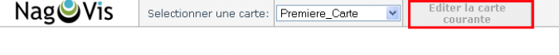](../../../_detail/addons/nagvis/editer_cartes.png@id=nagios%253Aaddons%253Anagvis%253Anagvis-manuel-utilisation.html "addons:nagvis:editer_cartes.png")

Ensuite, faire clic-droit → Ajouter un objet → icône → Service. Ceci va
nous permet d’ajouter un icône qui sera lié à un service de nagios.
Après cliquez n’importe où sur votre carte pour faire apparaître le
panneau de configuration de notre icône.

[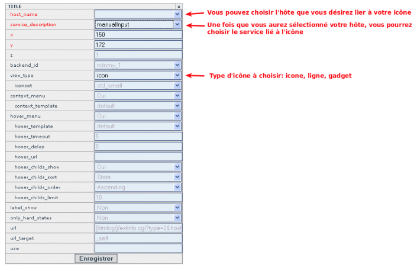](../../../_detail/addons/nagvis/panneau_config_icone.png@id=nagios%253Aaddons%253Anagvis%253Anagvis-manuel-utilisation.html "addons:nagvis:panneau_config_icone.png")

Ajoutons notre groupe d’hôtes tout de suite de la même manière que
précédemment mais en choisissant « Groupe de machines ».

[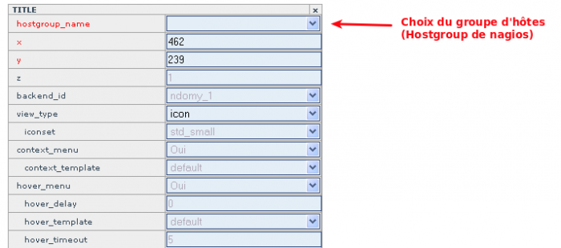](../../../_detail/addons/nagvis/panneau_config_hostgroup.png@id=nagios%253Aaddons%253Anagvis%253Anagvis-manuel-utilisation.html "addons:nagvis:panneau_config_hostgroup.png")

En mode « édition », vous pouvez déplacer vos icônes en « Glisser /
Déplacer » où vous le désirez.

Le résultat de notre carte manque encore d’habillage.

[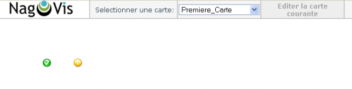](../../../_detail/addons/nagvis/rendu_carte_etape_1.png@id=nagios%253Aaddons%253Anagvis%253Anagvis-manuel-utilisation.html "addons:nagvis:rendu_carte_etape_1.png")

C’est laid pour de la cartographie me direz-vous ? Mais attendez ce
n’est que le début.

### Importation de contenu pour NagVis {#importation-de-contenu-pour-nagvis .sectionedit8}

Nous allons voir comment importer du contenu dans NagVis. Dans un
premier temps, nous allons importer un fond pour notre carte.

Dans le WUI, faire clic-droit → Gestion → arrière-plan

[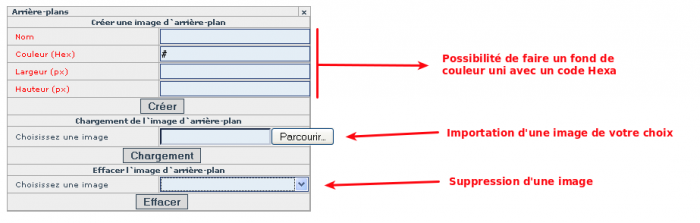](../../../_detail/addons/nagvis/panneau_config_arriere-plan.png@id=nagios%253Aaddons%253Anagvis%253Anagvis-manuel-utilisation.html "addons:nagvis:panneau_config_arriere-plan.png")

Dans notre cas, c’est l’importation que nous voulons. Nous allons
importer une carte de france et la mettre ensuite sur notre carte.

Une fois que votre fond est téléchargé, nous allons l’associé à notre
carte. Passez en édition sur la carte et faire clic-droit → Propriétés

Remplir le champs map\_image de notre image de fond comme ci-dessous.

[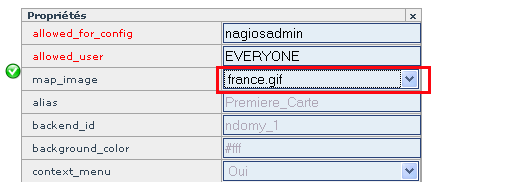](../../../_detail/addons/nagvis/selection_arriere-plan.png@id=nagios%253Aaddons%253Anagvis%253Anagvis-manuel-utilisation.html "addons:nagvis:selection_arriere-plan.png")

Voilà notre carte enfin terminée.

[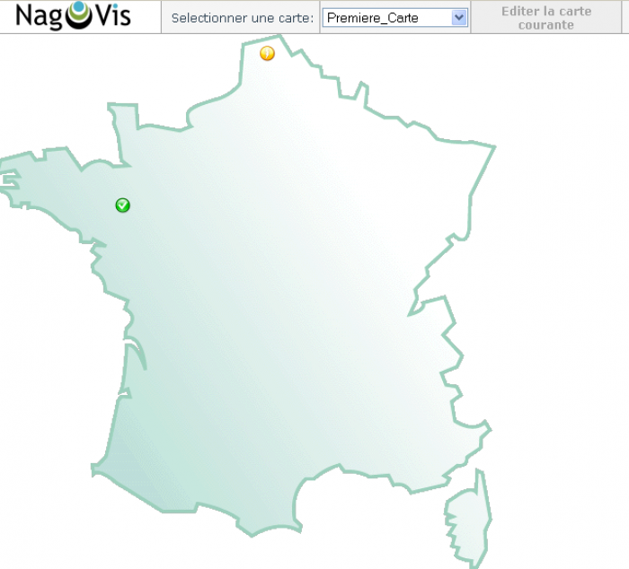](../../../_detail/addons/nagvis/rendu_carte_etape_2.png@id=nagios%253Aaddons%253Anagvis%253Anagvis-manuel-utilisation.html "addons:nagvis:rendu_carte_etape_2.png")

Voici le résultat du fichier de configuration de notre carte:

~~~
define global { 
map_image=france.gif 
allowed_for_config=nagiosadmin 
allowed_user=EVERYONE 
iconset=std_small 
} 

define service { 
host_name=test1
service_description=CHECK_DISK 
x=123 
y=168 
} 

define hostgroup { 
hostgroup_name=SERV_LINUX 
x=271 
y=21 
}
~~~

Bien sûr il existe d’autres types de formes à mettre sur une carte un
peu comme ci-dessous:

[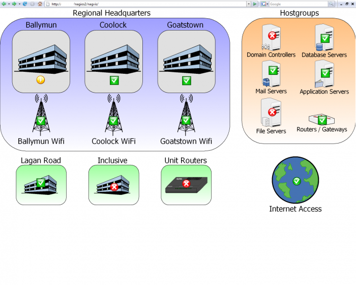](../../../_detail/addons/nagvis/exemple1.png@id=nagios%253Aaddons%253Anagvis%253Anagvis-manuel-utilisation.html "addons:nagvis:exemple1.png")

[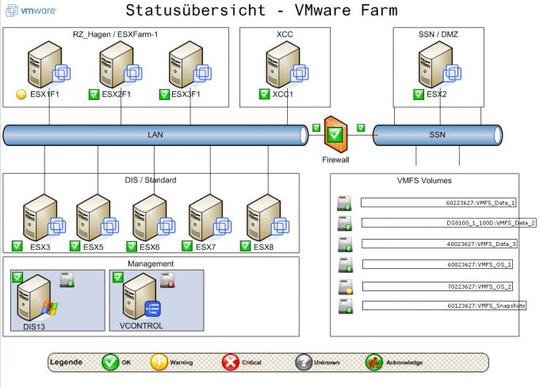](../../../_detail/addons/nagvis/nagvis_vmware.jpg@id=nagios%253Aaddons%253Anagvis%253Anagvis-manuel-utilisation.html "addons:nagvis:nagvis_vmware.jpg")

SOMMAIRE {#sommaire .sectionedit1}
--------

**[Accueil](../../../start.html "start")**

**[Supervision](../../../supervision/start.html "supervision:start")**

-   [Nagios](../../start.html "nagios:start")
-   [Centreon](../../../centreon/start.html "centreon:start")
-   [Shinken](../../../shinken/start.html "shinken:start")
-   [Zabbix](../../../zabbix/start.html "zabbix:start")
-   [OpenNMS](../../../opennms/start.html "opennms:start")
-   [EyesOfNetwork](../../../eyesofnetwork/start.html "eyesofnetwork:start")
-   [Groundwork](../../../groundwork/start.html "groundwork:start")
-   [Zenoss](../../../zenoss/start.html "zenoss:start")
-   [Vigilo](../../../vigilo/start.html "vigilo:start")
-   [Icinga](../../../icinga/start.html "icinga:start")
-   [Cacti](../../../cacti/start.html "cacti:start")
-   [Ressenti
    utilisateur](../../../supervision/eue/start.html "supervision:eue:start")
-   [Ressenti utilisateur avec
    sikuli](../../../sikuli/eue/start.html "sikuli:eue:start")

**[Hypervision](../../../hypervision/start.html "hypervision:start")**

-   [Canopsis](../../../canopsis/start.html "canopsis:start")

**[Sécurité](../../../securite/start.html "securite:start")**

**[Infrastructure](../../../infra/start.html "infra:start")**

**[Développement](../../../dev/start.html "dev:start")**

Nagios Addons {#nagios-addons .sectionedit1}
-------------

-   [Lilac
    Platform](../lilac-platform.html "nagios:addons:lilac-platform")
-   [Merlin](../../../addons/merlin.html "nagios:addons:merlin")
-   [NConf](../nconf.html "nagios:addons:nconf")
-   [NDOUtils](../ndoutils.html "nagios:addons:ndoutils")
-   [NSClient++](../nsclient.html "nagios:addons:nsclient")
-   [NagTrap](../../../addons/nagtrap.html "nagios:addons:nagtrap")
-   [NagVis](start.html "nagios:addons:nagvis:start")
-   [Nagios Business Process
    Addon](../nagios-business-process-addons.html "nagios:addons:nagios-business-process-addons")
-   [NagiosDigger](../nagiosdigger.html "nagios:addons:nagiosdigger")
-   [NagiosGrapher](../nagiosgrapher.html "nagios:addons:nagiosgrapher")
-   [NagiosQL](../nagiosql.html "nagios:addons:nagiosql")
-   [Netways Grapher
    V2](../netways-grapher-v2.html "nagios:addons:netways-grapher-v2")
-   [Ninja](../ninja.html "nagios:addons:ninja")
-   [PNP4Nagios](../pnp/start.html "nagios:addons:pnp:start")
-   [Protocole NRPE](../nrpe.html "nagios:addons:nrpe")
-   [Protocole NSCA](../nsca.html "nagios:addons:nsca")
-   [Setup distribué avec
    Mod\_Gearman](../mod_gearman.html "nagios:addons:mod_gearman")
-   [Vautour Style](../vautour-style.html "nagios:addons:vautour-style")
-   [check\_mk](../check_mk/start.html "nagios:addons:check_mk:start")
-   [omd Open Monitoring Distribution](../omd.html "nagios:addons:omd")

-   [Afficher le texte
    source](nagvis-manuel-utilisation@do=edit&rev=0.html "Afficher le texte source [V]")
-   [Anciennes
    révisions](nagvis-manuel-utilisation@do=revisions.html "Anciennes révisions [O]")
-   [Derniers
    changements](nagvis-manuel-utilisation@do=recent.html "Derniers changements [R]")
-   [Liens vers cette
    page](nagvis-manuel-utilisation@do=backlink.html "Liens vers cette page")
-   [Gestionnaire de
    médias](nagvis-manuel-utilisation@do=media.html "Gestionnaire de médias")
-   [Index](nagvis-manuel-utilisation@do=index.html "Index [X]")
-   [Connexion](nagvis-manuel-utilisation@do=login&sectok=6bca6bdf16f8880de3d6d3649db89a26.html "Connexion")
-   [Haut de
    page](nagvis-manuel-utilisation.html#dokuwiki__top "Haut de page [T]")

nagios/addons/nagvis/nagvis-manuel-utilisation.txt · Dernière
modification: 2013/03/29 09:39 (modification externe)

