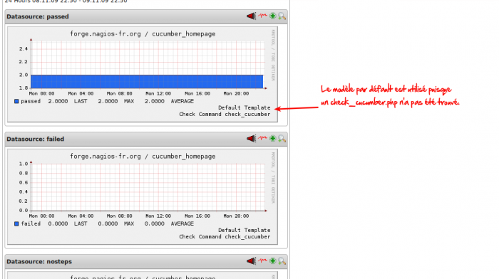
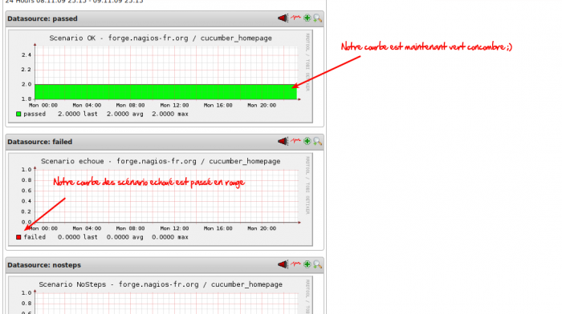
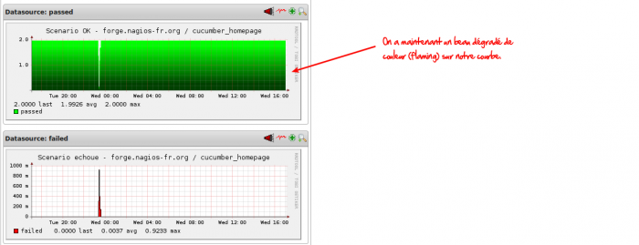
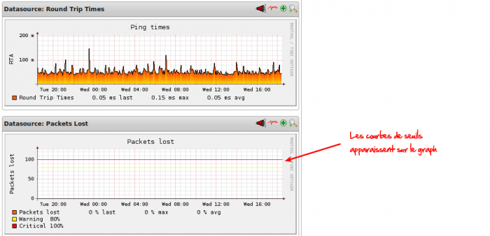
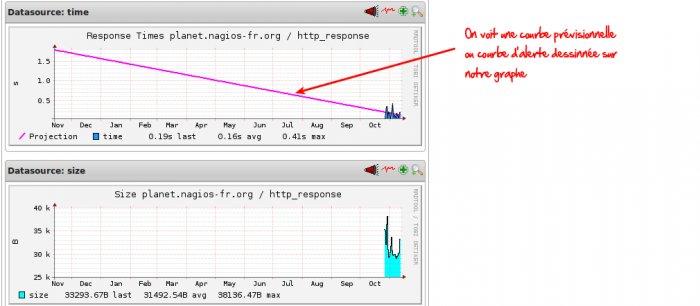

Dans cette page, nous allons expliquer :

-   Comment PNP procède pour réaliser ces modèles de courbes ?
-   Comment sait-il qu’il faut appliquer un modèle à un type de check
    Nagios ?
-   Comment créer son propre modèle et à quoi servent toutes les options
    ?

Mode de fonctionnement {#mode-de-fonctionnement .sectionedit2}
----------------------

Les modèles sont stockés à 2 endroits :

-   /usr/local/pnp4nagios/share/templates.dist → Il s’agit des modèles
    inclus avec PNP
-   /usr/local/pnp4nagios/share/templates → Il s’agit des modèles
    personnalisés (que vous allez créer)

Prenons un exemple pour mieux comprendre comment PNP arrive à lier un
check de Nagios à un modèle de graph

Si le graph du service http de l’hôte localhost devient visible, PNP
pourra alors explorer le fichier perfdata/localhost/http.xml et en lire
son contenu. Les fichiers XML sont créés automatiquement pour un hôte et
un service particulier. L’entête du fichier contient des informations
sur le plugin et les données de performance. Le tag XML \<TEMPLATE\>
permet à PNP d’identifier quel modèle (template) il doit utiliser.

Voici un exemple ci-dessous :

~~~
/localhost/http.xml

<NAGIOS>
  <DATASOURCE>
    <TEMPLATE>check_http</TEMPLATE>
    <DS>1</DS>
    <NAME>time</NAME>
    <UNIT>s</UNIT>
    <ACT>0.006721</ACT>
    <WARN>1.000000</WARN>
    <CRIT>2.000000</CRIT>
    <MIN>0.000000</MIN>
    <MAX></MAX>
  </DATASOURCE>
  <DATASOURCE>
    <TEMPLATE>check_http</TEMPLATE>
    <DS>2</DS>
    <NAME>size</NAME>
    <UNIT>B</UNIT>
    <ACT>263</ACT>
    <WARN></WARN>
    <CRIT></CRIT>
    <MIN>0</MIN>
    <MAX></MAX>
  </DATASOURCE>
...
</NAGIOS>
~~~

PNP examine si un modèle existe de la manière suivante :

1.  templates/check\_http.php
2.  templates.dist/check\_http.php
3.  templates/default.php
4.  templates.dist/default.php

Le modèle default.php est pris par défaut si les 2/3 première options
échoue.

Créer vos propres modèles {#creer-vos-propres-modeles .sectionedit3}
-------------------------

Les fichiers de modèles PNP sont en PHP et doivent respecter certaines
règles :

1.  Les modèles doivent contenir du code PHP valide.
2.  Les modèles ne doivent pas réaliser de sorties (echo, return, etc
    …).
3.  Les 2 tableaux \$opt[] et \$def[] doivent y apparaître.

Ces 2 tableaux sont nécessaire lors de l’exécution de la commande
‘rrdtool graph’ autant de fois que RRDtool peut le supporter. Toutes les
options de RRDtool sont détaillés sur la [Documentation du Site
Officiel](http://oss.oetiker.ch/rrdtool/doc/index.en.html "http://oss.oetiker.ch/rrdtool/doc/index.en.html").

Prenons pour exemple un modèle simple response.php. Nous allons vous
décrire les options les plus importantes.

~~~
<?php
#
$opt[1] = "--title \"Response Time For $hostname / $servicedesc\" ";
#
$def[1] =  "DEF:var1=$rrdfile:$DS[1]:AVERAGE " ;
$def[1] .= "AREA:var1#00FF00:\"Response Times \" " ;
$def[1] .= "LINE1:var1#000000 " ;
$def[1] .= "GPRINT:var1:LAST:\"%3.4lg %s$UNIT[1] LAST \" ";
$def[1] .= "GPRINT:var1:MAX:\"%3.4lg %s$UNIT[1] MAX \" ";
$def[1] .= "GPRINT:var1:AVERAGE:\"%3.4lg %s$UNIT[1] AVERAGE \" ";
?>
~~~

Note: le chiffre (1) et la lettre “L” se ressemble énormément: le format
”%3.4lg” contient des lettres minuscules.

**\$opt[1] = ”–title** … est l’option qui définit le titre du graphique.
Les variables \$hostname et \$servicedesc sont déterminés par l’appel de
PNP.

**\$def[1] = “DEF:var1=\$rrdfile:\$DS[1]:AVERAGE ”;** défini quel champ
du fichier RRD il va lire. \$rrdfile contient le chemin où se trouve le
fichier RRD de ce service. \$DS[1] correspond au premier champ du
fichier RRD.

**\$def[1] .= “AREA:var1\#00FF00:\\”Response Times \\” ”;** l’opérateur
”.=” va permettre l’écriture en “appends” de toutes les données
\$def[1]. Une aire (AREA) est ici dessinée avec les valeurs de **var1**.
La couleur Hexa-décimale \#00FF00 est choisi pour l’aire (red, green,
blue). La légende de la courbe a le nom “Response Times”.

**\$def[1] .= “LINE1:var1\#000000 ”;** en complément de l’aire (AREA)
dessinée, une ligne (LINE° de couleur noire (\#000000).

**\$def[1] .= “GPRINT:var1:LAST:\\”%3.4lg %s\$UNIT[1] LAST \\” ”;**

**\$def[1] .= “GPRINT:var1:MAX:\\”%3.4lg %s\$UNIT[1] MAX \\” ”;**

**\$def[1] .= “GPRINT:var1:AVERAGE:\\”%3.4lg %s\$UNIT[1] AVERAGE \\”
”;**

Les 3 lignes ci-dessus sont celles de la légende. Elle donne dans
l’ordre la dernière valeur récupérée (LAST), la valeur maximale atteinte
dans le laps de temps graphé (MAX) et la moyenne des valeurs du lap de
temps (AVERAGE).

Types de modèles {#types-de-modeles .sectionedit4}
----------------

**Tout au long de ce chapitre, je resterai sur des modèles avec le
strict minimum d’options qu’il faut pour créer un graph. Bien sûr, vous
pouvez pousser le vice en allant jusqu’à faire apparaître vos seuils de
WARNING et CRITICAL.**

**La magie avec RRDtool c’est que l’on peut customiser ses courbes à
volonté (dégradé de couleurs, courbes prévisionnelles en fonction des
dernières valeurs récupérées etc …).**

**Je parlerai un peu de tout ça après nos 3 exemples de modèles
simples.**

### Modèle simple {#modele-simple .sectionedit5}

Nous avons un service Cucumber Homepage qui fait appel au
check\_cucumber. Il n’y a pas de modèle pour cucumber. Donc nous avons
donc le modèle par défault.

Nous allons donc remédier à ça en créant un template simple pour
modifier la couleur de notre courbe. (car le concombre c’est vert).

Nous allons donc créer un check\_cucumber.php dans …share/templates/.
Nous sommes partis du check\_http et l’avons modifier en fonction de la
sortie de performance de check\_cucumber.

~~~
<?php
#
# Copyright (c) 2006-2008 Joerg Linge (http://www.pnp4nagios.org)
# Plugin: check_http
# $Id: check_http.php 367 2008-01-23 18:10:31Z pitchfork $
#
# Scenario OK
#
$opt[1] = "--vertical-label \"$UNIT[1]\" --title \"Scenario OK - $hostname / $servicedesc\" ";
#
#
#
$def[1] =  "DEF:var1=$RRDFILE[1]:$DS[1]:AVERAGE " ;
$def[1] .= "AREA:var1#07FA0A:\"$NAME[1] \" " ;
$def[1] .= "LINE1:var1#000000 " ;
$def[1] .= "GPRINT:var1:LAST:\"%3.4lf$UNIT[1] last\" " ;
$def[1] .= "GPRINT:var1:AVERAGE:\"%3.4lf$UNIT[1] avg\" " ;
$def[1] .= "GPRINT:var1:MAX:\"%3.4lf$UNIT[1] max\\n\" ";

#
# Scenario Echoue
#
$opt[2] = "--vertical-label \"$UNIT[2]\" --title \"Scenario echoue - $hostname / $servicedesc\" ";
#
#
#
$def[2] =  "DEF:var1=$RRDFILE[2]:$DS[2]:AVERAGE " ;
$def[2] .= "AREA:var1#FF0000:\"$NAME[2] \" " ;
$def[2] .= "LINE1:var1#000000 " ;
$def[2] .= "GPRINT:var1:LAST:\"%3.4lf$UNIT[2] last\" " ;
$def[2] .= "GPRINT:var1:AVERAGE:\"%3.4lf$UNIT[2] avg\" " ;
$def[2] .= "GPRINT:var1:MAX:\"%3.4lf$UNIT[2] max\\n\" ";

#
# Scenario NoSteps
#
$opt[3] = "--vertical-label \"$UNIT[3]\" --title \"Scenario NoSteps - $hostname / $servicedesc\" ";
#
#
#
$def[3] =  "DEF:var1=$RRDFILE[3]:$DS[3]:AVERAGE " ;
$def[3] .= "AREA:var1#FF00FF:\"$NAME[3] \" " ;
$def[3] .= "LINE1:var1#000000 " ;
$def[3] .= "GPRINT:var1:LAST:\"%3.4lf$UNIT[3] last\" " ;
$def[3] .= "GPRINT:var1:AVERAGE:\"%3.4lf$UNIT[3] avg\" " ;
$def[3] .= "GPRINT:var1:MAX:\"%3.4lf$UNIT[3] max\\n\" ";

#
# Scenario Total
#
$opt[4] = "--vertical-label \"$UNIT[4]\" --title \"Scenario Total - $hostname / $servicedesc\" ";
#
#
#
$def[4] =  "DEF:var1=$RRDFILE[4]:$DS[4]:AVERAGE " ;
$def[4] .= "AREA:var1#07FA0A:\"$NAME[4] \" " ;
$def[4] .= "LINE1:var1#000000 " ;
$def[4] .= "GPRINT:var1:LAST:\"%3.4lf$UNIT[4] last\" " ;
$def[4] .= "GPRINT:var1:AVERAGE:\"%3.4lf$UNIT[4] avg\" " ;
$def[4] .= "GPRINT:var1:MAX:\"%3.4lf$UNIT[4] max\\n\" ";

?>
~~~

**Quelques explications**

La sortie de performance de check\_cucumber possède 4 champs qui vont
être injecté dans le fichier RRD :

Les tableaux **\$opt[x]** et **\$def[x]** vont de 1 à 4 pour le nombre
de nos courbes (correspondant aux nombres de nos champs).

Et voilà le résultat.

### Modèle optimisé {#modele-optimise .sectionedit6}

Il fallait bien faire cette partie, car j’entends déjà le pro du codage
dire, mais c’est pas optimisé comme ça. Je vous rassure, il existe un
codage un peu plus complexe qui va vous permettre de ne pas avoir à
répéter la même chose plusieurs fois (ce qui peut être lourd sur
certains check comme check\_disk, etc …)

Je resterai sur notre check\_cucumber que je ferai évoluer selon les cas
qu’on abordera.

Mon modèle optimisé réside dans une boucle “for” qui va nous éviter de
répéter la même chose.

~~~
<?php
#
# Copyright (c) 2006-2008 Joerg Linge (http://www.pnp4nagios.org)
# Default Template used if no other template is found.
# Don`t delete this file !
# $Id: default.php 555 2008-11-16 16:35:59Z pitchfork $
#
# Template inspire du Default Template. Il est prevu pour optimiser
# le code pour la creation des graphs.
#
# AUTEUR : Romuald FRONTEAU

#
# Define some colors ..
#
$TAB_AREA  = array('#07FA0A','#FF0000','#FF00FF','#07FA0A');
$TAB_TITRE = array('Scenario OK','Scenario Echoue','Scenario NoSteps','Scenario Total');
$_LINE     = '#000000';
#
# Initial Logic ...
#

foreach ($this->DS as $CHAMP_RRD=>$VAL) {

        $opt[$CHAMP_RRD] = "--vertical-label \"Nombre de Scenario\" --title \"$TAB_TITRE[$CHAMP_RRD] - $hostname / $servicedesc\" ";
        $def[$CHAMP_RRD]  = "DEF:var1=".$VAL['RRDFILE'].":".$VAL['DS'].":AVERAGE ";
        $def[$CHAMP_RRD] .= "AREA:var1" . $TAB_AREA[$CHAMP_RRD] . ":\"".$VAL['NAME']."\" ";
        $def[$CHAMP_RRD] .= "LINE1:var1" . $_LINE . ":\"\" ";
        $def[$CHAMP_RRD] .= "GPRINT:var1:LAST:\"%3.4lf ".$VAL['UNIT']." LAST \" ";
        $def[$CHAMP_RRD] .= "GPRINT:var1:MAX:\"%3.4lf ".$VAL['UNIT']." MAX \" ";
        $def[$CHAMP_RRD] .= "GPRINT:var1:AVERAGE:\"%3.4lf ".$VAL['UNIT']." AVERAGE \\n\" ";
}
?>
~~~

Et voilà le résultat.

### Modèle condensé {#modele-condense .sectionedit7}

Ce que j’appelle le modèle condensé, c’est que au lieu que vos courbes
soit “splittés” sur plusieurs graphes, vous allez retrouver toutes vos
courbes sur un seul et même graphe.

~~~
<?php
#
# Copyright (c) 2006-2008 Joerg Linge (http://www.pnp4nagios.org)
# Default Template used if no other template is found.
# Don`t delete this file !
# $Id: default.php 555 2008-11-16 16:35:59Z pitchfork $
#
# AUTEUR : Romuald FRONTEAU

#
# Define some colors ..
#
$TAB_LINE  = array('#07FA0A','#FF0000','#FF00FF','#00FFFF');
$COMPTEUR =1;

$opt[$COMPTEUR] = "--vertical-label \"Nombre de Scenario\" --title \"Scenario - $hostname / $servicedesc\" ";

foreach ($this->DS as $CHAMP_RRD=>$VAL) {

        if ($COMPTEUR == "1") {
                $def[1]  = "DEF:var".$COMPTEUR."=".$VAL['RRDFILE'].":".$VAL['DS'].":AVERAGE ";
        }
        else {
                $def[1]  .= "DEF:var".$COMPTEUR."=".$VAL['RRDFILE'].":".$VAL['DS'].":AVERAGE ";
        }
        $def[1] .= "LINE2:var".$COMPTEUR.$TAB_LINE[$CHAMP_RRD] . ":\"".$VAL['NAME']."\" ";
        $def[1] .= "GPRINT:var".$COMPTEUR.":LAST:\"%3.4lf ".$VAL['UNIT']." LAST \" ";
        $def[1] .= "GPRINT:var".$COMPTEUR.":MAX:\"%3.4lf ".$VAL['UNIT']." MAX \" ";
        $def[1] .= "GPRINT:var".$COMPTEUR.":AVERAGE:\"%3.4lf ".$VAL['UNIT']." AVERAGE \\n\" ";
        $COMPTEUR = $COMPTEUR + 1;
}
?>
~~~

Et voilà le résultat :

Customisation des courbes {#customisation-des-courbes .sectionedit8}
-------------------------

### L'effet dégradé (Flaming) {#l-effet-degrade-flaming .sectionedit9}

L’effet dégradé n’a pas d’utilité en soi à part de rendre votre
métrologie plus belle à présenter. Nous allons rester sur du modèle
simple pour éviter de durcir la chose. Le principe est simple, il suffit
de créer une multitude d’aire (AREA) en fonction d’un pourcentage de
remplissage de courbe. Il faut commencer de la pointe à la base.

Le code pour pouvoir réaliser ce genre de petite merveille est le
suivant :

~~~
<?php
#
# Copyright (c) 2006-2008 Joerg Linge (http://www.pnp4nagios.org)
# Plugin: check_http
# $Id: check_http.php 367 2008-01-23 18:10:31Z pitchfork $
#
# Scenario OK
#
$opt[1] = "--vertical-label \"$UNIT[1]\" --title \"Scenario OK - $hostname / $servicedesc\" ";
#
#
#
$def[1] =  "DEF:var1=$RRDFILE[1]:$DS[1]:AVERAGE " ;
$def[1] .= "GPRINT:var1:LAST:\"%3.4lf$UNIT[1] last\" " ;
$def[1] .= "GPRINT:var1:AVERAGE:\"%3.4lf$UNIT[1] avg\" " ;
$def[1] .= "GPRINT:var1:MAX:\"%3.4lf$UNIT[1] max\\n\" ";
$def[1] .= "CDEF:g_color2=var1,0.98,* " ;
$def[1] .= "AREA:g_color2#00FF00:\"$NAME[1] \" " ;
$def[1] .= "CDEF:g_color10=var1,0.90,* " ;
$def[1] .= "AREA:g_color10#00FF00 " ;
$def[1] .= "CDEF:g_color15=var1,0.85,* " ;
$def[1] .= "AREA:g_color15#00F200 " ;
$def[1] .= "CDEF:g_color20=var1,0.80,* " ;
$def[1] .= "AREA:g_color20#00E500 " ;
$def[1] .= "CDEF:g_color25=var1,0.75,* " ;
$def[1] .= "AREA:g_color25#00D900 " ;
$def[1] .= "CDEF:g_color30=var1,0.70,* " ;
$def[1] .= "AREA:g_color30#00CC00 " ;
$def[1] .= "CDEF:g_color35=var1,0.65,* " ;
$def[1] .= "AREA:g_color35#00BF00 " ;
$def[1] .= "CDEF:g_color40=var1,0.60,* " ;
$def[1] .= "AREA:g_color40#00B200 " ;
$def[1] .= "CDEF:g_color45=var1,0.55,* " ;
$def[1] .= "AREA:g_color45#00A600 " ;
$def[1] .= "CDEF:g_color50=var1,0.50,* " ;
$def[1] .= "AREA:g_color50#009900 " ;
$def[1] .= "CDEF:g_color55=var1,0.45,* " ;
$def[1] .= "AREA:g_color55#008C00 " ;
$def[1] .= "CDEF:g_color60=var1,0.40,* " ;
$def[1] .= "AREA:g_color60#007F00 " ;
$def[1] .= "CDEF:g_color65=var1,0.35,* " ;
$def[1] .= "AREA:g_color65#007300 " ;
$def[1] .= "CDEF:g_color70=var1,0.30,* " ;
$def[1] .= "AREA:g_color70#006600 " ;
$def[1] .= "CDEF:g_color75=var1,0.25,* " ;
$def[1] .= "AREA:g_color75#005900 " ;
$def[1] .= "CDEF:g_color80=var1,0.20,* " ;
$def[1] .= "AREA:g_color80#004C00 " ;
$def[1] .= "CDEF:g_color85=var1,0.15,* " ;
$def[1] .= "AREA:g_color85#004000 " ;
?>
~~~

Je vous ai mis à disposition que le code de la première courbe pour des
soucis de longueur.

Et voici le résultat :

### Apparition des seuils {#apparition-des-seuils .sectionedit10}

L’apparition des seuils est possible avec les variables HRULE de
RRDtool. Nous prendrons un exemple déjà fourni par PNP le
check\_ping.php. On verra bien qu’il y a des conditions if pour faire
apparaître les HRULE Warning et critical.

-   **check\_ping.php**

~~~
<?php
#
# Copyright (c) 2006-2008 Joerg Linge (http://www.pnp4nagios.org)
# Plugin: check_icmp [Multigraph]
# $Id: check_ping.php 553 2008-11-07 21:33:50Z Le_Loup $
#
# RTA
#
$ds_name[1] = "Round Trip Times";
$opt[1]  = "--vertical-label \"RTA\"  --title \"Ping times\" ";
$def[1]  =  "DEF:var1=$RRDFILE[1]:$DS[1]:AVERAGE " ;
$def[1] .=  "CDEF:sp1=var1,100,/,12,* " ;
$def[1] .=  "CDEF:sp2=var1,100,/,30,* " ;
$def[1] .=  "CDEF:sp3=var1,100,/,50,* " ;
$def[1] .=  "CDEF:sp4=var1,100,/,70,* " ;

$def[1] .= "AREA:var1#FF5C00:\"Round Trip Times \" " ;
$def[1] .= "AREA:sp4#FF7C00: " ;
$def[1] .= "AREA:sp3#FF9C00: " ;
$def[1] .= "AREA:sp2#FFBC00: " ;
$def[1] .= "AREA:sp1#FFDC00: " ;

$def[1] .= "GPRINT:var1:LAST:\"%6.2lf $UNIT[1] last \" " ;
$def[1] .= "GPRINT:var1:MAX:\"%6.2lf $UNIT[1] max \" " ;
$def[1] .= "GPRINT:var1:AVERAGE:\"%6.2lf $UNIT[1] avg \\n\" " ;
$def[1] .= "LINE1:var1#000000:\"\" " ;
if($WARN[1] != ""){
        if($UNIT[1] == "%%"){ $UNIT[1] = "%"; };
        $def[1] .= "HRULE:".$WARN[1]."#FFFF00:\"Warning  ".$WARN[1].$UNIT[1]." \\n\" " ;
}
if($CRIT[1] != ""){
        if($UNIT[1] == "%%"){ $UNIT[1] = "%"; };
        $def[1] .= "HRULE:".$CRIT[1]."#FF0000:\"Critical ".$CRIT[1].$UNIT[1]." \\n\" " ;
}
#
# Packets Lost
$ds_name[2] = "Packets Lost";
$opt[2] = "--vertical-label \"Packets lost\" -l0 -u105 --title \"Packets lost\" ";

$def[2] = "DEF:var1=$RRDFILE[2]:$DS[2]:AVERAGE " ;
$def[2] .=  "CDEF:sp1=var1,100,/,12,* " ;
$def[2] .=  "CDEF:sp2=var1,100,/,30,* " ;
$def[2] .=  "CDEF:sp3=var1,100,/,50,* " ;
$def[2] .=  "CDEF:sp4=var1,100,/,70,* " ;

$def[2] .= "AREA:var1#FF5C00:\"Packets lost \" " ;
$def[2] .= "AREA:sp4#FF7C00: " ;
$def[2] .= "AREA:sp3#FF9C00: " ;
$def[2] .= "AREA:sp2#FFBC00: " ;
$def[2] .= "AREA:sp1#FFDC00: " ;

$def[2] .= "GPRINT:var1:LAST:\"%6.2lg $UNIT[2] last \" " ;
$def[2] .= "GPRINT:var1:MAX:\"%6.2lg $UNIT[2] max \" " ;
$def[2] .= "GPRINT:var1:AVERAGE:\"%6.2lg $UNIT[2] avg \\n\" " ;
$def[2] .= "LINE1:var1#000000: " ;
$def[2] .= "HRULE:100#000000:\"\" " ;
if($WARN[2] != ""){
        if($UNIT[2] == "%%"){ $UNIT[2] = "%"; };
        $def[2] .= "HRULE:".$WARN[2]."#FFFF00:\"Warning  ".$WARN[2].$UNIT[2]." \\n\" " ;
}
if($CRIT[2] != ""){
        if($UNIT[2] == "%%"){ $UNIT[2] = "%"; };
        $def[2] .= "HRULE:".$CRIT[2]."#FF0000:\"Critical ".$CRIT[2].$UNIT[2]." \\n\" " ;
}

?>
~~~

Et voilà le résultat :

### Courbe de projection {#courbe-de-projection .sectionedit11}

Cette courbe sert à donner une estimation (en fonction d’un calcul sur
une courbe) dans le temps de l’évolution de la courbe (peut être très
utile sur les courbes de disques ou de mémoire par exemple).

~~~
<?php
#
# Copyright (c) 2006-2008 Joerg Linge (http://www.pnp4nagios.org)
# Plugin: check_http_response
# $Id: check_http.php 367 2008-01-23 18:10:31Z pitchfork $
#
# Response Time
#
$opt[1] = "--vertical-label \"$UNIT[1]\" --title \"Response Times $hostname / $servicedesc\" --slope-mode";
#
#
#
$def[1] =  "DEF:var1=$RRDFILE[1]:$DS[1]:AVERAGE " ;
$def[1] .= "VDEF:slope=var1,LSLSLOPE " ;
$def[1] .= "VDEF:int=var1,LSLINT " ;
$def[1] .= "CDEF:proj=var1,POP,slope,COUNT,*,int,+ " ;
$def[1] .= "LINE2:proj#ff00ff:\"Projection \" " ;
$def[1] .= "AREA:var1#1E90FF:\"$NAME[1] \" " ;
$def[1] .= "LINE1:var1#000000 " ;
$def[1] .= "GPRINT:var1:LAST:\"%6.2lf$UNIT[1] last\" " ;
$def[1] .= "GPRINT:var1:AVERAGE:\"%6.2lf$UNIT[1] avg\" " ;
$def[1] .= "GPRINT:var1:MAX:\"%6.2lf$UNIT[1] max\\n\" ";
?>
~~~

Et voilà le résultat :

