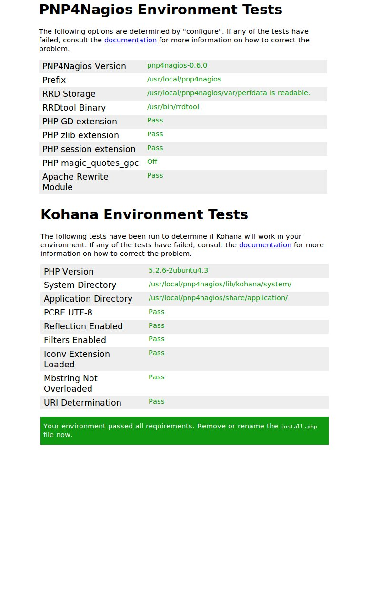

[[[PNP 0.6](pnp-0.6@do=backlink.html)]]

[wiki monitoring-fr.org](../../../start.html "[ALT+H]")

-   [Accueil](../../../index.html "Cliquez pour revenir |  l'accueil")
-   [Blog](http://www.monitoring-fr.org "Blog & News")
-   [Forums](http://forums.monitoring-fr.org "Forums")
-   [Doc](http://doc.monitoring-fr.org "Doc")
-   [Forge](https://github.com/monitoring-fr "Forge")

Vous êtes ici: [Accueil](../../../start.html "start") »
[Nagios](../../start.html "nagios:start") » [Nagios
Addons](../start.html "nagios:addons:start") »
[PNP4Nagios](start.html "nagios:addons:pnp:start") » [PNP
0.6](pnp-0.6.html "nagios:addons:pnp:pnp-0.6")

### Table des matières {.toggle}

-   [PNP 0.6](pnp-0.6.html#pnp-06)
    -   [Introduction](pnp-0.6.html#introduction)
    -   [Mode de déploiement](pnp-0.6.html#mode-de-deploiement)
    -   [Récupération des
        sources](pnp-0.6.html#recuperation-des-sources)
    -   [Constuction et
        installation](pnp-0.6.html#constuction-et-installation)
        -   [Prérequis](pnp-0.6.html#prerequis)
        -   [Configuration de PHP5](pnp-0.6.html#configuration-de-php5)
        -   [Activation du module rewrite de
            apache](pnp-0.6.html#activation-du-module-rewrite-de-apache)
        -   [Configuration de l'arbre des
            sources](pnp-0.6.html#configuration-de-l-arbre-des-sources)
        -   [Compilation](pnp-0.6.html#compilation)
        -   [Installation](pnp-0.6.html#installation)
        -   [Redémarrage de apache](pnp-0.6.html#redemarrage-de-apache)
        -   [Test de
            l'installation](pnp-0.6.html#test-de-l-installation)
        -   [Nettoyage de
            l'installation](pnp-0.6.html#nettoyage-de-l-installation)
    -   [Configuration](pnp-0.6.html#configuration)
        -   [Activer la traitement des données de peformance au niveau
            nagios](pnp-0.6.html#activer-la-traitement-des-donnees-de-peformance-au-niveau-nagios)
        -   [Configurer les données de performance de
            nagios](pnp-0.6.html#configurer-les-donnees-de-performance-de-nagios)
        -   [Configurer les commandes de traitement des données de
            performance](pnp-0.6.html#configurer-les-commandes-de-traitement-des-donnees-de-performance)
        -   [Création du modèle de service (template) pour prise en
            compte des données de
            performance](pnp-0.6.html#creation-du-modele-de-service-template-pour-prise-en-compte-des-donnees-de-performance)
        -   [Création du modèle d'hôte (template) pour prise en compte
            des données de
            performance](pnp-0.6.html#creation-du-modele-d-hote-template-pour-prise-en-compte-des-donnees-de-performance)
        -   [Activer les données de performance sur un
            hôte](pnp-0.6.html#activer-les-donnees-de-performance-sur-un-hote)
        -   [Activer les données de performance sur un
            service](pnp-0.6.html#activer-les-donnees-de-performance-sur-un-service)
        -   [Adapter les
            permission](pnp-0.6.html#adapter-les-permission)
        -   [Activer la configuration
            npcd](pnp-0.6.html#activer-la-configuration-npcd)
        -   [Redémarrer/Démarrer les
            services](pnp-0.6.html#redemarrerdemarrer-les-services)

PNP 0.6 {#pnp-06 .sectionedit1}
=======

Introduction {#introduction .sectionedit2}
------------

Le principal intérêt de cette nouvelle version 0.6 est que
l’installation est totalement séparée de l’installation de nagios (on ne
mélange plus les torchons et les serviettes). Ensuite l’outil est basé
sur le framework php
[kohana](http://www.kohanaphp.com/ "http://www.kohanaphp.com/")
(framework MVC dérivé de
[codeigniter](http://codeigniter.com/ "http://codeigniter.com/")), ce
qui laisse auguré des possibilités d’extension et de personnalisation
visuelle plus faciles (le V de MVC correspond à view et représente la
couche présentation de l’application. Il suffit simplement de retoucher
les vues pour personnaliser l’apparence de PNP). La personnalisation de
l’interface et donc maintenant à la portée de n’importe quel intégrateur
HTML.

L’ajout d’un “panier” de graphiques permet maintenant de mettre en
regard plusieurs graphes pour corréler les informations de métrologie
(pratique pour mettre en évidence que la surcharge de bande passante
d’un routeur vient bien de tel ou tel serveur).

Un moteur de recherche (avec complétion via une fonctionnalité ajax)
permet de sélectionner les hôtes bien plus facilement.

Mode de déploiement {#mode-de-deploiement .sectionedit3}
-------------------

Ce tutoriel est basé sur une installation “fraîche” de ubuntu 8.0.4 LTS
(option LAMP et SSH SERVER sélectionnées en fin d’installation), de
nagios et nagios-plugins conforme au tutoriel disponible pour ubuntu
dans le wiki nagios-fr. A ce titre, nagios est installé dans
/usr/local/nagios. Pour le stockage des sources et la construction, je
me base sur le layout suivant :

-   /home/system ⇒ repertoire home
-   /home/system/src ⇒ stockage des archives tar.gz
-   /home/system/build ⇒ extraction des archives et construction
-   /usr/local/nagios ⇒ chemin d’installation de nagios

Nous partirons sur le mode bulk avec npcd pour le traitement des données
de performance. Ce mode permettant de traiter de grandes quantité de
données de performance sans augmenter la latence de traitement de
l’ordonnanceur de supervision nagios. Nagios ne fait que stocker les
données de performances dans des fichiers et le démon npcd s’occupe de
traiter ces fichiers pour générer les rrd. La configuration est un peu
plus complexe mais on y gagne systématiquement.

Récupération des sources {#recuperation-des-sources .sectionedit4}
------------------------

~~~~ {.code}
cd /home/system/src
wget http://downloads.sourceforge.net/project/pnp4nagios/PNP-0.6/pnp4nagios-0.6.0.tar.gz?use_mirror=freefr
cd ../build
tar zxvf ../src/pnp4nagios-0.6.0.tar.gz
cd pnp4nagios-0.6.0
~~~~

Constuction et installation {#constuction-et-installation .sectionedit5}
---------------------------

### Prérequis {#prerequis .sectionedit6}

~~~~ {.code}
sudo apt-get install rrdtool librrds-perl php5-gd 
~~~~

### Configuration de PHP5 {#configuration-de-php5 .sectionedit7}

-   Editer le fichier /etc/php5
-   Modifier la directive magic\_quotes\_gpc = Off

### Activation du module rewrite de apache {#activation-du-module-rewrite-de-apache .sectionedit8}

~~~~ {.code}
sudo a2enmod rewrite
~~~~

### Configuration de l'arbre des sources {#configuration-de-l-arbre-des-sources .sectionedit9}

~~~~ {.code}
./configure --prefix=/usr/local/pnp4nagios --with-nagios-user=nagios --with-nagios-group=nagios
~~~~

### Compilation {#compilation .sectionedit10}

~~~~ {.code}
make all
~~~~

### Installation {#installation .sectionedit11}

~~~~ {.code}
sudo make install
sudo make install-webconf
sudo make install-config
sudo make install-init  
~~~~

### Redémarrage de apache {#redemarrage-de-apache .sectionedit12}

~~~~ {.code}
sudo /etc/init.d/apache2 reload
~~~~

### Test de l'installation {#test-de-l-installation .sectionedit13}

-   Utilisez votre navigateur préféré pour vérifier l’installation de
    pnp et du framework kohana
-   [http://192.168.1.114/pnp4nagios/](http://192.168.1.114/pnp4nagios/ "http://192.168.1.114/pnp4nagios/")

### Nettoyage de l'installation {#nettoyage-de-l-installation .sectionedit14}

-   Supprimmer le fichier /usr/local/pnp4nagios/share/install.php

Configuration {#configuration .sectionedit15}
-------------

### Activer la traitement des données de peformance au niveau nagios {#activer-la-traitement-des-donnees-de-peformance-au-niveau-nagios .sectionedit16}

-   Editer le fichier /usr/local/nagios/etc/nagios.cfg
-   rechercher la directive de configuration process\_performance\_data
    et la positionner à 1 ( process\_performance\_data=1 )

### Configurer les données de performance de nagios {#configurer-les-donnees-de-performance-de-nagios .sectionedit17}

-   Editer le fichier /usr/local/nagios/etc/nagios.cfg
-   Ajouter les lignes suivantes (par exemple en fin de fichier)

~~~~ {.code}
#
# service performance data
#
service_perfdata_file=/usr/local/pnp4nagios/var/service-perfdata
service_perfdata_file_template=DATATYPE::SERVICEPERFDATA\tTIMET::$TIMET$\tHOSTNAME::$HOSTNAME$\tSERVICEDESC::$SERVICEDESC$\tSERVICEPERFDATA::$SERVICEPERFDATA$\tSERVICECHECKCOMMAND::$SERVICECHECKCOMMAND$\tHOSTSTATE::$HOSTSTATE$\tHOSTSTATETYPE::$HOSTSTATETYPE$\tSERVICESTATE::$SERVICESTATE$\tSERVICESTATETYPE::$SERVICESTATETYPE$
service_perfdata_file_mode=a
service_perfdata_file_processing_interval=15
service_perfdata_file_processing_command=process-service-perfdata-file

#
# host performance data starting with Nagios 3.0
# 
host_perfdata_file=/usr/local/pnp4nagios/var/host-perfdata
host_perfdata_file_template=DATATYPE::HOSTPERFDATA\tTIMET::$TIMET$\tHOSTNAME::$HOSTNAME$\tHOSTPERFDATA::$HOSTPERFDATA$\tHOSTCHECKCOMMAND::$HOSTCHECKCOMMAND$\tHOSTSTATE::$HOSTSTATE$\tHOSTSTATETYPE::$HOSTSTATETYPE$
host_perfdata_file_mode=a
host_perfdata_file_processing_interval=15
host_perfdata_file_processing_command=process-host-perfdata-file
~~~~

### Configurer les commandes de traitement des données de performance {#configurer-les-commandes-de-traitement-des-donnees-de-performance .sectionedit18}

-   Editer un fichier de configuration (par exemple
    /usr/local/nagios/etc/pnp-commands.cfg)
-   Ajouter les lignes suivantes dans ce fichier

~~~~ {.code}
define command{
       command_name    process-service-perfdata-file
       command_line    /bin/mv /usr/local/pnp4nagios/var/service-perfdata /usr/local/pnp4nagios/var/spool/service-perfdata.$TIMET$
}

define command{
       command_name    process-host-perfdata-file
       command_line    /bin/mv /usr/local/pnp4nagios/var/host-perfdata /usr/local/pnp4nagios/var/spool/host-perfdata.$TIMET$
}
~~~~

### Création du modèle de service (template) pour prise en compte des données de performance {#creation-du-modele-de-service-template-pour-prise-en-compte-des-donnees-de-performance .sectionedit19}

-   Editer un fichier de configuration pour le modèle de service (par
    exemple /usr/local/nagios/etc/pnp-service-template.cfg)
-   Ajouter les lignes suivantes :

~~~~ {.code}
define service {
   name       srv-pnp
   process_perf_data  1
   action_url /pnp4nagios/graph?host=$HOSTNAME$&srv=$SERVICEDESC$' target='main' class='tips' rel='/pnp4nagios/popup?host=$HOSTNAME$&srv=$SERVICEDESC$
   register   0
}
~~~~

### Création du modèle d'hôte (template) pour prise en compte des données de performance {#creation-du-modele-d-hote-template-pour-prise-en-compte-des-donnees-de-performance .sectionedit20}

-   Editer un fichier de configuration pour le modèle de service (par
    exemple /usr/local/nagios/etc/pnp-host-template.cfg)
-   Ajouter les lignes suivantes :

~~~~ {.code}
define host {
   name       host-pnp
   process_perf_data  1
   action_url /pnp4nagios/graph?host=$HOSTNAME$&srv=_HOST_' target='main' class='tips' rel='/pnp4nagios/popup?host=$HOSTNAME$&srv=_HOST_
   register   0
}
~~~~

### Activer les données de performance sur un hôte {#activer-les-donnees-de-performance-sur-un-hote .sectionedit21}

-   Editer la configuration d’un hôte puis ajouter use host-pnp dans la
    définition de l’hôte

par exemple :

~~~~ {.code}
define host{
        use                     linux-server,host-pnp
        host_name               localhost
        alias                   localhost
        address                 127.0.0.1
        }
~~~~

### Activer les données de performance sur un service {#activer-les-donnees-de-performance-sur-un-service .sectionedit22}

-   Editer le fichier de configuration d’un service et ajouter use
    srv-pnp dans la définition du service

par exemple :

~~~~ {.code}
define service{
        use                             local-service,srv-pnp
        host_name                       localhost
        service_description             PING
        check_command                   check_ping!100.0,20%!500.0,60%
        }
~~~~

### Adapter les permission {#adapter-les-permission .sectionedit23}

~~~~ {.code}
sudo chown -R nagios:nagios /usr/local/nagios/etc
~~~~

**Astuce :** \
 Personnellement afin de référencer les fichiers de configurations dans
Nagios je préfère créer un répertoire conf.d sous /usr/local/nagios/etc
et rajouter une directive **cfg\_dir=/usr/local/nagios/etc/conf.d** dans
le fichier nagios.cfg. De cette manière tous mes fichiers de
configuration situés dans ce répertoire sont pris en compte par Nagios.

### Activer la configuration npcd {#activer-la-configuration-npcd .sectionedit24}

~~~~ {.code}
sudo cp npcd.cfg-sample npcd.cfg
~~~~

### Redémarrer/Démarrer les services {#redemarrerdemarrer-les-services .sectionedit25}

~~~~ {.code}
/etc/init.d/npcd start
/etc/init.d/nagios restart
/etc/init.d/apache2 restart
~~~~

SOMMAIRE {#sommaire .sectionedit1}
--------

**[Accueil](../../../start.html "start")**

**[Supervision](../../../supervision/start.html "supervision:start")**

-   [Nagios](../../start.html "nagios:start")
-   [Centreon](../../../centreon/start.html "centreon:start")
-   [Shinken](../../../shinken/start.html "shinken:start")
-   [Zabbix](../../../zabbix/start.html "zabbix:start")
-   [OpenNMS](../../../opennms/start.html "opennms:start")
-   [EyesOfNetwork](../../../eyesofnetwork/start.html "eyesofnetwork:start")
-   [Groundwork](../../../groundwork/start.html "groundwork:start")
-   [Zenoss](../../../zenoss/start.html "zenoss:start")
-   [Vigilo](../../../vigilo/start.html "vigilo:start")
-   [Icinga](../../../icinga/start.html "icinga:start")
-   [Cacti](../../../cacti/start.html "cacti:start")
-   [Ressenti
    utilisateur](../../../supervision/eue/start.html "supervision:eue:start")
-   [Ressenti utilisateur avec
    sikuli](../../../sikuli/eue/start.html "sikuli:eue:start")

**[Hypervision](../../../hypervision/start.html "hypervision:start")**

-   [Canopsis](../../../canopsis/start.html "canopsis:start")

**[Sécurité](../../../securite/start.html "securite:start")**

**[Infrastructure](../../../infra/start.html "infra:start")**

**[Développement](../../../dev/start.html "dev:start")**

Nagios Addons {#nagios-addons .sectionedit1}
-------------

-   [Lilac
    Platform](../lilac-platform.html "nagios:addons:lilac-platform")
-   [Merlin](../../../addons/merlin.html "nagios:addons:merlin")
-   [NConf](../nconf.html "nagios:addons:nconf")
-   [NDOUtils](../ndoutils.html "nagios:addons:ndoutils")
-   [NSClient++](../nsclient.html "nagios:addons:nsclient")
-   [NagTrap](../../../addons/nagtrap.html "nagios:addons:nagtrap")
-   [NagVis](../nagvis/start.html "nagios:addons:nagvis:start")
-   [Nagios Business Process
    Addon](../nagios-business-process-addons.html "nagios:addons:nagios-business-process-addons")
-   [NagiosDigger](../nagiosdigger.html "nagios:addons:nagiosdigger")
-   [NagiosGrapher](../nagiosgrapher.html "nagios:addons:nagiosgrapher")
-   [NagiosQL](../nagiosql.html "nagios:addons:nagiosql")
-   [Netways Grapher
    V2](../netways-grapher-v2.html "nagios:addons:netways-grapher-v2")
-   [Ninja](../ninja.html "nagios:addons:ninja")
-   [PNP4Nagios](start.html "nagios:addons:pnp:start")
-   [Protocole NRPE](../nrpe.html "nagios:addons:nrpe")
-   [Protocole NSCA](../nsca.html "nagios:addons:nsca")
-   [Setup distribué avec
    Mod\_Gearman](../mod_gearman.html "nagios:addons:mod_gearman")
-   [Vautour Style](../vautour-style.html "nagios:addons:vautour-style")
-   [check\_mk](../check_mk/start.html "nagios:addons:check_mk:start")
-   [omd Open Monitoring Distribution](../omd.html "nagios:addons:omd")

-   [Afficher le texte
    source](pnp-0.6@do=edit&rev=0.html "Afficher le texte source [V]")
-   [Anciennes
    révisions](pnp-0.6@do=revisions.html "Anciennes révisions [O]")
-   [Derniers
    changements](pnp-0.6@do=recent.html "Derniers changements [R]")
-   [Liens vers cette
    page](pnp-0.6@do=backlink.html "Liens vers cette page")
-   [Gestionnaire de
    médias](pnp-0.6@do=media.html "Gestionnaire de médias")
-   [Index](pnp-0.6@do=index.html "Index [X]")
-   [Connexion](pnp-0.6@do=login&sectok=6bca6bdf16f8880de3d6d3649db89a26.html "Connexion")
-   [Haut de page](pnp-0.6.html#dokuwiki__top "Haut de page [T]")

nagios/addons/pnp/pnp-0.6.txt · Dernière modification: 2013/03/29 09:39
(modification externe)

