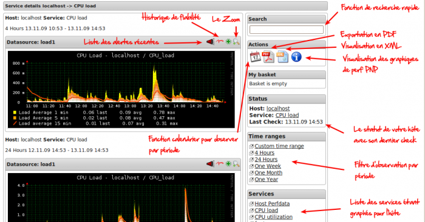

L’interface de la version 0.6 de PNP a été entièrement revue vers un
framework kohana. Une interface plus classe s’offre à nous et de jolis
templates de courbes y sont inclus et rendre le produit encore plus
beau.

Regardez par vous même avec la capture explicative ci-dessous :

