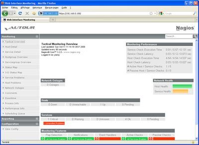

[[[Vautour Style](vautour-style@do=backlink.html)]]

[wiki monitoring-fr.org](../../start.html "[ALT+H]")

-   [Accueil](../../index.html "Cliquez pour revenir |  l'accueil")
-   [Blog](http://www.monitoring-fr.org "Blog & News")
-   [Forums](http://forums.monitoring-fr.org "Forums")
-   [Doc](http://doc.monitoring-fr.org "Doc")
-   [Forge](https://github.com/monitoring-fr "Forge")

Vous êtes ici: [Accueil](../../start.html "start") »
[Nagios](../start.html "nagios:start") » [Nagios
Addons](start.html "nagios:addons:start") » [Vautour
Style](vautour-style.html "nagios:addons:vautour-style")

### Table des matières {.toggle}

-   [Vautour Style](vautour-style.html#vautour-style)
    -   [Aperçu](vautour-style.html#apercu)
    -   [Installation](vautour-style.html#installation)

Vautour Style {#vautour-style .sectionedit1}
=============

[Vautour
Style](http://www.be-root.com/2009/03/01/nagios-vautour-style/ "http://www.be-root.com/2009/03/01/nagios-vautour-style/")
est un thème pour Nagios 3.x créé par Yoann LAMY. Les feuilles de styles
et les icônes initiaux ont été modifiés pour offrir une présentation
différente de l’interface Web de Nagios. Vautour Style s’appuie sur le
framework javascript
[MooTools](http://mootools.net/ "http://mootools.net/") et les icônes
[Silk icon
set](http://www.famfamfam.com/lab/icons/silk/ "http://www.famfamfam.com/lab/icons/silk/")
de Mark James.

Aperçu {#apercu .sectionedit2}
------

L’auteur a choisi des tons neutres pour convenir au plus grand nombre
d’entre vous.

Installation {#installation .sectionedit3}
------------

L’installation consiste à extraire le fichier ZIP dans le répertoire
contenant les pages Web de Nagios pour remplacer les fichiers existants.

~~~~ {.code}
unzip vautour_style.zip -d /usr/local/nagios/share/
~~~~

Il vous faudra certainement vider le cache de votre navigateur Web pour
afficher correctement la nouvelle interface.

SOMMAIRE {#sommaire .sectionedit1}
--------

**[Accueil](../../start.html "start")**

**[Supervision](../../supervision/start.html "supervision:start")**

-   [Nagios](../start.html "nagios:start")
-   [Centreon](../../centreon/start.html "centreon:start")
-   [Shinken](../../shinken/start.html "shinken:start")
-   [Zabbix](../../zabbix/start.html "zabbix:start")
-   [OpenNMS](../../opennms/start.html "opennms:start")
-   [EyesOfNetwork](../../eyesofnetwork/start.html "eyesofnetwork:start")
-   [Groundwork](../../groundwork/start.html "groundwork:start")
-   [Zenoss](../../zenoss/start.html "zenoss:start")
-   [Vigilo](../../vigilo/start.html "vigilo:start")
-   [Icinga](../../icinga/start.html "icinga:start")
-   [Cacti](../../cacti/start.html "cacti:start")
-   [Ressenti
    utilisateur](../../supervision/eue/start.html "supervision:eue:start")
-   [Ressenti utilisateur avec
    sikuli](../../sikuli/eue/start.html "sikuli:eue:start")

**[Hypervision](../../hypervision/start.html "hypervision:start")**

-   [Canopsis](../../canopsis/start.html "canopsis:start")

**[Sécurité](../../securite/start.html "securite:start")**

**[Infrastructure](../../infra/start.html "infra:start")**

**[Développement](../../dev/start.html "dev:start")**

Nagios Addons {#nagios-addons .sectionedit1}
-------------

-   [Lilac Platform](lilac-platform.html "nagios:addons:lilac-platform")
-   [Merlin](../../addons/merlin.html "nagios:addons:merlin")
-   [NConf](nconf.html "nagios:addons:nconf")
-   [NDOUtils](ndoutils.html "nagios:addons:ndoutils")
-   [NSClient++](nsclient.html "nagios:addons:nsclient")
-   [NagTrap](../../addons/nagtrap.html "nagios:addons:nagtrap")
-   [NagVis](nagvis/start.html "nagios:addons:nagvis:start")
-   [Nagios Business Process
    Addon](nagios-business-process-addons.html "nagios:addons:nagios-business-process-addons")
-   [NagiosDigger](nagiosdigger.html "nagios:addons:nagiosdigger")
-   [NagiosGrapher](nagiosgrapher.html "nagios:addons:nagiosgrapher")
-   [NagiosQL](nagiosql.html "nagios:addons:nagiosql")
-   [Netways Grapher
    V2](netways-grapher-v2.html "nagios:addons:netways-grapher-v2")
-   [Ninja](ninja.html "nagios:addons:ninja")
-   [PNP4Nagios](pnp/start.html "nagios:addons:pnp:start")
-   [Protocole NRPE](nrpe.html "nagios:addons:nrpe")
-   [Protocole NSCA](nsca.html "nagios:addons:nsca")
-   [Setup distribué avec
    Mod\_Gearman](mod_gearman.html "nagios:addons:mod_gearman")
-   [Vautour Style](vautour-style.html "nagios:addons:vautour-style")
-   [check\_mk](check_mk/start.html "nagios:addons:check_mk:start")
-   [omd Open Monitoring Distribution](omd.html "nagios:addons:omd")

-   [Afficher le texte
    source](vautour-style@do=edit&rev=0.html "Afficher le texte source [V]")
-   [Anciennes
    révisions](vautour-style@do=revisions.html "Anciennes révisions [O]")
-   [Derniers
    changements](vautour-style@do=recent.html "Derniers changements [R]")
-   [Liens vers cette
    page](vautour-style@do=backlink.html "Liens vers cette page")
-   [Gestionnaire de
    médias](vautour-style@do=media.html "Gestionnaire de médias")
-   [Index](vautour-style@do=index.html "Index [X]")
-   [Connexion](vautour-style@do=login&sectok=6bca6bdf16f8880de3d6d3649db89a26.html "Connexion")
-   [Haut de page](vautour-style.html#dokuwiki__top "Haut de page [T]")

nagios/addons/vautour-style.txt · Dernière modification: 2013/03/29
09:39 (modification externe)

