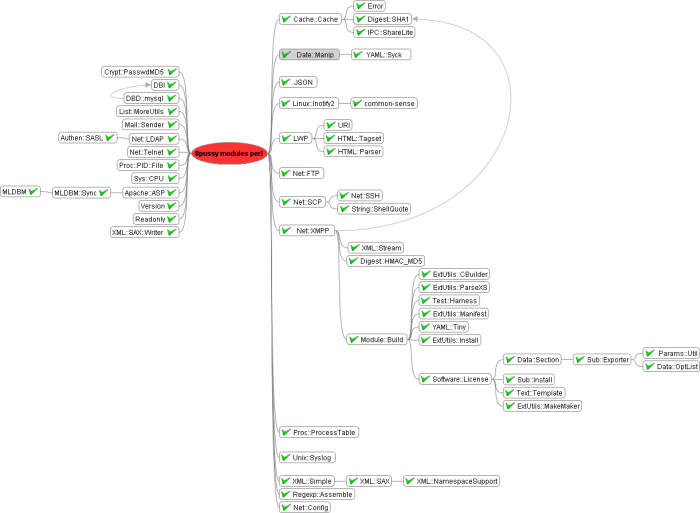
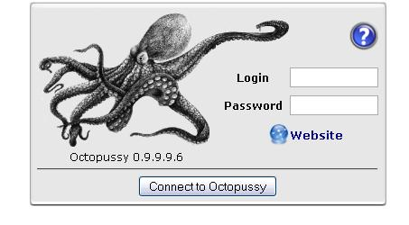
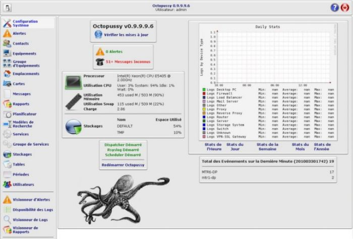
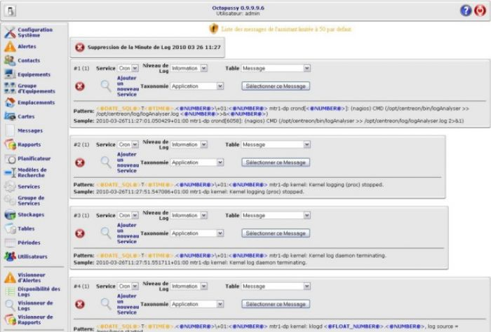

[[[Octopussy](8pussy@do=backlink.html)]]

[wiki monitoring-fr.org](../../start.html "[ALT+H]")

-   [Accueil](../../index.html "Cliquez pour revenir |  l'accueil")
-   [Blog](http://www.monitoring-fr.org "Blog & News")
-   [Forums](http://forums.monitoring-fr.org "Forums")
-   [Doc](http://doc.monitoring-fr.org "Doc")
-   [Forge](https://github.com/monitoring-fr "Forge")

Vous êtes ici: [Accueil](../../start.html "start") »
[Nagios](../start.html "nagios:start") » [Nagios
Integration](start.html "nagios:integration:start") »
[Octopussy](8pussy.html "nagios:integration:8pussy")

### Table des matières {.toggle}

-   [Octopussy](8pussy.html#octopussy)
    -   [Pré-requis](8pussy.html#pre-requis)
    -   [Installation Octopussy sur RedHat
        5.2](8pussy.html#installation-octopussy-sur-redhat-52)

Octopussy {#octopussy .sectionedit1}
---------

Pour les débutants, je recommande d’installer Octopussy sur une
plateforme Debian-like pour l’unique raison que le développeur fourni un
paquet .deb à disposition ce qui vous fera gagner beaucoup de temps.

Il est aussi conseillé d’avoir une machine qui “tient la route”. En
effet, Octopussy est assez gourmand en RAM, et on ajoutera à cela le
fait qu’il lance un process par machine surveillée. Un minimum d’1go de
RAM est donc plus que vivement conseillé !!!

[8pussy](http://www.8pussy.org "http://www.8pussy.org") (Octopussy) est
une application dédiée au traitement des journaux capable d’analyser,
d’alerter et de rendre des statistiques sur les événements qui y sont
contenus. 8Pussy est capable d’analyser, entre autres, les journaux des
services suivants : Bind, Cisco Router, Cisco Switch, DenyAll Reverse
Proxy, Drbd, F5 BigIP, Fortinet FW, Ironport MailServer, Linux
Kernel/System, Linux IPTables, Monit, MySQL, Nagios, NetApp NetCache,
Juniper Netscreen FW, Juniper Netscreen NSM, Postfix, PostgreSQL,
Samhain, Snmpd, Squid, Sshd, Syslogng, Windows Snare Agent, Xen. Il
s’appuie sur le logiciel rsyslog.

Cela en fait donc un logiciel capable de traiter tous les niveaux du
système d’informations, réseaux comme applicatifs. Son intérêt réside
pour nous dans sa possibilité d’alerter soit par email, soit par
messagerie de type jabber mais aussi et surtout via send\_nsca. Il est
donc possible d’intercaler 8pussy entre le démon du protocole syslog et
Nagios, permettant une meilleure qualification des événements à remonter
à Nagios. Il existe aussi un plugin check\_octopussy.pl.

Ce tutoriel a été réalisé par :

  **Rôle**        **Nom**
  --------------- -----------------
  **Rédacteur**   Sylvain MILLOUR

### Pré-requis {#pre-requis .sectionedit3}

Vous allez comprendre pourquoi j’ai conseillé aux débutants de
s’orienter vers du Debian-like. Voici la liste des pré-requis pour le
bon fonctionnement d’Octopussy.

-   Httpd
-   Apache::ASP
-   Perl
-   Mod\_Perl
-   MySQL
-   Nscd
-   RRDTool & librrd0
-   Rsyslog
-   htmldoc
-   sudo

et les modules perl suivants :

-   Cache::Cache
-   Crypt::PasswdMD5
-   Date::Manip
-   DBI (with DBD::mysql)
-   JSON
-   Linux::Inotify2
-   List::MoreUtils
-   LWP
-   Mail::Sender
-   Net::FTP
-   Net::LDAP
-   Net::SCP
-   Net::Telnet
-   Net::XMPP
-   Proc::PID::File
-   Proc::ProcessTable
-   Sys::CPU
-   Unix::Syslog
-   URI
-   XML::Simple

Voici un arbre des dépendances de modules PERL nécessaires pour la
validation des pré-requis :

### Installation Octopussy sur RedHat 5.2 {#installation-octopussy-sur-redhat-52 .sectionedit4}

ATTENTION : comme dit précédemment, Octopussy est à l’origine fait pour
être installé sur Debian. Le portage de l’installation sur une RedHat
5.2 va nécessiter de mettre les mains dans le cambouis ! Si vous
réussissez, vous pourrez vous vanter d’être un peu “barbu” !

Nous allons travailler avec la dernière archive tar.gz Octopussy sortie
à ce jour, à savoir la version 0.9.9.9.6 Je pars donc du principe que
vous l’avez récupérée et décompressée.

-   **Le contexte**

Il m’a été demandé d’installer un serveur Octopussy dans un contexte
clientèle. Chez ce client, les seuls plateformes disponibles étaient des
RedHat 5.2 EL. Arghhhh, Octopussy a été conçu à l’origine pour tourner
sur du Debian. Mais votre serviteur ne s’est pas démonté pour autant, il
s’est dit : “En voilà un défis intéressant à relever !” Et pour faire
bien les choses (pour ajouter un côté sport à tout ça), sachez que ce
serveur ne possède pas d’accès à Internet ! Et ben bonjour la galère
pour les modules Perl et leurs dépendances sans CPAN ! Enfin bref, me
voilà en mode garagiste, à devoir mettre les mains dans les viscères de
la pieuvre ….

\* **Et le premier problème …**

Afin de faire une installation “propre”, j’aurais souhaité installé
Octopussy (et tous ses composants) dans /opt par exemple. Mais après
avoir étudié les différents fichiers, cela s’est avéré impossible !
(bon, en réalité ça doit être possible, du moins si vous avez envie de
vous éditer tous les fichiers pour modifier les chemins écrits en dur !)
Je réaliserai donc une installation dans l’arborescence par défaut
d’Octopussy !

Toutes les manipulations seront réalisées avec le compte root !

Préchauffez vos doigts, et on se lance ….

-   **Création de l’utilisateur et du groupe Octopussy**

~~~
/usr/sbin/groupadd octopussy
/usr/sbin/adduser -M -r -s /sbin/nologin -g octopussy octopussy
/usr/bin/passwd -f -u octopussy
~~~

-   **Création de l’arborescence**

~~~
/bin/mkdir -p /etc/aat/
/bin/mkdir -p /etc/octopussy/
/bin/mkdir -p /usr/share/aat/
/bin/mkdir -p /usr/share/octopussy/
/bin/mkdir -p /usr/share/perl5/AAT/
/bin/mkdir -p /usr/share/perl5/Octopussy/
/bin/mkdir -p /var/cache/octopussy/asp/
/bin/mkdir -p /var/lib/octopussy/
/bin/mkdir -p /var/lib/octopussy/logs/
/bin/mkdir -p /var/lib/octopussy/rrd/
/bin/mkdir -p /var/lock/httpd/
/bin/mkdir -p /var/run/aat/
/bin/mkdir -p /var/run/octopussy/
/bin/mkdir -p /var/spool/octopussy/
~~~

-   **Sauvegarde du fichier rsyslog.conf existant**

~~~
/bin/mv /etc/rsyslog.conf /etc/rsyslog.ORIG
~~~

-   **Copie des fichiers d’Octopussy vers leur destination**

~~~
/bin/cp -f -r etc/aat/* /etc/aat/
/bin/cp -f -r etc/octopussy/* /etc/octopussy/
/bin/cp -f -r etc/rsyslog.d/octopussy.conf /etc/rsyslog.conf
/bin/cp -f -r usr/sbin/* /usr/sbin/
/bin/cp -f -r usr/share/aat/* /usr/share/aat/
/bin/cp -f -r usr/share/octopussy/* /usr/share/octopussy/
/bin/cp -f -r usr/share/perl5/* /usr/share/perl5/
/bin/cp -f -r usr/share/perl5/* /usr/lib/perl5/5.8.8/
/bin/cp -f -r var/lib/octopussy/* /var/lib/octopussy/
~~~

-   **Création de quelques répertoires dans l’arborescence d’Octopussy**

~~~
/bin/mkdir -p /var/lib/octopussy/conf/devices/
/bin/mkdir -p /var/lib/octopussy/conf/contacts/
/bin/mkdir -p /var/lib/octopussy/conf/alerts/
/bin/mkdir -p /var/lib/octopussy/conf/maps/
/bin/mkdir -p /usr/share/octopussy/rrd/
~~~

-   **Création d’un lien symbolique AAT dans /usr/share/octopussy**

~~~
/bin/ln -f -s /usr/share/aat /usr/share/octopussy/AAT
~~~

-   **Création de la FIFO**

~~~
/usr/bin/mkfifo /var/spool/octopussy/octo_fifo
~~~

-   **Modification du propriétaire de l’arborescence Octopussy**

~~~
/bin/chown -R octopussy:octopussy /etc/octopussy/
/bin/chown -R octopussy:octopussy /etc/aat/
/bin/chown -R octopussy:octopussy /usr/sbin/octo*
/bin/chown -R octopussy:octopussy /usr/share/aat/
/bin/chown -R octopussy:octopussy /usr/share/octopussy/
/bin/chown -R octopussy:octopussy /usr/share/perl5
/bin/chown -R octopussy:octopussy /var/cache/octopussy/
/bin/chown -R octopussy:octopussy /var/lib/octopussy/
/bin/chown -R octopussy:octopussy /var/lock/httpd/
/bin/chown -R octopussy:octopussy /var/run/aat/
/bin/chown -R octopussy:octopussy /var/run/octopussy/
/bin/chown -R octopussy:octopussy /var/spool/octopussy/
~~~

-   **Création de la base de données**

~~~
/usr/bin/mysql -u root -p < OCTOPUSSY.sql
~~~

Détails du scripts OCTOPUSSY.sql

~~~
CREATE DATABASE IF NOT EXISTS octopussy;
CREATE TABLE IF NOT EXISTS octopussy._alerts_ (log_id bigint(20) NOT NULL auto_increment, alert_id varchar(250) default NULL, status varchar(50) default 'Opened', level varchar(50) default NULL, date_time datetime default NULL, device varchar(250) default NULL, log text default NULL, comment text default NULL, PRIMARY KEY  (log_id));
INSERT IGNORE INTO mysql.user (host,user,password, file_priv) values ('localhost','octopussy',password('octopussy'), 'Y');
INSERT IGNORE INTO mysql.db (host,user,db,Select_priv,Insert_priv,Update_priv,Delete_priv,Create_priv,Drop_priv) values ('localhost','octopussy','octopussy','Y','Y','Y','Y','Y','Y');
FLUSH PRIVILEGES;
~~~

Vous pouvez, si vous le souhaitez, utilisé une base MySQL sur un hôte
distant. Pour cela, il vous faudra modifier le fichier OCTOPUSSY.sql en
conséquence et ensuite paramétrer Octopussy pour utiliser ce serveur
MySQL (via l’interface web **System Configuration** d’Octopussy).

-   **Ajout du fichier octo\_logrotate au cron.daily**

Créez le fichier /etc/cron.daily/octo\_logrotate et placez-y le code
suivant :

~~~
#!/bin/sh

test -x /usr/sbin/octo_logrotate || exit 0
sudo -u octopussy /usr/sbin/octo_logrotate
~~~

-   **Edition du fichier/etc/octopussy/apache2.conf pour l’adapter à
    HTTPD**

J’ai décidé de réécrire ce fichier car il y avait trop de différences
entre la version Apache2 (Debian) et la version Httpd (RedHat). Nous
allons donc sauvegarder le fichier existant et en créer un nouveau.

~~~
/bin/mv /etc/octopussy/apache2.conf /etc/octopussy/apache2.conf.ORIG
~~~

Créez le fichier /etc/octopussy/apache2.conf et placez-y le code suivant
:

~~~
ServerRoot "/etc/httpd"

LockFile /var/lock/httpd/accept-octopussy.lock
PidFile /var/run/octopussy/httpd.pid

Timeout 300
KeepAlive On
MaxKeepAliveRequests 100
KeepAliveTimeout 15

<IfModule prefork.c>
StartServers       8
MinSpareServers    5
MaxSpareServers   20
ServerLimit      256
MaxClients       256
MaxRequestsPerChild  4000
</IfModule>

<IfModule worker.c>
StartServers         2
MaxClients         150
MinSpareThreads     25
MaxSpareThreads     75 
ThreadsPerChild     25
MaxRequestsPerChild  0
</IfModule>

Listen 443

LoadModule include_module modules/mod_include.so
LoadModule log_config_module modules/mod_log_config.so
LoadModule logio_module modules/mod_logio.so
LoadModule env_module modules/mod_env.so
LoadModule setenvif_module modules/mod_setenvif.so
LoadModule status_module modules/mod_status.so
LoadModule dir_module modules/mod_dir.so
LoadModule alias_module modules/mod_alias.so
LoadModule cache_module modules/mod_cache.so
LoadModule cgi_module modules/mod_cgi.so
LoadModule ssl_module modules/mod_ssl.so
LoadModule perl_module modules/mod_perl.so

User octopussy
Group octopussy

DocumentRoot "/usr/share/octopussy"

DefaultType text/plain

HostnameLookups Off

ErrorLog /var/log/httpd/octopussy-error.log
LogLevel warn

LogFormat "%v:%p %h %l %u %t \"%r\" %>s %b \"%{Referer}i\" \"%{User-Agent}i\"" vhost_combined
LogFormat "%h %l %u %t \"%r\" %>s %b \"%{Referer}i\" \"%{User-Agent}i\"" combined
LogFormat "%h %l %u %t \"%r\" %>s %b" common
LogFormat "%{Referer}i -> %U" referer
LogFormat "%{User-agent}i" agent
CustomLog /var/log/httpd/octopussy.log vhost_combined

ServerTokens Full
ServerSignature Off

<IfModule mod_setenvif.c>
    BrowserMatch "Mozilla/2" nokeepalive
    BrowserMatch "MSIE 4\.0b2;" nokeepalive downgrade-1.0 force-response-1.0
    BrowserMatch "RealPlayer 4\.0" force-response-1.0
    BrowserMatch "Java/1\.0" force-response-1.0
    BrowserMatch "JDK/1\.0" force-response-1.0
    BrowserMatch "Microsoft Data Access Internet Publishing Provider" redirect-carefully
    BrowserMatch "MS FrontPage" redirect-carefully
    BrowserMatch "^WebDrive" redirect-carefully
    BrowserMatch "^WebDAVFS/1.[012]" redirect-carefully
    BrowserMatch "^gnome-vfs/1.0" redirect-carefully
    BrowserMatch "^XML Spy" redirect-carefully
    BrowserMatch "^Dreamweaver-WebDAV-SCM1" redirect-carefully
</IfModule>

  DocumentRoot /usr/share/octopussy/
  SSLEngine on
  SSLCertificateFile    /etc/octopussy/server.crt
  SSLCertificateKeyFile /etc/octopussy/server.key
  DirectoryIndex index.asp

  <Directory "/usr/share/octopussy/">
    Options +FollowSymLinks
  </Directory>

  PerlModule Bundle::Apache2
  PerlModule Apache2::compat

  <Files ~ (\.asp)>
    AddDefaultCharset utf-8
    SetHandler perl-script
    PerlHandler Apache::ASP
    PerlSetVar StateDB MLDBM::Sync::SDBM_File
    PerlSetVar Global /usr/share/octopussy
    PerlSetVar StateDir /var/cache/octopussy/asp
    PerlSetVar RequestParams 1
    PerlSetVar XMLSubsMatch \w+:[\w\-]+
  </Files>
~~~

-   **Modification du fichier /etc/sysconfig/rsyslog**

Editez le fichier /etc/sysconfig/rsyslog et remplacer la ligne :

~~~
SYSLOGD_OPTIONS="-m 0"
~~~

par :

~~~
SYSLOGD_OPTIONS="-m 0 -r514"
~~~

-   **Modification du fichier /etc/rsyslog.conf**

Editez le fichier /etc/rsyslog.conf et remplacer la ligne :

~~~
$FileGroup adm
~~~

par :

~~~
$FileGroup root
~~~

-   **Modification du fichier /usr/sbin/octopussy pour l’adapter à
    RedHat**

Editez le fichier /usr/sbin/octopussy et remplacer les lignes :

~~~
#!/usr/bin/perl -w
### BEGIN INIT INFO
# Provides:          octopussy
# Required-Start:    $local_fs $remote_fs $network $syslog
# Required-Stop:     $local_fs $remote_fs $network $syslog
# Default-Start:     2 3 4 5
# Default-Stop:      0 1 6
# Short-Description: Start/Stop Octopussy programs
### END INIT INFO
~~~

par :

~~~
#!/usr/bin/perl -w
### BEGIN INIT INFO
# Provides:          octopussy
# Required-Start:    $local_fs $remote_fs $network $syslog
# Required-Stop:     $local_fs $remote_fs $network $syslog
# Default-Start:     2 3 4 5
# Default-Stop:      0 1 6
# chkconfig: 2345 99 00
# description: Octopussy server daemon
#
# processname: octopussy
# Short-Description: Start/Stop Octopussy programs
### END INIT INFO
~~~

Et :

~~~
Readonly my $PROG_NAME       => 'octopussy';
Readonly my $USER            => 'octopussy';
Readonly my $APACHE2_BIN     => '/usr/sbin/apache2';
Readonly my $APACHE2_CONF    => '/etc/octopussy/apache2.conf';
Readonly my $COMMANDER       => 'octo_commander';
Readonly my $DISPATCHER      => 'octo_dispatcher';
Readonly my $PARSER          => 'octo_parser';
Readonly my $PUSHER          => 'octo_pusher';
Readonly my $RRD             => 'octo_rrd';
Readonly my $SCHEDULER       => 'octo_scheduler';
Readonly my $NICE_PUSHER     => 'nice -n 10';
Readonly my $NICE_RRD        => 'nice -n 15';
Readonly my $NICE_SCHEDULER  => 'nice -n 10';
Readonly my $KILLALL         => '/usr/bin/killall';
Readonly my $INITD_MYSQL     => '/etc/init.d/mysql';
Readonly my $INITD_SYSLOG_NG => '/etc/init.d/syslog-ng';
~~~

par :

~~~
Readonly my $PROG_NAME       => 'octopussy';
Readonly my $USER            => 'octopussy';
Readonly my $APACHE2_BIN     => '/usr/sbin/httpd';
Readonly my $APACHE2_CONF    => '/etc/octopussy/apache2.conf';
Readonly my $COMMANDER       => 'octo_commander';
Readonly my $DISPATCHER      => 'octo_dispatcher';
Readonly my $PARSER          => 'octo_parser';
Readonly my $PUSHER          => 'octo_pusher';
Readonly my $RRD             => 'octo_rrd';
Readonly my $SCHEDULER       => 'octo_scheduler';
Readonly my $NICE_PUSHER     => 'nice -n 10';
Readonly my $NICE_RRD        => 'nice -n 15';
Readonly my $NICE_SCHEDULER  => 'nice -n 10';
Readonly my $KILLALL         => '/usr/bin/killall';
Readonly my $INITD_MYSQL     => '/etc/init.d/mysql';
Readonly my $INITD_SYSLOG_NG => '/etc/init.d/rsyslog';
~~~

-   **Création du script d’initialisation**

~~~
/bin/cp /usr/sbin/octopussy /etc/init.d/
~~~

-   **Changements des droits sur les fichiers et répertoires**

~~~
/bin/chmod +x /etc/cron.daily/octo_logrotate
/bin/chmod +x /usr/sbin/octo*
/bin/chmod +x /etc/init.d/octopussy

/bin/chmod -R 775 /var/lib/octopussy/
/bin/chmod -R 775 /usr/share/octopussy/rrd/

/bin/chmod +r -R /usr/lib/perl5/5.8.8/Octopussy*
/bin/chmod +r -R /usr/lib/perl5/5.8.8/AAT*
/bin/chmod +x /usr/lib/perl5/5.8.8/Octopussy/Report/
~~~

-   **Planification d’Octopussy en démarrage automatique**

~~~
/sbin/chkconfig --add octopussy
~~~

-   **Redémarrage des différents démons**

~~~
/etc/init.d/rsyslog stop
/etc/init.d/rsyslog start
/etc/init.d/octopussy start
~~~

-   **Vérification**

Voici quelques commandes pour vérifier que tout tourne normalement :

La commande suivante :

~~~
/bin/netstat -anupt | grep rsyslog
~~~

doit vous renvoyer :

~~~
udp        0      0 0.0.0.0:514                 0.0.0.0:*                               17812/rsyslogd
udp        0      0 :::514                      :::*                                    17812/rsyslogd
~~~

Et cette commande :

~~~
/bin/ps -edf | grep octo
~~~

doit vous renvoyer quelque chose proche de ça :

~~~
root      5427     1  0 17:26 ?        00:00:00 /usr/sbin/httpd -f /etc/octopussy/httpd.conf -k start
101       5432  5427  1 17:26 ?        00:00:02 /usr/sbin/httpd -f /etc/octopussy/httpd.conf -k start
101       5433  5427  0 17:26 ?        00:00:01 /usr/sbin/httpd -f /etc/octopussy/httpd.conf -k start
101       5434  5427  0 17:26 ?        00:00:00 /usr/sbin/httpd -f /etc/octopussy/httpd.conf -k start
101       5443  5427  1 17:26 ?        00:00:02 /usr/sbin/httpd -f /etc/octopussy/httpd.conf -k start
101       5444  5427  1 17:26 ?        00:00:02 /usr/sbin/httpd -f /etc/octopussy/httpd.conf -k start
101       5445  5427  0 17:26 ?        00:00:00 /usr/sbin/httpd -f /etc/octopussy/httpd.conf -k start
101       5446  5427  0 17:26 ?        00:00:00 /usr/sbin/httpd -f /etc/octopussy/httpd.conf -k start
101       5447  5427  1 17:26 ?        00:00:02 /usr/sbin/httpd -f /etc/octopussy/httpd.conf -k start
101       5556     1  0 17:26 pts/0    00:00:00 /usr/bin/perl -w? /usr/sbin/octo_dispatcher
101       5700     1  1 17:27 pts/0    00:00:02 /usr/bin/perl -w? /usr/sbin/octo_rrd
101       5702     1  0 17:27 pts/0    00:00:00 /usr/bin/perl -w? /usr/sbin/octo_scheduler
101       5711     1  0 17:27 pts/0    00:00:00 /usr/bin/perl -w? /usr/sbin/octo_pusher
101       5713     1  0 17:27 pts/0    00:00:00 /usr/bin/perl -w? /usr/sbin/octo_commander
101       5841  5427  0 17:28 ?        00:00:00 /usr/sbin/httpd -f /etc/octopussy/httpd.conf -k start
101       5842  5427  0 17:28 ?        00:00:00 /usr/sbin/httpd -f /etc/octopussy/httpd.conf -k start
101       5843  5427  0 17:28 ?        00:00:00 /usr/sbin/httpd -f /etc/octopussy/httpd.conf -k start
101       5999  5427  0 17:28 ?        00:00:00 /usr/sbin/httpd -f /etc/octopussy/httpd.conf -k start
~~~

Ben voilà, c’était pas compliqué (j’en vois au fond qui sont en sueur
non ?) Normalement, si vous avez bien effectué toute la procédure à la
lettre, vous devriez pouvoir accéder à votre Octopussy à l’adresse
suivante : <https://@IP_du_serveur/> (login : admin/admin) Si ce n’est
pas le cas, je vous souhaite bonne chance pour l’épluchage des fichiers
de logs \^\^ (je suis passé par là !)

Et voici quelques captures pour vous mettre l’eau à la bouche (ou vous
montrez à côté de quoi vous passez \^\^) !

SOMMAIRE {#sommaire .sectionedit1}
--------

**[Accueil](../../start.html "start")**

**[Supervision](../../supervision/start.html "supervision:start")**

-   [Nagios](../start.html "nagios:start")
-   [Centreon](../../centreon/start.html "centreon:start")
-   [Shinken](../../shinken/start.html "shinken:start")
-   [Zabbix](../../zabbix/start.html "zabbix:start")
-   [OpenNMS](../../opennms/start.html "opennms:start")
-   [EyesOfNetwork](../../eyesofnetwork/start.html "eyesofnetwork:start")
-   [Groundwork](../../groundwork/start.html "groundwork:start")
-   [Zenoss](../../zenoss/start.html "zenoss:start")
-   [Vigilo](../../vigilo/start.html "vigilo:start")
-   [Icinga](../../icinga/start.html "icinga:start")
-   [Cacti](../../cacti/start.html "cacti:start")
-   [Ressenti
    utilisateur](../../supervision/eue/start.html "supervision:eue:start")
-   [Ressenti utilisateur avec
    sikuli](../../sikuli/eue/start.html "sikuli:eue:start")

**[Hypervision](../../hypervision/start.html "hypervision:start")**

-   [Canopsis](../../canopsis/start.html "canopsis:start")

**[Sécurité](../../securite/start.html "securite:start")**

**[Infrastructure](../../infra/start.html "infra:start")**

**[Développement](../../dev/start.html "dev:start")**

Nagios Integration {#nagios-integration .sectionedit1}
------------------

-   [Blosxom4nagios](../../integration/blosxom4nagios.html "nagios:integration:blosxom4nagios")
-   [Collectd](collectd.html "nagios:integration:collectd")
-   [Incron & LoggedFS](incron.html "nagios:integration:incron")
-   [Intégration de Prelude-IDS à
    Nagios](prelude.html "nagios:integration:prelude")
-   [Intégrer Job Scheduler à
    Nagios](jobscheduler.html "nagios:integration:jobscheduler")
-   [Monit](monit.html "nagios:integration:monit")
-   [Nagios Plugin for Cacti](npc.html "nagios:integration:npc")
-   [Nmon](nmon.html "nagios:integration:nmon")
-   [OSSEC](ossec.html "nagios:integration:ossec")
-   [Octopussy](8pussy.html "nagios:integration:8pussy")
-   [Rsyslog](rsyslog.html "nagios:integration:rsyslog")
-   [SEC](sec.html "nagios:integration:sec")
-   [SmokePing](smokeping.html "nagios:integration:smokeping")
-   [Webinject](webinject.html "nagios:integration:webinject")
-   [Wordpress4nagios](../../integration/wordpress.html "nagios:integration:wordpress")

-   [Afficher le texte
    source](8pussy@do=edit&rev=0.html "Afficher le texte source [V]")
-   [Anciennes
    révisions](8pussy@do=revisions.html "Anciennes révisions [O]")
-   [Derniers
    changements](8pussy@do=recent.html "Derniers changements [R]")
-   [Liens vers cette
    page](8pussy@do=backlink.html "Liens vers cette page")
-   [Gestionnaire de
    médias](8pussy@do=media.html "Gestionnaire de médias")
-   [Index](8pussy@do=index.html "Index [X]")
-   [Connexion](8pussy@do=login&sectok=6bca6bdf16f8880de3d6d3649db89a26.html "Connexion")
-   [Haut de page](8pussy.html#dokuwiki__top "Haut de page [T]")

nagios/integration/8pussy.txt · Dernière modification: 2013/03/29 09:39
(modification externe)

