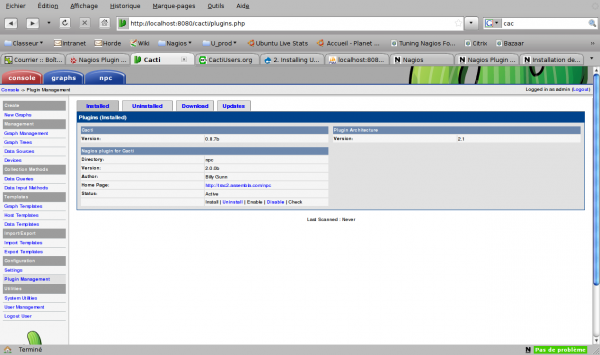
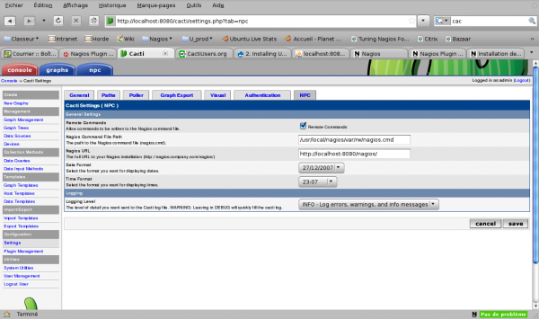
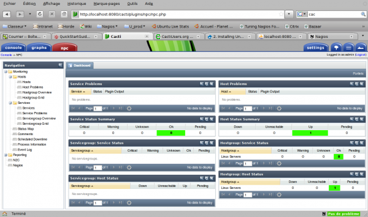
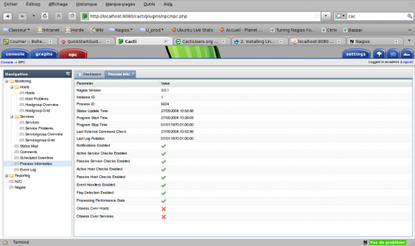
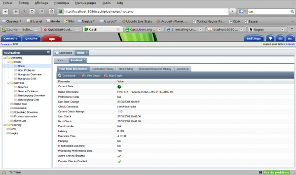
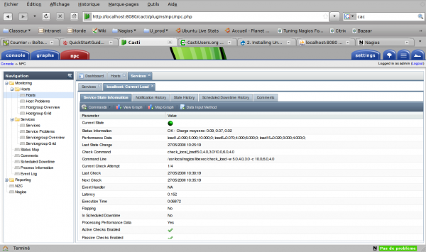

---
layout: page
title: Nagios Plugin for Cacti---

NPC ([Nagios Plugin for Cacti](http://trac2.assembla.com/npc/wiki "http://trac2.assembla.com/npc/wiki"))
est un plugin cacti qui permet de complètement intégrer Nagios à Cacti
et offre les fonctionnalités suivantes:

-   Une interface à Nagios complètement intégrée à Cacti.
-   Une interface utilisateur riche développée avec [Ext
    2.0](http://extjs.com/ "http://extjs.com/").
-   Un point d’entrée unique pour surveiller à la fois les états et
    tendances des composants surveillés.
-   Toutes les données sont mises à jour de façon asynchrone grâce à
    JSON.
-   Importation/synchronisation des hôtes de Nagios dans Cacti (N2C).
-   Possibilités de customiser l’interface par utilisateur.

L’idée de marier Cacti et Nagios n’est pas nouvelle mais franchit une
nouvelle étape avec NPC.

Installation {#installation .sectionedit2}
------------

je pars du principe que
[Nagios](../ubuntu-install.html "nagios:ubuntu-install") et
[Cacti](../../cacti/ubuntu-install.html "cacti:ubuntu-install") sont
correctement installés en suivant les différents tutos disponibles
notamment sur monitoring-fr.org

### Installation architecture de plugins Cacti {#installation-architecture-de-plugins-cacti .sectionedit3}

La plupart des plugins disponibles pour Cacti et donc l’architecture de
plugins sont disponibles sur
[cactiusers.org](http://cactiusers.org/index.php "http://cactiusers.org/index.php").

L’installation de cette architecture est simple et peut être rélalisée
de deux façons, soit en utilisant des fichiers prépatchés pour la
version de cacti utilisée ou patcher soi-même ces mes fichiers. Nous
allons utiliser la méthode un, soit les fichiers prépatchés. Cacti est
installé en /var/www/cacti et est accessible par l’url /cacti/ du
serveur web.

~~~
wget http://cactiusers.org/downloads/cacti-plugin-arch.tar.gz
tar xzf cacti-plugin-arch.tar.gz
cd cacti-plugin-arch
~~~

Il faut d’abord injecter le fichier sql pour la base de données cacti
qui est situé au premier niveau du dossier décompressé.

~~~
mysql -u cacti -p cacti < pa.sql
~~~

Ensuite, un sipmle déplacement des fichiers situés dans mon cas dans le
dossier files-0.8.7b.

~~~
cd files-0.8.7b/
sudo mv lib/* /var/www/cacti/lib/
sudo mv plugins /var/www/cacti/
sudo mv include/* /var/www/cacti/include/
sudo mv *.php /var/www/cacti/
~~~

A ce stade, l’architecture est installée. Il reste à configurer le
minimum pour passer à la suite. Dans l’interface de Cacti, il ne faut
pas oublier de donner les droits sur les plugins à l’utilisateur avec
lequel vous êtes connectés à Cacti. Ça se passe dans le menu Console –\>
Utilities –\> User Management de Cacti. Apparaît alors un nouveau
sous-menu Plugin Management dans le menu Settings de la console. Il
reste à éditer la nouvelle version du fichier include/global.php fournie
avec l’architecture de plugins..

~~~
sudo nano /var/www/cacti/include/global.php
~~~

deux blocs sont à modifier. Le premie rpour la connexion à la base de
données et l’autre concernant l’url\_path.

~~~
/* Default database settings*/
$database_type = "mysql";
$database_default = "cacti";
$database_hostname = "localhost";
$database_username = "cactiuser";
$database_password = "cactiuser";
$database_port = "3306";
~~~

~~~
/*
   Edit this to point to the default URL of your Cacti install
   ex: if your cacti install as at http://serverip/cacti/ this
   would be set to /cacti/
*/

$config['url_path'] = '/cacti/';
~~~

### Installation NPC {#installation-npc .sectionedit4}

Une fois l’architecture en place, l’installation de NPC ne pose pas de
problèmes particuliers.

~~~
wget http://trac2.assembla.com/npc/wiki/NPCDownload
tar xzf npc-2.0.0b.166.tar.gz
sudo mv npc /var/www/cacti/plugins/
~~~

L’installation est terminée. La configuration commence par l’activation
de NPC au niveau Cacti. Editer le fichier include/global.php.

~~~
sudo nano /var/www/cacti/include/global.php
~~~

Déclarer ce plugin dans le fichier global.php.

~~~
$plugins = array();
$plugins[] = 'npc';
~~~

Le reste se passe dans l’interface de cacti. Aller dans Console –\>
Configuration –\> Plugin Management. Se rendre dans l’onglet Uninstalled
et valider l’install de npc. Ensuite se rendre dans l’onglet Installed
et cliquer sur Enable. Ca doit ensuite ressembler à l’écran ci-dessous.

Aller dans Console –\> Configuration –\> Settings. Un nouvel onglet doit
apparaître appelé npc. Il suffit de renseigner les différents champs
pour refléter l’installation de Nagios comme l’écran ci-dessous.

NPC est prêt. Reste à configurer Nagios pour qu’il collabore avec son
nouveau camarade.

### Configuration Nagios {#configuration-nagios .sectionedit5}

Il faut impérativement que NDOUtilis soit installé sur le serveur Nagios
pour faire fonctionner NPC. Au niveau du fichier de configuration
nagios.cfg, il faut valider ces directives de configuration.

~~~
check_external_commands=1
command_check_interval=-1
event_broker_options=-1
broker_module=/usr/local/nagios/bin/ndomod.o config_file=/usr/local/nagios/etc/ndomod.cfg
process_performance_data=1
~~~

Il n’y a pas besoin comme d’habitude de renseigner les directives
host\_perfdata\_command et service\_perfdata\_command. Les données de
performance sont directement stockées en base MySQL par NDO2DB et sont
interrogeables par cacti avec le script perfdata.php inclus. Il reste à
renseigner le fichier de configuration ndo2db.cfg pour y reporter les
valeurs de connexion à la base. Le préfixe des tables ajoutées par NPC à
la base Cacti commence par npc\_.

~~~
db_servertype=mysql
db_host=localhost
db_port=3306
db_name=cacti
db_prefix=npc_
db_user=cactiuser
db_pass=cacti_user
~~~

Quelques écrans {#quelques-ecrans .sectionedit6}
---------------

Si tout fonctionne, il est alors temps de se faire plaisir avec un petit
tour dans la nouvelle interface de Nagios… dans Cacti.

Le tableau de bord

Les processus de Nagios vu depuis Cacti

La vue détaillée d’un hôte

La vue détaillée d’un service