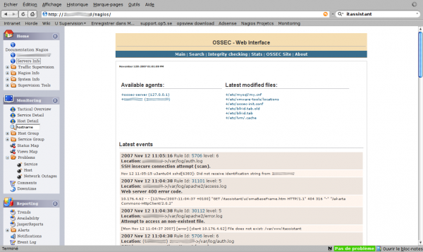

[[[OSSEC](ossec@do=backlink.html)]]

[wiki monitoring-fr.org](../../start.html "[ALT+H]")

-   [Accueil](../../index.html "Cliquez pour revenir |  l'accueil")
-   [Blog](http://www.monitoring-fr.org "Blog & News")
-   [Forums](http://forums.monitoring-fr.org "Forums")
-   [Doc](http://doc.monitoring-fr.org "Doc")
-   [Forge](https://github.com/monitoring-fr "Forge")

Vous êtes ici: [Accueil](../../start.html "start") »
[Nagios](../start.html "nagios:start") » [Nagios
Integration](start.html "nagios:integration:start") »
[OSSEC](ossec.html "nagios:integration:ossec")

### Table des matières {.toggle}

-   [OSSEC](ossec.html#ossec)
    -   [Installation sur OSSEC](ossec.html#installation-sur-ossec)
    -   [Installation sur Nagios](ossec.html#installation-sur-nagios)
    -   [Intégration OSSEC-WUI à
        Nagios](ossec.html#integration-ossec-wui-a-nagios)

OSSEC {#ossec .sectionedit1}
=====

[OSSEC-HIDS](http://ossec.net "http://ossec.net") est un programme de
type HIDS qui peut s’interfacer avec Nagios. L’objectif est de ne plus
utiliser les alertes par mail que génère directement OSSEC (dont les
options sont sommaires) mais de passer les alertes à Nagios qui les
affichent en console et éventuellement les notifie. En effet, Nagios
dispose pour les notifications d’options beaucoup plus puissantes comme
les groupes différents en fonction de l’alerte, les plages horaires
d’envois ainsi que les escalades. Ce tuto s’appuie sur la [documentation
de OSSEC concernant les active
response](http://www.ossec.net/wiki/index.php/Know_How:CustomActiveResponses "http://www.ossec.net/wiki/index.php/Know_How:CustomActiveResponses").

 Je n’ai pas encore testé ce
tuto; il ne s’agit pour le moment que d’une construction théorique. Le
script n’est donc pas fonctionnel en l’état et la configuration côté
Nagios non précisée.

Ce tutoriel a été réalisé par :

  **Rôle**        **Nom**
  --------------- -------------
  **Rédacteur**   Olivier JAN

Installation sur OSSEC {#installation-sur-ossec .sectionedit3}
----------------------

Il faut commencer par créer une commande active-response dans le fichier
de configuration ossec.conf

~~~~ {.code}
<command>
   <name>nagios-alert</name>
   <executable>nagios-alert.sh</executable>
   <timeout_allowed>no</timeout_allowed>
   <expect />
 </command>
~~~~

Notre commande s’appelle nagios-alerte.sh et doit être déposée dans le
répertoire des binaires active response de notre installation ossec;
dans mon cas /var/ossec/active-response/bin/. Il ne devrait pas y avoir
besoin de la srcip et du username, ces paramètres sont donc omis. Le
timeout sur le script est également désactivé.

Il faut maintenant créer une active response toujours dans le fichier
ossec.conf. Nous créons une alerte pour les évènements id 1002 ce qui
nous permettra de remonter entre autre vers Nagios les problèmes de
checkpoint sur MySQL par exemple comme le message reçu de OSSEC par mail
ci-dessous

~~~~ {.code}
OSSEC HIDS Notification.
2007 Nov 12 11:24:23

Received From: server->/var/log/syslog
Rule: 1002 fired (level 2) -> "Unknown problem somewhere in the system."
Portion of the log(s):

Nov 12 11:24:22 server mysqld[25435]: 071112 11:24:22  InnoDB: ERROR: the age of the last checkpoint is 9444615,

 --END OF NOTIFICATION
~~~~

Définition de notre active response

~~~~ {.code}
 <active-response>
    <command>nagios-alert</command>
    <location>local</location>
    <rules_id>1002</rules_id>
 </active-response>
~~~~

Il reste maintenant à créer le script chargé de la remontée de l’info
vers Nagios. Ce script s’appuiera bien évidemment sur send\_nsca puisque
nous sommes dans le cas d’une supervision passive.

~~~~ {.code}
#!/bin/sh
# sends an alert to Nagios - copy at /var/ossec/active-response/bin/nagios-alert.sh
# Change hostname and servicename
# Author: Olivier Jan based on mail-test.sh by Daniel Cid

ACTION=$1
USER=$2
IP=$3
ALERTID=$4
RULEID=$5

LOCAL=`dirname $0`;
cd $LOCAL
cd ../
PWD=`pwd`

# Logging the call
echo "`date` $0 $1 $2 $3 $4 $5 $6 $7 $8" >> ${PWD}/../logs/active-responses.log

# Getting alert time
ALERTTIME=`echo "$ALERTID" | cut -d  "." -f 1`

# Getting end of alert
ALERTLAST=`echo "$ALERTID" | cut -d  "." -f 2`

# Getting full alert
grep -A 10 "$ALERTTIME" ${PWD}/../logs/alerts/alerts.log | grep -v ".$ALERTLAST: " -A 10 | /usr/local/nagios/libexec/event_handlers/send_nsca -H ip_server_nagios -C /usr/local/nagios/etc/send_nsca.cfg
~~~~

Installation sur Nagios {#installation-sur-nagios .sectionedit4}
-----------------------

Il faut créer un service de type passif dans Nagios.

 A compléter

Intégration OSSEC-WUI à Nagios {#integration-ossec-wui-a-nagios .sectionedit5}
------------------------------

Il ne reste plus qu’à intégrer OSSEC-Wui, l’interface web de OSSEC à
celle de Nagios. Et si comme moi, vous utilisez le thème Nuvola, il
suffit d’éditer le fichier /usr/local/nagios/share/side/dtree\_data.js
pour pointer sur la bonne url et voir s’afficher quelque chose comme
l’écran ci-dessous

SOMMAIRE {#sommaire .sectionedit1}
--------

**[Accueil](../../start.html "start")**

**[Supervision](../../supervision/start.html "supervision:start")**

-   [Nagios](../start.html "nagios:start")
-   [Centreon](../../centreon/start.html "centreon:start")
-   [Shinken](../../shinken/start.html "shinken:start")
-   [Zabbix](../../zabbix/start.html "zabbix:start")
-   [OpenNMS](../../opennms/start.html "opennms:start")
-   [EyesOfNetwork](../../eyesofnetwork/start.html "eyesofnetwork:start")
-   [Groundwork](../../groundwork/start.html "groundwork:start")
-   [Zenoss](../../zenoss/start.html "zenoss:start")
-   [Vigilo](../../vigilo/start.html "vigilo:start")
-   [Icinga](../../icinga/start.html "icinga:start")
-   [Cacti](../../cacti/start.html "cacti:start")
-   [Ressenti
    utilisateur](../../supervision/eue/start.html "supervision:eue:start")
-   [Ressenti utilisateur avec
    sikuli](../../sikuli/eue/start.html "sikuli:eue:start")

**[Hypervision](../../hypervision/start.html "hypervision:start")**

-   [Canopsis](../../canopsis/start.html "canopsis:start")

**[Sécurité](../../securite/start.html "securite:start")**

**[Infrastructure](../../infra/start.html "infra:start")**

**[Développement](../../dev/start.html "dev:start")**

Nagios Integration {#nagios-integration .sectionedit1}
------------------

-   [Blosxom4nagios](../../integration/blosxom4nagios.html "nagios:integration:blosxom4nagios")
-   [Collectd](collectd.html "nagios:integration:collectd")
-   [Incron & LoggedFS](incron.html "nagios:integration:incron")
-   [Intégration de Prelude-IDS à
    Nagios](prelude.html "nagios:integration:prelude")
-   [Intégrer Job Scheduler à
    Nagios](jobscheduler.html "nagios:integration:jobscheduler")
-   [Monit](monit.html "nagios:integration:monit")
-   [Nagios Plugin for Cacti](npc.html "nagios:integration:npc")
-   [Nmon](nmon.html "nagios:integration:nmon")
-   [OSSEC](ossec.html "nagios:integration:ossec")
-   [Octopussy](8pussy.html "nagios:integration:8pussy")
-   [Rsyslog](rsyslog.html "nagios:integration:rsyslog")
-   [SEC](sec.html "nagios:integration:sec")
-   [SmokePing](smokeping.html "nagios:integration:smokeping")
-   [Webinject](webinject.html "nagios:integration:webinject")
-   [Wordpress4nagios](../../integration/wordpress.html "nagios:integration:wordpress")

-   [Afficher le texte
    source](ossec@do=edit&rev=0.html "Afficher le texte source [V]")
-   [Anciennes
    révisions](ossec@do=revisions.html "Anciennes révisions [O]")
-   [Derniers
    changements](ossec@do=recent.html "Derniers changements [R]")
-   [Liens vers cette
    page](ossec@do=backlink.html "Liens vers cette page")
-   [Gestionnaire de
    médias](ossec@do=media.html "Gestionnaire de médias")
-   [Index](ossec@do=index.html "Index [X]")
-   [Connexion](ossec@do=login&sectok=6bca6bdf16f8880de3d6d3649db89a26.html "Connexion")
-   [Haut de page](ossec.html#dokuwiki__top "Haut de page [T]")

nagios/integration/ossec.txt · Dernière modification: 2013/03/29 09:39
(modification externe)

