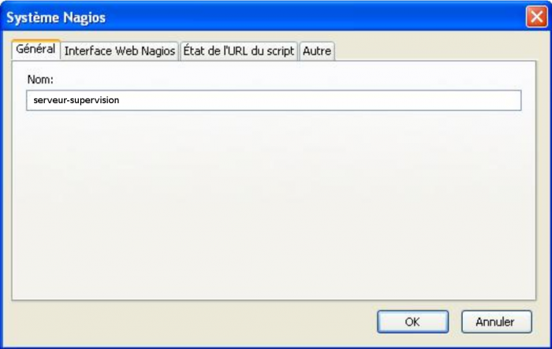

[[[Extension Mozilla Firefox : Nagios
Checker](nagios-checker@do=backlink.html)]]

[wiki monitoring-fr.org](../../start.html "[ALT+H]")

-   [Accueil](../../index.html "Cliquez pour revenir |  l'accueil")
-   [Blog](http://www.monitoring-fr.org "Blog & News")
-   [Forums](http://forums.monitoring-fr.org "Forums")
-   [Doc](http://doc.monitoring-fr.org "Doc")
-   [Forge](https://github.com/monitoring-fr "Forge")

Vous êtes ici: [Accueil](../../start.html "start") »
[Nagios](../start.html "nagios:start") » [Mise en place complète de
Nagios sur RHEL
5.4](start.html "nagios:mise-en-place-complete-nagios-sur-rhel-5.4:start")
» [Extension Mozilla Firefox : Nagios
Checker](nagios-checker.html "nagios:mise-en-place-complete-nagios-sur-rhel-5.4:nagios-checker")

### Table des matières {.toggle}

-   [Extension Mozilla Firefox : Nagios
    Checker](nagios-checker.html#extension-mozilla-firefoxnagios-checker)
    -   [Paramétrer le plugin](nagios-checker.html#parametrer-le-plugin)

Extension Mozilla Firefox : Nagios Checker {#extension-mozilla-firefoxnagios-checker .sectionedit1}
==========================================

Une extension du navigateur Mozilla Firefox permet de récupérer les
informations affichées par l’interface de Nagios. Cette extension
récupère les alertes et permet d’un simple clic d’accéder à la page
Nagios correspondant à l’élément en alerte.

Pour l’installer suivre ce lien avec Firefox bien sûr :p
[https://addons.mozilla.org/fr/firefox/search?q=nagios+checker&cat=all](https://addons.mozilla.org/fr/firefox/search?q=nagios+checker&cat=all "https://addons.mozilla.org/fr/firefox/search?q=nagios+checker&cat=all")

Paramétrer le plugin {#parametrer-le-plugin .sectionedit2}
--------------------

Clic droit → Paramètres sur le plugin tout en bas à droite de la fenêtre
firefox. Ajouter un système Nagios et suivre les screenshots suivants.

Dans l’onglet Général donner un nom à la configuration (ex : nom du
serveur : serveur).

Dans l’onglet Interface Web Nagios, mettre l’URL d’accès à la page
Nagios (ex :
[http://serveur.domaine.local/nagios](http://serveur.domaine.local/nagios "http://serveur.domaine.local/nagios")
Entrer le nom d’utilisateur et le mot de passe.

Dans l’onglet Etat de l’URL du script, entrer manuellement l’URL
[http://serveur.domaine.local/nagios/cgi-bin/status.cgi](http://serveur.domaine.local/nagios/cgi-bin/status.cgi "http://serveur.domaine.local/nagios/cgi-bin/status.cgi")
Valider la configuration. La récupération des informations doit déjà
fonctionner.

Se rendre dans les paramètres généraux et modifier l’intervalle de
vérification à toutes les 15 secondes (0:15).

Ensuite, on peut modifier à sa convenance les alertes sonores, le mode
d’affichage des alertes (séparées par type ou regroupées dans une même
barre… Différents paramètres sont réglables, notamment le son.

SOMMAIRE {#sommaire .sectionedit1}
--------

**[Accueil](../../start.html "start")**

**[Supervision](../../supervision/start.html "supervision:start")**

-   [Nagios](../start.html "nagios:start")
-   [Centreon](../../centreon/start.html "centreon:start")
-   [Shinken](../../shinken/start.html "shinken:start")
-   [Zabbix](../../zabbix/start.html "zabbix:start")
-   [OpenNMS](../../opennms/start.html "opennms:start")
-   [EyesOfNetwork](../../eyesofnetwork/start.html "eyesofnetwork:start")
-   [Groundwork](../../groundwork/start.html "groundwork:start")
-   [Zenoss](../../zenoss/start.html "zenoss:start")
-   [Vigilo](../../vigilo/start.html "vigilo:start")
-   [Icinga](../../icinga/start.html "icinga:start")
-   [Cacti](../../cacti/start.html "cacti:start")
-   [Ressenti
    utilisateur](../../supervision/eue/start.html "supervision:eue:start")
-   [Ressenti utilisateur avec
    sikuli](../../sikuli/eue/start.html "sikuli:eue:start")

**[Hypervision](../../hypervision/start.html "hypervision:start")**

-   [Canopsis](../../canopsis/start.html "canopsis:start")

**[Sécurité](../../securite/start.html "securite:start")**

**[Infrastructure](../../infra/start.html "infra:start")**

**[Développement](../../dev/start.html "dev:start")**

Nagios {#nagios .sectionedit1}
------

-   [Arborescence des
    fichiers](../installation-layout.html "nagios:installation-layout")
-   [Commandes de remontée de
    contrôle](../ocsp-ochp.html "nagios:ocsp-ochp")
-   [Données Nagios dans un ramdisk](../ramdisk.html "nagios:ramdisk")
-   [Event Handlers](../event_handlers.html "nagios:event_handlers")
-   [Gabarits d'objets de
    configuration](../templates.html "nagios:templates")
-   [Installation Nagios 2 & 3 sur Ubuntu 6.0.6, 8.0.4 et 10.0.4
    LTS](../ubuntu-install.html "nagios:ubuntu-install")
-   [Installation Nagios 3 sur Debian Squeeze
    6.0.3](../debian-install.html "nagios:debian-install")
-   [Installation de Nagios 3.x sur CentOS
    5.3](../nagios-centos-install.html "nagios:nagios-centos-install")
-   [Introduction aux objets de
    configuration](../configobjects.html "nagios:configobjects")
-   [Introduction à
    Nagios](../nagios-introduction.html "nagios:nagios-introduction")
-   [Liens Nagios](../links.html "nagios:links")
-   [Mise en place complète de Nagios sur RHEL
    5.4](start.html "nagios:mise-en-place-complete-nagios-sur-rhel-5.4:start")
-   [NAGIOS - Guide de démarrage pour
    débutant](../nagios-debutant/start.html "nagios:nagios-debutant:start")
-   [Nagios Addons](../addons/start.html "nagios:addons:start")
-   [Nagios
    Integration](../integration/start.html "nagios:integration:start")
-   [Nagios Plugins](../plugins/start.html "nagios:plugins:start")
-   [Nagios et les
    notifications](../notifications.html "nagios:notifications")
-   [Outils de supervision d'un hôte
    Windows](../windows-client.html "nagios:windows-client")
-   [Référence des objets de
    configuration](../objects-reference.html "nagios:objects-reference")
-   [Superviser un hôte Windows avec
    NSClient++](../nagios-nsclient-host.html "nagios:nagios-nsclient-host")
-   [Supervision Windows en mode
    passif](../supervision-windows-passif.html "nagios:supervision-windows-passif")
-   [Supervision vmware esx](../vmware_esx.html "nagios:vmware_esx")
-   [check-list de diagnostic](../debug.html "nagios:debug")

-   [Afficher le texte
    source](nagios-checker@do=edit&rev=0.html "Afficher le texte source [V]")
-   [Anciennes
    révisions](nagios-checker@do=revisions.html "Anciennes révisions [O]")
-   [Derniers
    changements](nagios-checker@do=recent.html "Derniers changements [R]")
-   [Liens vers cette
    page](nagios-checker@do=backlink.html "Liens vers cette page")
-   [Gestionnaire de
    médias](nagios-checker@do=media.html "Gestionnaire de médias")
-   [Index](nagios-checker@do=index.html "Index [X]")
-   [Connexion](nagios-checker@do=login&sectok=6bca6bdf16f8880de3d6d3649db89a26.html "Connexion")
-   [Haut de page](nagios-checker.html#dokuwiki__top "Haut de page [T]")

nagios/mise-en-place-complete-nagios-sur-rhel-5.4/nagios-checker.txt ·
Dernière modification: 2013/03/29 09:39 (modification externe)

