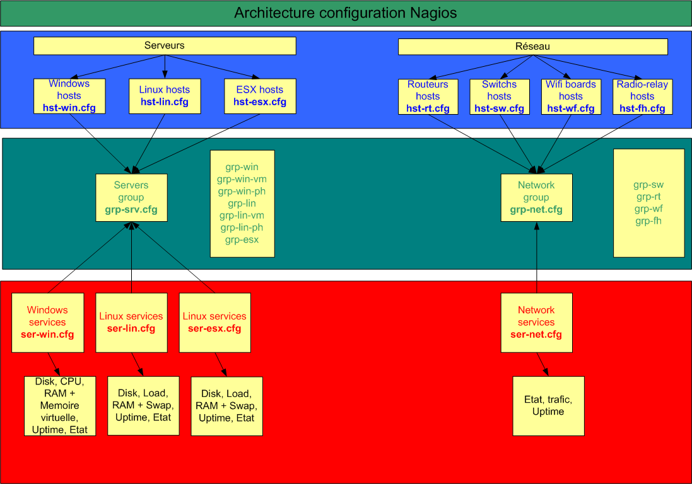
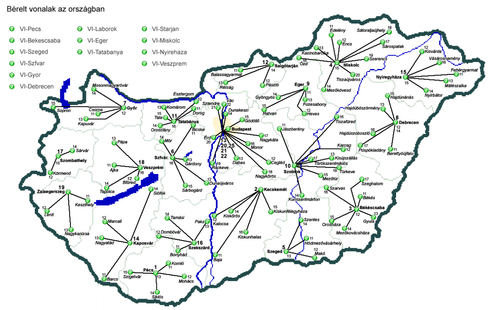

[[[Nagios complet avec NDOUtils et
Nagvis](nagios-infrastructure-complete@do=backlink.html)]]

[wiki monitoring-fr.org](../../start.html "[ALT+H]")

-   [Accueil](../../index.html "Cliquez pour revenir |  l'accueil")
-   [Blog](http://www.monitoring-fr.org "Blog & News")
-   [Forums](http://forums.monitoring-fr.org "Forums")
-   [Doc](http://doc.monitoring-fr.org "Doc")
-   [Forge](https://github.com/monitoring-fr "Forge")

Vous êtes ici: [Accueil](../../start.html "start") »
[Nagios](../start.html "nagios:start") » [Mise en place complète de
Nagios sur RHEL
5.4](start.html "nagios:mise-en-place-complete-nagios-sur-rhel-5.4:start")
» [Nagios complet avec NDOUtils et
Nagvis](nagios-infrastructure-complete.html "nagios:mise-en-place-complete-nagios-sur-rhel-5.4:nagios-infrastructure-complete")

### Table des matières {.toggle}

-   [Nagios complet avec NDOUtils et
    Nagvis](nagios-infrastructure-complete.html#nagios-complet-avec-ndoutils-et-nagvis)
-   [Version utilisées dans cette
    documentation](nagios-infrastructure-complete.html#version-utilisees-dans-cette-documentation)
-   [Généralités](nagios-infrastructure-complete.html#generalites)
-   [Installation de
    Nagios](nagios-infrastructure-complete.html#installation-de-nagios)
    -   [Étapes d'installation de
        Nagios](nagios-infrastructure-complete.html#etapes-d-installation-de-nagios)
-   [Configuration de
    Nagios](nagios-infrastructure-complete.html#configuration-de-nagios)
    -   [Documentations](nagios-infrastructure-complete.html#documentations)
-   [Architecture
    utilisée](nagios-infrastructure-complete.html#architecture-utilisee)
    -   [Général](nagios-infrastructure-complete.html#general)
    -   [Déclaration des éléments à
        superviser](nagios-infrastructure-complete.html#declaration-des-elements-a-superviser)
    -   [Supervision locale du serveur de
        supervision](nagios-infrastructure-complete.html#supervision-locale-du-serveur-de-supervision)
    -   [Supervision des systèmes
        Windows](nagios-infrastructure-complete.html#supervision-des-systemes-windows)
    -   [Supervision des systèmes
        Linux](nagios-infrastructure-complete.html#supervision-des-systemes-linux)
    -   [Supervision des systèmes VMware
        ESX](nagios-infrastructure-complete.html#supervision-des-systemes-vmware-esx)
    -   [Fichier de déclaration de tous les groupes de systèmes
        (Windows, Linux,
        ESX)](nagios-infrastructure-complete.html#fichier-de-declaration-de-tous-les-groupes-de-systemes-windows-linux-esx)
    -   [Supervision des
        routeurs](nagios-infrastructure-complete.html#supervision-des-routeurs)
    -   [Supervision des
        switchs](nagios-infrastructure-complete.html#supervision-des-switchs)
    -   [Supervision des bornes
        wifi](nagios-infrastructure-complete.html#supervision-des-bornes-wifi)
    -   [Supervision des faisceaux
        hertziens](nagios-infrastructure-complete.html#supervision-des-faisceaux-hertziens)
    -   [Pour les routeurs, les switchs, les bornes wifi et les
        faisceaux
        hertziens](nagios-infrastructure-complete.html#pour-les-routeurs-les-switchs-les-bornes-wifi-et-les-faisceaux-hertziens)
    -   [Important](nagios-infrastructure-complete.html#important)
-   [Supervision serveur/réseau avec
    agent](nagios-infrastructure-complete.html#supervision-serveurreseau-avec-agent)
-   [Supervision serveur/réseau avec le protocole SNMP sans installation
    d'agent](nagios-infrastructure-complete.html#supervision-serveurreseau-avec-le-protocole-snmp-sans-installation-d-agent)
-   [Supervision locale du serveur
    Nagios](nagios-infrastructure-complete.html#supervision-locale-du-serveur-nagios)
-   [Notifications](nagios-infrastructure-complete.html#notifications)
    -   [Paramétrage des intervalles de
        check](nagios-infrastructure-complete.html#parametrage-des-intervalles-de-check)
-   [Extension Mozilla Firefox : Nagios
    Checker](nagios-infrastructure-complete.html#extension-mozilla-firefoxnagios-checker)
-   [Erreures
    connues](nagios-infrastructure-complete.html#erreures-connues)
-   [NDOUtils](nagios-infrastructure-complete.html#ndoutils)
    -   [Prérequis](nagios-infrastructure-complete.html#prerequis)
    -   [Installation
        MySQL](nagios-infrastructure-complete.html#installation-mysql)
    -   [Configurer
        MySQL](nagios-infrastructure-complete.html#configurer-mysql)
    -   [Installer
        NDOUtils](nagios-infrastructure-complete.html#installer-ndoutils)
        -   [Configuration
            Nagios](nagios-infrastructure-complete.html#configuration-nagios)
        -   [Configuration
            NDOUtils](nagios-infrastructure-complete.html#configuration-ndoutils)
-   [Nagvis](nagios-infrastructure-complete.html#nagvis)
    -   [Prérequis](nagios-infrastructure-complete.html#prerequis1)
        -   [Remarque](nagios-infrastructure-complete.html#remarque)
    -   [Configuration
        Nagvis](nagios-infrastructure-complete.html#configuration-nagvis)
        -   [Type de
            carte](nagios-infrastructure-complete.html#type-de-carte)
-   [Restaurer la base de données
    nagios](nagios-infrastructure-complete.html#restaurer-la-base-de-donnees-nagios)
    -   [Reprendre les dumps
        sauvegardés](nagios-infrastructure-complete.html#reprendre-les-dumps-sauvegardes)
-   [Rotation des
    logs](nagios-infrastructure-complete.html#rotation-des-logs)

Nagios complet avec NDOUtils et Nagvis {#nagios-complet-avec-ndoutils-et-nagvis .sectionedit1}
======================================

**Documentation sur Nagios en solo dans une infrastructure complète avec
NDOUtils et Nagvis.**

Version utilisées dans cette documentation {#version-utilisees-dans-cette-documentation .sectionedit2}
==========================================

-   Nagios 3.0.6
-   RHEL 5.4
-   MySQL 5
-   NDOUtils 1.4 beta7
-   Nagvis 1.4

Généralités {#generalites .sectionedit3}
===========

Nagios (anciennement appelé Netsaint) est une application permettant la
surveillance système et réseau. Elle surveille les hôtes et services
spécifiés, alertant lorsque les systèmes vont mal et quand ils vont
mieux. C’est un logiciel libre sous licence GPL. C’est un programme
modulaire qui se décompose en trois parties :

-   Le moteur de l’application qui vient ordonnancer les tâches de
    supervision.
-   L’interface web, qui permet d’avoir une vue d’ensemble du système
    d’information et des possibles anomalies.
-   Les plugins, une centaine de mini programmes que l’on peut compléter
    en fonction des besoins de chacun pour superviser chaque service ou
    ressource disponible sur l’ensemble des ordinateurs ou éléments
    réseaux du SI.

Installation de Nagios {#installation-de-nagios .sectionedit4}
======================

Les RPM installés manuellement (fichier avec l’extension .rpm) sont à
récupérer sur les sites de création de paquets comme dagwieers.com,
rpm.pbone.net et rpmfind.net. Essayer d’obtenir la dernière version du
logiciel.

La totalité des paquets qui n’était pas présent dans les paquets fournit
avec le dépôt EPEL
([http://fedoraproject.org/wiki/EPEL](http://fedoraproject.org/wiki/EPEL "http://fedoraproject.org/wiki/EPEL"))
a été récupérée sur le site rpm.pbone.net. On ne peut pas installer
Nagios en faisant un `yum install nagios` car Nagios n’est pas intégré
par Red Hat dans Red Hat Network. Par contre avec le dépôt EPEL, Nagios
est présent mais en version 2. Or il est plus intéressant de disposer de
la dernière version car elle contient des améliorations importantes par
rapport à la 2 et Centreon 2 ne supporte que Nagios version 3.

Donc, pour l’installation, la méthode du dépôt EPEL, et des paquets RPM
récupérés manuellement sur Internet a été utilisée.

Remarque : remplacer les noms de paquets par les versions adéquates.
Récupérer le dossier nagios avec tout les RPM téléchargés avec WinSCP et
le positionner dans /root par exemple. Il faudra après installation
supprimer le dossier.

Étapes d'installation de Nagios {#etapes-d-installation-de-nagios .sectionedit5}
-------------------------------

Dépendances dont a besoin nagios pour fonctionner.

~~~
yum install httpd gcc glibc glibc-common gd gd-devel
yum install libtool-ltdl
~~~

Décommenter la directive ServerName du fichier
/etc/httpd/conf/httpd.conf.

Les deux paquets principaux de nagios.

~~~
rpm -ivh nagios-3.0.6-1.el5.rf.i386.rpm
rpm -ivh nagios-plugins-1.4.13-4.el5.i386.rpm
~~~

Deux dépendances nécessaires à net-snmp

~~~
yum install fping
yum install qstat
~~~

Installer les paquets SNMP suivants nécessaires au fonctionnement de
nagios avec SNMP. Essayer de les installer avec yum ou utiliser les
paquets téléchargés. Faire attention, certains paquets sont peut-être
déjà présent sur le système.

~~~
yum install net-snmp net-snmp-libs net-snmp-utils php-snmp
yum install nagios-plugins-all
~~~

~~~
vi /etc/nagios/objects/contacts.cfg
~~~

changer `nagioasadmin@localhost` par votre boite mail de supervision par
exemple.

Attribuer un mot de passe pour nagios.

~~~
passwd nagios
~~~

Créer le mot de passe de connexion à l’interface web de supervision.

~~~
htpasswd -c /etc/nagios/htpasswd.users nagiosadmin
~~~

C’est la même commande pour changer le mot de passe.

Redémarrer le service.

~~~
service httpd restart
~~~

Vérifier la syntaxe du fichier de configuration de nagios.

~~~
nagios -v /etc/nagios/nagios.cfg
~~~

Démarrer le service nagios.

~~~
/etc/init.d/nagios start
~~~

Vérifier qu’il est bien lancé.

~~~
ps -ef | grep nagios
~~~

Vérifier qu’il est lancé au démarrage de la machine.

~~~
chkconfig --list | grep nagi
~~~

Accéder à l’interface web de nagios.

~~~
http://serveur.domaine.local/nagios/
~~~

Entrer `nagiosadmin` et son mot de passe. On accède à l’interface de
nagios.

Configuration de Nagios {#configuration-de-nagios .sectionedit6}
=======================

Documentations {#documentations .sectionedit7}
--------------

-   [sources-nagios-centreon](http://wiki.monitoring-fr.org/powered/centreon/sources-nagios-centreon "powered:centreon:sources-nagios-centreon").

Architecture utilisée {#architecture-utilisee .sectionedit8}
=====================

Nous avons le fichier `/etc/nagios/nagios.cfg` qui inclus la plupart des
fichiers qui suivent.

Le dossier qui contient la configuration (`/etc/nagios/objects`),
dispose des fichiers suivants par défaut.

Général {#general .sectionedit9}
-------

-   commands.cfg : liste des commandes utilisables par Nagios ainsi que
    les paramètres passés à ces commandes.
-   contacts.cfg : informations de contacts des alertes.
-   timeperiods.cfg : plannification des périodes de remontés d’alerte.

Déclaration des éléments à superviser {#declaration-des-elements-a-superviser .sectionedit10}
-------------------------------------

-   templates.cfg : squelette de configuration qu’on applique aux
    définitions d’hôtes Windows ou Linux, des services…
-   localhost.cfg : configuration de la supervision de la machine locale
    (du serveur Nagios).
-   printer.cfg : configuration de la supervision des imprimantes.
-   switch.cfg : configuration des routeurs et des switchs.
-   windows.cfg : configuration de la supervision des hôtes Windows.

Ceci est la configuration par défaut. Nous allons considérablement la
modifier.

Pour clarifier le plus possible les fichiers de configuration et faire
en sorte qu’ils restent lisibles (pas un fichier de 400 lignes), on va
découper la configuration. Pour une structure qui dispose d’environ 200
serveurs et d’environ 100 éléments réseaux. A raison de sept lignes par
définition d’hôtes dans le fichier de configuration, cela représente
finalement 300\*7 = 2100 lignes de configuration.

Pour conserver la lisibilité des fichiers, nous allons adopter la
configuration qui suit.

Supervision locale du serveur de supervision {#supervision-locale-du-serveur-de-supervision .sectionedit11}
--------------------------------------------

-   localhost.cfg : configuration de la supervision locale de la machine
    Nagios. On y trouve la décalaration de l’hôte, son groupe et ses
    services. Toute la configuration locale est présente dans ce fichier
    et ne dépend d’aucun autre.

Supervision des systèmes Windows {#supervision-des-systemes-windows .sectionedit12}
--------------------------------

-   hst-win.cfg : déclaration des systèmes Windows.
-   ser-win.cfg : définition des services et des groupes de services.

Supervision des systèmes Linux {#supervision-des-systemes-linux .sectionedit13}
------------------------------

-   hst-lin.cfg : déclaration des systèmes Linux.
-   ser-lin.cfg : définition des services.

Supervision des systèmes VMware ESX {#supervision-des-systemes-vmware-esx .sectionedit14}
-----------------------------------

-   hst-esx.cfg : déclaration des systèmes ESX.
-   ser-esx.cfg : définition des services.

Fichier de déclaration de tous les groupes de systèmes (Windows, Linux, ESX) {#fichier-de-declaration-de-tous-les-groupes-de-systemes-windows-linux-esx .sectionedit15}
----------------------------------------------------------------------------

-   grp-srv.cfg : définition des groupes d’hôtes.

Supervision des routeurs {#supervision-des-routeurs .sectionedit16}
------------------------

-   hst-rt.cfg : déclaration des routeurs.

Supervision des switchs {#supervision-des-switchs .sectionedit17}
-----------------------

-   hst-sw.cfg : déclaration des switchs.

Supervision des bornes wifi {#supervision-des-bornes-wifi .sectionedit18}
---------------------------

-   hst-wf.cfg : déclaration des bornes wifi.

Supervision des faisceaux hertziens {#supervision-des-faisceaux-hertziens .sectionedit19}
-----------------------------------

-   hst-fh.cfg : déclaration des faisceaux hertziens.

Pour les routeurs, les switchs, les bornes wifi et les faisceaux hertziens {#pour-les-routeurs-les-switchs-les-bornes-wifi-et-les-faisceaux-hertziens .sectionedit20}
--------------------------------------------------------------------------

-   grp-net.cfg : définition des groupes de switchs, de routeurs, des
    bornes wifi et des faisceaux hertziens.
-   ser-net.cfg : définition des services, et groupes de services pour
    les routeurs, les switchs, les bornes wifi et les faisceaux
    hertziens. Ceci a été fait car ce sont exactement les mêmes
    services.

A chaque fois qu’un nouveau fichier est créé, vérifier que le
propriétaire et le groupe est bien nagios et que ses permissions sont
`-rw-rw-r– (664)`.

~~~
chown nagios:nagios hst-rt.cfg
chmod 664 hst-rt.cfg
~~~

L’ajout des fichiers décrit précédemment se décrit dans le fichier de
configuration principal `/etc/nagios/nagios.cfg`.

Visionner le schéma ci-après pour avoir une meilleure idée.

~~~
######################## System ##########################
###### Local Linux config ######
# Definitions for monitoring the local (Linux) host
cfg_file=/etc/nagios/objects/localhost.cfg

# Definitions for all hosts
cfg_dir=/etc/nagios/objects/hst

# Definition for all groups
cfg_dir=/etc/nagios/objects/grp

# Definition for all services and service groups
cfg_dir=/etc/nagios/objects/ser
~~~

J’ai donc créé une arborescence de dossier simple.

-   hst : fichiers d’hôtes.
-   grp : fichiers de groupes.
-   ser : fichiers des services.

Remarque : tous les fichiers présents doivent obligatoirement avoir
l’extension `.cfg` pour être pris en compte par Nagios.

Il faut savoir que tout peut être regroupé dans encore moins de fichiers
mais c’est plus clair comme cela.

Pour connaître les erreurs de tout les fichiers qui sont ajoutés dans
`/etc/nagios/nagios.cfg`, exécuter la commande suivante.

~~~
nagios -v /etc/nagios/nagios.cfg
~~~

Important {#important .sectionedit21}
---------

L’architecture que nous utilisons est simple. Des hôtes sont membres
d’un groupe. Sur ce groupe nous allons appliquer différents services.
J’ai séparé les machines virtuelles des machines physiques car des
différences les opposent au niveau réseau. Les machines physiques ont
des Bonding actif-passif avec leurs deux cartes et les serveurs virtuels
ont une seule carte réseau sans configuration particulière.

Groupe de serveurs Windows

grp-win

-   grp-win-vm
    -   Système windows 1
    -   Système windows 2

-   grp-win-ph
    -   Système windows 1
    -   Système windows 2

Groupe de serveurs Linux

grp-lin

-   grp-lin-vm
    -   Système linux 1
    -   Système linux 2

-   grp-lin-ph
    -   Système linux 1
    -   Système linux 2

grp-esx

-   Système esx 1
-   Système esx 2

Groupe de services Windows de base

ser-win-base

-   Service CPU.
-   Service Memoire.
-   Service Réseau.
-   Service Disque.
-   Service Uptime.

Groupe de services Linux de base

ser-lin-base

-   Service CPU.
-   Service Memoire.
-   Service Réseau.
-   Service Disque.
-   Service Uptime.

Groupe de services ESX de base

ser-esx-base

-   Service CPU.
-   Service Memoire.
-   Service Réseau.
-   Service Disque.
-   Service Uptime.

Exemple : les hôtes Linux appartiennent à un groupe d’hôtes Linux
(grp-lin) et les services associés ont été définie comme appartenant au
groupe Linux. De cette manière toutes les nouvelles machines Linux
ajoutées membre de ce même groupe d’hôtes (grp-lin) auront les mêmes
services supervisés. De cette manière on applique des services à un
groupe d’hôtes.

Cas d’exemple concret faisant intervenir tout les types de fichiers.

`/etc/nagios/nagios.cfg`

~~~
######################## System ##########################
# Definitions for all hosts
cfg_dir=/etc/nagios/objects/hst

# Definition for all groups
cfg_dir=/etc/nagios/objects/grp

# Definition for all services and service groups
cfg_dir=/etc/nagios/objects/ser
<code>

''/etc/nagios/objects/hst-win.cfg''
<code>
define host{
        use             windows-server  ; Inherit default values from a template
        host_name       srv-w2k3-sup    ; The name we're giving to this host
        address         172.20.50.30    ; IP address of the host
        hostgroups      grp-win-vm      ; Host belong group
        }
~~~

`/etc/nagios/objects/grp-srv.cfg`

~~~
define hostgroup{
        hostgroup_name  grp-win                 ; The name of the hostgroup
        alias           Global Windows Servers Group    ; Long name of the group
        #This group contain all the other Windows groups
        hostgroup_members       grp-win-vm, grp-win-ph
        }

define hostgroup{
        hostgroup_name  grp-win-vm              ; The name of the hostgroup
        alias           VM Windows Servers Group        ; Long name of the group
        }
~~~

`/etc/nagios/objects/ser-win.cfg`

~~~
# Create a service for monitoring Windows CPU load with SNMP
define service{
        use                     generic-service         ;Use generic-service template
        hostgroup_name          grp-win           ;Apply this service to hostgroup
        service_description     chk-win-load            ;Description of service
        check_command           check_win_load!COMMUNAUTE_SERVEUR!--v2c!stand!85!95 ;Command
        servicegroups           ser-win-base            ;Service belong servicegroup
        }
~~~

Un hôte créé dans hst-win.cfg (srv-w2k3-sup = machine virtuelle) est
membre d’un groupe de machine (grp-win-vm) créé dans grp-srv.cfg
lui-même membre du groupe grp-win. Les services créés dans ser-win.cfg
sont associés au groupe de machine globale (grp-win) sauf dans le cas où
ils sont spécifiques. Dans ce cas, il sont attaché au groupe grp-win-vm
. C’est pour cette raison que lors de l’ajout d’une nouvelle machine à
un groupe, elles disposent directement de tous les services associés
sans modification.

Il faut juste savoir si la machine est physique ou virtuelle. Les
modifications ne sont à prévoir que lors d’arrivée de nouveau matériel.
Il faudra peut-être dans ce cas mettre à jour la configuration pour les
prendre en compte.

Supervision serveur/réseau avec agent {#supervision-serveurreseau-avec-agent .sectionedit22}
=====================================

Cf. documentation [Supervision Nagios
Agent](supervision-nagios-agent.html "nagios:mise-en-place-complete-nagios-sur-rhel-5.4:supervision-nagios-agent").

Supervision serveur/réseau avec le protocole SNMP sans installation d'agent {#supervision-serveurreseau-avec-le-protocole-snmp-sans-installation-d-agent .sectionedit23}
===========================================================================

Cf. documentation [Supervision Nagios
SNMP](supervision-nagios-snmp.html "nagios:mise-en-place-complete-nagios-sur-rhel-5.4:supervision-nagios-snmp").

Supervision locale du serveur Nagios {#supervision-locale-du-serveur-nagios .sectionedit24}
====================================

Il faut que le serveur s’auto supervise un minimum pour éviter que le
serveur sur lequel on se base pour obtenir des informations soit perdu à
cause d’un système de fichiers plein ou une autre chose du même genre.

La totalité de la configuration de la supervision de l’hôte local (le
serveur Nagios) se situe dans `/etc/nagios/localhost.cfg`. L’hôte, le
groupe et les services sont définies dans le même fichier
`localhost.cfg`. Comme une seule machine est déclarée, il n’est pas
nécessaire de séparer la configuration.

Par défaut une configuration spécifique est créé pour la supervision
locale du serveur. J’ai fait le choix de conserver exactement le même
type de supervision que les autres serveurs Linux en utilisant SNMP en
local. Néanmoins, j’ai séparé le serveur dans un groupe dédié car cela
permet d’ajouter des services uniquement à ce serveur dans les ajouter
aux autres.

J’ai modifié la définition de l’hôte local afin de l’intégrer au groupe
grp-local dans lequel il est seul.

~~~
define host{
        use                     linux-server            ; Name of host template to use
                                                        ; This host definition will inherit all variables that are defined
                                                        ; in (or inherited by) the linux-server host template definition.
        host_name               localhost
        alias                   Serveur de supervision
        address                 127.0.0.1
        hostgroups              grp-local
        }

# Define an optional hostgroup for Linux machines

define hostgroup{
        hostgroup_name  grp-local ; The name of the hostgroup
        alias           Groupe Machine locale ; Long name of the group
        }

# Define a service to "ping" the local machine
define service{
        use                             local-service         ; Name of service template to use
        host_name                       localhost
        service_description             Ping
        check_command                   check_ping!3.0,20%!6.0,60%
        }

# Create a service for monitoring Linux partitions levels with SNMP
# Checks that "/", "/tmp", "/usr", "/var" mountpoints usage is < 85 and 95%
define service{
        use                     generic-service         ;Use generic-service template
        host_name               localhost
        service_description     chk-lin-disk            ;Description of service
        check_command           check_lin_storage!COMMUNAUTE_SERVEUR!--v2c!"^/$|tmp|usr|var|data"!85!95   ;Command
        servicegroups           ser-local            ;Service belong servicegroup
        }

# Create a service for monitoring Linux load (CPU + processus + disk charge confondu) with SNMP
define service{
        use                     generic-service         ;Use generic-service template
        host_name               localhost
        service_description     chk-lin-load            ;Description of service
        check_command           check_lin_load!COMMUNAUTE_SERVEUR!--v2c!netsl!4,3,3!8,5,5 ;Command
        servicegroups           ser-local            ;Service belong servicegroup
        }

# Create a service for monitoring Linux memory (RAM + Swap) with SNMP
# Linux_memory : warning at 95% memory used and 20% swap used, critical at 99% mem and 70% swap
define service {
        use                     generic-service         ;Use generic-service template
        host_name               localhost
        service_description     chk-lin-mem            ;Description of service
        check_command           check_lin_mem!COMMUNAUTE_SERVEUR!--v2c!-N!95,20!99,70             ;Command
        servicegroups           ser-local            ;Service belong servicegroup
        }

define service{
        use                     generic-service ; Inherit values from a template
        host_name               localhost
        service_description     chk-lin-up
        check_command           check_snmp!-C COMMUNAUTE_SERVEUR -P 2c -o sysUpTime.0
        servicegroups           ser-local     ; Service belong servicegroup
        }

# Network interfaces checks
define service {
        use                     generic-service         ;Use generic-service template
        host_name               localhost
        service_description     chk-lin-int            ;Description of service
        #warning to 15 Mo/s (input) and 15 Mo/s (output) and critical to 25 Mo/s (input) and 25 Mo/s (output)
        check_command           check_lin_int!COMMUNAUTE_SERVEUR!--v2c!"eth0"!15,15!25,25
        servicegroups           ser-local            ;Service belong servicegroup
        }

# Nagios process check if > 50% CPU utilisation warning and if 100% critical
define service {
        use                     generic-service         ;Use generic-service template
        host_name               localhost
        service_description     chk-lin-procs            ;Description of service
        check_command           check_lin_procs!nagios!CPU!50!100
        servicegroups           ser-local            ;Service belong servicegroup
        }

Définition du groupe de service
define servicegroup{
        servicegroup_name       ser-local
        alias                   Supervision serveur de supervision
       }
~~~

Vérifier la configuration pour éliminer les éventuelles erreurs.

~~~
nagios -v /etc/nagios/nagios.cfg
~~~

Redémarrer le service Nagios.

~~~
/etc/init.d/nagios restart
~~~

Accéder à l’interface web de nagios :
[http://srv-supervision.domaine.local/nagios/](http://srv-supervision.domaine.local/nagios/ "http://srv-supervision.domaine.local/nagios/")

Notifications {#notifications .sectionedit25}
=============

J’ai paramétré tout les templates définit dans `templates.cfg` afin que
les notifications mails ne soient envoyé qu’une seule fois. C’est
l’option `notification_interval 0` qui permet de régler cette
possibilité.

La boîte mail mailsupervis a bénéficié de règles Exchange serveur afin
de séparer les différents types de mail envoyé par Nagios dans
différents dossiers.

-   WARNING
-   CRITICAL et DOWN
-   UNKNOWN
-   OK et UP

Ainsi, si on veut obtenir les informations critiques, on n’a uniquement
à consulter le dossier CRITICAL et DOWN sans se poser de questions.

Paramétrage des intervalles de check {#parametrage-des-intervalles-de-check .sectionedit26}
------------------------------------

Les services que nous avons définies s’appuient tous sur le template
generic-service déclaré dans /etc/nagios/objects/templates.cfg.

J’ai modifié l’intervalle de vérification à 3 minutes
(normal\_check\_interval) et j’ai laissé la valeur par défaut à 2
minutes pour les services qui ont été déclarés en difficultés
(retry\_check\_interval). J’ai aussi passé les renotifications
(notification\_interval) à 0 afin de désactiver celles-ci.

~~~
define service{
        name                            generic-service         ; The 'name' of this service template
        active_checks_enabled           1                       ; Active service checks are enabled
        passive_checks_enabled          1                       ; Passive service checks are enabled/accepted
        parallelize_check               1                       ; Active service checks should be parallelized (disabling this can lead to major performance problems)
        obsess_over_service             1                       ; We should obsess over this service (if necessary)
        check_freshness                 0                       ; Default is to NOT check service 'freshness'
        notifications_enabled           1                       ; Service notifications are enabled
        event_handler_enabled           1                       ; Service event handler is enabled
        flap_detection_enabled          1                       ; Flap detection is enabled
        failure_prediction_enabled      1                       ; Failure prediction is enabled
        process_perf_data               1                       ; Process performance data
        retain_status_information       1                       ; Retain status information across program restarts
        retain_nonstatus_information    1                       ; Retain non-status information across program restarts
        is_volatile                     0                       ; The service is not volatile
        check_period                    24x7                    ; The service can be checked at any time of the day
        max_check_attempts              3                       ; Re-check the service up to 3 times in order to determine its final (hard) state
        normal_check_interval           3                       ; Check the service every 10 minutes under normal conditions
        retry_check_interval            2                       ; Re-check the service every two minutes until a hard state can be determined
        contact_groups                  admins                  ; Notifications get sent out to everyone in the 'admins' group
        notification_options            w,u,c,r                 ; Send notifications about warning, unknown, critical, and recovery events
        notification_interval           0                       ; not Re-notify about service problems
        notification_period             24x7                    ; Notifications can be sent out at any time
         register                        0                      ; DONT REGISTER THIS DEFINITION - ITS NOT A REAL SERVICE, JUST A TEMPLATE!
        }
~~~

Changer aussi les intervalles de renotifications dans chaque template
appliqués à un groupe de machines (host templates). Il faut réaliser
cela pour linux-server, windows-server, generic-printer, generic-switch.
Voici un exemple avec windows-server.

~~~
define host{
        name                    windows-server  ; The name of this host template
        use                     generic-host    ; Inherit default values from the generic-host template
        check_period            24x7            ; By default, Windows servers are monitored round the clock
        check_interval          3               ; Actively check the server every 5 minutes
        retry_interval          1               ; Schedule host check retries at 1 minute intervals
        max_check_attempts      10              ; Check each server 10 times (max)
        check_command           check-host-alive        ; Default command to check if servers are "alive"
        notification_period     24x7            ; Send notification out at any time - day or night
        notification_interval   0               ; Not Resend notifications
        notification_options    d,r             ; Only send notifications for specific host states
        contact_groups          admins          ; Notifications get sent to the admins by default
        hostgroups              windows-servers ; Host groups that Windows servers should be a member of
        register                0               ; DONT REGISTER THIS - ITS JUST A TEMPLATE
        }
~~~

Vérifier la configuration pour éliminer les éventuelles erreurs avec
nagios -v /etc/nagios/nagios.cfg.

Redémarrer le service Nagios.

~~~
/etc/init.d/nagios restart
~~~

Accéder à l’interface web de nagios :
[http://srv-supervision.domaine.local/nagios/](http://srv-supervision.domaine.local/nagios/ "http://srv-supervision.domaine.local/nagios/")

Extension Mozilla Firefox : Nagios Checker {#extension-mozilla-firefoxnagios-checker .sectionedit27}
==========================================

Cf. documentation [Extension Mozilla Firefox : Nagios
Checker](nagios-checker.html "nagios:mise-en-place-complete-nagios-sur-rhel-5.4:nagios-checker")
qui traite de cette extension.

Erreures connues {#erreures-connues .sectionedit28}
================

~~~
no usable data on file
~~~

Classique lors de l’ajout d’un élément. Il faut attendre un peu que le
fichier situé dans `/tmp` soit créé. Il y a un fichier par interface. Il
faut qu’ils disposent des bonnes permissions. Par défaut elles sont bien
appliquées mais si on fait le test de la commande en root, le fichier
est créé avec ces propriétés. Du coup, le compte nagios n’accède pas au
fichier en émettant une erreur. Pour remédier à cela utiliser `chown`.

~~~
chown nagios:nagios tmp_Nagios_int.172.20.50.126.Ethernet1_0
~~~

NDOUtils {#ndoutils .sectionedit29}
========

Prérequis {#prerequis .sectionedit30}
---------

Nagios et MySQL.

Installation MySQL {#installation-mysql .sectionedit31}
------------------

~~~
yum install mysql
~~~

Configurer MySQL {#configurer-mysql .sectionedit32}
----------------

Commencer par créer un disque supplémentaire (ici de 6Go de taille) afin
d’isoler la base de données du système.

J’ai donc un point de montage `/data` qui pointe sur le deuxième disque
nouvellement ajouté.

J’ai supprimé le fichier `/etc/my.cnf` par défaut (copie de sauvegarde
au début quand même) et j’ai copié le fichier
`/usr/share/mysql/my-large.cnf` à la place.

~~~
cp /usr/share/mysql/my-large.cnf /etc
~~~

Plusieurs gabarit sont fournit par défaut pour adapter la configuration
en fonction de la taille de la machine (`my-huge.cnf`, `my-large.cnf`,
`my-medium.cnf`…).

J’ai créé un dossier `/data/sgbd` qui remplacera le dossier par défaut
`/var/lib/mysql`.

~~~
chown mysql:mysql /data/sgbd
~~~

Arrêter le serveur.

~~~
/etc/init.d/mysqld stop
~~~

Supprimer le dossier `/var/lib/mysql`.

Créér un lien symbolique nommé `mysql` dans `/var/lib` qui pointe sur le
dossier `/data/sgbd`.

~~~
cd /var/lib
ln -s /data/sgbd mysql
~~~

Options modifiés de `my.cnf` en partant à l’origine de `my-large.cnf`.

~~~
[client]
socket          = /data/sgbd/mysql.sock

# The MySQL server
[mysqld]
datadir         = /data/sgbd
socket          = /data/sgbd/mysql.sock

# Try number of CPU's*2 for thread_concurrency
thread_concurrency = 4
max_connections=200
~~~

Très important la directive qui active ou désactive les logs binaires de
MySQL. L’activation de ces logs est obligatoire dans les cas de serveur
maître et esclave ce qui n’est pas le cas pour nous. Les logs binaires
contiennent toutes les requêtes qui modifie la BD. Le problème est la
taille que prennent ces logs. On ne peut que les purger sur une durée
d’un jour ce qui n’est pas assez fin. La rotation est impossible ce qui
m’a conduit à les désactiver.

~~~
# binary logging - not required for slaves, but recommended
#log-bin=mysql-bin
~~~

Toujours dans la section mysqld, j’ai décommenté et modifié la
configuration concernant Innodb car c’est le type de table que nous
allons utiliser.

~~~
# Uncomment the following if you are using InnoDB tables
#innodb_data_home_dir = /data/sgbd/
#innodb_data_file_path = ibdata1:10M:autoextend

#innodb_log_group_home_dir = /data/sgbd/
#innodb_log_arch_dir = /data/sgbd/

# You can set .._buffer_pool_size up to 50 - 80 %
# of RAM but beware of setting memory usage too high
innodb_buffer_pool_size = 256M
innodb_additional_mem_pool_size = 20M
# Set .._log_file_size to 25 % of buffer pool size
innodb_log_file_size = 64M
#innodb_log_buffer_size = 8M
#innodb_flush_log_at_trx_commit = 1
#innodb_lock_wait_timeout = 50

# un fichier par table innodb
innodb_file_per_table

# Gestion des logs binaires (mysql-bin.0000X avec index mysql-bin.index)
#Default 1G = 1073741824
#150Mo * 1024 * 1024 = 157286400 octets
#60Mo * 1024 * 1024 = 62914560 octets

#max_binlog_size=62914560

#Default 4Go = 4294967295 octets
#1073741824 = 1Go
#max_binlog_cache_size=1073741824
#expire_logs_days=1
~~~

Redémarrer la base de données (`/etc/init.d/mysqld restart`) et lancer
le script de sécurisation qui permet au passage d’attribuer un mot de
passe à root.

~~~
[root@srv-supervis mysql]# mysql_secure_installation
NOTE: RUNNING ALL PARTS OF THIS SCRIPT IS RECOMMENDED FOR ALL MySQL
      SERVERS IN PRODUCTION USE!  PLEASE READ EACH STEP CAREFULLY!

In order to log into MySQL to secure it, we'll need the current
password for the root user.  If you've just installed MySQL, and
you haven't set the root password yet, the password will be blank,
so you should just press enter here.

Enter current password for root (enter for none):
OK, successfully used password, moving on...

Setting the root password ensures that nobody can log into the MySQL
root user without the proper authorisation.

Set root password? [Y/n] Y
New password:
Re-enter new password:
Password updated successfully!
Reloading privilege tables..
 ... Success!

By default, a MySQL installation has an anonymous user, allowing anyone
to log into MySQL without having to have a user account created for
them.  This is intended only for testing, and to make the installation
go a bit smoother.  You should remove them before moving into a
production environment.

Remove anonymous users? [Y/n] Y
 ... Success!

Normally, root should only be allowed to connect from 'localhost'.  This
ensures that someone cannot guess at the root password from the network.

Disallow root login remotely? [Y/n] n
 ... skipping.

By default, MySQL comes with a database named 'test' that anyone can
access.  This is also intended only for testing, and should be removed
before moving into a production environment.

Remove test database and access to it? [Y/n] Y
 - Dropping test database...
 ... Success!
 - Removing privileges on test database...
 ... Success!

Reloading the privilege tables will ensure that all changes made so far
will take effect immediately.

Reload privilege tables now? [Y/n] Y
 ... Success!
Cleaning up...

All done!  If you've completed all of the above steps, your MySQL
installation should now be secure.

Thanks for using MySQL!
~~~

Installer NDOUtils {#installer-ndoutils .sectionedit33}
------------------

Installation des dépendances dont NDOUtils a besoin.

~~~
yum install postgresql
~~~

car NDOUtils intègre un début de support de la base de données
PostgreSQL. Ceci n’installe pas PostgreSQL serveur, seulement le client.

Installer NDOUtils, il ne devrait pas demander d’autres dépendances.

~~~
rpm -ivh ndoutils-1.4-0.beta7.3.el5.rf.i386.rpm
~~~

~~~
cd /etc/nagios
chown nagios:nagios ndo2db.cfg ndomod.cfg
~~~

Créer une base de données nommé nagios avec un nom d’utilisateur et un
mot de passe que NDOUtils va utiliser.

~~~
mysql -u root -p
mysql> create database if not exists `nagios`;
mysql> create user 'nagios'@'localhost' identified by 'MotDePasse';
mysql> grant usage on *.* to 'nagios'@'localhost' identified by 'MotDePasse' with max_queries_per_hour 0 max_connections_per_hour 0 max_updates_per_hour 0 max_user_connections 0;
mysql> grant select, insert, update, delete on `nagios`.* to 'nagios'@'localhost';
~~~

Pour créer la structure de la base de données, utiliser le script prévu
à cet effet.

~~~
cd /usr/share/ndoutils/
./installdb -u root -p MDProot -h localhost -d nagios
~~~

Ce script créé les tables de type Innodb. Ce mode de table permet une
gestion des clés étrangères et des transactions. L’inconvénient est que
nous ne pouvons pas sauvegarder la base à chaud.

Pour vérifier.

~~~
mysql -u root -p
mysql> use nagios
mysql> show table status;
~~~

On voit que les tables sont de type Innodb et non MyISAM. Les fichiers
de la base de données sont dans le dossier /data/sgbd/nagios et sont des
fichiers .frm et .ibd mais pas des fichiers .myd.

### Configuration Nagios {#configuration-nagios .sectionedit34}

Vérifier que la valeur suivante est à -1 pour que Nagios transmette les
informations à NDOUtils. Cela se situe dans /etc/nagios/nagios.cfg.
C’est normalement appliqué par défaut.

~~~
event_broker_options=-1
~~~

Ajouter le module qui gère l’interception des actions à positionner dans
la base de données.

~~~
broker_module=/usr/libexec/ndomod-3x.o config_file=/etc/nagios/ndomod.cfg
~~~

= utilise le module ndomod avec le fichier de configuration passé en
paramètre.

Attention tout tient sur une seule ligne.

### Configuration NDOUtils {#configuration-ndoutils .sectionedit35}

Dans `/etc/nagios/ndomod.cfg`.

~~~
#rotation pour 3h
file_rotation_interval=10800
~~~

Dans /`etc/nagios/ndo2db.cfg`.

~~~
db_name=nagios
db_user=nagios
db_pass=MotDePasse
~~~

Pour obtenir plus d’informations dans le log
`/var/log/nagios/ndo2db.debug`, il faut jouer avec les valeurs
suivantes.

~~~
debug_level=1
debug_verbosity=1
max_debug_file_size=1000000 = limite à 1 Mo le fichier de debug.
~~~

La rotation des données dans la base est géré par les valeurs suivantes.

~~~
# Keep timed events for 24 hours
max_timedevents_age=1440

# Keep system commands for 1 week
max_systemcommands_age=10080

# Keep service checks for 1 week
max_servicechecks_age=10080

# Keep host checks for 1 week
max_hostchecks_age=10080

# Keep event handlers for 31 days
max_eventhandlers_age=44640
~~~

A partir de maintenant, NDOUtils récupère les informations et les
positionne dans la base de données de manière structuré mais il n’est
pas possible de les visionner actuellement. Remarque : une documentation
est livrée sur le site de Nagios/NDOutils pour expliquer le schéma de la
base de données. Cela peut-être utile si on veut obtenir des
informations.

Nous allons utiliser Nagvis pour visualiser les informations.

Nagvis {#nagvis .sectionedit36}
======

Prérequis {#prerequis1 .sectionedit37}
---------

-   MySQL
-   NDOUtils
-   Nagios
-   Un serveur Web (Apache) avec mod\_php, PHP minimum en version 5 et
    avec les modules php suivants.
    -   php
    -   php-gd
    -   php-mysql
    -   php5-mbstring
    -   php5-session
    -   php5-xml

Graphviz

-   graphviz-2.22.2-1.el5.i386.rpm
-   graphviz-doc-2.22.2-1.el5.i386.rpm
-   graphviz-gd-2.22.2-1.el5.i386.rpm
-   graphviz-graphs-2.22.2-1.el5.i386.rpm
-   graphviz-guile-2.22.2-1.el5.i386.rpm
-   graphviz-perl-2.22.2-1.el5.i386.rpm

On installe les modules PHP avec la commande yum.

~~~
yum install php php-gd php-mysql php-mbstring php-xml php-common
~~~

`php-session` n’est pas présent dans les dépôts, mais ce paquet est
compris dans le paquet php-common déjà installé normalement mais on le
remet pour être sûr.

Aller dans le dossier et installer graphviz via les rpm téléchargés. Il
est demandé une version supérieur à 2.14 de graphviz (pour Nagvis 1.4)
or dans le dépôt epel, ce sont les version 2.12 qui sont fournit.

~~~
rpm -ivh graphviz-2.22.2-1.el5.i386.rpm
rpm -ivh graphviz-doc-2.22.2-1.el5.i386.rpm
rpm -ivh graphviz-gd-2.22.2-1.el5.i386.rpm
rpm -ivh graphviz-graphs-2.22.2-1.el5.i386.rpm
rpm -ivh graphviz-perl-2.22.2-1.el5.i386.rpm
~~~

Redémarrer Apache pour prendre en compte les nouveaux modules.

Télécharger Nagvis (tar.gz) sur le site et positionner le dossier
décompressé dans `/usr/share/nagios/`.

~~~
tar zxvf navis-1.4.tar.gz
mv nagvis-1.4 /usr/share/nagios/nagvis
~~~

On a donc un dossier nommé `/usr/share/nagios/nagvis` qui contient
l’intégralité de Nagvis. Nagvis est une application web, il n’y a aucune
compilation à faire. C’est une succession de fichiers PHP à positionner
dans un répertoire.

### Remarque {#remarque .sectionedit38}

Pour ce logiciel, j’ai utilisé directement les sources et non le RPM car
une nouvelle version venait de sortir (1.4), c’est une application web
donc qui ne demande pas de compilation et le rpm de la version 1.3
demandait une dépendance mystérieuse nommée rpmlib(PayloadIsLzma) que je
n’ai jamais réussi à trouver. Pour information le rpm ne fait ni plus ni
moins de copier les fichiers dans l’arborescence de fichiers, c’est
tout.

Mettre en place le fichier de configuration principal.

~~~
cd /usr/share/nagios/nagvis/etc
cp nagvis.ini.php-sample nagvis.ini.php
~~~

Connaître l’utilisateur et le groupe du serveur web Apache sous Red Hat.

~~~
grep -e '^User' /etc/httpd/conf/*.conf
grep -e '^Group' /etc/httpd/conf/*.conf
~~~

Ceci est important pour ce qui suit : l’application des permissions sur
les dossiers.

Application des permissions sur le dossier nagvis (dossier qui contient
tout)

~~~
chown apache:apache /usr/share/nagios/nagvis -R
chmod 664 /usr/share/nagios/nagvis/etc/nagvis.ini.php
chmod 775 /usr/share/nagios/nagvis/nagvis/images/maps
chmod 664 /usr/share/nagios/nagvis/nagvis/images/maps/*
chmod 775 /usr/share/nagios/nagvis/etc/maps
chmod 664 /usr/share/nagios/nagvis/etc/maps/*
chmod 775 /usr/share/nagios/nagvis/var
chmod 664 /usr/share/nagios/nagvis/var/*
~~~

Accès à la page d’accueil qui liste les cartes définies :
[http://srv-supervision.domaine.local/nagios/nagvis/nagvis/index.php](http://srv-supervision.domaine.local/nagios/nagvis/nagvis/index.php "http://srv-supervision.domaine.local/nagios/nagvis/nagvis/index.php")

La page d’accueil est aussi accessible à cette URL :
[http://srv-supervision.domaine.local/nagios/nagvis/](http://srv-supervision.domaine.local/nagios/nagvis/ "http://srv-supervision.domaine.local/nagios/nagvis/")

Accès à la page de configuration web :
[http://srv-supervision.domaine.local/nagios/nagvis/config.php](http://srv-supervision.domaine.local/nagios/nagvis/config.php "http://srv-supervision.domaine.local/nagios/nagvis/config.php")

Configuration Nagvis {#configuration-nagvis .sectionedit39}
--------------------

Le fichier de configuration général est à l’origine une copie du fichier
example.

~~~
cd /usr/share/nagios/nagvis/etc/
cp nagvis.ini.php-sample nagvis.ini.php
~~~

Par défaut tout est en commentaire, Il faut simplement décommenter ce
dont on a besoin. Je n’ai pas mis les sections pour laquelle il n’y a
aucune directive de décommenté pour plus de clarté.

~~~
vi /usr/share/nagios/nagvis/etc/nagvis.ini.php
~~~

~~~
; General options which affect the whole NagVis installation
[global]
; Dateformat of the time/dates shown in nagvis (For valid format see PHP docs)
dateformat="Y-m-d H:i:s"
; Select language (Available by default: en_US, de_DE)
language="fr_FR"
; Refresh time of pages
refreshtime=15

; Path definitions
[paths]
; absolute physical NagVis path
base="/usr/share/nagios/nagvis/"
; absolute html NagVis path
htmlbase="/nagios/nagvis"
; absolute html NagVis cgi path
htmlcgi="/nagios/cgi-bin"

; Path definitions
[paths]
; absolute physical NagVis path
base="/usr/share/nagios/nagvis/"
; absolute html NagVis path
htmlbase="/nagios/nagvis"
; absolute html NagVis cgi path
htmlcgi="/nagios/cgi-bin"

[defaults]
; default backend (id of the default backend)
backend="ndomy_1"
[...]

; ----------------------------
; Backend definitions
; ----------------------------

; in this example the ID of the Backend is "ndomy_1" you can define another ID.
[backend_ndomy_1]
; type of backend - MUST be set
backendtype="ndomy"
; hostname for NDO-db
dbhost="localhost"
; portname for NDO-db
dbport=3306
; database name for NDO-db
dbname="nagios"
; username for NDO-db
dbuser="nagios"
; password for NDO-db
dbpass="PWSAFE"
; prefix for tables in NDO-db
dbprefix="nagios_"
; instance name for tables in NDO-db
dbinstancename="default"
; maximum delay of the NDO Database in seconds
maxtimewithoutupdate=180
; path to the cgi-bin of this backend
htmlcgi="/nagios/cgi-bin"

; ----------------------------
; Rotation pool definitions
; ----------------------------

; in this example the browser switches between the maps demo and demo2 every 15
; seconds, the rotation is enabled by url: index.php?rotation=demo
[rotation_demo]
; These steps are rotated. The "Demo2:" is a label which is being displayed in
; the index pages rotation list.
maps="demo,Demo2:demo2"
; rotation interval (seconds)
interval=15
~~~

### Type de carte {#type-de-carte .sectionedit40}

Pour la carte des serveurs, nous allons utiliser l’automap et pour la
carte des routeurs, on va utiliser une carte dédiée sur laquelle on va
positionner les éléments que l’on souhaite directement sur l’interface
web.

Pour que l’automap fonctionne, il faut mettre en place une relation de
dépendance entre les éléments au niveau de la configuration Nagios comme
expliqué ici :
[http://nagios.sourceforge.net/docs/3\_0/networkreachability.html](http://nagios.sourceforge.net/docs/3_0/networkreachability.html "http://nagios.sourceforge.net/docs/3_0/networkreachability.html")

Concrètement, j’ai positionné tout les serveurs en tant que fils de
localhost (le serveur nagios). Pour cela, il faut utiliser la directive
parents qui permet de spécifier qu’un serveur dépend d’un autre ou d’un
élément réseau. Nagvis reproduit la hiérarchie Nagios ni plus ni moins.
Si on veut changer l’aspect hiérarchique, il faut changer la
configuration dans Nagios elle sera automatiquement reportée dans Nagvis
puisqu’il se base dessus.

J’ai réutilisé un fichier de demo pour avoir une base de départ.

~~~
cd /usr/share/nagios/nagvis/etc/maps
cp demo-map.cfg carte-routeur.cfg
~~~

On peut directement rafraichir dans l’interface, la nouvelle carte est
directement accessible sans redémarrer aucun service.

Copier le fichier image de fond de carte de la saône et loire dans le
dossier des images dans le dossier suivant.

~~~
/usr/share/nagios/nagvis/nagvis/images/maps/dep_routeurs1024x768.png
~~~

Éditer la configuration de la carte.

~~~
vi /usr/share/nagios/nagvis/etc/maps/__automap.cfg
~~~

Changer le mot clé suivant dans la section global avec le nom de
l’image.

~~~
map_image=dep_routeurs1024x768.png
~~~

J’ai utilisé plusieurs fichiers images avec différentes résolutions pour
s’adapter aux tailles des écrans. J’ai conservé les images de tailles
supérieures. A l’origine, c’est la même image que celle utilisée dans
l’ancien serveur de supervision. Néanmoins la qualité est meilleure. Je
suis repartis du fichier source pour retailler les images.

Voici un exemple de carte qu’on peut obtenir à l’aide de Nagvis (image
d’exemple du site officiel de Nagvis :
[http://www.nagvis.org/](http://www.nagvis.org/ "http://www.nagvis.org/")).

Restaurer la base de données nagios {#restaurer-la-base-de-donnees-nagios .sectionedit41}
===================================

Reprendre les dumps sauvegardés {#reprendre-les-dumps-sauvegardes .sectionedit42}
-------------------------------

~~~
gunzip dmpinfo20090618.sql.gz dmpmysql20090618.sql.gz dmpnagios20090618.sql.gz
~~~

~~~
mysql -u root -p < dmpmysql20090618.sql
mysql -u root -p < dmpinfo20090618.sql
~~~

~~~
cd /usr/share/ndoutils/
./installdb -u root -p MDProot -h localhost -d nagios
~~~

~~~
mysql -u root -p < dmpnagios20090618.sql
~~~

Rotation des logs {#rotation-des-logs .sectionedit43}
=================

`/etc/logrotate.d/services-nagios`.

~~~
/var/log/nagios/ndo2db.debug {
    daily
    rotate 1
    size=1M
    compress
    dateext
    missingok
    notifempty
}
~~~

SOMMAIRE {#sommaire .sectionedit1}
--------

**[Accueil](../../start.html "start")**

**[Supervision](../../supervision/start.html "supervision:start")**

-   [Nagios](../start.html "nagios:start")
-   [Centreon](../../centreon/start.html "centreon:start")
-   [Shinken](../../shinken/start.html "shinken:start")
-   [Zabbix](../../zabbix/start.html "zabbix:start")
-   [OpenNMS](../../opennms/start.html "opennms:start")
-   [EyesOfNetwork](../../eyesofnetwork/start.html "eyesofnetwork:start")
-   [Groundwork](../../groundwork/start.html "groundwork:start")
-   [Zenoss](../../zenoss/start.html "zenoss:start")
-   [Vigilo](../../vigilo/start.html "vigilo:start")
-   [Icinga](../../icinga/start.html "icinga:start")
-   [Cacti](../../cacti/start.html "cacti:start")
-   [Ressenti
    utilisateur](../../supervision/eue/start.html "supervision:eue:start")
-   [Ressenti utilisateur avec
    sikuli](../../sikuli/eue/start.html "sikuli:eue:start")

**[Hypervision](../../hypervision/start.html "hypervision:start")**

-   [Canopsis](../../canopsis/start.html "canopsis:start")

**[Sécurité](../../securite/start.html "securite:start")**

**[Infrastructure](../../infra/start.html "infra:start")**

**[Développement](../../dev/start.html "dev:start")**

Nagios {#nagios .sectionedit1}
------

-   [Arborescence des
    fichiers](../installation-layout.html "nagios:installation-layout")
-   [Commandes de remontée de
    contrôle](../ocsp-ochp.html "nagios:ocsp-ochp")
-   [Données Nagios dans un ramdisk](../ramdisk.html "nagios:ramdisk")
-   [Event Handlers](../event_handlers.html "nagios:event_handlers")
-   [Gabarits d'objets de
    configuration](../templates.html "nagios:templates")
-   [Installation Nagios 2 & 3 sur Ubuntu 6.0.6, 8.0.4 et 10.0.4
    LTS](../ubuntu-install.html "nagios:ubuntu-install")
-   [Installation Nagios 3 sur Debian Squeeze
    6.0.3](../debian-install.html "nagios:debian-install")
-   [Installation de Nagios 3.x sur CentOS
    5.3](../nagios-centos-install.html "nagios:nagios-centos-install")
-   [Introduction aux objets de
    configuration](../configobjects.html "nagios:configobjects")
-   [Introduction à
    Nagios](../nagios-introduction.html "nagios:nagios-introduction")
-   [Liens Nagios](../links.html "nagios:links")
-   [Mise en place complète de Nagios sur RHEL
    5.4](start.html "nagios:mise-en-place-complete-nagios-sur-rhel-5.4:start")
-   [NAGIOS - Guide de démarrage pour
    débutant](../nagios-debutant/start.html "nagios:nagios-debutant:start")
-   [Nagios Addons](../addons/start.html "nagios:addons:start")
-   [Nagios
    Integration](../integration/start.html "nagios:integration:start")
-   [Nagios Plugins](../plugins/start.html "nagios:plugins:start")
-   [Nagios et les
    notifications](../notifications.html "nagios:notifications")
-   [Outils de supervision d'un hôte
    Windows](../windows-client.html "nagios:windows-client")
-   [Référence des objets de
    configuration](../objects-reference.html "nagios:objects-reference")
-   [Superviser un hôte Windows avec
    NSClient++](../nagios-nsclient-host.html "nagios:nagios-nsclient-host")
-   [Supervision Windows en mode
    passif](../supervision-windows-passif.html "nagios:supervision-windows-passif")
-   [Supervision vmware esx](../vmware_esx.html "nagios:vmware_esx")
-   [check-list de diagnostic](../debug.html "nagios:debug")

-   [Afficher le texte
    source](nagios-infrastructure-complete@do=edit&rev=0.html "Afficher le texte source [V]")
-   [Anciennes
    révisions](nagios-infrastructure-complete@do=revisions.html "Anciennes révisions [O]")
-   [Derniers
    changements](nagios-infrastructure-complete@do=recent.html "Derniers changements [R]")
-   [Liens vers cette
    page](nagios-infrastructure-complete@do=backlink.html "Liens vers cette page")
-   [Gestionnaire de
    médias](nagios-infrastructure-complete@do=media.html "Gestionnaire de médias")
-   [Index](nagios-infrastructure-complete@do=index.html "Index [X]")
-   [Connexion](nagios-infrastructure-complete@do=login&sectok=6bca6bdf16f8880de3d6d3649db89a26.html "Connexion")
-   [Haut de
    page](nagios-infrastructure-complete.html#dokuwiki__top "Haut de page [T]")

nagios/mise-en-place-complete-nagios-sur-rhel-5.4/nagios-infrastructure-complete.txt
· Dernière modification: 2013/03/29 09:39 (modification externe)

