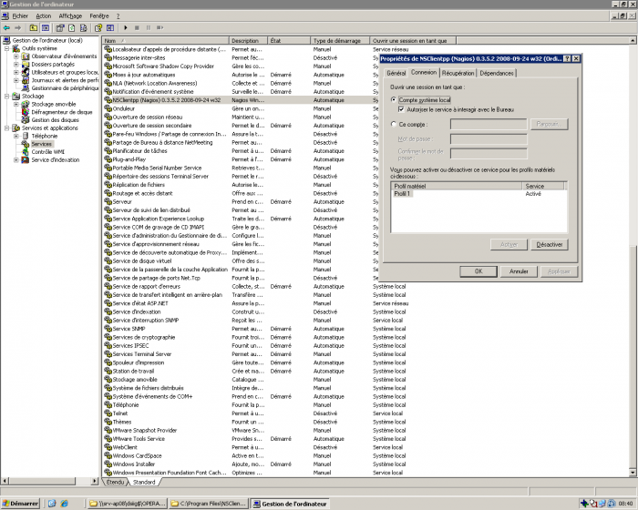

[[[Supervision Nagios
Agent](supervision-nagios-agent@do=backlink.html)]]

[wiki monitoring-fr.org](../../start.html "[ALT+H]")

-   [Accueil](../../index.html "Cliquez pour revenir |  l'accueil")
-   [Blog](http://www.monitoring-fr.org "Blog & News")
-   [Forums](http://forums.monitoring-fr.org "Forums")
-   [Doc](http://doc.monitoring-fr.org "Doc")
-   [Forge](https://github.com/monitoring-fr "Forge")

Vous êtes ici: [Accueil](../../start.html "start") »
[Nagios](../start.html "nagios:start") » [Mise en place complète de
Nagios sur RHEL
5.4](start.html "nagios:mise-en-place-complete-nagios-sur-rhel-5.4:start")
» [Supervision Nagios
Agent](supervision-nagios-agent.html "nagios:mise-en-place-complete-nagios-sur-rhel-5.4:supervision-nagios-agent")

### Table des matières {.toggle}

-   [Supervision Nagios
    Agent](supervision-nagios-agent.html#supervision-nagios-agent)
-   [Supervision serveur avec agent installé sur la machine à
    superviser](supervision-nagios-agent.html#supervision-serveur-avec-agent-installe-sur-la-machine-a-superviser)
    -   [Pré-requis](supervision-nagios-agent.html#pre-requis)
    -   [Ajout d'un système Windows avec
        agent](supervision-nagios-agent.html#ajout-d-un-systeme-windows-avec-agent)
        -   [Sur le serveur
            Nagios](supervision-nagios-agent.html#sur-le-serveur-nagios)
        -   [Sur le serveur à
            superviser](supervision-nagios-agent.html#sur-le-serveur-a-superviser)
        -   [Sur le serveur
            Nagios](supervision-nagios-agent.html#sur-le-serveur-nagios1)
    -   [Ajout d'un système Linux avec
        agent](supervision-nagios-agent.html#ajout-d-un-systeme-linux-avec-agent)
        -   [Sur le serveur
            Nagios](supervision-nagios-agent.html#sur-le-serveur-nagios2)
        -   [Sur le serveur à
            superviser](supervision-nagios-agent.html#sur-le-serveur-a-superviser1)
        -   [Sur le serveur
            Nagios](supervision-nagios-agent.html#sur-le-serveur-nagios3)

Supervision Nagios Agent {#supervision-nagios-agent .sectionedit1}
========================

Documentation d’explication de la supervision d’éléments à l’aide d’un
agent.

Supervision serveur avec agent installé sur la machine à superviser {#supervision-serveur-avec-agent-installe-sur-la-machine-a-superviser .sectionedit2}
===================================================================

Pour superviser les machines, deux solutions s’offrent à nous. La
solution de l’agent Windows et Linux installé sur chaque machine ou la
solution d’utiliser SNMP pour tout les systèmes qui supportent SNMP
(c’est à dire tous) et ne pas avoir besoin d’installer de logiciel
supplémentaire sur le serveur. On peut combiner les deux sans problèmes,
mais afin d’homogénéiser, il est intéressant de faire un choix entre les
deux.

Cette partie est à lire uniquement si on a fait le choix d’utiliser les
agents sur chaque serveur au lieu d’SNMP. Sinon, se reporter à la
documentation nommé [Supervision Nagios
SNMP](supervision-nagios-snmp.html "nagios:mise-en-place-complete-nagios-sur-rhel-5.4:supervision-nagios-snmp").

Pré-requis {#pre-requis .sectionedit3}
----------

-   @IP du serveur de supervision (srv-supervision) : 172.20.50.163
-   @IP du serveur Windows de test (srv-w2k3-test) : 172.20.50.30

Ajout d'un système Windows avec agent {#ajout-d-un-systeme-windows-avec-agent .sectionedit4}
-------------------------------------

Utilisation de l’agent actif Windows NSClient++.

### Sur le serveur Nagios {#sur-le-serveur-nagios .sectionedit5}

Dans /etc/nagios/nagios.cfg, les lignes suivantes doivent être actives.

~~~
# Definitions for Windows hosts
cfg_file=/etc/nagios/objects/hst-win.cfg

# Definitions for Windows groups
cfg_file=/etc/nagios/objects/grp-win.cfg

# Definitions for Windows services (services and service groups)
cfg_file=/etc/nagios/objects/ser-win.cfg
~~~

Récupérer NSClient++ :
[http://sourceforge.net/projects/nscplus](http://sourceforge.net/projects/nscplus "http://sourceforge.net/projects/nscplus")

### Sur le serveur à superviser {#sur-le-serveur-a-superviser .sectionedit6}

Installer le NSClient++ avec l’installeur MSI : pas de difficultés
particulières.

Aller dans la gestion des services Windows et faire une clic droit
propriétés sur le service NSClientpp. Vérifier la configuration comme
suit.

Aller dans `C:\Program Files\NSClient++\NSC.ini`.

Tout décommenter sauf `CheckWMI.dll` et `RemoteConfiguration.dll`

~~~
[modules]
FileLogger.dll
CheckSystem.dll
CheckDisk.dll
NSClientListener.dll
NRPEListener.dll
SysTray.dll
CheckEventLog.dll
CheckHelpers.dll
~~~

Ajouter un mot de passe utiliser par le serveur pour accéder aux
informations distantes du serveur Windows.

~~~
[Settings]
;# PASSWORD
;  This is the password (-s) that is required to access NSClient remotely. If you leave this blank everyone will be able to access the daemon remotly.
password=MotDePasse
~~~

Dans la même section, ajouter l’adresse IP du serveur Nagios pour
limiter les autorisations à cette adresse IP seulement.

~~~
;# ALLOWED HOST ADDRESSES
;  This is a comma-delimited list of IP address of hosts that are allowed to talk to the all daemons.
;  If leave this blank anyone can access the deamon remotly (NSClient still requires a valid password).
;  The syntax is host or ip/mask so 192.168.0.0/24 will allow anyone on that subnet access
allowed_hosts=172.20.50.163/32

Décommenter le port afin d'utiliser le port 12489 par défaut.
[NSClient]
;# NSCLIENT PORT NUMBER
;  This is the port the NSClientListener.dll will listen to.
port=12489
~~~

Sauvegarder le fichier et clic droit démarrer sur le service windows.
Une icône s’affiche dans la barre des tâches. La machine peut maintenant
être ajoutée dans la configuration nagios afin de permettre la remonté
d’informations.

### Sur le serveur Nagios {#sur-le-serveur-nagios1 .sectionedit7}

De retour sur le serveur dans le fichier
`/etc/nagios/objects/hst-win.cfg`.

Modifier l’host existant en changeant son nom et l’adresse IP du serveur
Windows que nous voulons superviser.

~~~
define host{
        use             windows-server  ; Inherit default values from a template
        host_name       srv-w2k3-sup    ; The name we're giving to this host
        address         172.20.50.30     ; IP address of the host
        hostgroups      windows-servers ; Host belong group
        }
~~~

Laisser le reste par défaut. Le serveur Windows sera dans le groupe
`windows-servers` (directive hostgroups), et aura les services suivants
de surveillés.

-   Alerte CPU.
-   Alerte mémoire.
-   Alerte espace disque.
-   Uptime.

Pour ajouter le password de l’agent, le mettre dans le fichier
`/etc/nagios/objects/commands.cfg`.

~~~
# 'check_nt' command definition
define command{
        command_name    check_nt
        command_line    $USER1$/check_nt -H $HOSTADDRESS$ -p 12489 -s MotDePasse -v $ARG1$ $ARG2$
        }
~~~

Il faut juste ajouter le `-s MONPASSWORD` à la commande.

Pour vérifier complètement la configuration de Nagios, utiliser la
commande suivante.

~~~
nagios -v /etc/nagios/nagios.cfg
<code/>

Les fichiers inclus dans nagios.cfg sont aussi vérifié, c'est pour cette raison qu'il faut toujours vérifier le fichier ''nagios.cfg'' car de toute façon la totalité des fichiers inclus seront parcourus et testés.

Redémarrer le serveur nagios.
<code>
/etc/init.d/nagios restart
~~~

Consulter les informations récoltées sur l’interface web :
[http://srv-supervision.domaine.local/nagios](http://srv-supervision.domaine.local/nagios "http://srv-supervision.domaine.local/nagios")
Il faut un petit temps d’apprentissage afin que les informations soient
remontées.

Ajout d'un système Linux avec agent {#ajout-d-un-systeme-linux-avec-agent .sectionedit8}
-----------------------------------

Utilisation de l’agent actif Linux NRPE.

### Sur le serveur Nagios {#sur-le-serveur-nagios2 .sectionedit9}

Installer le plugin nrpe pour nagios.

~~~
rpm -ivh nagios-plugins-nrpe-2.12-6.el5.i386.rpm
~~~

N’installer que le plugin sur le serveur nagios, apparement, il peut y
avoir des incidences si on installe tous les paquets NRPE (y compris les
paquets clients) sur la même machine que le serveur Nagios.

### Sur le serveur à superviser {#sur-le-serveur-a-superviser1 .sectionedit10}

Installer nagios-nrpe. Pour cela, il est nécessaire d’installer
nagios-plugins au préalable.

~~~
rpm -ivh nagios-plugins-1.4.13-11.el5.i386.rpm
rpm -ivh nagios-nrpe-2.5.2-1.el5.rf.i386.rpm
~~~

Installer les plugins de bases pour superviser uniquement ce qu’on veut
sur les clients. Aller dans le dossier plugin-client et installer les
plugins suivants.

~~~
rpm -ivh nagios-plugins-load-1.4.13-11.el5.i386.rpm
rpm -ivh nagios-plugins-disk-1.4.13-11.el5.i386.rpm
~~~

Installer les dépendances Perl suivantes.

-   perl-Digest-SHA1
-   perl-Socket6
-   perl-Crypt-DES
-   perl-Digest-HMAC
-   perl-Net-SNMP

Utiliser les paquets présent dans le dépôt à l’aide de la commande
`yum install`. S’ils ne sont pas présent, effectuer la commande rpm -ivh
sur chaque paquets récupérés sur internet.

Installer le paquet fping.

~~~
rpm -ivh fping-2.4-1.b2.2.el5.rf.i386.rpm
~~~

Vérifier qu’xinetd est lancé au démarrage dans le runlevel qu’on utilise
(ici runlevel 5).

~~~
chkconfig --list | grep xinetd
~~~

Si ce n’est pas le cas, l’activer.

~~~
chkconfig --level 5 xinetd on
~~~

xinetd est un super daemon qui permet de ne pas laisser une connexion
ouverte de manière permanent mais uniquement lorsque celle-ci a une
utilité. Typiquement, le daemon ne s’allume que lorsque une requête est
demandée. Dans notre cas, NRPE ne sera lancé que lorsque le serveur NRPE
demandera des informations. Le reste du temps, le daemon ne sera pas
lancé.

Éditer le fichier `/etc/xinetd.d/nrpe` et l’activer (`disable = no`) et
ajouter l’adresse IP qui a l’autorisation d’accéder aux informations de
la machine (ici 172.20.50.163).

~~~
# default: off
# description: NRPE (Nagios Remote Plugin Executor)
service nrpe
{
        flags           = REUSE
        type            = UNLISTED
        port            = 5666
        socket_type     = stream
        wait            = no
        user            = nagios
        group           = nagios
        server          = /usr/sbin/nrpe
        server_args     = -c /etc/nagios/nrpe.cfg --inetd
        log_on_failure  += USERID
        disable         = no
        only_from       = 127.0.0.1 172.20.50.163
}
~~~

Redémarrer le service xinetd afin de prendre en compte les
modifications.

~~~
/etc/init.d/xinetd restart
~~~

Dans le fichier de configuration d’NRPE, dans /etc/nagios/nrpe.cfg, on
ajoute les commandes qui représentent ce qu’on veut obtenir comme
informations sur le serveur. J’ai modifié les informations par défaut
pour coller le plus possible à ce que nous cherchons.

~~~
command[check_users]=/usr/lib/nagios/plugins/check_users -w 5 -c 10
#CPU
command[check_load]=/usr/lib/nagios/plugins/check_load -w 15,10,5 -c 30,25,20
#Disk
#verifie /tmp /var et /usr à 10% et 5% et / à 150MB et 100MB
command[check_disk]=/usr/lib/nagios/plugins/check_disk -w 10% -c 5% -p /tmp -p /var -p /usr -C -w 150 -c 100 -p /
command[check_zombie_procs]=/usr/lib/nagios/plugins/check_procs -w 5 -c 10 -s Z
command[check_total_procs]=/usr/lib/nagios/plugins/check_procs -w 150 -c 200
~~~

Nous n’avons pas besoin de redémarrer de daemon sur le serveur à
superviser car c’est xinetd qui s’occupe de lancer le daemon uniquement
le temps de l’utilisation du service. De cette manière la nouvelle
configuration est appliquée à chaque nouvelle vérification du serveur
Nagios.

### Sur le serveur Nagios {#sur-le-serveur-nagios3 .sectionedit11}

Dans `/etc/nagios/objects/commands.cfg`, il faut ajouter la commande
check\_nrpe sinon Nagios ne la reconnaîtra pas. Ajouter cette définition
à la suite des commandes déjà définies.

~~~
##############
# NRPE       #
##############
# 'check_nrpe' command definition
define command{
        command_name    check_nrpe
        command_line    $USER1$/check_nrpe -H $HOSTADDRESS$ -c $ARG1$
        }

Définition des services associés à la commande check_nrpe dans le fichier des services linux : ser-lin.cfg

define service{
        use                     generic-service         ;Use generic-service template
        hostgroup_name          linux-servers           ;Apply this service to hostgroup
        service_description     chk-disk                ;Description of service
        check_command           check_nrpe!check_disk   ;Command
        servicegroups           ser-lin-base            ;Service belong servicegroup
        }

define service{
        use                     generic-service
        hostgroup_name          linux-servers
        service_description     chk-cpu
        check_command           check_nrpe!check_load
        servicegroups           ser-lin-base
        }
~~~

Vérifier la configuration pour éliminer les éventuelles erreurs.

~~~
nagios -v /etc/nagios/nagios.cfg
~~~

Redémarrer le service Nagios.

~~~
/etc/init.d/nagios restart
~~~

Accéder à l’interface web de nagios :
[http://srv-supervision.domaine.local/nagios/](http://srv-supervision.domaine.local/nagios/ "http://srv-supervision.domaine.local/nagios/")

SOMMAIRE {#sommaire .sectionedit1}
--------

**[Accueil](../../start.html "start")**

**[Supervision](../../supervision/start.html "supervision:start")**

-   [Nagios](../start.html "nagios:start")
-   [Centreon](../../centreon/start.html "centreon:start")
-   [Shinken](../../shinken/start.html "shinken:start")
-   [Zabbix](../../zabbix/start.html "zabbix:start")
-   [OpenNMS](../../opennms/start.html "opennms:start")
-   [EyesOfNetwork](../../eyesofnetwork/start.html "eyesofnetwork:start")
-   [Groundwork](../../groundwork/start.html "groundwork:start")
-   [Zenoss](../../zenoss/start.html "zenoss:start")
-   [Vigilo](../../vigilo/start.html "vigilo:start")
-   [Icinga](../../icinga/start.html "icinga:start")
-   [Cacti](../../cacti/start.html "cacti:start")
-   [Ressenti
    utilisateur](../../supervision/eue/start.html "supervision:eue:start")
-   [Ressenti utilisateur avec
    sikuli](../../sikuli/eue/start.html "sikuli:eue:start")

**[Hypervision](../../hypervision/start.html "hypervision:start")**

-   [Canopsis](../../canopsis/start.html "canopsis:start")

**[Sécurité](../../securite/start.html "securite:start")**

**[Infrastructure](../../infra/start.html "infra:start")**

**[Développement](../../dev/start.html "dev:start")**

Nagios {#nagios .sectionedit1}
------

-   [Arborescence des
    fichiers](../installation-layout.html "nagios:installation-layout")
-   [Commandes de remontée de
    contrôle](../ocsp-ochp.html "nagios:ocsp-ochp")
-   [Données Nagios dans un ramdisk](../ramdisk.html "nagios:ramdisk")
-   [Event Handlers](../event_handlers.html "nagios:event_handlers")
-   [Gabarits d'objets de
    configuration](../templates.html "nagios:templates")
-   [Installation Nagios 2 & 3 sur Ubuntu 6.0.6, 8.0.4 et 10.0.4
    LTS](../ubuntu-install.html "nagios:ubuntu-install")
-   [Installation Nagios 3 sur Debian Squeeze
    6.0.3](../debian-install.html "nagios:debian-install")
-   [Installation de Nagios 3.x sur CentOS
    5.3](../nagios-centos-install.html "nagios:nagios-centos-install")
-   [Introduction aux objets de
    configuration](../configobjects.html "nagios:configobjects")
-   [Introduction à
    Nagios](../nagios-introduction.html "nagios:nagios-introduction")
-   [Liens Nagios](../links.html "nagios:links")
-   [Mise en place complète de Nagios sur RHEL
    5.4](start.html "nagios:mise-en-place-complete-nagios-sur-rhel-5.4:start")
-   [NAGIOS - Guide de démarrage pour
    débutant](../nagios-debutant/start.html "nagios:nagios-debutant:start")
-   [Nagios Addons](../addons/start.html "nagios:addons:start")
-   [Nagios
    Integration](../integration/start.html "nagios:integration:start")
-   [Nagios Plugins](../plugins/start.html "nagios:plugins:start")
-   [Nagios et les
    notifications](../notifications.html "nagios:notifications")
-   [Outils de supervision d'un hôte
    Windows](../windows-client.html "nagios:windows-client")
-   [Référence des objets de
    configuration](../objects-reference.html "nagios:objects-reference")
-   [Superviser un hôte Windows avec
    NSClient++](../nagios-nsclient-host.html "nagios:nagios-nsclient-host")
-   [Supervision Windows en mode
    passif](../supervision-windows-passif.html "nagios:supervision-windows-passif")
-   [Supervision vmware esx](../vmware_esx.html "nagios:vmware_esx")
-   [check-list de diagnostic](../debug.html "nagios:debug")

-   [Afficher le texte
    source](supervision-nagios-agent@do=edit&rev=0.html "Afficher le texte source [V]")
-   [Anciennes
    révisions](supervision-nagios-agent@do=revisions.html "Anciennes révisions [O]")
-   [Derniers
    changements](supervision-nagios-agent@do=recent.html "Derniers changements [R]")
-   [Liens vers cette
    page](supervision-nagios-agent@do=backlink.html "Liens vers cette page")
-   [Gestionnaire de
    médias](supervision-nagios-agent@do=media.html "Gestionnaire de médias")
-   [Index](supervision-nagios-agent@do=index.html "Index [X]")
-   [Connexion](supervision-nagios-agent@do=login&sectok=6bca6bdf16f8880de3d6d3649db89a26.html "Connexion")
-   [Haut de
    page](supervision-nagios-agent.html#dokuwiki__top "Haut de page [T]")

nagios/mise-en-place-complete-nagios-sur-rhel-5.4/supervision-nagios-agent.txt
· Dernière modification: 2013/03/29 09:39 (modification externe)

