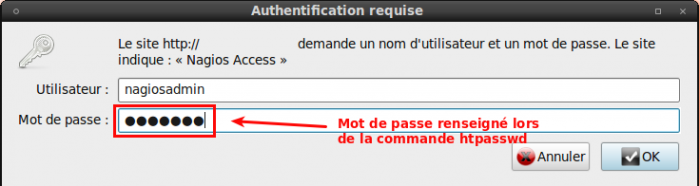

[[[Installation de Nagios 3.x sur CentOS
5.3](nagios-centos-install@do=backlink.html)]]

[wiki monitoring-fr.org](../start.html "[ALT+H]")

-   [Accueil](../index.html "Cliquez pour revenir |  l'accueil")
-   [Blog](http://www.monitoring-fr.org "Blog & News")
-   [Forums](http://forums.monitoring-fr.org "Forums")
-   [Doc](http://doc.monitoring-fr.org "Doc")
-   [Forge](https://github.com/monitoring-fr "Forge")

Vous êtes ici: [Accueil](../start.html "start") »
[Nagios](start.html "nagios:start") » [Installation de Nagios 3.x sur
CentOS 5.3](nagios-centos-install.html "nagios:nagios-centos-install")

### Table des matières {.toggle}

-   [Installation de Nagios 3.x sur CentOS
    5.3](nagios-centos-install.html#installation-de-nagios-3x-sur-centos-53)
    -   [Pré-requis](nagios-centos-install.html#pre-requis)
        -   [Installation du dépôt "RPM
            forge"](nagios-centos-install.html#installation-du-depot-rpm-forge)
        -   [Installation des
            packages](nagios-centos-install.html#installation-des-packages)
    -   [Création Utilisateur et groupes
        Nagios](nagios-centos-install.html#creation-utilisateur-et-groupes-nagios)
    -   [Compilation et
        Installation](nagios-centos-install.html#compilation-et-installation)
    -   [Sécuriser l'accès à
        Nagios](nagios-centos-install.html#securiser-l-acces-a-nagios)
    -   [Installation des Plugins
        Nagios](nagios-centos-install.html#installation-des-plugins-nagios)
    -   [Problèmes
        éventuels](nagios-centos-install.html#problemes-eventuels)
        -   [Règle de Firewall
            RedHat](nagios-centos-install.html#regle-de-firewall-redhat)
        -   [Problème de
            droits](nagios-centos-install.html#probleme-de-droits)
        -   [Problème d'Internal Error lors d'accès aux
            CGI](nagios-centos-install.html#probleme-d-internal-error-lors-d-acces-aux-cgi)

Installation de Nagios 3.x sur CentOS 5.3 {#installation-de-nagios-3x-sur-centos-53 .sectionedit1}
=========================================

Pré-requis {#pre-requis .sectionedit2}
----------

### Installation du dépôt "RPM forge" {#installation-du-depot-rpm-forge .sectionedit3}

Nous allons ajouter aux sources de dépôt celui de RPMForge pour éviter
quelques désagréments de compilation (par exemple RRDTool n’est pas
disponible sur les dépôts officiels).

Dans un terminal, exécutez les commandes suivantes :

~~~
# wget http://apt.sw.be/redhat/el5/en/i386/RPMS.dag/rpmforge-release-0.3.6-1.el5.rf.i386.rpm

# rpm --import http://dag.wieers.com/rpm/packages/RPM-GPG-KEY.dag.txt

# rpm -Uvh rpmforge-release-0.3.6-1.el5.rf.i386.rpm
~~~

### Installation des packages {#installation-des-packages .sectionedit4}

~~~
# yum install httpd gd fontconfig-devel libjpeg-devel libpng-devel gd-devel perl-GD openssl-devel php mailx postfix cpp gcc gcc-c++ libstdc++ glib2-devel libtool-ltdl-devel
~~~

Création Utilisateur et groupes Nagios {#creation-utilisateur-et-groupes-nagios .sectionedit5}
--------------------------------------

Nous allons créer l’utilisateur Nagios et les groupes Nagios dont on a
besoin

~~~
# groupadd -g 6000 nagios
# groupadd -g 6001 nagcmd
# useradd -u 6000 -g nagios -G nagcmd -d /usr/local/nagios -c "Nagios Admin" nagios
~~~

Compilation et Installation {#compilation-et-installation .sectionedit6}
---------------------------

On récupère les sources :

~~~
# wget http://prdownloads.sourceforge.net/sourceforge/nagios/nagios-3.2.0.tar.gz
# tar xzf nagios-3.2.0.tar.gz
# cd nagios-3.2.0
~~~

Pour la compilation de Nagios, il est important de suivre toutes les
étapes ci-dessous

~~~
# ./configure --prefix=/usr/local/nagios --with-nagios-user=nagios --with-nagios-group=nagios --with-command-user=nagios --with-command-group=nagcmd --enable-event-broker --enable-nanosleep --enable-embedded-perl --with-perlcache

# make all

# make install

# make install-init

# make install-commandmode

# make install-webconf

# make install-config
~~~

Sécuriser l'accès à Nagios {#securiser-l-acces-a-nagios .sectionedit7}
--------------------------

Le minimum en sécurité pour éviter que n’importe qui accède à Nagios est
une mire de connexion apache.

Nous allons créer un fichier des utilisateurs ayant accès à Nagios (le
mot de passe qui vous demandera sera le mot de passe à mettre lors de la
connexion à la mire) :

~~~
# htpasswd -c /usr/local/nagios/etc/htpasswd.users nagiosadmin
~~~

L’utilisateur Nagios devient propriétaire du fichier

~~~
# chown nagios:nagcmd /usr/local/nagios/etc/htpasswd.users
~~~

On ajoute l’utilisateur apache au groupe Nagios

~~~
# usermod -a -G nagios,nagcmd apache
~~~

Redémarrez Apache

~~~
/etc/init.d/httpd restart
~~~

Maintenant vous avez accès à Nagios via l’url :
<http://IP_SERV_NAGIOS/nagios>

A la mire de connexion, il faudra entrer le login et mot de passe
renseigné plus haut avec la commande htpasswd

Installation des Plugins Nagios {#installation-des-plugins-nagios .sectionedit8}
-------------------------------

C’est bien beau d’avoir installé Nagios, mais il nous faut des plugins
avec tous ça. On va récupérer les sources.

~~~
# wget http://ovh.dl.sourceforge.net/sourceforge/nagiosplug/nagios-plugins-1.4.13.tar.gz
# tar xzf nagios-plugins-1.4.13.tar.gz 
# cd nagios-plugins-1.4.13
~~~

-   **Compilation et Installation**

~~~
# ./configure --with-nagios-user=nagios --with-nagios-group=nagios --with-command-user=nagios --with-command-group=nagcmd --prefix=/usr/local/nagios

# make all

# make install
~~~

Problèmes éventuels {#problemes-eventuels .sectionedit9}
-------------------

### Règle de Firewall RedHat {#regle-de-firewall-redhat .sectionedit10}

Vous n’avez pas du tout accès via l’url donné. Normal, sous Redhat la
règle de firewall (IpTables) est aggressive. Donnez accès au port 80 et
vous pourrez voir votre interface web

A developper

### Problème de droits {#probleme-de-droits .sectionedit11}

Il vous met “Permissions denied /nagios”, aller voir dans le répertoire
d’installation de nagios. Perso sur 2 installations de Redhat, à chaque
fois il m’a mis des droits aux répertoires nagios 700 alors que ça doit
être 755

~~~
# chmod 755 /usr/local/nagios
~~~

### Problème d'Internal Error lors d'accès aux CGI {#probleme-d-internal-error-lors-d-acces-aux-cgi .sectionedit12}

Faites attention à SElinux, étant activé, j’avais des “internal Error”
lorsque je voulais accéder aux cgi. On rencontre souvent des problèmes
avec le SElinux.

Désactivation de Selinux, éditer le fichier de configuration de SELINUX
:

~~~
# vi /etc/selinux/config
~~~

~~~
# This file controls the state of SELinux on the system.
# SELINUX= can take one of these three values:
# enforcing - SELinux security policy is enforced.
# permissive - SELinux prints warnings instead of enforcing.
# disabled - No SELinux policy is loaded.
SELINUX=disabled
# SELINUXTYPE= can take one of these two values:
# targeted - Only targeted network daemons are protected.
# strict - Full SELinux protection.
SELINUXTYPE=targeted
~~~

**Vous devez redémarrer votre machine pour que cela soit pris en
compte.**

SOMMAIRE {#sommaire .sectionedit1}
--------

**[Accueil](../start.html "start")**

**[Supervision](../supervision/start.html "supervision:start")**

-   [Nagios](start.html "nagios:start")
-   [Centreon](../centreon/start.html "centreon:start")
-   [Shinken](../shinken/start.html "shinken:start")
-   [Zabbix](../zabbix/start.html "zabbix:start")
-   [OpenNMS](../opennms/start.html "opennms:start")
-   [EyesOfNetwork](../eyesofnetwork/start.html "eyesofnetwork:start")
-   [Groundwork](../groundwork/start.html "groundwork:start")
-   [Zenoss](../zenoss/start.html "zenoss:start")
-   [Vigilo](../vigilo/start.html "vigilo:start")
-   [Icinga](../icinga/start.html "icinga:start")
-   [Cacti](../cacti/start.html "cacti:start")
-   [Ressenti
    utilisateur](../supervision/eue/start.html "supervision:eue:start")
-   [Ressenti utilisateur avec
    sikuli](../sikuli/eue/start.html "sikuli:eue:start")

**[Hypervision](../hypervision/start.html "hypervision:start")**

-   [Canopsis](../canopsis/start.html "canopsis:start")

**[Sécurité](../securite/start.html "securite:start")**

**[Infrastructure](../infra/start.html "infra:start")**

**[Développement](../dev/start.html "dev:start")**

Nagios {#nagios .sectionedit1}
------

-   [Arborescence des
    fichiers](installation-layout.html "nagios:installation-layout")
-   [Commandes de remontée de
    contrôle](ocsp-ochp.html "nagios:ocsp-ochp")
-   [Données Nagios dans un ramdisk](ramdisk.html "nagios:ramdisk")
-   [Event Handlers](event_handlers.html "nagios:event_handlers")
-   [Gabarits d'objets de
    configuration](templates.html "nagios:templates")
-   [Installation Nagios 2 & 3 sur Ubuntu 6.0.6, 8.0.4 et 10.0.4
    LTS](ubuntu-install.html "nagios:ubuntu-install")
-   [Installation Nagios 3 sur Debian Squeeze
    6.0.3](debian-install.html "nagios:debian-install")
-   [Installation de Nagios 3.x sur CentOS
    5.3](nagios-centos-install.html "nagios:nagios-centos-install")
-   [Introduction aux objets de
    configuration](configobjects.html "nagios:configobjects")
-   [Introduction à
    Nagios](nagios-introduction.html "nagios:nagios-introduction")
-   [Liens Nagios](links.html "nagios:links")
-   [Mise en place complète de Nagios sur RHEL
    5.4](mise-en-place-complete-nagios-sur-rhel-5.4/start.html "nagios:mise-en-place-complete-nagios-sur-rhel-5.4:start")
-   [NAGIOS - Guide de démarrage pour
    débutant](nagios-debutant/start.html "nagios:nagios-debutant:start")
-   [Nagios Addons](addons/start.html "nagios:addons:start")
-   [Nagios
    Integration](integration/start.html "nagios:integration:start")
-   [Nagios Plugins](plugins/start.html "nagios:plugins:start")
-   [Nagios et les
    notifications](notifications.html "nagios:notifications")
-   [Outils de supervision d'un hôte
    Windows](windows-client.html "nagios:windows-client")
-   [Référence des objets de
    configuration](objects-reference.html "nagios:objects-reference")
-   [Superviser un hôte Windows avec
    NSClient++](nagios-nsclient-host.html "nagios:nagios-nsclient-host")
-   [Supervision Windows en mode
    passif](supervision-windows-passif.html "nagios:supervision-windows-passif")
-   [Supervision vmware esx](vmware_esx.html "nagios:vmware_esx")
-   [check-list de diagnostic](debug.html "nagios:debug")

-   [Afficher le texte
    source](nagios-centos-install@do=edit&rev=0.html "Afficher le texte source [V]")
-   [Anciennes
    révisions](nagios-centos-install@do=revisions.html "Anciennes révisions [O]")
-   [Derniers
    changements](nagios-centos-install@do=recent.html "Derniers changements [R]")
-   [Liens vers cette
    page](nagios-centos-install@do=backlink.html "Liens vers cette page")
-   [Gestionnaire de
    médias](nagios-centos-install@do=media.html "Gestionnaire de médias")
-   [Index](nagios-centos-install@do=index.html "Index [X]")
-   [Connexion](nagios-centos-install@do=login&sectok=6bca6bdf16f8880de3d6d3649db89a26.html "Connexion")
-   [Haut de
    page](nagios-centos-install.html#dokuwiki__top "Haut de page [T]")

nagios/nagios-centos-install.txt · Dernière modification: 2013/03/29
09:39 (modification externe)

