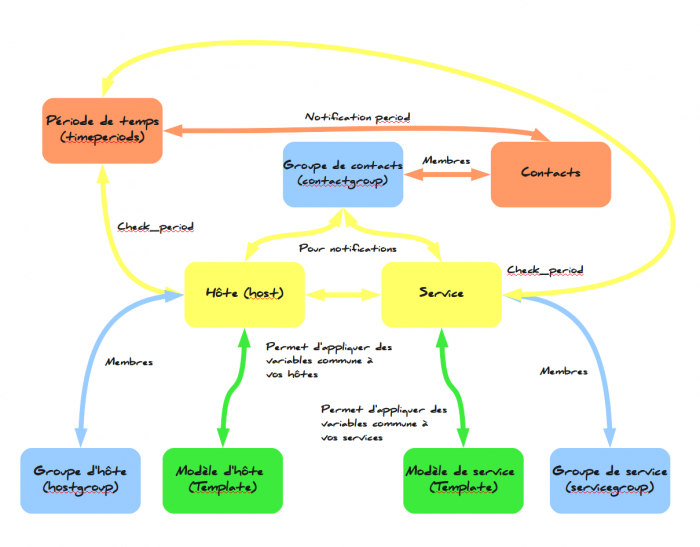
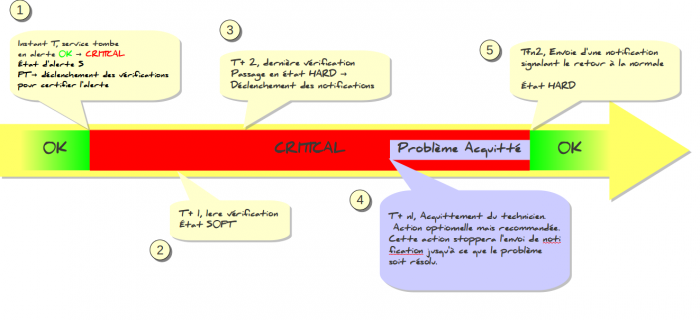
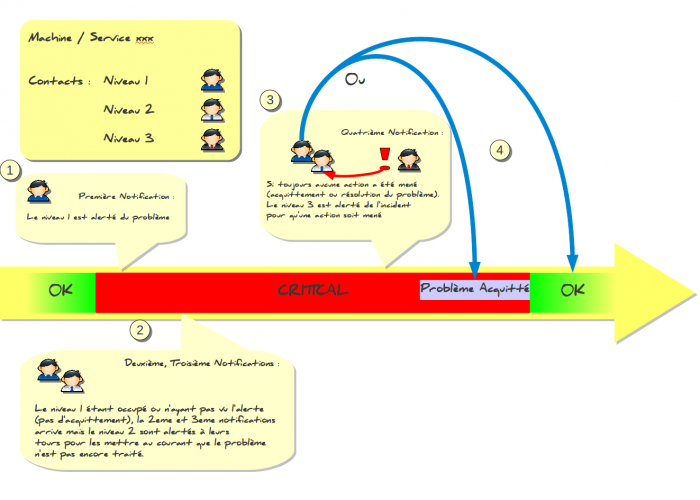

[[[Ce qu'il faut savoir sur
Nagios](ce-qu-il-faut-savoir@do=backlink.html)]]

[wiki monitoring-fr.org](../../start.html "[ALT+H]")

-   [Accueil](../../index.html "Cliquez pour revenir |  l'accueil")
-   [Blog](http://www.monitoring-fr.org "Blog & News")
-   [Forums](http://forums.monitoring-fr.org "Forums")
-   [Doc](http://doc.monitoring-fr.org "Doc")
-   [Forge](https://github.com/monitoring-fr "Forge")

Vous êtes ici: [Accueil](../../start.html "start") »
[Nagios](../start.html "nagios:start") » [NAGIOS - Guide de démarrage
pour débutant](start.html "nagios:nagios-debutant:start") » [Ce qu'il
faut savoir sur
Nagios](ce-qu-il-faut-savoir.html "nagios:nagios-debutant:ce-qu-il-faut-savoir")

### Table des matières {.toggle}

-   [Ce qu'il faut savoir sur
    Nagios](ce-qu-il-faut-savoir.html#ce-qu-il-faut-savoir-sur-nagios)
    -   [L'arborescence](ce-qu-il-faut-savoir.html#l-arborescence)
    -   [La configuration de
        Nagios](ce-qu-il-faut-savoir.html#la-configuration-de-nagios)
    -   [Fonctionnement des
        notifications](ce-qu-il-faut-savoir.html#fonctionnement-des-notifications)
    -   [Fonctionnement des
        escalades](ce-qu-il-faut-savoir.html#fonctionnement-des-escalades)
    -   [Acquitter un
        incident](ce-qu-il-faut-savoir.html#acquitter-un-incident)

Ce qu'il faut savoir sur Nagios {#ce-qu-il-faut-savoir-sur-nagios .sectionedit1}
===============================

L'arborescence {#l-arborescence .sectionedit2}
--------------

L’installation de nagios via les sources installe votre contenu dans
/usr/local/nagios par défaut. Ce répertoire est constitué de sous
répertoire qui ont chacun un rôle :

-   **/usr/local/nagios/bin** → Contient les binaires de nagios

-   **/usr/local/nagios/sbin** → Contient les cgi de nagios

-   **/usr/local/nagios/etc** → Contient la configuration de Nagios

-   **/usr/local/nagios/libexec** → Contient les scripts, plugins de
    Nagios qui vont servir à interroger votre Infrastructure

-   **/usr/local/nagios/var** → Contient les fichiers de logs, commandes
    et performances

La configuration de Nagios {#la-configuration-de-nagios .sectionedit3}
--------------------------

Le coeur de Nagios gère sa configuration d’une manière bien
particulière. Et lorsque l’on est débutant, ça peut être ardu à
comprendre. Nous allons résumer de manière très simpliste les liens
entre les éléments de configurations dans un schéma.

-   Les timeperiods sont utiles pour fixer : les plages de notifications
    des contacts, les plages de contrôle de vos hôtes et services.

-   Les contacts sont les personnes que vous désirez voir alerter par la
    supervision

-   Les contactgroups sont, comme leur nom l’indique, des groupes que
    vous allez former pour alerter plusieurs personnes (souvent des
    personnes avec un même rôle ex: administrateur, exploitant,
    direction …)

-   Les hosts représentent les machines physiques que vous voulez voir
    dans votre supervision

-   Les services sont les contrôles que vous désirez effectuer sur votre
    hôte (ex : Service DNS, démon SSH tourne, la CPU, la RAM, l’IO Disk,
    etc …)

-   Les groupes d’hôtes sont des groupes que vous allez créer pour
    rassembler des hôtes selon un rôle, une application ou autres
    éléments communs.

-   Les servicegroups sont des groupes de services que vous allez créer.
    C’est un point de configuration qui est le moins utilisé car sa
    gestion est assez lourde. Mais peut être utile sur des
    configurations plus complexes ou regrouper des services pour les
    considérer comme un cluster applicatif etc …

-   Les templates sont là pour faciliter la vie de l’administrateur de
    supervision. Il permet de raccourcir vos définitions d’hôtes et de
    services regroupant des variables communes lors de chaque
    définition. **Pour être clair au lieu que votre définition pour un
    hôte contienne 30 lignes, grâce aux templates vous n’en aurez plus
    que 4 !**

Fonctionnement des notifications {#fonctionnement-des-notifications .sectionedit4}
--------------------------------

1.  A l’instant T, la machine ou le service supervisé passe de l’état OK
    –\> Critical. Nagios va passer la machine / service est état SOFT
    –\> Début du déclenchement du cycle de vérification de la fiabilité
    de l’incident (*max\_check\_attemps*)
2.  Ensuite, la première vérification a lieu à l’instant T+1 qui peut
    être définit grâce à la variable *retry\_interval*
3.  Une fois arrivée à la fin du cycle de vérification, Nagios va passer
    la machine / service en état HARD. C’est à dire que l’incident est
    certifié et que le cycle de notification va commencer.
4.  La 4eme étape est optionnelle mais plus que recommandée dans la
    vision ITIL et dans la logique du fonctionnement de la Supervision.
    L’action d’acquittement va permettre de stopper l’envoi des
    notifications et marqué votre intervention sur la supervision pour
    le traitement du problème. Ceci informe le reste des équipes que
    vous ayez bien pris le problème en compte.
5.  Le problème est résolu, Nagios envoi une dernière notification
    (réglage par défaut) pour signaler que tout est rentré dans l’ordre

Fonctionnement des escalades {#fonctionnement-des-escalades .sectionedit5}
----------------------------

Ceci est un exemple d’escalade parmi tant d’autres. Le schéma ci-dessous
est là pour vous expliquer de manière simple le principe d’escalades de
notifications.

1.  La première notification est envoyée à l’équipe de Niveau 1
    (support, hotline, exploitation,…)
2.  La deuxième et troisième notification sont envoyées toujours au
    niveau 1 mais aussi au niveau 2 (responsable, administrateurs …)
    pour l’alerter qu’aucune action n’a été réalisé pour traiter
    l’incident pour X raisons
3.  La quatrième notification est envoyé au Niveau 3 (astreinte,
    responsable, DSI …) pour qu’une action soit mené au plus tôt sur cet
    incident.
4.  Les équipes ont 2 choix qui se présentent à eux : soit acquitter le
    problème pour stopper l’envoi des notifications, car on ne sait pas
    combien de temps l’incident va encore durer, ou bien, résoudre
    l’incident dans les plus brefs délais.

Acquitter un incident {#acquitter-un-incident .sectionedit6}
---------------------

SOMMAIRE {#sommaire .sectionedit1}
--------

**[Accueil](../../start.html "start")**

**[Supervision](../../supervision/start.html "supervision:start")**

-   [Nagios](../start.html "nagios:start")
-   [Centreon](../../centreon/start.html "centreon:start")
-   [Shinken](../../shinken/start.html "shinken:start")
-   [Zabbix](../../zabbix/start.html "zabbix:start")
-   [OpenNMS](../../opennms/start.html "opennms:start")
-   [EyesOfNetwork](../../eyesofnetwork/start.html "eyesofnetwork:start")
-   [Groundwork](../../groundwork/start.html "groundwork:start")
-   [Zenoss](../../zenoss/start.html "zenoss:start")
-   [Vigilo](../../vigilo/start.html "vigilo:start")
-   [Icinga](../../icinga/start.html "icinga:start")
-   [Cacti](../../cacti/start.html "cacti:start")
-   [Ressenti
    utilisateur](../../supervision/eue/start.html "supervision:eue:start")
-   [Ressenti utilisateur avec
    sikuli](../../sikuli/eue/start.html "sikuli:eue:start")

**[Hypervision](../../hypervision/start.html "hypervision:start")**

-   [Canopsis](../../canopsis/start.html "canopsis:start")

**[Sécurité](../../securite/start.html "securite:start")**

**[Infrastructure](../../infra/start.html "infra:start")**

**[Développement](../../dev/start.html "dev:start")**

Nagios {#nagios .sectionedit1}
------

-   [Arborescence des
    fichiers](../installation-layout.html "nagios:installation-layout")
-   [Commandes de remontée de
    contrôle](../ocsp-ochp.html "nagios:ocsp-ochp")
-   [Données Nagios dans un ramdisk](../ramdisk.html "nagios:ramdisk")
-   [Event Handlers](../event_handlers.html "nagios:event_handlers")
-   [Gabarits d'objets de
    configuration](../templates.html "nagios:templates")
-   [Installation Nagios 2 & 3 sur Ubuntu 6.0.6, 8.0.4 et 10.0.4
    LTS](../ubuntu-install.html "nagios:ubuntu-install")
-   [Installation Nagios 3 sur Debian Squeeze
    6.0.3](../debian-install.html "nagios:debian-install")
-   [Installation de Nagios 3.x sur CentOS
    5.3](../nagios-centos-install.html "nagios:nagios-centos-install")
-   [Introduction aux objets de
    configuration](../configobjects.html "nagios:configobjects")
-   [Introduction à
    Nagios](../nagios-introduction.html "nagios:nagios-introduction")
-   [Liens Nagios](../links.html "nagios:links")
-   [Mise en place complète de Nagios sur RHEL
    5.4](../mise-en-place-complete-nagios-sur-rhel-5.4/start.html "nagios:mise-en-place-complete-nagios-sur-rhel-5.4:start")
-   [NAGIOS - Guide de démarrage pour
    débutant](start.html "nagios:nagios-debutant:start")
-   [Nagios Addons](../addons/start.html "nagios:addons:start")
-   [Nagios
    Integration](../integration/start.html "nagios:integration:start")
-   [Nagios Plugins](../plugins/start.html "nagios:plugins:start")
-   [Nagios et les
    notifications](../notifications.html "nagios:notifications")
-   [Outils de supervision d'un hôte
    Windows](../windows-client.html "nagios:windows-client")
-   [Référence des objets de
    configuration](../objects-reference.html "nagios:objects-reference")
-   [Superviser un hôte Windows avec
    NSClient++](../nagios-nsclient-host.html "nagios:nagios-nsclient-host")
-   [Supervision Windows en mode
    passif](../supervision-windows-passif.html "nagios:supervision-windows-passif")
-   [Supervision vmware esx](../vmware_esx.html "nagios:vmware_esx")
-   [check-list de diagnostic](../debug.html "nagios:debug")

-   [Afficher le texte
    source](ce-qu-il-faut-savoir@do=edit&rev=0.html "Afficher le texte source [V]")
-   [Anciennes
    révisions](ce-qu-il-faut-savoir@do=revisions.html "Anciennes révisions [O]")
-   [Derniers
    changements](ce-qu-il-faut-savoir@do=recent.html "Derniers changements [R]")
-   [Liens vers cette
    page](ce-qu-il-faut-savoir@do=backlink.html "Liens vers cette page")
-   [Gestionnaire de
    médias](ce-qu-il-faut-savoir@do=media.html "Gestionnaire de médias")
-   [Index](ce-qu-il-faut-savoir@do=index.html "Index [X]")
-   [Connexion](ce-qu-il-faut-savoir@do=login&sectok=6bca6bdf16f8880de3d6d3649db89a26.html "Connexion")
-   [Haut de
    page](ce-qu-il-faut-savoir.html#dokuwiki__top "Haut de page [T]")

nagios/nagios-debutant/ce-qu-il-faut-savoir.txt · Dernière modification:
2013/03/29 09:39 (modification externe)

