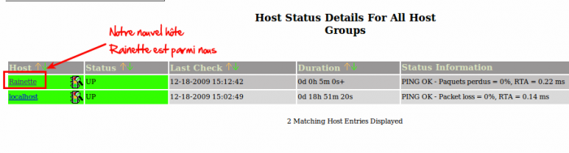

[[[Créer son premier hôte](creer-son-premier-hote@do=backlink.html)]]

[wiki monitoring-fr.org](../../start.html "[ALT+H]")

-   [Accueil](../../index.html "Cliquez pour revenir |  l'accueil")
-   [Blog](http://www.monitoring-fr.org "Blog & News")
-   [Forums](http://forums.monitoring-fr.org "Forums")
-   [Doc](http://doc.monitoring-fr.org "Doc")
-   [Forge](https://github.com/monitoring-fr "Forge")

Vous êtes ici: [Accueil](../../start.html "start") »
[Nagios](../start.html "nagios:start") » [NAGIOS - Guide de démarrage
pour débutant](start.html "nagios:nagios-debutant:start") » [Créer son
premier
hôte](creer-son-premier-hote.html "nagios:nagios-debutant:creer-son-premier-hote")

### Table des matières {.toggle}

-   [Créer son premier
    hôte](creer-son-premier-hote.html#creer-son-premier-hote)
    -   [Création du premier
        hôte](creer-son-premier-hote.html#creation-du-premier-hote)

Créer son premier hôte {#creer-son-premier-hote .sectionedit1}
======================

Ce chapitre va montrer pas par pas comment ajouter un hôte juste après
l’installation de Nagios.

Création du premier hôte {#creation-du-premier-hote .sectionedit2}
------------------------

Dans un premier temps, ce qu’il faut savoir c’est que la définition d’un
hôte s’appuie sur un template (en post-install, celui-ci se nomme
**generic-host**). Ces templates sont très utiles pour minimiser la
définition d’un hôte.

Le generic-host se trouve dans le fichier *templates.cfg*.

Pour créer un hôte, il est conseillé de créer un fichier .cfg par hôte.
(je vous cache qu’il y a des façons plus compliquer de gérer les
fichiers, mais ne compliquons pas la chose plus qu’elle n’est).

Donc pour notre machine s’appelant RAINETTE, nous allons donc créer
(dans le répertoire objects) son fichier cfg correspondant :

~~~~ {.code}
vi rainette.cfg
~~~~

Nous allons ajouter les lignes suivantes dans notre fichier :

~~~~ {.code}
define host{
        use                     generic-host
        host_name               Rainette
        alias                   Rainette
        address                 xx.xx.xx.xx
        }
~~~~

et voilà après un redémarrage de Nagios, vous aurez un nouvel hôte ;)
comme ci-dessous

A ce stade, la définition de notre hôte ne comprend aucun service. Le
service de ping sur l’adresse IP de l’hôte en question n’est donc pas
activé à la différence de ce qui est affiché ci-dessous. Du coup sur la
capture d’écran suivante, notre hôte Rainette ne devrait pas afficher un
statut “UP”, ni un résultat de ping.

SOMMAIRE {#sommaire .sectionedit1}
--------

**[Accueil](../../start.html "start")**

**[Supervision](../../supervision/start.html "supervision:start")**

-   [Nagios](../start.html "nagios:start")
-   [Centreon](../../centreon/start.html "centreon:start")
-   [Shinken](../../shinken/start.html "shinken:start")
-   [Zabbix](../../zabbix/start.html "zabbix:start")
-   [OpenNMS](../../opennms/start.html "opennms:start")
-   [EyesOfNetwork](../../eyesofnetwork/start.html "eyesofnetwork:start")
-   [Groundwork](../../groundwork/start.html "groundwork:start")
-   [Zenoss](../../zenoss/start.html "zenoss:start")
-   [Vigilo](../../vigilo/start.html "vigilo:start")
-   [Icinga](../../icinga/start.html "icinga:start")
-   [Cacti](../../cacti/start.html "cacti:start")
-   [Ressenti
    utilisateur](../../supervision/eue/start.html "supervision:eue:start")
-   [Ressenti utilisateur avec
    sikuli](../../sikuli/eue/start.html "sikuli:eue:start")

**[Hypervision](../../hypervision/start.html "hypervision:start")**

-   [Canopsis](../../canopsis/start.html "canopsis:start")

**[Sécurité](../../securite/start.html "securite:start")**

**[Infrastructure](../../infra/start.html "infra:start")**

**[Développement](../../dev/start.html "dev:start")**

Nagios {#nagios .sectionedit1}
------

-   [Arborescence des
    fichiers](../installation-layout.html "nagios:installation-layout")
-   [Commandes de remontée de
    contrôle](../ocsp-ochp.html "nagios:ocsp-ochp")
-   [Données Nagios dans un ramdisk](../ramdisk.html "nagios:ramdisk")
-   [Event Handlers](../event_handlers.html "nagios:event_handlers")
-   [Gabarits d'objets de
    configuration](../templates.html "nagios:templates")
-   [Installation Nagios 2 & 3 sur Ubuntu 6.0.6, 8.0.4 et 10.0.4
    LTS](../ubuntu-install.html "nagios:ubuntu-install")
-   [Installation Nagios 3 sur Debian Squeeze
    6.0.3](../debian-install.html "nagios:debian-install")
-   [Installation de Nagios 3.x sur CentOS
    5.3](../nagios-centos-install.html "nagios:nagios-centos-install")
-   [Introduction aux objets de
    configuration](../configobjects.html "nagios:configobjects")
-   [Introduction à
    Nagios](../nagios-introduction.html "nagios:nagios-introduction")
-   [Liens Nagios](../links.html "nagios:links")
-   [Mise en place complète de Nagios sur RHEL
    5.4](../mise-en-place-complete-nagios-sur-rhel-5.4/start.html "nagios:mise-en-place-complete-nagios-sur-rhel-5.4:start")
-   [NAGIOS - Guide de démarrage pour
    débutant](start.html "nagios:nagios-debutant:start")
-   [Nagios Addons](../addons/start.html "nagios:addons:start")
-   [Nagios
    Integration](../integration/start.html "nagios:integration:start")
-   [Nagios Plugins](../plugins/start.html "nagios:plugins:start")
-   [Nagios et les
    notifications](../notifications.html "nagios:notifications")
-   [Outils de supervision d'un hôte
    Windows](../windows-client.html "nagios:windows-client")
-   [Référence des objets de
    configuration](../objects-reference.html "nagios:objects-reference")
-   [Superviser un hôte Windows avec
    NSClient++](../nagios-nsclient-host.html "nagios:nagios-nsclient-host")
-   [Supervision Windows en mode
    passif](../supervision-windows-passif.html "nagios:supervision-windows-passif")
-   [Supervision vmware esx](../vmware_esx.html "nagios:vmware_esx")
-   [check-list de diagnostic](../debug.html "nagios:debug")

-   [Afficher le texte
    source](creer-son-premier-hote@do=edit&rev=0.html "Afficher le texte source [V]")
-   [Anciennes
    révisions](creer-son-premier-hote@do=revisions.html "Anciennes révisions [O]")
-   [Derniers
    changements](creer-son-premier-hote@do=recent.html "Derniers changements [R]")
-   [Liens vers cette
    page](creer-son-premier-hote@do=backlink.html "Liens vers cette page")
-   [Gestionnaire de
    médias](creer-son-premier-hote@do=media.html "Gestionnaire de médias")
-   [Index](creer-son-premier-hote@do=index.html "Index [X]")
-   [Connexion](creer-son-premier-hote@do=login&sectok=6bca6bdf16f8880de3d6d3649db89a26.html "Connexion")
-   [Haut de
    page](creer-son-premier-hote.html#dokuwiki__top "Haut de page [T]")

nagios/nagios-debutant/creer-son-premier-hote.txt · Dernière
modification: 2013/03/29 09:39 (modification externe)

