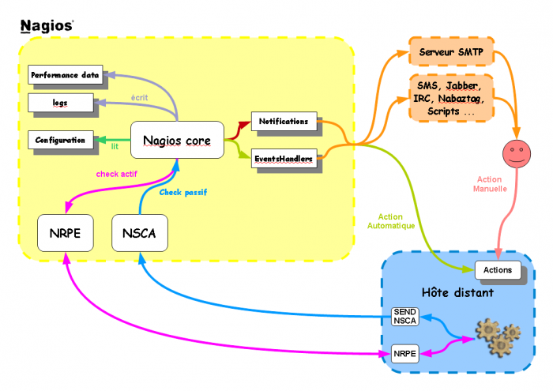

[[[NAGIOS - Guide de démarrage pour débutant](start@do=backlink.html)]]

[wiki monitoring-fr.org](../../start.html "[ALT+H]")

-   [Accueil](../../index.html "Cliquez pour revenir |  l'accueil")
-   [Blog](http://www.monitoring-fr.org "Blog & News")
-   [Forums](http://forums.monitoring-fr.org "Forums")
-   [Doc](http://doc.monitoring-fr.org "Doc")
-   [Forge](https://github.com/monitoring-fr "Forge")

Vous êtes ici: [Accueil](../../start.html "start") »
[Nagios](../start.html "nagios:start") » [NAGIOS - Guide de démarrage
pour débutant](start.html "nagios:nagios-debutant:start")

### Table des matières {.toggle}

-   [NAGIOS - Guide de démarrage pour
    débutant](start.html#nagios-guide-de-demarrage-pour-debutant)
    -   [Schéma Fonctionnel](start.html#schema-fonctionnel)
    -   [Documentation](start.html#documentation)
        -   [Chapitre 1 - Installation de
            Nagios](start.html#chapitre-1-installation-de-nagios)
        -   [Chapitre 2 - Premiers pas avec
            Nagios](start.html#chapitre-2-premiers-pas-avec-nagios)
        -   [Chapitre 3 - Configuration avancée de
            Nagios](start.html#chapitre-3-configuration-avancee-de-nagios)
        -   [Chapitre 4 - Divers](start.html#chapitre-4-divers)

NAGIOS - Guide de démarrage pour débutant {#nagios-guide-de-demarrage-pour-debutant .sectionedit1}
=========================================

Ce dossier a été réalisé avec l’aide de :

  **Rôle**        **Nom**
  --------------- ---------------------------------------------------------------------------------------------------------------------------------------------------------
  **Rédacteur**   [Romuald FRONTEAU](http://www.monitoring-fr.org/community/members/romuald-fronteau/ "http://www.monitoring-fr.org/community/members/romuald-fronteau/")

Ce dossier va permettre au débutant de faire leur premier pas avec
Nagios pour savoir comment cette petite bête tourne. Nous allons essayer
au maximum d’orienter ce dossier de wiki comme un petit cours. Nous
allons rester simple dans les premiers chapitres. Normalement, en
suivant à la lettre ce qui suit, vous finirez par voir plus clair de
comment tous les éléments de Nagios fonctionnent.

Schéma Fonctionnel {#schema-fonctionnel .sectionedit3}
------------------

Voilà de manière simple comment se comporte le Core de Nagios :

Documentation {#documentation .sectionedit4}
-------------

### Chapitre 1 - Installation de Nagios {#chapitre-1-installation-de-nagios .sectionedit5}

-   **[1.1 - Installation de Nagios sur Ubuntu
    LTS](../ubuntu-install.html "nagios:ubuntu-install")**

-   **[1.2 - Installation de Nagios sur Centos
    5.3](../nagios-centos-install.html "nagios:nagios-centos-install")**

### Chapitre 2 - Premiers pas avec Nagios {#chapitre-2-premiers-pas-avec-nagios .sectionedit6}

Ce chapitre va expliquer comment configurer Nagios de manière la plus
simple possible. En tout cas on va essayer ;)

#### Chapitre 2.1 - Les bases de Nagios {#chapitre-21-les-bases-de-nagios}

-   **[2.1 - Ce qu'il faut savoir sur
    Nagios](ce-qu-il-faut-savoir.html "nagios:nagios-debutant:ce-qu-il-faut-savoir")**

#### Chaptire 2.2 - Première configuration {#chaptire-22-premiere-configuration}

-   **[2.2.1 - Nettoyage de la configuration
    post-install](nettoyage-de-la-configuration.html "nagios:nagios-debutant:nettoyage-de-la-configuration")**

-   **[2.2.2 - Créer son premier
    hôte](creer-son-premier-hote.html "nagios:nagios-debutant:creer-son-premier-hote")**

-   **[2.2.3 - Créer son premier service pour notre premier
    hôte](creer-son-premier-service.html "nagios:nagios-debutant:creer-son-premier-service")**

-   **[2.2.4 - Créer sa première commande pour notre premier
    hôte](creer-sa-premiere-commande.html "nagios:nagios-debutant:creer-sa-premiere-commande")**

-   **[2.2.5 - Créer son premier contact & groupe de contacts pour notre
    premier
    hôte](creer-son-premier-contact.html "nagios:nagios-debutant:creer-son-premier-contact")**

-   **[2.2.6 - Créer son premier hostgroup pour notre premier
    hôte](creer-son-premier-hostgroup.html "nagios:nagios-debutant:creer-son-premier-hostgroup")**

### Chapitre 3 - Configuration avancée de Nagios {#chapitre-3-configuration-avancee-de-nagios .sectionedit7}

Ce chapitre va expliquer comment configurer Nagios de manière plus
intelligente pour vous simplifier son administration. Ceci n’est qu’un
modèle de configuration parmi tant d’autres.

-   **[3.1 - Les Templates & les hostgroups
    "pivots"](templates-hostgroups-pivots.html "nagios:nagios-debutant:templates-hostgroups-pivots")**

### Chapitre 4 - Divers {#chapitre-4-divers .sectionedit8}

Ce chapitre regroupe différentes documentations et astuces diverses
autour de Nagios, afin de faciliter son usage au quotidien.

-   **[4.1 - Boîte à
    outils](boite-a-outils.html "nagios:nagios-debutant:boite-a-outils")**

SOMMAIRE {#sommaire .sectionedit1}
--------

**[Accueil](../../start.html "start")**

**[Supervision](../../supervision/start.html "supervision:start")**

-   [Nagios](../start.html "nagios:start")
-   [Centreon](../../centreon/start.html "centreon:start")
-   [Shinken](../../shinken/start.html "shinken:start")
-   [Zabbix](../../zabbix/start.html "zabbix:start")
-   [OpenNMS](../../opennms/start.html "opennms:start")
-   [EyesOfNetwork](../../eyesofnetwork/start.html "eyesofnetwork:start")
-   [Groundwork](../../groundwork/start.html "groundwork:start")
-   [Zenoss](../../zenoss/start.html "zenoss:start")
-   [Vigilo](../../vigilo/start.html "vigilo:start")
-   [Icinga](../../icinga/start.html "icinga:start")
-   [Cacti](../../cacti/start.html "cacti:start")
-   [Ressenti
    utilisateur](../../supervision/eue/start.html "supervision:eue:start")
-   [Ressenti utilisateur avec
    sikuli](../../sikuli/eue/start.html "sikuli:eue:start")

**[Hypervision](../../hypervision/start.html "hypervision:start")**

-   [Canopsis](../../canopsis/start.html "canopsis:start")

**[Sécurité](../../securite/start.html "securite:start")**

**[Infrastructure](../../infra/start.html "infra:start")**

**[Développement](../../dev/start.html "dev:start")**

Nagios {#nagios .sectionedit1}
------

-   [Arborescence des
    fichiers](../installation-layout.html "nagios:installation-layout")
-   [Commandes de remontée de
    contrôle](../ocsp-ochp.html "nagios:ocsp-ochp")
-   [Données Nagios dans un ramdisk](../ramdisk.html "nagios:ramdisk")
-   [Event Handlers](../event_handlers.html "nagios:event_handlers")
-   [Gabarits d'objets de
    configuration](../templates.html "nagios:templates")
-   [Installation Nagios 2 & 3 sur Ubuntu 6.0.6, 8.0.4 et 10.0.4
    LTS](../ubuntu-install.html "nagios:ubuntu-install")
-   [Installation Nagios 3 sur Debian Squeeze
    6.0.3](../debian-install.html "nagios:debian-install")
-   [Installation de Nagios 3.x sur CentOS
    5.3](../nagios-centos-install.html "nagios:nagios-centos-install")
-   [Introduction aux objets de
    configuration](../configobjects.html "nagios:configobjects")
-   [Introduction à
    Nagios](../nagios-introduction.html "nagios:nagios-introduction")
-   [Liens Nagios](../links.html "nagios:links")
-   [Mise en place complète de Nagios sur RHEL
    5.4](../mise-en-place-complete-nagios-sur-rhel-5.4/start.html "nagios:mise-en-place-complete-nagios-sur-rhel-5.4:start")
-   [NAGIOS - Guide de démarrage pour
    débutant](start.html "nagios:nagios-debutant:start")
-   [Nagios Addons](../addons/start.html "nagios:addons:start")
-   [Nagios
    Integration](../integration/start.html "nagios:integration:start")
-   [Nagios Plugins](../plugins/start.html "nagios:plugins:start")
-   [Nagios et les
    notifications](../notifications.html "nagios:notifications")
-   [Outils de supervision d'un hôte
    Windows](../windows-client.html "nagios:windows-client")
-   [Référence des objets de
    configuration](../objects-reference.html "nagios:objects-reference")
-   [Superviser un hôte Windows avec
    NSClient++](../nagios-nsclient-host.html "nagios:nagios-nsclient-host")
-   [Supervision Windows en mode
    passif](../supervision-windows-passif.html "nagios:supervision-windows-passif")
-   [Supervision vmware esx](../vmware_esx.html "nagios:vmware_esx")
-   [check-list de diagnostic](../debug.html "nagios:debug")

-   [Afficher le texte
    source](start@do=edit&rev=0.html "Afficher le texte source [V]")
-   [Anciennes
    révisions](start@do=revisions.html "Anciennes révisions [O]")
-   [Derniers
    changements](start@do=recent.html "Derniers changements [R]")
-   [Liens vers cette
    page](start@do=backlink.html "Liens vers cette page")
-   [Gestionnaire de
    médias](start@do=media.html "Gestionnaire de médias")
-   [Index](start@do=index.html "Index [X]")
-   [Connexion](start@do=login&sectok=6bca6bdf16f8880de3d6d3649db89a26.html "Connexion")
-   [Haut de page](start.html#dokuwiki__top "Haut de page [T]")

nagios/nagios-debutant/start.txt · Dernière modification: 2013/03/29
09:39 (modification externe)

