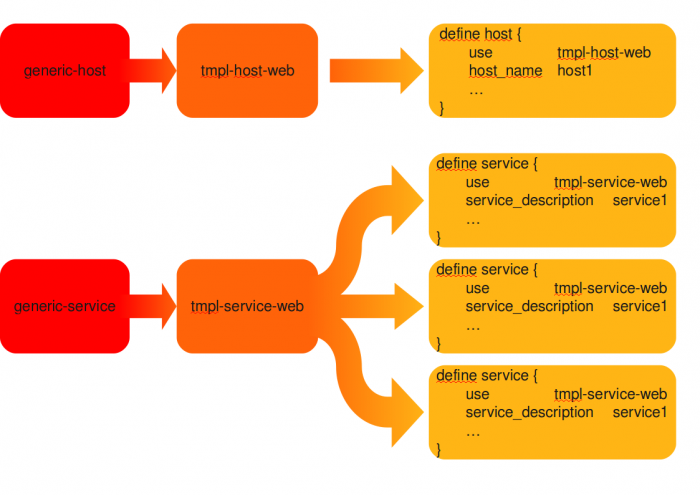

[[[Les templates et les "pivots" de
configuration](templates-hostgroups-pivots@do=backlink.html)]]

[wiki monitoring-fr.org](../../start.html "[ALT+H]")

-   [Accueil](../../index.html "Cliquez pour revenir |  l'accueil")
-   [Blog](http://www.monitoring-fr.org "Blog & News")
-   [Forums](http://forums.monitoring-fr.org "Forums")
-   [Doc](http://doc.monitoring-fr.org "Doc")
-   [Forge](https://github.com/monitoring-fr "Forge")

Vous êtes ici: [Accueil](../../start.html "start") »
[Nagios](../start.html "nagios:start") » [NAGIOS - Guide de démarrage
pour débutant](start.html "nagios:nagios-debutant:start") » [Les
templates et les "pivots" de
configuration](templates-hostgroups-pivots.html "nagios:nagios-debutant:templates-hostgroups-pivots")

### Table des matières {.toggle}

-   [Les templates et les "pivots" de
    configuration](templates-hostgroups-pivots.html#les-templates-et-les-pivots-de-configuration)
    -   [Templates](templates-hostgroups-pivots.html#templates)
        -   [Principe d'héritage des
            templates](templates-hostgroups-pivots.html#principe-d-heritage-des-templates)
        -   [Exemple](templates-hostgroups-pivots.html#exemple)
    -   [Les pivots](templates-hostgroups-pivots.html#les-pivots)
        -   [Principe de
            fonctionnement](templates-hostgroups-pivots.html#principe-de-fonctionnement)
        -   [Exemple](templates-hostgroups-pivots.html#exemple1)
    -   [Les astuces](templates-hostgroups-pivots.html#les-astuces)

Les templates et les "pivots" de configuration {#les-templates-et-les-pivots-de-configuration .sectionedit1}
==============================================

En approfondissant la configuration de Nagios, on peut s’apercevoir et
avoir des idées sur comment mieux agencer sa configuration pour avoir un
minimum d’efforts à faire. Il existe quelques astuces pour éviter
d’avoir à répéter les mêmes variables, les mêmes services pour
différents hôtes :

-   Les templates existent pour éviter que chaque déclarations de vos
    hôtes ou services fassent des pages.
-   Les “pivots”, c’est un nom que nous avons donné à ce type d’objets
    qui vont permettre d’accélérer le déploiement de votre
    configuration. Pour résumer, en ajoutant vos hôtes à des hostgroups
    de type pivots, ils se verront ajouter automatiquement des services.

Templates {#templates .sectionedit2}
---------

Les templates sont très utiles pour vous éviter d’avoir à répéter les
variables commune à chaque définition de vos hôtes et services. Ils vont
nous aider aussi pour cette customisation de la configuration.

En utilisant les templates, nous allons jouer sur le principe d’héritage
natif du Nagios Core.

### Principe d'héritage des templates {#principe-d-heritage-des-templates .sectionedit3}

Comme sur le schéma ci-dessus, on peut voir 2 templates “père”
(generic-host et generic-service). C’est 2 templates contiennent toutes
les variables récurrentes des déclarations d’hôtes et de services.

Bien sur, vous n’allez pas vous limitez qu’à ces 2 templates car vous
avez des contacts, des périodes de notifications, des périodes de
contrôles différents pour telle ou telle machines. Vous pouvez créer des
sous-templates qui hériteront des templates generic grâce à la variable
**“use”**. Cette variable est la clé du système d’héritage.

**La règle primordiale de héritage est que la variable situé le plus
près de la définition de l’hôte ou du service remporte sur le(s)
héritage(s) parent(s)**

### Exemple {#exemple .sectionedit4}

On peut partir de 2 templates basiques generic-host et generic-service

+--------------------------------------+--------------------------------------+
| **generic-host**                     | **generic-service**                  |
+======================================+======================================+
| ~~~~ {.code}                         | ~~~~ {.code}                         |
| define host{                         | define service{                      |
|         name                         |         name                         |
|     generic-host                     |     generic-service                  |
|         initial_state                |         active_checks_enabled        |
|     o                                |     1                                |
|         active_checks_enabled        |         passive_checks_enabled       |
|     1                                |     1                                |
|         passive_checks_enabled       |         initial_state                |
|     1                                |     o                                |
|         notifications_enabled        |         parallelize_check            |
|     1                                |     1                                |
|         event_handler_enabled        |         obsess_over_service          |
|     0                                |     0                                |
|         check_command                |         check_freshness              |
|     check-host-alive                 |     0                                |
|         flap_detection_enabled       |         notifications_enabled        |
|     1                                |     1                                |
|         failure_prediction_enabled   |         event_handler_enabled        |
|     1                                |     0                                |
|         failure_prediction_options   |         flap_detection_enabled       |
|     d,u,r                            |     1                                |
|         process_perf_data            |         failure_prediction_enabled   |
|     1                                |     1                                |
|         check_freshness              |         failure_prediction_options   |
|     0                                |     w,c,u                            |
|         obsess_over_host             |         process_perf_data            |
|     0                                |     1                                |
|         check_period                 |         retain_status_information    |
|     24x7                             |     1                                |
|         check_interval               |         retain_nonstatus_information |
|     0                                |     1                                |
|         retry_interval               |         is_volatile                  |
|     1                                |     0                                |
|         stalking_options             |         check_period                 |
|     u,d                              |     24x7                             |
|         max_check_attempts           |         flap_detection_options       |
|     10                               |     o,u,c,w                          |
|         retain_status_information    |         max_check_attempts           |
|     1                                |     5                                |
|         retain_nonstatus_information |         normal_check_interval        |
|     1                                |     5                                |
|         notification_period          |         retry_check_interval         |
|     24x7                             |     2                                |
|         first_notification_delay     |         contact_groups               |
|     0                                |     admins                           |
|         contact_groups               |         notification_options         |
|     admins                           |     w,u,c,r                          |
|         notification_options         |         notification_interval        |
|     d,u,r                            |     0                                |
|         notification_interval        |         notification_period          |
|     0                                |     24x7                             |
|         register                     |         first_notification_delay     |
|     0                                |     0                                |
|         notes                        |         notes                        |
|     generic-host                     |     generic-service                  |
|         }                            |         register                     |
| ~~~~                                 |     0                                |
|                                      |         }                            |
|                                      | ~~~~                                 |
+--------------------------------------+--------------------------------------+

Bien sur à partir de ces 2 templates réunissant une grande partie des
variables de déclarations, vous pouvez créer des sous-templates qui
hériteront du *generic-host* et *generic-service*

Disons que nous allons avoir besoin d’un template pour nos serveurs Web.
Ils sont en sauvegarde de 22h à 0h et nous voulons que ce soit l’équipe
de support qui soit alertée par interface de 60 minutes.

Il faudra avoir créer préalablement un timeperiod pour la plage de
sauvegarde des serveurs web, le contact “support”

+--------------------------------------+--------------------------------------+
| **tmpl-host-web**                    | **tmpl-service-web**                 |
+======================================+======================================+
| ~~~~ {.code}                         | ~~~~ {.code}                         |
| define host{                         | define service{                      |
|         use                          |         use                          |
|     generic-host                     |     generic-service                  |
|         name                         |         name                         |
|     tmpl-host-web                    |     tmpl-service-web                 |
|         check_command                |         check_period                 |
|     check-host-alive                 |     24x7                             |
|         check_period                 |         max_check_attempts           |
|     24x7                             |     5                                |
|         max_check_attempts           |         normal_check_interval        |
|     5                                |     15                               |
|         notification_period          |         retry_check_interval         |
|     24x7                             |     2                                |
|         contact_groups               |         contact_groups               |
|     support                          |     support                          |
|         notification_interval        |         notification_interval        |
|     60                               |     60                               |
|         register                     |         notification_period          |
|     0                                |     24x7                             |
|         notes                        |         register                     |
|     generic-host                     |     0                                |
|         }                            |         }                            |
| ~~~~                                 | ~~~~                                 |
+--------------------------------------+--------------------------------------+

Une autre clé majeure dans nagios à retenir est le **register 0**. Cette
variable permet de faire apparaître ou non cette déclaration dans
l’interface Web (vous commencez à voir ce que vont être nos pivots).

Il ne reste plus qu’à déclarer notre hôte avec au moins un service.

+--------------------------------------+--------------------------------------+
| **Déclaration de l’hôte Rainette**   | **Déclaration du service de réponse  |
|                                      | de l’interface Nagios**              |
+======================================+======================================+
| ~~~~ {.code}                         | ~~~~ {.code}                         |
| define host{                         | define service{                      |
|         use                     tmpl |         use                          |
| -host-web                            |     tmpl-service-web                 |
|         host_name               Rain |         host_name                    |
| ette                                 |     Rainette                         |
|         alias                   Serv |         service_description          |
| eur Web Rainette                     |     Reponse interface Web Nagios     |
|         address                 xx.x |         check_command                |
| x.xx.xx                              |     check_http!"http://xx.xx.xx.xx/n |
|         contact_groups          supp | agios"                               |
| ort,admins                           |         }                            |
|         }                            | ~~~~                                 |
| ~~~~                                 |                                      |
+--------------------------------------+--------------------------------------+

On remarquera dans la déclaration de l’hôte Rainette, l’ajout d’une
variable contact\_groups où en plus du support, l’équipe admins y est.
Selon la règle d’héritage, c’est cette dernière qui fera foi. Bien sur
ceci fonctionne avec n’importe qu’elle autres variables de déclaration.

Les pivots {#les-pivots .sectionedit8}
----------

Les pivots sont les fruits d’une réflexion sur l’amélioration et la
simplification du déploiement de la configuration Nagios.

### Principe de fonctionnement {#principe-de-fonctionnement .sectionedit9}

Comme vous pouvez le voir sur le schéma ci-dessus, nous utilisons les
hostgroups comme pivot de la configuration de Nagios.

En gros, nous allons avoir des groupes d’hôtes et des sous-groupes qui
vont être rattacher à des services. En fonction du rattachement de
l’hôte à un groupe, des services s’ajouteront automatiquement.

Comme vous pouvez le voir, il peut y avoir des groupes d’hôtes en
fonction du lieu géographique des hôtes ou alors de leur rôles.

Par exemple, pour un serveur Web, Que veux-t-on savoir ?

-   Si Apache tourne ?
-   Si le site est bien en ligne (test Webinject)
-   Si on a assez de place disque
-   Si les alimentations sont opérationnelles.
-   Si sa température interne est bonne
-   Si les ventilateurs tourne correctement
-   etc ….

En rattachant tous ces services à un hostgroup du nom de SERV\_WEB, tous
hôtes membres de ce groupe se verront les contrôles ci-dessus ajoutés
sans le moindre effort.

Bien sur le principe des pivots n’est pas une règle absolue, il est très
utile dans le déploiement massif de services identiques pour vos
machines.

### Exemple {#exemple1 .sectionedit10}

Pour cette exemple, nous allons laisser “rainette” tranquille et créer 2
nouveaux hôtes du nom de “crapaud” et “goliath”. Pour résumer, “crapaud”
et goliath sont des serveurs faisant partie d’une batterie de serveur
web. Admettons, notre politique d’entreprise veut que pour tous nos
serveurs web des contrôles de base soit fait. Le souci c’est que l’on a
X serveurs web et que l’on a pas envie de se repéter une multitude de
fois dans la définition des services. Pour être clair, nous allons
déclarer ces services par défaut en les liant à un hostgroup. Ensuite,
nous n’aurons plus qu’à rattacher nos serveurs web à cet hostgroup et
les services seront déployé automatiquement.

**Définition des hôtes :**

Vous pouvez créer un crapaud.cfg et un goliath.cfg contenant la
définition pour chacun.

+--------------------------------------+--------------------------------------+
| **Goliath**                          | **Crapaud**                          |
+======================================+======================================+
| ~~~~ {.code}                         | ~~~~ {.code}                         |
| define host{                         | define host{                         |
|         use                     gene |         use                     gene |
| ric-host                             | ric-host                             |
|         host_name               Goli |         host_name               Crap |
| ath                                  | aud                                  |
|         alias                   Goli |         alias                   Crap |
| ath                                  | aud                                  |
|         address                 127. |         address                 127. |
| 0.0.1                                | 0.0.1                                |
|         contact_groups          supp |         contact_groups          supp |
| ort                                  | ort                                  |
|         }                            |         }                            |
| ~~~~                                 | ~~~~                                 |
+--------------------------------------+--------------------------------------+

**Définition de l’hostgroup :**

Dans le fichier hostgroups.cfg, rajoutez la définition suivante :

~~~~ {.code}
define hostgroup {
        hostgroup_name          SERV_WEB
        alias                   Groupe des Serveurs WEB
        members                 Goliath,Crapaud
}
~~~~

**Définition de nos services :**

Vous pouvez créer un fichier service-load.cfg et un fichier
service-acces-http.cfg contenant pour chacun la définition ci-dessous.

+--------------------------------------+--------------------------------------+
| **Load Average**                     | **Réponse HTTP**                     |
+======================================+======================================+
| ~~~~ {.code}                         | ~~~~ {.code}                         |
|  Definition du service de Load Avera | # Definition du service de controle  |
| ge                                   | d'url Web                            |
| define service{                      | define service{                      |
|         use                          |         use                          |
|     generic-service                  |     generic-service                  |
|         hostgroup_name               |         hostgroup_name               |
|     SERV_WEB                         |     SERV_WEB                         |
|         service_description          |         service_description          |
|     Load Average                     |     Reponse HTTP                     |
|         check_command                |         check_command                |
|     check_load!5.0,4.0,3.0!10.0,8.0, |     check_http                       |
| 6.0                                  |         }                            |
|         contact_groups               | ~~~~                                 |
|     support                          |                                      |
|         }                            |                                      |
| ~~~~                                 |                                      |
+--------------------------------------+--------------------------------------+

On voit que dans nos définitions de service, ce n’est plus le
traditionnel host\_name mais hostgroup\_name.

Maintenant regardons dans l’interface ce qui a été déployé :

Les astuces {#les-astuces .sectionedit13}
-----------

A écrire

SOMMAIRE {#sommaire .sectionedit1}
--------

**[Accueil](../../start.html "start")**

**[Supervision](../../supervision/start.html "supervision:start")**

-   [Nagios](../start.html "nagios:start")
-   [Centreon](../../centreon/start.html "centreon:start")
-   [Shinken](../../shinken/start.html "shinken:start")
-   [Zabbix](../../zabbix/start.html "zabbix:start")
-   [OpenNMS](../../opennms/start.html "opennms:start")
-   [EyesOfNetwork](../../eyesofnetwork/start.html "eyesofnetwork:start")
-   [Groundwork](../../groundwork/start.html "groundwork:start")
-   [Zenoss](../../zenoss/start.html "zenoss:start")
-   [Vigilo](../../vigilo/start.html "vigilo:start")
-   [Icinga](../../icinga/start.html "icinga:start")
-   [Cacti](../../cacti/start.html "cacti:start")
-   [Ressenti
    utilisateur](../../supervision/eue/start.html "supervision:eue:start")
-   [Ressenti utilisateur avec
    sikuli](../../sikuli/eue/start.html "sikuli:eue:start")

**[Hypervision](../../hypervision/start.html "hypervision:start")**

-   [Canopsis](../../canopsis/start.html "canopsis:start")

**[Sécurité](../../securite/start.html "securite:start")**

**[Infrastructure](../../infra/start.html "infra:start")**

**[Développement](../../dev/start.html "dev:start")**

Nagios {#nagios .sectionedit1}
------

-   [Arborescence des
    fichiers](../installation-layout.html "nagios:installation-layout")
-   [Commandes de remontée de
    contrôle](../ocsp-ochp.html "nagios:ocsp-ochp")
-   [Données Nagios dans un ramdisk](../ramdisk.html "nagios:ramdisk")
-   [Event Handlers](../event_handlers.html "nagios:event_handlers")
-   [Gabarits d'objets de
    configuration](../templates.html "nagios:templates")
-   [Installation Nagios 2 & 3 sur Ubuntu 6.0.6, 8.0.4 et 10.0.4
    LTS](../ubuntu-install.html "nagios:ubuntu-install")
-   [Installation Nagios 3 sur Debian Squeeze
    6.0.3](../debian-install.html "nagios:debian-install")
-   [Installation de Nagios 3.x sur CentOS
    5.3](../nagios-centos-install.html "nagios:nagios-centos-install")
-   [Introduction aux objets de
    configuration](../configobjects.html "nagios:configobjects")
-   [Introduction à
    Nagios](../nagios-introduction.html "nagios:nagios-introduction")
-   [Liens Nagios](../links.html "nagios:links")
-   [Mise en place complète de Nagios sur RHEL
    5.4](../mise-en-place-complete-nagios-sur-rhel-5.4/start.html "nagios:mise-en-place-complete-nagios-sur-rhel-5.4:start")
-   [NAGIOS - Guide de démarrage pour
    débutant](start.html "nagios:nagios-debutant:start")
-   [Nagios Addons](../addons/start.html "nagios:addons:start")
-   [Nagios
    Integration](../integration/start.html "nagios:integration:start")
-   [Nagios Plugins](../plugins/start.html "nagios:plugins:start")
-   [Nagios et les
    notifications](../notifications.html "nagios:notifications")
-   [Outils de supervision d'un hôte
    Windows](../windows-client.html "nagios:windows-client")
-   [Référence des objets de
    configuration](../objects-reference.html "nagios:objects-reference")
-   [Superviser un hôte Windows avec
    NSClient++](../nagios-nsclient-host.html "nagios:nagios-nsclient-host")
-   [Supervision Windows en mode
    passif](../supervision-windows-passif.html "nagios:supervision-windows-passif")
-   [Supervision vmware esx](../vmware_esx.html "nagios:vmware_esx")
-   [check-list de diagnostic](../debug.html "nagios:debug")

-   [Afficher le texte
    source](templates-hostgroups-pivots@do=edit&rev=0.html "Afficher le texte source [V]")
-   [Anciennes
    révisions](templates-hostgroups-pivots@do=revisions.html "Anciennes révisions [O]")
-   [Derniers
    changements](templates-hostgroups-pivots@do=recent.html "Derniers changements [R]")
-   [Liens vers cette
    page](templates-hostgroups-pivots@do=backlink.html "Liens vers cette page")
-   [Gestionnaire de
    médias](templates-hostgroups-pivots@do=media.html "Gestionnaire de médias")
-   [Index](templates-hostgroups-pivots@do=index.html "Index [X]")
-   [Connexion](templates-hostgroups-pivots@do=login&sectok=6bca6bdf16f8880de3d6d3649db89a26.html "Connexion")
-   [Haut de
    page](templates-hostgroups-pivots.html#dokuwiki__top "Haut de page [T]")

nagios/nagios-debutant/templates-hostgroups-pivots.txt · Dernière
modification: 2013/03/29 09:39 (modification externe)

