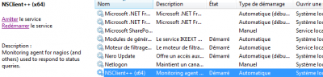
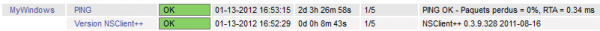
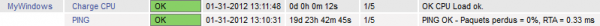
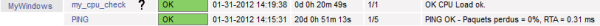

[[[Superviser un hôte Windows avec
NSClient++](nagios-nsclient-host@do=backlink.html)]]

[wiki monitoring-fr.org](../start.html "[ALT+H]")

-   [Accueil](../index.html "Cliquez pour revenir |  l'accueil")
-   [Blog](http://www.monitoring-fr.org "Blog & News")
-   [Forums](http://forums.monitoring-fr.org "Forums")
-   [Doc](http://doc.monitoring-fr.org "Doc")
-   [Forge](https://github.com/monitoring-fr "Forge")

Vous êtes ici: [Accueil](../start.html "start") »
[Nagios](start.html "nagios:start") » [Superviser un hôte Windows avec
NSClient++](nagios-nsclient-host.html "nagios:nagios-nsclient-host")

### Table des matières {.toggle}

-   [Superviser un hôte Windows avec
    NSClient++](nagios-nsclient-host.html#superviser-un-hote-windows-avec-nsclient)
    -   [Pré-requis](nagios-nsclient-host.html#pre-requis)
    -   [Installation](nagios-nsclient-host.html#installation)
    -   [Configuration](nagios-nsclient-host.html#configuration)
        -   [Mode NSClient](nagios-nsclient-host.html#mode-nsclient)
        -   [Mode NRPE](nagios-nsclient-host.html#mode-nrpe)
        -   [Mode NSCA](nagios-nsclient-host.html#mode-nsca)

Superviser un hôte Windows avec NSClient++ {#superviser-un-hote-windows-avec-nsclient .sectionedit1}
==========================================

Tutoriel rédigé avec Nagios 3.3.1 et NSClient++ 0.3.9.

[NSClient++](http://nsclient.org/nscp/ "http://nsclient.org/nscp/") est
un service pour toutes versions de Windows (NT, 2000, 2003, 2008, XP,
Vista, Seven) qui combine les fonctionnalités d’un agent de supervision
dédié à l’environnement Windows ainsi que les fonctions de transport
[NRPE](addons/nrpe.html "nagios:addons:nrpe") et
[NSCA](addons/nsca.html "nagios:addons:nsca") pour cet environnement. Il
est disponible en version 32 et 64 bits. Du fait de ces triples
fonctions, le fichier de configuration de NSClient++ est assez long mais
également assez simple. Il est aujourd’hui considéré comme l’agent de
supervision standard Nagios pour plateformes Windows.

Pour plus d’informations, je vous invite à consulter la page
**[NSClient++](addons/nsclient.html "nagios:addons:nsclient")** du wiki.

L’objectif de cette documentation est de présenter les différentes
procédures d’usages de NSClient++, afin de superviser un hôte Windows
depuis Nagios. Il s’agit avant tout d’une procédure d’exemple de mise en
place de la supervision NSClient++, afin de faciliter, à la fois la
compréhension de son fonctionnement et de son usage.

Ce tutoriel a été réalisé par :

  **Rôle**        **Nom**
  --------------- ---------------------------------------------------------------------------------------------------------------------------------------------------------
  **Rédacteur**   [Ludovic VALENTIN](http://www.monitoring-fr.org/community/members/ludovic-valentin/ "http://www.monitoring-fr.org/community/members/ludovic-valentin/")

Pré-requis {#pre-requis .sectionedit3}
----------

Afin de superviser un hôte Windows depuis un serveur Nagios, il est
primordial de répondre à certains besoins essentiels. Tout d’abord, et
en toute logique, vous devez avoir un Nagios installé et correctement
configuré, donc opérationnel sinon je vous invite à vous rendre au
préalable [ici](start.html "nagios:start"), de manière à pouvoir suivre
les différentes documentations et procédures
d’installation/configuration de Nagios.

Ensuite, sur votre serveur Nagios vous devez avoir installé
[NRPE](ubuntu-install.html#installation-nrpe "nagios:ubuntu-install") et
[NSCA](ubuntu-install.html#installation-nsca "nagios:ubuntu-install"),
ainsi que les [plugins
Nagios](ubuntu-install.html#installation-plugins "nagios:ubuntu-install")
(notamment **check\_nt** et **check\_nrpe**).

Pour finir, vous devez avoir un hôte Windows opérationnel sur lequel
vous pouvez installer NSClient++.

Installation {#installation .sectionedit4}
------------

L’installation de NSClient++ est à réaliser sur votre hôte Windows. Il
faut tout d’abord commencer à télécharger l’application sur le site
officiel
[nsclient.org](http://nsclient.org/nscp/downloads "http://nsclient.org/nscp/downloads").

**NSClient++ ou NSCP ?** L’application NSClient++ et NSCP sont à peu
près similaires, à la différence que NSCP représente l’évolution de
NSClient++. Hors la configuration et l’usage de NSCP présentent quelques
modifications non-documentées. Je vous conseille donc d’utiliser
NSClient++ en attendant une version plus aboutie et documentée de la
nouvelle application.

Une fois l’application choisie téléchargée (pour ce tutoriel, il s’agit
de **NSClient++** 0.3.9 en version msi x64), on peut commencer à
l’installer en double-cliquant sur l’exécutable. Ensuite vous n’avez
plus qu’à suivre les différentes étapes de l’installation, en prenant
soin de préciser à un moment donné l’adresse IP du serveur Nagios, un
mot-de-passe, et les modules/modes que vous souhaitez utiliser avec
NSClient++ pour superviser votre Windows.

Configuration {#configuration .sectionedit5}
-------------

### Mode NSClient {#mode-nsclient .sectionedit6}

En mode NSClient, il est possible de récupérer un certain nombre
d’informations sur un hôte Windows tels que le CPU, la mémoire, l’espace
disque ou encore les processus et services. Pour fonctionner NSClient++
utilise différentes **variables**. Ce tutoriel ne présente que
l’utilisation d’une seule variable à titre d’exemple d’usage du mode
NSClient, vous êtes donc libre d’en utiliser d’autres parmi celles
listées sur la page
**[NSClient++](addons/nsclient.html "nagios:addons:nsclient")**.

#### Hôte Windows {#hote-windows}

Par défaut, en ayant précisé, durant l’installation de NSClient++,
l’adresse IP du serveur Nagios, un mot-de-passe et les modules de base à
utiliser (tel que par exemple **NSClientListener**), le mode NSClient
est pour ainsi dire fonctionnel. Toutefois vous pouvez vous en assurer
dans le fichier de configuration. Normalement ce dernier se trouve dans
**C:\\Program Files\\NSClient++\\** (ou C:\\Program\\NSClient++\\ pour
une version 64 bits), le fichier de configuration est **NSC.ini**.

Ensuite, il suffit juste de s’assurer que le service NSClient++ est bien
lancé ou le redémarrer en cas de modification de la configuration. Pour
cela, vous pouvez vous rendre dans le gestionnaire de services Windows
(cliquez sur **Démarrer** puis **Exécuter**, saisissez ensuite la
commande “services.msc” puis validez avec la touche entrée).

Démarrez le service si cela n’est pas le cas. Après chaque modification
du fichier de configuration, il faudra aussi ne pas oublier de le
redémarrer.

#### Serveur Nagios

##### Test

De manière à vérifier la configuration de NSClient++ et que la
communication entre Nagios et lui fonctionne, nous allons utiliser le
plugin **check\_nt** avec la variable **CLIENTVERSION**. Celle-ci permet
de récupérer la version NSClient++ installée sur notre hôte Windows.

~~~
# /usr/local/nagios/libexec/check_nt -H <adresse-ip> -v CLIENTVERSION -p 12489 -s <mot-de-passe>
~~~

Le champ `<adresse-ip>` doit être remplacé par l’adresse IP de votre
hôte Windows. Quant au champ `<mot-de-passe>`, il suffit d’entrer le
mot-de-passe renseigné durant l’installation de NSClient++ (sinon vous
pouvez le définir dans le fichier de configuration de ce dernier).

L’usage de cette commande doit retourner la version de NSClient++ comme
dans cet exemple :

~~~
NSClient++ 0.3.9.328 2011-08-16
~~~

En cas de problème, pensez à vérifier au niveau du pare-feu de votre
hôte Windows. Au niveau de votre configuration et bien entendu que le
service NSClient++ a bien été démarré/redémarrer.

##### Configuration {#configuration1}

Le test terminé et réussi, il faut mettre à jour la commande
**check\_nt** dans Nagios, pour que ce dernier utilise le bon
mot-de-passe défini dans NSClient++.

~~~
$ vi /usr/local/nagios/etc/objects/commands.cfg
~~~

Ainsi dans le fichier “commands.cfg”, nous pouvons indiquer le
mot-de-passe, de manière à ce qu’il soit automatiquement pris en compte
à chaque usage de check\_nt dans Nagios :

~~~ {.file}
define command{
        command_name    check_nt
        command_line    $USER1$/check_nt -H $HOSTADDRESS$ -p 12489 -s <mot-de-passe> -v $ARG1$ $ARG2$
        }
~~~

Maintenant, nous allons nous atteler à configurer Nagios, afin qu’il
puisse superviser notre hôte Windows avec le plugin **check\_nt**. Pour
commencer, il faut définir un hôte dans un fichier de configuration (par
exemple “mywindows.cfg”) :

~~~
$ vi /usr/local/nagios/etc/objects/mywindows.cfg
~~~

Une fois le fichier ouvert (ou créé), nous pouvons déclarer notre hôte
en indiquant son nom ainsi que son adresse IP :

~~~ {.file}
define host{
        use                             generic-host
        host_name                       MyWindows
        alias                           Mon hôte Windows
        address                         X.X.X.X
        }
~~~

Ensuite il ne reste plus qu’à déclarer les services. Afin de simplifier
au maximum cette procédure de configuration, nous allons définir un seul
service dans le même fichier que pour l’hôte Windows (à savoir dans cet
exemple “mywindows.cfg”) :

~~~ {.file}
define service {
        use                             generic-service
        host_name                       MyWindows
        service_description             Version NSClient++
        check_command                   check_nt!CLIENTVERSION
}
~~~

Après sauvegarde du fichier, il faut redémarrer Nagios :

~~~
# /etc/init.d/nagios restart
~~~

Si le démarrage s’effectue sans problème, c’est que notre configuration
ne présente, à priori, aucune erreur.

##### Résultat {#resultat}

Dans l’interface Nagios, vous devez dorénavant pouvoir visualiser votre
service :

Dans ce tutoriel, il ne s’agit que d’un exemple de service afin de
faciliter l’apprentissage de la configuration de NSClient++ et de
Nagios. En suivant le même principe, vous êtes maintenant libre de
poursuivre en rajoutant de nouveaux services de supervision, en mode
NSClient (ou autre), pour votre hôte Windows. Concernant les **autres
variables** pouvant être utilisées afin de superviser un hôte Windows
avec NSClient++, je vous invite à vous rendre sur le page
**[NSClient++](addons/nsclient.html "nagios:addons:nsclient")** du wiki.

### Mode NRPE {#mode-nrpe .sectionedit7}

Le mode NRPE permet tout simplement à NSClient++ de jouer le rôle d’un
agent [NRPE](addons/nrpe.html "nagios:addons:nrpe"). Ainsi il devient
possible d’exécuter localement (sur l’hôte Windows) des scripts,
notamment les plugins de Nagios qui ne peuvent fonctionner sur des hôtes
distants sans agent, depuis un serveur Nagios.

#### Hôte Windows {#hote-windows1}

Pour activer le mode NRPE sur NSClient++, il est essentiel d’utiliser
certains modules tels que **NRPEListener**, **CheckExternalScripts** et
bien entendu tous les autres modules que vous jugiez nécessaires à votre
supervision. Il faut indiquer l’usage de ces modules dans le fichier de
configuration de NSClient++, à savoir le fichier **NSC.ini** dans
**C:\\Program Files\\NSClient++\\** (ou C:\\Program\\NSClient++\\ pour
une version 64 bits).

Dans le fichier de configuration de NSClient++, vous avez une section
”[NRPE]” qui permet de paramétrer et/ou de préciser l’usage du protocole
NRPE :

~~~ {.file}
[NRPE]
port=5666
command_timeout=60
allow_arguments=0
allow_nasty_meta_chars=0
use_ssl=1
bind_to_address=
allowed_hosts=
socket_timeout=30
~~~

Il y a aussi une section ”[External Alias]” dans laquelle sont définies
les commandes éxecutables en mode NRPE, tout en précisant les seuils
d’alerte lorsque cela est nécessaire. C’est au sein de cette section que
vous pouvez donc définir, par exemple la criticité de la charge CPU à
contrôler sur notre hôte Windows :

~~~ {.file}
[External Alias]
alias_cpu=checkCPU warn=90 crit=95 time=1m time=5m time=15m
alias_disk=CheckDriveSize MinWarn=10% MinCrit=5% CheckAll
FilterType=FIXED
alias_service=checkServiceState CheckAll
alias_mem=checkMem MaxWarn=80% MaxCrit=90% ShowAll type=physical
~~~

Vous trouverez plus d’indormations à ce sujet sur la page
**[NSClient++](addons/nsclient.html "nagios:addons:nsclient")** de notre
wiki.

Pour finir, il vous reste à redémarrer le service NSClient++, afin qu’au
démarrage il prenne en compte les nouveau modules.

#### Serveur Nagios {#serveur-nagios1}

##### Test {#test1}

Tout d’abord, nous allons tester que notre hôte Windows répond bien aux
requêtes NRPE depuis Nagios. Pour cela il faut utiliser le plugin
**check\_nrpe**, généralement présent par défaut dans le dossier des
plugins de Nagios, c’est-à-dire dans **/usr/local/nagios/libexec**. Dans
ce test, nous allons utiliser la variable (commande) dénommée
**alias\_cpu**. Cette dernière permet de remonter les informations sur
la charge CPU d’un hôte.

~~~
# /usr/local/nagios/libexec/check_nrpe -H <adresse-ip> -c alias_cpu
~~~

Le champ `<adresse-ip>` doit être remplacé par l’adresse IP de votre
hôte Windows.

L’usage de cette commande doit donc retourner la charge CPU comme dans
cet exemple :

~~~
OK CPU Load ok.|'5m'=16%;80;90 '1m'=16%;80;90 '30s'=15%;80;90
~~~

En cas de problème, pensez à vérifier au niveau du pare-feu de votre
hôte Windows. Au niveau de votre configuration et bien entendu que le
service NSClient++ a bien été démarré/redémarrer.

##### Configuration {#configuration2}

Le test terminé et réussi, il faut définir la commande **check\_nrpe**
dans Nagios, afin que celui-ci puisse l’utiliser.

~~~
$ vi /usr/local/nagios/etc/objects/commands.cfg
~~~

Dans le fichier “commands.cfg”, nous allons déclarer notre commande
**check\_nrpe**. Ainsi celle-ci sera dorénavant fonctionnelle dans
Nagios avec au choix l’utilisation du protocole SSL pour sécuriser les
échanges ou pas :

~~~ {.file}
# nrpe avec ssl
define command{
       command_name       check_nrpe
       command_line       $USER1$/check_nrpe -H $HOSTADDRESS$ -c $ARG1$
}

# nrpe sans ssl
define command{
        command_name check_nrpe_no_ssl
        command_line $USER1$/check_nrpe -H $HOSTADDRESS$ -n -c $ARG1$
}
~~~

Maintenant, nous allons nous atteler à configurer Nagios, afin qu’il
puisse superviser notre hôte Windows avec le plugin **check\_nrpe**.
Pour commencer, il faut définir un hôte dans un fichier de configuration
(par exemple “mywindows.cfg”) :

~~~
$ vi /usr/local/nagios/etc/objects/mywindows.cfg
~~~

Une fois le fichier ouvert (ou créé), nous pouvons déclarer notre hôte
en indiquant son nom ainsi que son adresse IP :

~~~ {.file}
define host{
        use                             generic-host
        host_name                       MyWindows
        alias                           Mon hôte Windows
        address                         X.X.X.X
        }
~~~

Ensuite il ne reste plus qu’à déclarer les services. Afin de simplifier
au maximum cette procédure de configuration, nous allons définir un seul
service dans le même fichier que pour l’hôte Windows (à savoir dans cet
exemple “mywindows.cfg”) :

~~~ {.file}
define service {
        use                             generic-service
        host_name                       MyWindows
        service_description             Charge CPU
        check_command                   check_nrpe!alias_cpu
}
~~~

Après sauvegarde du fichier, il faut redémarrer Nagios :

~~~
# /etc/init.d/nagios restart
~~~

Si le démarrage s’effectue sans problème, c’est que notre configuration
ne présente, à priori, aucune erreur.

##### Résultat {#resultat1}

Dans l’interface Nagios, vous devez dorénavant pouvoir visualiser votre
service :

Dans ce tutoriel, il ne s’agit que d’un exemple de service afin de
faciliter l’apprentissage de la configuration de NSClient++ et de Nagios
avec le mode NRPE. En suivant le même principe, vous êtes maintenant
libre de poursuivre en rajoutant de nouveaux services de supervision
pour votre hôte Windows. Concernant les **autres commandes** pouvant
être utilisées afin de superviser un hôte Windows avec NSClient++, je
vous invite à vous rendre sur la page
**[NSClient++](addons/nsclient.html "nagios:addons:nsclient")** du wiki.

### Mode NSCA {#mode-nsca .sectionedit8}

Le mode NSCA permet d’utiliser les checks passifs avec Nagios.
NSClient++ joue alors le rôle d’un agent
[NSCA](addons/nsca.html "nagios:addons:nsca"), qui exécute certaines
commandes à intervalle régulier avant de les transmettre au serveur
Nagios. Dans cette configuration, c’est l’hôte à superviser qui initie
le contact avec le serveur Nagios. Cela permet donc de réduire la charge
de travail du serveur, ainsi que la charge du réseau.

#### Hôte Windows {#hote-windows2}

L’usage du mode NSCA de NSClient++ requiert le module **NSCAAgent**. Il
faut indiquer l’usage de ce modules dans le fichier de configuration de
NSClient++, à savoir le fichier **NSC.ini** dans **C:\\Program
Files\\NSClient++\\** (ou C:\\Program\\NSClient++\\ pour une version 64
bits).

Dans le fichier de configuration de NSClient++, vous avez une section
”[NSCA Agent]” qui permet de paramétrer et/ou de préciser l’usage du
protocole NSCA :

~~~ {.file}
[NSCA Agent]
interval=300
encryption_method=x
password=xxxx
bind_to_address=
hostname=MyWindows
nsca_host=X.X.X.X
nsca_port=5667
~~~

Il y a aussi une section ”[NSCA Commands]” dans laquelle sont définies
les commandes exécutables en mode NSCA, tout en précisant les seuils
d’alerte lorsque cela est nécessaire. C’est au sein de cette section que
vous pouvez donc définir, par exemple la criticité de la charge CPU à
contrôler sur notre hôte Windows :

~~~ {.file}
[NSCA Commands]
my_cpu_check=checkCPU warn=80 crit=90 time=20m time=10s time=4
my_mem_check=checkMem MaxWarn=80% MaxCrit=90% ShowAll type=page
my_svc_check=checkServiceState CheckAll exclude=wampmysqld exclude=MpfService
host_check=check_ok
~~~

Vous trouverez plus d’indormations à ce sujet sur la page
**[NSClient++](addons/nsclient.html "nagios:addons:nsclient")** de notre
wiki.

Pour finir, il vous reste à redémarrer le service NSClient++, afin qu’au
démarrage il prenne en compte les nouveau modules.

#### Serveur Nagios {#serveur-nagios2}

##### Configuration {#configuration3}

Tout d’abord, commençons par définir la commande **check\_dummy** dans
Nagios. Cette commande permet contrôler rafraîchir le statut du service.
Elle va donc nous permettre manuellement de repasser le statut à “OK” du
service à la suite d’un problème remonté et corrigé (de préférence).

~~~
$ vi /usr/local/nagios/etc/objects/commands.cfg
~~~

Dans le fichier “commands.cfg”, nous allons déclarer notre commande
**check\_dummy** :

~~~ {.file}
define command{
        command_name check_dummy
        command_line $USER1$/check_dummy $ARG1$ $ARG2$
}
~~~

Maintenant, nous allons nous atteler à configurer Nagios, afin qu’il
puisse recevoir les paquets transmis par notre hôte Windows avec le
protocole NSCA. Pour commencer, il faut définir un hôte dans un fichier
de configuration (par exemple “mywindows.cfg”) :

~~~
$ vi /usr/local/nagios/etc/objects/mywindows.cfg
~~~

Une fois le fichier ouvert (ou créé), nous pouvons déclarer notre hôte
en indiquant son nom ainsi que son adresse IP :

~~~ {.file}
define host{
        use                             generic-host
        host_name                       MyWindows
        alias                           Mon hôte Windows
        address                         X.X.X.X
        }
~~~

Ensuite il ne reste plus qu’à déclarer les services. Afin de simplifier
au maximum cette procédure de configuration, nous allons définir un seul
service dans le même fichier que pour l’hôte Windows (à savoir dans cet
exemple “mywindows.cfg”) :

~~~ {.file}
define service{
        name                            passif-generic
        use                             generic-service
        service_description             my_cpu_check
        host_name                       MyWindows
        active_checks_enabled           0
        passive_checks_enabled          1
        is_volatile                     1
        max_check_attempts              1
        check_freshness                 1
        freshness_threshold             120
        check_command                   check_dummy!0!Retour la normal
}
~~~

Il est **impératif** de préciser dans le champ “service\_description”,
le même **nom de la commande NRPE** à utiliser, définie dans la section
”[NSCA Commands]” du fichier de configuration de NSClient++. Cela permet
de faire le lien entre la commande NSCA de NSClient++ exécutée sur
l’hôte Windows et le service de Nagios correspondant. Les champs
“check\_freshness” et “freshness\_threshold” permettent de rafraîchir
automatiquement (toutes les 120 secondes) le statut du service à “OK”.

Après sauvegarde du fichier, il faut redémarrer Nagios :

~~~
# /etc/init.d/nagios restart
~~~

Si le démarrage s’effectue sans problème, c’est que notre configuration
ne présente, à priori, aucune erreur.

Pour terminer, il reste à configurer NSCA sur notre serveur Nagios :

~~~
$ vi /usr/local/nagios/etc/nsca.cfg
~~~

Dans ce fichier de configuration, il faut indiquer différents champs en
fonction des paramètres utilisés dans la configuration de NSClient++,
comme par exemple l’usage d’un mot-de-passe et de la méthode
d’encryptage/décryptage :

~~~ {.file}
password=xxxx
decryption_method=x
~~~

Ensuite on redémarre NSCA :

~~~
# /etc/init.d/nsca restart
~~~

Maintenant nous allons pouvoir voir le résultat de notre configuration.

##### Résultat {#resultat2}

Dans l’interface Nagios, vous devez dorénavant pouvoir visualiser votre
service :

Dans ce tutoriel, il ne s’agit que d’un exemple de service afin de
faciliter l’apprentissage de la configuration de NSClient++ et de Nagios
avec le mode NSCA. En suivant le même principe, vous êtes maintenant
libre de poursuivre en rajoutant de nouveaux services de supervision
pour votre hôte Windows. Concernant les **autres commandes** pouvant
être utilisées afin de superviser un hôte Windows avec NSClient++, je
vous invite à vous rendre sur la page
**[NSClient++](addons/nsclient.html "nagios:addons:nsclient")** du wiki.

SOMMAIRE {#sommaire .sectionedit1}
--------

**[Accueil](../start.html "start")**

**[Supervision](../supervision/start.html "supervision:start")**

-   [Nagios](start.html "nagios:start")
-   [Centreon](../centreon/start.html "centreon:start")
-   [Shinken](../shinken/start.html "shinken:start")
-   [Zabbix](../zabbix/start.html "zabbix:start")
-   [OpenNMS](../opennms/start.html "opennms:start")
-   [EyesOfNetwork](../eyesofnetwork/start.html "eyesofnetwork:start")
-   [Groundwork](../groundwork/start.html "groundwork:start")
-   [Zenoss](../zenoss/start.html "zenoss:start")
-   [Vigilo](../vigilo/start.html "vigilo:start")
-   [Icinga](../icinga/start.html "icinga:start")
-   [Cacti](../cacti/start.html "cacti:start")
-   [Ressenti
    utilisateur](../supervision/eue/start.html "supervision:eue:start")
-   [Ressenti utilisateur avec
    sikuli](../sikuli/eue/start.html "sikuli:eue:start")

**[Hypervision](../hypervision/start.html "hypervision:start")**

-   [Canopsis](../canopsis/start.html "canopsis:start")

**[Sécurité](../securite/start.html "securite:start")**

**[Infrastructure](../infra/start.html "infra:start")**

**[Développement](../dev/start.html "dev:start")**

Nagios {#nagios .sectionedit1}
------

-   [Arborescence des
    fichiers](installation-layout.html "nagios:installation-layout")
-   [Commandes de remontée de
    contrôle](ocsp-ochp.html "nagios:ocsp-ochp")
-   [Données Nagios dans un ramdisk](ramdisk.html "nagios:ramdisk")
-   [Event Handlers](event_handlers.html "nagios:event_handlers")
-   [Gabarits d'objets de
    configuration](templates.html "nagios:templates")
-   [Installation Nagios 2 & 3 sur Ubuntu 6.0.6, 8.0.4 et 10.0.4
    LTS](ubuntu-install.html "nagios:ubuntu-install")
-   [Installation Nagios 3 sur Debian Squeeze
    6.0.3](debian-install.html "nagios:debian-install")
-   [Installation de Nagios 3.x sur CentOS
    5.3](nagios-centos-install.html "nagios:nagios-centos-install")
-   [Introduction aux objets de
    configuration](configobjects.html "nagios:configobjects")
-   [Introduction à
    Nagios](nagios-introduction.html "nagios:nagios-introduction")
-   [Liens Nagios](links.html "nagios:links")
-   [Mise en place complète de Nagios sur RHEL
    5.4](mise-en-place-complete-nagios-sur-rhel-5.4/start.html "nagios:mise-en-place-complete-nagios-sur-rhel-5.4:start")
-   [NAGIOS - Guide de démarrage pour
    débutant](nagios-debutant/start.html "nagios:nagios-debutant:start")
-   [Nagios Addons](addons/start.html "nagios:addons:start")
-   [Nagios
    Integration](integration/start.html "nagios:integration:start")
-   [Nagios Plugins](plugins/start.html "nagios:plugins:start")
-   [Nagios et les
    notifications](notifications.html "nagios:notifications")
-   [Outils de supervision d'un hôte
    Windows](windows-client.html "nagios:windows-client")
-   [Référence des objets de
    configuration](objects-reference.html "nagios:objects-reference")
-   [Superviser un hôte Windows avec
    NSClient++](nagios-nsclient-host.html "nagios:nagios-nsclient-host")
-   [Supervision Windows en mode
    passif](supervision-windows-passif.html "nagios:supervision-windows-passif")
-   [Supervision vmware esx](vmware_esx.html "nagios:vmware_esx")
-   [check-list de diagnostic](debug.html "nagios:debug")

-   [Afficher le texte
    source](nagios-nsclient-host@do=edit&rev=0.html "Afficher le texte source [V]")
-   [Anciennes
    révisions](nagios-nsclient-host@do=revisions.html "Anciennes révisions [O]")
-   [Derniers
    changements](nagios-nsclient-host@do=recent.html "Derniers changements [R]")
-   [Liens vers cette
    page](nagios-nsclient-host@do=backlink.html "Liens vers cette page")
-   [Gestionnaire de
    médias](nagios-nsclient-host@do=media.html "Gestionnaire de médias")
-   [Index](nagios-nsclient-host@do=index.html "Index [X]")
-   [Connexion](nagios-nsclient-host@do=login&sectok=6bca6bdf16f8880de3d6d3649db89a26.html "Connexion")
-   [Haut de
    page](nagios-nsclient-host.html#dokuwiki__top "Haut de page [T]")

nagios/nagios-nsclient-host.txt · Dernière modification: 2013/03/29
09:39 (modification externe)

