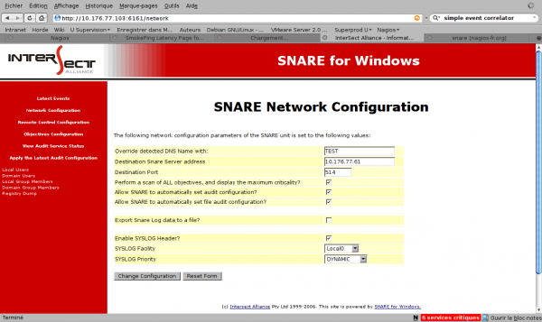
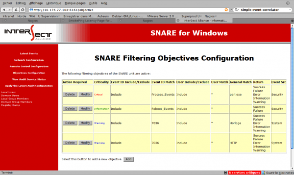
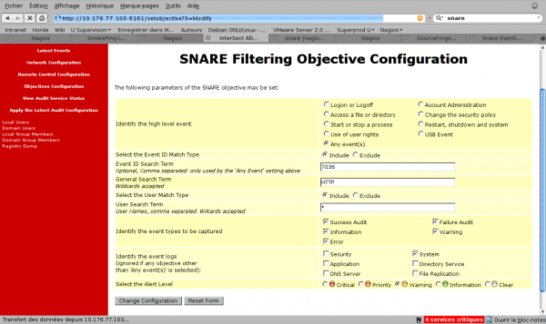

[[[Supervision Windows en mode
passif](supervision-windows-passif@do=backlink.html)]]

[wiki monitoring-fr.org](../start.html "[ALT+H]")

-   [Accueil](../index.html "Cliquez pour revenir |  l'accueil")
-   [Blog](http://www.monitoring-fr.org "Blog & News")
-   [Forums](http://forums.monitoring-fr.org "Forums")
-   [Doc](http://doc.monitoring-fr.org "Doc")
-   [Forge](https://github.com/monitoring-fr "Forge")

Vous êtes ici: [Accueil](../start.html "start") »
[Nagios](start.html "nagios:start") » [Supervision Windows en mode
passif](supervision-windows-passif.html "nagios:supervision-windows-passif")

### Table des matières {.toggle}

-   [Supervision Windows en mode
    passif](supervision-windows-passif.html#supervision-windows-en-mode-passif)
    -   [SNARE](supervision-windows-passif.html#snare)
        -   [Intérêts](supervision-windows-passif.html#interets)
        -   [Configuration](supervision-windows-passif.html#configuration)
    -   [Syslog-ng](supervision-windows-passif.html#syslog-ng)
        -   [Configuration](supervision-windows-passif.html#configuration1)
    -   [Simple Event
        Correlator](supervision-windows-passif.html#simple-event-correlator)
        -   [Installation](supervision-windows-passif.html#installation)
        -   [Configuration](supervision-windows-passif.html#configuration2)
    -   [Nagios](supervision-windows-passif.html#nagios)

Supervision Windows en mode passif {#supervision-windows-en-mode-passif .sectionedit1}
==================================

La supervision en mode passif sur Windows s’appuie sur le journal des
évènements Windows qu’il est possible de traiter de deux grandes façons.
Traduire les évènements en traps SNMP ou/et traduire les évènements en
évènement au format syslog.

Sur l’hôte supervisé, nous installons Snare et sur le serveur Nagios
Syslog-ng et SEC pour pouvoir traiter informations du journal
d’évènements Windows.

 A compléter avec le
circuit passif basé sur SNMP avec “evntwin” côté client et snmptrapd,
snmptt, syslog-ng, mysql et SEC côté serveur. Cet article complète
[Outils de supervision d'un hôte
Windows](windows-client.html "nagios:windows-client")

SNARE {#snare .sectionedit2}
-----

L’agent [Snare pour
Windows](http://www.intersectalliance.com/projects/SnareWindows/ "http://www.intersectalliance.com/projects/SnareWindows/")
est un service compatible pour Windows NT, Windows 2000, Windows XP, et
Windows 2003 qui permet le transfert à distance et en temps réel des
informations contenus dans les Eventlog Windows. Il convertit ces
informations au format texte et les délivre à un serveur syslog local ou
distant.

### Intérêts {#interets .sectionedit3}

SNARE est particulièrement intéressant sur environnement Windows car il
peut constituer la brique de base d’une supervision passive d’hôte
Windows. Beaucoup d’informations circulent en effet dans les EventLogs
Windows. Et les possibilités de filtrage du contenu de ces évènements
constitue la fonction la plus notable de SNARE. Elle permet de filtrer
de façon très fine les évènements qui seront envoyés à notre serveur
Syslog via protocole UDP pour la version gratuite et UDP/TCP pour la
version payante.

### Configuration {#configuration .sectionedit4}

l’installation de SNARE est tellement simple (click, click, click) qu’il
n’y a matière à s’étendre plus que ça. Une fois installé, il ne reste
plus qu’à se rendre sur <http://localhost:6161>, renseigner snare/snare
comme identifiant/passe et attaquer la configuration. Le premier écran
intéressant concerne la configuration réseau de snare.

Il convient d’indiquer l’adresse IP de destination des messages et le
port sur lequel écoute les serveur syslog distant.

Ensuite, il convient d’éditer les règles de configuration pour traquer
les processes et services qu’il nous importe de superviser. Pour ma
part, j’ai créé deux règles pour chaque service que je veux superviser.
De cette façon, je remonte pour chaque évènement le code retour
qu’attend Nagios ^[1)](supervision-windows-passif.html#fn__1)^ comme le
montre l’exemple de fichier de configuration ci-dessous. Coller ce texte
dans un fichier .reg pour l’importer directement et voir comment sont
paramétrées chaque règle.

~~~~ {.code}
Windows Registry Editor Version 5.00

[HKEY_LOCAL_MACHINE\SOFTWARE\InterSect Alliance\AuditService\Objective]

"Objective0"="2  31  32  592,593,594,595 *perl.exe*  0   *   0"
"Objective1"="1  24  32  512,513 **  0   *   0"
"Objective2"="0  31  16  7036    *NSClientpp*en cours d'exécution*  0   *   0"
"Objective3"="2  31  16  7036    *NSClientpp*arrêté* 0   *   0"
"Objective4"="0  31  16  7036    *SNMP*en cours d'exécution*    0   *   0"
"Objective5"="2  31  16  7036    *SNMP*arrêté*   0   *   0"
~~~~

Syslog-ng {#syslog-ng .sectionedit5}
---------

Syslog-ng est une version plus évoluée du démon standard syslog. Nous
allons voir comment le configurer sur le serveur Nagios pour écrire les
évènements remontés par Snare dans un fichier de log particulier qui
sera ensuite scruté par SEC.

L’installation proprement parler est des plus simple puisque un simple
apt-get install syslog-ng suffit. Il s’agit par contre de décrire les
modifications de configuration effectuées par rapport au fichier de
configuration initial de la distribution.

### Configuration {#configuration1 .sectionedit6}

En effet, Nous attendons une remontée des évènements marqués sur des
hôtes supervisés par le canal syslog gràca à Snare et il faut donc
préparer notre collecteur à recevoir et classer ces infos provenant des
hôtes Windows.

La première partie modifiée concerne les sources. Y est ajouté udp et
tcp pour ouvrir les connexions entrantes depuis le réseau.

~~~~ {.code}
source s_all {
        # message generated by Syslog-NG
        internal();
        # standard Linux log source (this is the default place for the syslog()
        # function to send logs to)
        unix-stream("/dev/log");
        # messages from the kernel
        file("/proc/kmsg" log_prefix("kernel: "));
        # use the following line if you want to receive remote UDP logging messages
        # (this is equivalent to the "-r" syslogd flag)
        udp();
        tcp();
};
~~~~

Ensuite, nous ajoutons une destination à notre fichier.

~~~~ {.code}
destination df_mswin { file("/var/log/mswin.log"); };
~~~~

Puis un filtre qui capture tous les évènements de nos sources d’après le
mot-clé MSWinEventLog.

~~~~ {.code}
filter f_mswin { match("MSWinEventLog"); };
~~~~

Et on aggrège notre source, filtre et destination comme suit

~~~~ {.code}
# mswin.*                 /var/log/mswin.log
log {
        source(s_all);
        filter(f_mswin);
        destination(df_mswin);
};
~~~~

#### Rotation des fichiers

Reste à assurer la rotation du nouveau fichier de log ainsi créé en
modifiant le fichier /etc/logrotate.d/syslog-ng. Les paramètres sont une
rotation tous les jours gardée sous forme d’archive compressée pendant 7
jours.

~~~~ {.code}
/var/log/mswin.log {
   rotate 7
   daily
   missingok
   notifempty
   compress
}
~~~~

**Pensez à redémarrer syslog après ces modifications
/etc/init.d/syslog-ng restart**

Simple Event Correlator {#simple-event-correlator .sectionedit7}
-----------------------

### Installation {#installation .sectionedit8}

SEC nous permet de détecter la source, le service, l’état parmi les
messages remontés et de formater, envoyer l’alerte correspondante à
Nagios. L’installation est des plus simple puisqu’il suffit de
décompresser l’archive et de placer les fichiers fournis où bon vous
semble.

Sur le serveur Nagios, lancer la commande suivante pour récupérer les
sources :

~~~~ {.code}
wget http://freefr.dl.sourceforge.net/sourceforge/simple-evcorr/sec-2.5.1.tar.gz

tar -xvzf sec-2.5.1.tar.gz

mv sec-2.5.1/ sec

cp -R sec/ /usr/local/
~~~~

### Configuration {#configuration2 .sectionedit9}

Pour démarrer SEC, il faudra utiliser un démon du type de celui fournie
ci-dessous en adaptant bien sûr les chemins à votre installation.

-   **Création du démon**

**Attention ce démon a été réalisé sous OS Debian / Ubuntu, concernant
d’autres scripts, il y en a fourni dans le répertoire contrib/ des
sources de SEC.**

~~~~ {.code}
#! /bin/sh
### BEGIN INIT INFO
# Provides:      sec
# Required-Start: $local_fs
# Required-Stop: $local_fs
# Default-Start: 2 3 4 5
# Default-Stop:    016
# Short-Description: starts and stops the Simple Event Correlator
# Description:    SEC is Simple Event Correlator
### END INIT INFO
# Auteur: Romuald Fronteau
#
# Base sur Squelette Debian Etch. Merci a Jaakko Niemi pour le script d origine
# PATH should only include /usr/* if it runs after the mountnfs.sh script
PATH=/sbin:/usr/sbin:/bin:/usr/bin
DESC="Simple Event Correlator"
NAME=sec
DAEMON=/usr/local/sec/sec.pl
CONFFILE=/usr/local/sec/etc/*.conf
SYSLOG_INPUT=/var/log/mswin.log
LOGFILE=/usr/local/nagios/var/$NAME.log
#DAEMON_ARGS="--options args"
PIDFILE=/usr/local/nagios/var/$NAME.pid
SCRIPTNAME=/etc/init.d/$NAME
#
# Function that starts the daemon/service
#
do_start()
{
      if [ -f $PIDFILE ]
      then
             return 1
      elif /usr/bin/perl $DAEMON -input=$SYSLOG_INPUT -conf=$CONFFILE
-log=$LOGFILE -pid=$PIDFILE -detach
      then
             return 0
      else
             return 2
      fi
}
#
# Function that stops the daemon/service
#
do_stop()
{
      if [ -f $PIDFILE ]
      then
             PID=`cat $PIDFILE`
             kill -9 $PID
             # Effacement du fichier pid lors de l'arret
             rm -f $PIDFILE
             return 0
      else
             return 1
      fi
}
case "$1" in
  start)
      echo "Demarrage du demon $DESC" "$NAME"
      do_start
      case "$?" in
             0) echo "Le demon a demarre";;
             1) echo "ATTENTION: Un demon tourne deja";;
             2) echo "ERREUR: Une erreur est survenu pendant le demarrage du demon";;
      esac
      ;;
  stop)
      echo "Arret du demon $DESC" "$NAME"
      do_stop
      case "$?" in
            0) echo "Le demon est arrete";;
            1) echo "ATTENTION: Le demon est deja arrete";;
      esac
      ;;
  restart)
      echo "Redemarrage du demon $DESC" "$NAME"
      do_stop
      case "$?" in
        0)
            do_start
            case "$?" in
                 0) echo "Le demon a demarre";;
                 1) echo "ATTENTION: Un demon tourne deja";;
                 2) echo "ERREUR: Une erreur est survenu pendant le demarrage du demon";;
            esac
            ;;
        1)
            # Echec de l arret
            echo "ATTENTION: Le demon est deja arrete"
            do_start
            ;;
      esac
      ;;
  *)
      echo "Usage: $SCRIPTNAME {start|stop|restart}" >&2
      exit 3
      ;;
esac
:
~~~~

Ensuite, on donne les droits d’exécution au démon, on le copie dans
/etc/init.d et le paramètre pour un lancement au démarrage de la machine
:

~~~~ {.code}
chmod +x sec

cp sec /etc/init.d
 
update-rc.d sec defaults 91
~~~~

Enfin, voici deux règles de base, simple et 100% améliorable de ce qu’il
est possible de faire avec SEC dans le cadre d’un traitement de fichier
Windows.

~~~~ {.code}
mkdir /usr/local/sec/etc
vi /usr/local/sec/etc/win_horloge.conf
~~~~

~~~~ {.code}
type=Single
ptype=RegExp
pattern=.*Horloge.*cution
desc=Le service Horloge Windows est entré dans l'état : en cours d'exécution
action=shellcmd /usr/local/nagios/libexec/eventhandlers/submit_check_sec SERVER_NAME SERVICE_TO_IMPACT_IN_NAGIOS 0 "OK - W32 Time Started"

type=Single
ptype=RegExp
pattern=.*Horloge.*arr
desc=Le service Horloge Windows est entré dans l'état : arrêté
action=shellcmd /usr/local/nagios/libexec/eventhandlers/submit_check_sec SERVER_NAME SERVICE_TO_IMPACT_IN_NAGIOS 2 "Critical - W32 Time Stopped"
~~~~

Nagios {#nagios .sectionedit10}
------

-   **Pré-requis**

Nagios doit être paramétré pour que le check passif fonctionne.

-   **Création le l’eventhandler submit\_check\_sec**

La façon la plus simple de gérer notre service lié à SEC dans nagios est
de définir ce service en check passif et de lui envoyer des commandes
externes lors qu’un eventlog remonte comme défini dans les règles
ci-dessus.

~~~~ {.code}
#!/bin/sh
# This is a sample shell script showing how you can submit the PROCESS_SERVICE_CHECK_RESULT command
# to Nagios. Adjust variables to fit your environment as necessary.
now=`date +%s`
commandfile='/usr/local/nagios/var/rw/nagios.cmd'
/bin/printf "[%lu] PROCESS_SERVICE_CHECK_RESULT;$1;$2;$3;$4\n" $now > $commandfile
~~~~

On autorisera le droit en exécution à notre eventhandler.

~~~~ {.code}
chmod 755 /usr/local/nagios/libexec/eventhandlers/submit_check_sec
~~~~

Pour finir, vous n’aurez plus qu’à déclarer votre service avec la
commande check\_dummy (ce plugin simule l’état que vous désirez). Votre
service sera réellement piloter par les règles définies dans la conf de
SEC via submit\_check\_sec.

Dans commands.cfg :

~~~~ {.code}
define command{
        command_name    check_dummy
        command_line    $USER1$/check_dummy $ARG1$
        }
~~~~

Dans le service.cfg :

define service{

~~~~ {.code}
   use                     template-service
   host_name               WIN2K3_TEST
   service_description     Service DNS
   active_checks_enabled   0
   passive_checks_enabled  1
   check_command           check_dummy!0
   }
~~~~

^[1)](supervision-windows-passif.html#fnt__1)^ 0 pour OK et 2 pour
Critical

SOMMAIRE {#sommaire .sectionedit1}
--------

**[Accueil](../start.html "start")**

**[Supervision](../supervision/start.html "supervision:start")**

-   [Nagios](start.html "nagios:start")
-   [Centreon](../centreon/start.html "centreon:start")
-   [Shinken](../shinken/start.html "shinken:start")
-   [Zabbix](../zabbix/start.html "zabbix:start")
-   [OpenNMS](../opennms/start.html "opennms:start")
-   [EyesOfNetwork](../eyesofnetwork/start.html "eyesofnetwork:start")
-   [Groundwork](../groundwork/start.html "groundwork:start")
-   [Zenoss](../zenoss/start.html "zenoss:start")
-   [Vigilo](../vigilo/start.html "vigilo:start")
-   [Icinga](../icinga/start.html "icinga:start")
-   [Cacti](../cacti/start.html "cacti:start")
-   [Ressenti
    utilisateur](../supervision/eue/start.html "supervision:eue:start")
-   [Ressenti utilisateur avec
    sikuli](../sikuli/eue/start.html "sikuli:eue:start")

**[Hypervision](../hypervision/start.html "hypervision:start")**

-   [Canopsis](../canopsis/start.html "canopsis:start")

**[Sécurité](../securite/start.html "securite:start")**

**[Infrastructure](../infra/start.html "infra:start")**

**[Développement](../dev/start.html "dev:start")**

Nagios {#nagios .sectionedit1}
------

-   [Arborescence des
    fichiers](installation-layout.html "nagios:installation-layout")
-   [Commandes de remontée de
    contrôle](ocsp-ochp.html "nagios:ocsp-ochp")
-   [Données Nagios dans un ramdisk](ramdisk.html "nagios:ramdisk")
-   [Event Handlers](event_handlers.html "nagios:event_handlers")
-   [Gabarits d'objets de
    configuration](templates.html "nagios:templates")
-   [Installation Nagios 2 & 3 sur Ubuntu 6.0.6, 8.0.4 et 10.0.4
    LTS](ubuntu-install.html "nagios:ubuntu-install")
-   [Installation Nagios 3 sur Debian Squeeze
    6.0.3](debian-install.html "nagios:debian-install")
-   [Installation de Nagios 3.x sur CentOS
    5.3](nagios-centos-install.html "nagios:nagios-centos-install")
-   [Introduction aux objets de
    configuration](configobjects.html "nagios:configobjects")
-   [Introduction à
    Nagios](nagios-introduction.html "nagios:nagios-introduction")
-   [Liens Nagios](links.html "nagios:links")
-   [Mise en place complète de Nagios sur RHEL
    5.4](mise-en-place-complete-nagios-sur-rhel-5.4/start.html "nagios:mise-en-place-complete-nagios-sur-rhel-5.4:start")
-   [NAGIOS - Guide de démarrage pour
    débutant](nagios-debutant/start.html "nagios:nagios-debutant:start")
-   [Nagios Addons](addons/start.html "nagios:addons:start")
-   [Nagios
    Integration](integration/start.html "nagios:integration:start")
-   [Nagios Plugins](plugins/start.html "nagios:plugins:start")
-   [Nagios et les
    notifications](notifications.html "nagios:notifications")
-   [Outils de supervision d'un hôte
    Windows](windows-client.html "nagios:windows-client")
-   [Référence des objets de
    configuration](objects-reference.html "nagios:objects-reference")
-   [Superviser un hôte Windows avec
    NSClient++](nagios-nsclient-host.html "nagios:nagios-nsclient-host")
-   [Supervision Windows en mode
    passif](supervision-windows-passif.html "nagios:supervision-windows-passif")
-   [Supervision vmware esx](vmware_esx.html "nagios:vmware_esx")
-   [check-list de diagnostic](debug.html "nagios:debug")

-   [Afficher le texte
    source](supervision-windows-passif@do=edit&rev=0.html "Afficher le texte source [V]")
-   [Anciennes
    révisions](supervision-windows-passif@do=revisions.html "Anciennes révisions [O]")
-   [Derniers
    changements](supervision-windows-passif@do=recent.html "Derniers changements [R]")
-   [Liens vers cette
    page](supervision-windows-passif@do=backlink.html "Liens vers cette page")
-   [Gestionnaire de
    médias](supervision-windows-passif@do=media.html "Gestionnaire de médias")
-   [Index](supervision-windows-passif@do=index.html "Index [X]")
-   [Connexion](supervision-windows-passif@do=login&sectok=6bca6bdf16f8880de3d6d3649db89a26.html "Connexion")
-   [Haut de
    page](supervision-windows-passif.html#dokuwiki__top "Haut de page [T]")

nagios/supervision-windows-passif.txt · Dernière modification:
2013/03/29 09:39 (modification externe)

