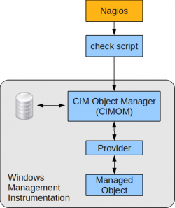

[[[Supervision WMI](superivision-wmi@do=backlink.html)]]

[wiki monitoring-fr.org](../../start.html "[ALT+H]")

-   [Accueil](../../index.html "Cliquez pour revenir |  l'accueil")
-   [Blog](http://www.monitoring-fr.org "Blog & News")
-   [Forums](http://forums.monitoring-fr.org "Forums")
-   [Doc](http://doc.monitoring-fr.org "Doc")
-   [Forge](https://github.com/monitoring-fr "Forge")

Vous êtes ici: [Accueil](../../start.html "start") »
[Nagios](../start.html "nagios:start") » [Outils de supervision d'un
hôte Windows](../windows-client.html "nagios:windows-client") »
[Supervision
WMI](superivision-wmi.html "nagios:windows-client:superivision-wmi")

### Table des matières {.toggle}

-   [Supervision WMI](superivision-wmi.html#supervision-wmi)
    -   [Pré-requis](superivision-wmi.html#pre-requis)
    -   [Installation de
        wmic](superivision-wmi.html#installation-de-wmic)
    -   [Utilisation de wmic](superivision-wmi.html#utilisation-de-wmic)

Supervision WMI {#supervision-wmi .sectionedit1}
===============

Une manière simple de superviser un hôte windows est d’interroger à
distance sa base
[WMI](http://fr.wikipedia.org/wiki/Windows_Management_Instrumentation "http://fr.wikipedia.org/wiki/Windows_Management_Instrumentation")
(système de gestion interne fournissant un modèle des états des
différents composants matériels ou logiciels de Windows).

Simple car cela ne nécessite pas d’installer un agent sur la machine à
superviser.

Le schéma ci-dessous présente le principe de la supervision WMI :

Pré-requis {#pre-requis .sectionedit2}
----------

L’interrogation de la base WMI d’un hôte client nécessite un client en
ligne de commande à installer sur le serveur nagios pour réaliser
l’exécution de commandes à distance.

L’équipe du projet Zenoss a développé un binaire permettant d’interroger
cette base à distance, wmic (wmic-client). Il est disponible depuis le
SVN de Zenoss à l’adresse
[http://dev.zenoss.org/svn/trunk/inst/externallibs/](http://dev.zenoss.org/svn/trunk/inst/externallibs/ "http://dev.zenoss.org/svn/trunk/inst/externallibs/"),
sous le nom wmi-\<version\>.tar.bz2.

Il est à noter que ce binaire était disponible dans la version Hardy de
Ubuntu.

Installation de wmic {#installation-de-wmic .sectionedit3}
--------------------

L’installation a été réalisée sur une Debian Stable (Lenny) toute
fraichement déployée.

-   Installation des dépendances système

~~~
apt-get install build-essential
apt-get install autoconf
~~~

-   Récupération des sources de wmi depuis le SVN de Zenoss (si le
    fichier n’est pas disponible, une nouvelle version a peut être été
    mise à jour, il faut alors naviguer dans le répertoire)

~~~
wget http://dev.zenoss.org/svn/trunk/inst/externallibs/wmi-1.3.11.tar.bz2
~~~

-   Désarchivage des sources récupérées

~~~
bunzip2 wmi-1.3.11.tar.bz2
tar xf wmi-1.3.11.tar
~~~

-   Compilation

~~~
cd wmi-1.3.11/Samba/source
./autogen.sh
./configure
make proto bin/wmic
~~~

-   Installation

~~~
cp bin/wmic /bin
~~~

Une fois l’installation terminée, vous pouvez tester le bon
fonctionnement de wmic :

~~~
$ wmic -h

Usage: [-?|--help] [--usage] [-d|--debuglevel DEBUGLEVEL] [--debug-stderr]
        [-s|--configfile CONFIGFILE] [--option=name=value]
        [-l|--log-basename LOGFILEBASE] [--leak-report] [--leak-report-full]
        [-R|--name-resolve NAME-RESOLVE-ORDER]
        [-O|--socket-options SOCKETOPTIONS] [-n|--netbiosname NETBIOSNAME]
        [-W|--workgroup WORKGROUP] [--realm=REALM] [-i|--scope SCOPE]
        [-m|--maxprotocol MAXPROTOCOL] [-U|--user [DOMAIN\]USERNAME[%PASSWORD]]
        [-N|--no-pass] [--password=STRING] [-A|--authentication-file FILE]
        [-S|--signing on|off|required] [-P|--machine-pass]
        [--simple-bind-dn=STRING] [-k|--kerberos STRING]
        [--use-security-mechanisms=STRING] [-V|--version] [--namespace=STRING]
        [--delimiter=STRING]
        //host query

Example: wmic -U [domain/]adminuser%password //host "select * from Win32_ComputerSystem"

$ wmic -U user%password //X.X.X.X "select * from Win32_ComputerSystem"
CLASS: Win32_ComputerSystem
AdminPasswordStatus|AutomaticResetBootOption|AutomaticResetCapability|BootOptionOnLimit|BootOptionOnWatchDog|BootROMSupported|BootupState|Caption|ChassisBootupState|CreationClassName|CurrentTimeZone|DaylightInEffect|Description|DNSHostName|Domain|DomainRole|EnableDaylightSavingsTime|FrontPanelResetStatus|InfraredSupported|InitialLoadInfo|InstallDate|KeyboardPasswordStatus|LastLoadInfo|Manufacturer|Model|Name|NameFormat|NetworkServerModeEnabled|NumberOfProcessors|OEMLogoBitmap|OEMStringArray|PartOfDomain|PauseAfterReset|PowerManagementCapabilities|PowerManagementSupported|PowerOnPasswordStatus|PowerState|PowerSupplyState|PrimaryOwnerContact|PrimaryOwnerName|ResetCapability|ResetCount|ResetLimit|Roles|Status|SupportContactDescription|SystemStartupDelay|SystemStartupOptions|SystemStartupSetting|SystemType|ThermalState|TotalPhysicalMemory|UserName|WakeUpType|Workgroup
3|True|True|0|0|True|Normal boot|PROTO-SNMP-2|3|Win32_ComputerSystem|120|True|AT/AT COMPATIBLE|proto-snmp-2|WORKGROUP|2|True|3|False|NULL|(null)|3|(null)|Xen|HVM domU|PROTO-SNMP-2|(null)|True|1|NULL|(Xen,[MS_VM_CERT/SHA1/bdbeb6e0a816d43fa6d3fe8aaef04c2bad9d3e3d])|False|-1|NULL|False|3|0|3|(null)|ME|1|-1|-1|(LM_Workstation,LM_Server,SQLServer,NT,Server_NT,Backup_Browser,DFS)|OK|NULL|30|("Windows Server 2003, Standard" /noexecute=optout /fastdetect)|0|X86-based PC|3|536346624|(null)|6|(null)
~~~

Utilisation de wmic {#utilisation-de-wmic .sectionedit4}
-------------------

Comme le montre le dernier exemple, le parcours de la base WMI est assez
similaire à du requêtage SQL. On appelle cela chez Microsoft du WQL (!)
(WMI Query Language).

Quelques requêtes utiles :

~~~
// état des services Windows (Running / Stopped)
SELECT State FROM Win32_Service

// mémoire disponible
SELECT AvailableBytes FROM Win32_PerfRawData_PerfOS_Memory

// mémoire physique du serveur
SELECT Capacity FROM Win32_PhysicalMemory

// espace disque disponible sur tous les disques (media type = 12 pour ne sélectionner que les partitions provenant de disques dur)
SELECT FreeSpace, Size FROM Win32_LogicalDisk WHERE MediaType = '12'

// charge en pourcentage de chaque processeur
SELECT LoadPercentage FROM Win32_Processor

// mémoire utilisé par un processus donné
SELECT WorkingSet FROM Win32_PerfRawData_PerfProc_Process where Name = 'sqlservr'
~~~

~~~
//Les services en auto tournent bien?
SELECT Name,State,StartMode FROM Win32_Service WHERE StartMode="Auto"
Attention à SysmonLog, il faut le passer en manuel (automatique arrété de base...)

//I/O des disques :
SELECT Name,DiskReadsPersec,DiskReadBytesPersec,DiskWrite sPersec,DiskWriteBytesPersec FROM Win32_PerfFormattedData_PerfDisk_PhysicalDisk
Attention, pas windows 2k.

//Queue d'attente des disques:
SELECT Name,CurrentDiskQueueLength FROM Win32_PerfFormattedData_PerfDisk_PhysicalDisk
Si supérieur à 2, pas bon.

//% de bande passante utilisé
SELECT Name,BytesTotalPersec,CurrentBandwidth FROM Win32_PerfFormattedData_Tcpip_NetworkInterface

//Queue du réseau:
SELECT Name,OutputQueueLength FROM Win32_PerfFormattedData_Tcpip_NetworkInterface
>2? pas bon

//Type d'utilisation du CPU :
SELECT PercentInterruptTime,PercentDPCTime,PercentPrivile gedTime Win32_PerfFormattedData_PerfOS_Processor WHERE Name='_Total'
*PercentInterruptTime > 50%? trop d'I/O réseaux
*PercentPrivilegedTime > 20%? trop d'I/O disque!

//Utilisation du swap
SELECT AllocatedBaseSize,CurrentUsage FROM Win32_PageFileUsage
Pas bon le swap (si la ram est également utilisée, sinon ce n'est pas grave!)

//Détection d'un reboot:
SELECT SystemUpTime FROM Win32_PerfFormattedData_PerfOS_System
<3600= reboot dans l'heure passée

//Data de création d'un fichier
SELECT LastModified FROM CIM_Datafile WHERE name="C:\myfile.txt"
~~~

On peut aussi requêter pour avoir des informations sur des logiciels
installés, comme par exemple SQL Server (MSSQL) :

~~~
// mémoire utilisé par SQL Server
SELECT TotalServerMemoryKB FROM Win32_PerfRawData_MSSQLSERVER_SQLServerMemoryManager
// buffer cache hit ratio
SELECT Buffercachehitratio FROM Win32_PerfRawData_MSSQLSERVER_SQLServerBufferManager
// taille d'une base de données (fichier et log) donnée
SELECT DataFilesSizeKB, LogFilesSizeKB, LogFilesUsedSizeKB FROM Win32_PerfRawData_MSSQLSERVER_SQLServerDatabases WHERE Name = 'test'
~~~

Il existe une multitude de données dans la base WMI, à vous de les
parcourir (via l’outil windows wbemtest.exe notamment)

Il vous suffit ensuite de mettre ça dans un petit script et de
l’intégrer à Nagios !

A noter quatre pages intéressantes sur la toile :

-   [http://forums.cacti.net/about30438-0-asc-0.html](http://forums.cacti.net/about30438-0-asc-0.html "http://forums.cacti.net/about30438-0-asc-0.html")
-   [http://www.yannobi.com/2010/07/plugin-de-controle-par-wmi-sous-nagios/](http://www.yannobi.com/2010/07/plugin-de-controle-par-wmi-sous-nagios/ "http://www.yannobi.com/2010/07/plugin-de-controle-par-wmi-sous-nagios/")
-   [Plugin
    checkwmiplus](http://www.edcint.co.nz/checkwmiplus/ "http://www.edcint.co.nz/checkwmiplus/")
-   [Installation check\_wmi\_plus sur CentOs et
    exploitation](http://alexnogard.com/monitorer-windows-avec-nagios-centreon/ "http://alexnogard.com/monitorer-windows-avec-nagios-centreon/")

SOMMAIRE {#sommaire .sectionedit1}
--------

**[Accueil](../../start.html "start")**

**[Supervision](../../supervision/start.html "supervision:start")**

-   [Nagios](../start.html "nagios:start")
-   [Centreon](../../centreon/start.html "centreon:start")
-   [Shinken](../../shinken/start.html "shinken:start")
-   [Zabbix](../../zabbix/start.html "zabbix:start")
-   [OpenNMS](../../opennms/start.html "opennms:start")
-   [EyesOfNetwork](../../eyesofnetwork/start.html "eyesofnetwork:start")
-   [Groundwork](../../groundwork/start.html "groundwork:start")
-   [Zenoss](../../zenoss/start.html "zenoss:start")
-   [Vigilo](../../vigilo/start.html "vigilo:start")
-   [Icinga](../../icinga/start.html "icinga:start")
-   [Cacti](../../cacti/start.html "cacti:start")
-   [Ressenti
    utilisateur](../../supervision/eue/start.html "supervision:eue:start")
-   [Ressenti utilisateur avec
    sikuli](../../sikuli/eue/start.html "sikuli:eue:start")

**[Hypervision](../../hypervision/start.html "hypervision:start")**

-   [Canopsis](../../canopsis/start.html "canopsis:start")

**[Sécurité](../../securite/start.html "securite:start")**

**[Infrastructure](../../infra/start.html "infra:start")**

**[Développement](../../dev/start.html "dev:start")**

Nagios {#nagios .sectionedit1}
------

-   [Arborescence des
    fichiers](../installation-layout.html "nagios:installation-layout")
-   [Commandes de remontée de
    contrôle](../ocsp-ochp.html "nagios:ocsp-ochp")
-   [Données Nagios dans un ramdisk](../ramdisk.html "nagios:ramdisk")
-   [Event Handlers](../event_handlers.html "nagios:event_handlers")
-   [Gabarits d'objets de
    configuration](../templates.html "nagios:templates")
-   [Installation Nagios 2 & 3 sur Ubuntu 6.0.6, 8.0.4 et 10.0.4
    LTS](../ubuntu-install.html "nagios:ubuntu-install")
-   [Installation Nagios 3 sur Debian Squeeze
    6.0.3](../debian-install.html "nagios:debian-install")
-   [Installation de Nagios 3.x sur CentOS
    5.3](../nagios-centos-install.html "nagios:nagios-centos-install")
-   [Introduction aux objets de
    configuration](../configobjects.html "nagios:configobjects")
-   [Introduction à
    Nagios](../nagios-introduction.html "nagios:nagios-introduction")
-   [Liens Nagios](../links.html "nagios:links")
-   [Mise en place complète de Nagios sur RHEL
    5.4](../mise-en-place-complete-nagios-sur-rhel-5.4/start.html "nagios:mise-en-place-complete-nagios-sur-rhel-5.4:start")
-   [NAGIOS - Guide de démarrage pour
    débutant](../nagios-debutant/start.html "nagios:nagios-debutant:start")
-   [Nagios Addons](../addons/start.html "nagios:addons:start")
-   [Nagios
    Integration](../integration/start.html "nagios:integration:start")
-   [Nagios Plugins](../plugins/start.html "nagios:plugins:start")
-   [Nagios et les
    notifications](../notifications.html "nagios:notifications")
-   [Outils de supervision d'un hôte
    Windows](../windows-client.html "nagios:windows-client")
-   [Référence des objets de
    configuration](../objects-reference.html "nagios:objects-reference")
-   [Superviser un hôte Windows avec
    NSClient++](../nagios-nsclient-host.html "nagios:nagios-nsclient-host")
-   [Supervision Windows en mode
    passif](../supervision-windows-passif.html "nagios:supervision-windows-passif")
-   [Supervision vmware esx](../vmware_esx.html "nagios:vmware_esx")
-   [check-list de diagnostic](../debug.html "nagios:debug")

-   [Afficher le texte
    source](superivision-wmi@do=edit&rev=0.html "Afficher le texte source [V]")
-   [Anciennes
    révisions](superivision-wmi@do=revisions.html "Anciennes révisions [O]")
-   [Derniers
    changements](superivision-wmi@do=recent.html "Derniers changements [R]")
-   [Liens vers cette
    page](superivision-wmi@do=backlink.html "Liens vers cette page")
-   [Gestionnaire de
    médias](superivision-wmi@do=media.html "Gestionnaire de médias")
-   [Index](superivision-wmi@do=index.html "Index [X]")
-   [Connexion](superivision-wmi@do=login&sectok=6bca6bdf16f8880de3d6d3649db89a26.html "Connexion")
-   [Haut de
    page](superivision-wmi.html#dokuwiki__top "Haut de page [T]")

nagios/windows-client/superivision-wmi.txt · Dernière modification:
2013/03/29 09:39 (modification externe)

