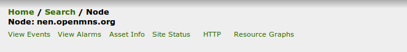
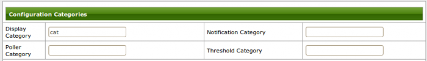

[[[Personnalisation de l'interface](custom-ihm@do=backlink.html)]]

[wiki monitoring-fr.org](../start.html "[ALT+H]")

-   [Accueil](../index.html "Cliquez pour revenir |  l'accueil")
-   [Blog](http://www.monitoring-fr.org "Blog & News")
-   [Forums](http://forums.monitoring-fr.org "Forums")
-   [Doc](http://doc.monitoring-fr.org "Doc")
-   [Forge](https://github.com/monitoring-fr "Forge")

Vous êtes ici: [Accueil](../start.html "start") »
[OpenNMS](start.html "opennms:start") » [Personnalisation de
l'interface](custom-ihm.html "opennms:custom-ihm")

### Table des matières {.toggle}

-   [Personnalisation de
    l'interface](custom-ihm.html#personnalisation-de-l-interface)
    -   [1. Personnalisation des catégories de la page
        d'accueil](custom-ihm.html#personnalisation-des-categories-de-la-page-d-accueil)
        -   [1.1 Création des catégories en page
            d'accueil](custom-ihm.html#creation-des-categories-en-page-d-accueil)
        -   [1.2 Ajout d'un équipement à une
            catégorie](custom-ihm.html#ajout-d-un-equipement-a-une-categorie)
        -   [1.3 Prise en compte des
            modifications](custom-ihm.html#prise-en-compte-des-modifications)
    -   [2. Cacher des liens dans la barre de navigation de
        l'interface](custom-ihm.html#cacher-des-liens-dans-la-barre-de-navigation-de-l-interface)
        -   [2.1 Pourquoi cacher un lien
            ?](custom-ihm.html#pourquoi-cacher-un-lien)
        -   [2.2 Configuration](custom-ihm.html#configuration)
        -   [2.3 Prise en compte des
            modifications](custom-ihm.html#prise-en-compte-des-modifications1)

Personnalisation de l'interface {#personnalisation-de-l-interface .sectionedit1}
===============================

1. Personnalisation des catégories de la page d'accueil {#personnalisation-des-categories-de-la-page-d-accueil .sectionedit2}
-------------------------------------------------------

La page d’accueil d’**OpenNMS** affiche sous forme de liste organisée
par catégorie le taux de disponibilité des équipements sur une fenêtre
de 24 heures glissantes.

Dans la configuration ci-dessous, nous créons des catégories en relation
avec le champ **displayCategory** des assets.

### 1.1 Création des catégories en page d'accueil {#creation-des-categories-en-page-d-accueil .sectionedit3}

Nous allons créer la catégorie **cat**. Pour cela éditez le fichier
/opt/opennms/etc/categories.xml pour qu’il ressemble à celui-ci :

~~~~ {.code .xml}
<catinfo>
    <header>
        <rev>1.3</rev>
        <created>Wednesday, February 6, 2002 10:10:00 AM EST</created>
        <mstation>checkers</mstation>
    </header>
    <categorygroup>
        <name>WebConsole</name>
        <comment>Service Level Availability by Functional Group</comment>
        <common>
            <rule><![CDATA[IPADDR != '0.0.0.0']]></rule>
        </common>
        <categories>
            <category>
                <label><![CDATA[Overall Service Availability]]></label>
                <comment>This category reflects availability of all services currently being monitored by OpenNMS.</comment>
                <normal>99.99</normal>
                <warning>97</warning>
                <rule><![CDATA[IPADDR != '0.0.0.0']]></rule>
            </category>
            <category>
                <label><![CDATA[cat]]></label>
                <comment>This category reflects availability of network and services included in cat category.</comment>
                <normal>99.99</normal>
                <warning>97</warning>
                <rule><![CDATA[(displayCategory == 'cat')]]></rule>
            </category>
        </categories>
    </categorygroup>
</catinfo>
~~~~

Plusieurs catégories peuvent être ajouté entre les balises
\<categories\> et \</categories\>.

Éditez ensuite le fichier **/opt/opennms/etc/viewsdisplay.xml** pour
qu’il contienne les éléments ci-dessous :

~~~~ {.code .xml}
<?xml version="1.0"?>
<viewinfo>
    <view>
        <view-name>WebConsoleView</view-name>
        <section>
            <section-name><![CDATA[Categories]]></section-name>
            <category><![CDATA[cat]]></category>
        </section>
        <section>
            <section-name><![CDATA[Total]]></section-name>
            <category><![CDATA[Overall Service Availability]]></category>
        </section>            
    </view>
</viewinfo>
~~~~

### 1.2 Ajout d'un équipement à une catégorie {#ajout-d-un-equipement-a-une-categorie .sectionedit4}

Pour ajouter un équipement à la catégorie **cat**. Dans l’interface,
cliquez sur la **Node List**. Sélectionnez l’équipement que vous
souhaitez ajouter à la catégorie et cliquez dessus pour faire apparaître
la page **Node Detail**.

Dans la partie ci-dessous, cliquez sur Asset Info :

Dans la page de configuration des assets, renseignez le nom de la
catégorie dans le champ **displayCategorie**.

### 1.3 Prise en compte des modifications {#prise-en-compte-des-modifications .sectionedit5}

Pour que les modifications soient prises en compte, vous devez
redémarrer **OpenNMS**. Pour cela, tapez la commande suivante :

~~~~ {.code}
shell> service opennms restart
~~~~

2. Cacher des liens dans la barre de navigation de l'interface {#cacher-des-liens-dans-la-barre-de-navigation-de-l-interface .sectionedit6}
--------------------------------------------------------------

### 2.1 Pourquoi cacher un lien ? {#pourquoi-cacher-un-lien .sectionedit7}

Il est parfois utile de cacher certains liens de la barre de navigation
(Node List, Search, Outages, Path Outages, …) de l’interface.

On peut imaginer une partie de l’ihm qui n’est pas configurée et/ou qui
n’est pas utilisé par le superviseur.

### 2.2 Configuration {#configuration .sectionedit8}

La configuration s’effectue dans le fichier
**/opt/opennms/jetty-webapps/opennms/WEB-INF/dispatcher-servlet.xml**.

Éditez le fichier et repérez la partie correspond au lien que vous
souhaitez masquer. Par exemple pour le lien **Path Outage**, cette
partie est la suivante :

~~~~ {.code .xml}
  <bean class="org.opennms.web.navigate.LocationBasedNavBarEntry">
    <property name="name" value="Path Outages"/>
    <property name="url" value="pathOutage/index.jsp"/>
    <property name="locationMatch" value="pathOutage"/>
  </bean>
~~~~

Ajoutez des commentaires comme ci-dessous :

~~~~ {.code .xml}
<!--
  <bean class="org.opennms.web.navigate.LocationBasedNavBarEntry">
    <property name="name" value="Path Outages"/>
    <property name="url" value="pathOutage/index.jsp"/>
    <property name="locationMatch" value="pathOutage"/>
  </bean>
-->
~~~~

### 2.3 Prise en compte des modifications {#prise-en-compte-des-modifications1 .sectionedit9}

Pour que les modifications soient prises en compte, vous devez
redémarrer **OpenNMS**. Pour cela, tapez la commande suivante :

~~~~ {.code}
shell> service opennms restart
~~~~

SOMMAIRE {#sommaire .sectionedit1}
--------

**[Accueil](../start.html "start")**

**[Supervision](../supervision/start.html "supervision:start")**

-   [Nagios](../nagios/start.html "nagios:start")
-   [Centreon](../centreon/start.html "centreon:start")
-   [Shinken](../shinken/start.html "shinken:start")
-   [Zabbix](../zabbix/start.html "zabbix:start")
-   [OpenNMS](start.html "opennms:start")
-   [EyesOfNetwork](../eyesofnetwork/start.html "eyesofnetwork:start")
-   [Groundwork](../groundwork/start.html "groundwork:start")
-   [Zenoss](../zenoss/start.html "zenoss:start")
-   [Vigilo](../vigilo/start.html "vigilo:start")
-   [Icinga](../icinga/start.html "icinga:start")
-   [Cacti](../cacti/start.html "cacti:start")
-   [Ressenti
    utilisateur](../supervision/eue/start.html "supervision:eue:start")
-   [Ressenti utilisateur avec
    sikuli](../sikuli/eue/start.html "sikuli:eue:start")

**[Hypervision](../hypervision/start.html "hypervision:start")**

-   [Canopsis](../canopsis/start.html "canopsis:start")

**[Sécurité](../securite/start.html "securite:start")**

**[Infrastructure](../infra/start.html "infra:start")**

**[Développement](../dev/start.html "dev:start")**

OpenNMS {#opennms .sectionedit1}
-------

-   [Configuration des évènements et des
    alarmes](events-alarms.html "opennms:events-alarms")
-   [Découverte des équipements
    (discovery)](discovery.html "opennms:discovery")
-   [Découverte et supervision des services (capsd et
    pollerd)](services.html "opennms:services")
-   [Installation d'OpenNMS sur CentOS
    5.x](install-on-centos.html "opennms:install-on-centos")
-   [Installation d'OpenNMS sur Ubuntu 8.0.4
    LTS](install-on-ubuntu.html "opennms:install-on-ubuntu")
-   [Interface Web
    d'OpenNMS](opennms-interface.html "opennms:opennms-interface")
-   [Optimisations possibles](optimisation.html "opennms:optimisation")
-   [Personnalisation de
    l'interface](custom-ihm.html "opennms:custom-ihm")
-   [Redondance avec Heartbeat et
    Mon](redondance.html "opennms:redondance")

-   [Afficher le texte
    source](custom-ihm@do=edit&rev=0.html "Afficher le texte source [V]")
-   [Anciennes
    révisions](custom-ihm@do=revisions.html "Anciennes révisions [O]")
-   [Derniers
    changements](custom-ihm@do=recent.html "Derniers changements [R]")
-   [Liens vers cette
    page](custom-ihm@do=backlink.html "Liens vers cette page")
-   [Gestionnaire de
    médias](custom-ihm@do=media.html "Gestionnaire de médias")
-   [Index](custom-ihm@do=index.html "Index [X]")
-   [Connexion](custom-ihm@do=login&sectok=6bca6bdf16f8880de3d6d3649db89a26.html "Connexion")
-   [Haut de page](custom-ihm.html#dokuwiki__top "Haut de page [T]")

opennms/custom-ihm.txt · Dernière modification: 2013/03/29 09:39
(modification externe)

