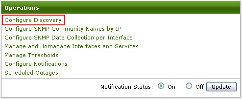
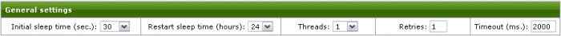
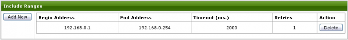
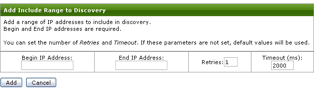
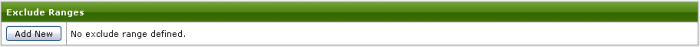
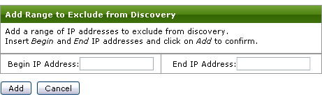
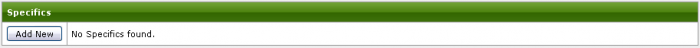
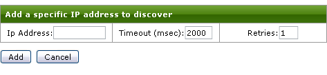
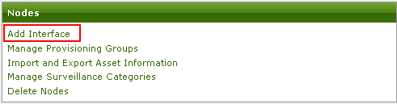
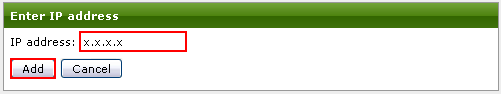

OpenNMS possède un module de découverte automatique des équipements
(discovery). Celui-ci intérroge chaque équipement à l’aide d’une requête
ICMP et l’ajoute à la supervision si celui-ci répond à cette requête.

1. Configuration de la découverte automatique {#configuration-de-la-decouverte-automatique .sectionedit2}
---------------------------------------------

### 1.1 Pré-requis {#pre-requis .sectionedit3}

-   Se connecter à l’interface d’OpenNMS avec le compte **admin**

### 1.2 Accès à la page de configuration de la découverte {#acces-a-la-page-de-configuration-de-la-decouverte .sectionedit4}

Cliquer sur le lien **Admin** dans la barre de navigation.

Dans la partie **Operations**, cliquez sur le lien intitulé **Configure
Discovery**

### 1.3 Configuration générale {#configuration-generale .sectionedit5}

Les paramètres généraux sont les suivants :

-   *Initial sleep time :* c’est le délai en millisecondes pendant
    lequel OpenNMS attend avant de lancer la découverte automatique
    après avoir redémarré. Ce délai permet à OpenNMS de démarrer
    complètement avant de lancer le processus de découverte ;
-   *Restart sleep time :* Une fois que le processus de découverte est
    terminé ; c’est le délai, en millisecondes, avant le démarrage par
    OpenNMS d’un nouveau processus de découverte ;
-   *Threads :* C’est le nombre de threads utilisés pour la découverte ;
-   *Retries :* C’est le nombre de tentatives qui seront faites pour
    interroger une adresse IP donnée avant de décider qu’elle ne
    correspond à aucun équipement. Ce paramètre peut être substitué plus
    tard dans la configuration ;
-   *Timeout :* Il s’agit du délai, en millisecondes, que le processus
    de découverte va attendre une réponse d’une adresse IP donnée avant
    de décider qu’elle ne correspond à aucun équipement. Ce paramètre
    peut être substitué plus tard dans la configuration.

### 1.4 Configuration d'une plage de découverte {#configuration-d-une-plage-de-decouverte .sectionedit6}

Cette section est utilisée pour spécifier une plage d’adresse IP à
inclure dans le processus de découverte.

Pour ajouter une plage, cliquez sur le bouton **Add New**. La fenêtre
suivante apparaît :

-   Entrez l’adresse IP du début de plage ;
-   Entrez l’adresse IP de fin de plage ;
-   Cliquez sur le bouton Add ;

Les autres paramètres sont les suivants :

-   *Timeout :* Il s’agit du délai, en millisecondes, que le processus
    de découverte va attendre une réponse d’une adresse IP donnée avant
    de décider qu’elle ne correspond à aucun équipement ;
-   *Retries:* C’est le nombre de tentatives qui seront faites pour
    interroger une adresse IP donnée avant de décider qu’elle ne
    correspond à aucun équipement ;

### 1.5 Configuration d'une plage d'exclusion {#configuration-d-une-plage-d-exclusion .sectionedit7}

Cette section est utilisée pour spécifier une plage d’adresse IP à
exclure dans le processus de découverte.

Pour ajouter une plage à exclure, cliquez sur le bouton **Add New**. La
fenêtre suivante apparaît :

-   Entrez l’adresse IP du début de plage ;
-   Entrez l’adresse IP de fin de plage ;
-   Cliquez sur le bouton Add ;

### 1.6 Configuration d'un équipement isolé {#configuration-d-un-equipement-isole .sectionedit8}

Cette section est utilisée pour spécifier une adresse IP spécifique à
inclure dans le processus de découverte.

Pour ajouter une adresse IP, cliquez sur le bouton **Add New**. La
fenêtre suivante apparaît :

-   Entrez l’adresse IP de l’équipement à superviser ;
-   Cliquez sur le bouton Add ;

Les autres paramètres sont les suivants :

-   *Timeout :* Il s’agit du délai, en millisecondes, que le processus
    de découverte va attendre une réponse d’une adresse IP donnée avant
    de décider qu’elle ne correspond à aucun équipement ;
-   *Retries :* C’est le nombre de tentatives qui seront faites pour
    interroger une adresse IP donnée avant de décider qu’elle ne
    correspond à aucun équipement ;

2. Ajout rapide d'un équipement à découvrir {#ajout-rapide-d-un-equipement-a-decouvrir .sectionedit9}
-------------------------------------------

### 2.1 Ajout via l'interface web {#ajout-via-l-interface-web .sectionedit10}

Si vous souhaitez ajouter un équipement à découvrir immédiatement sans
changer la configuration de la découverte automatique, procédez comme
suit :

Sur la page d’administration, cliquez sur **Add Interface** :

Renseignez l’adresse IP de l’équipement que vous souhaitez ajouter et
cliquez sur le bouton **Add** :

L’équipement doit répondre au ping pour pouvoir être ajouté dans
l’interface.

La configuration de la découverte automatique n’est pas modifiée. Si
l’équipement est supprimé de l’interface d’OpenNMS, il ne sera pas
découvert à nouveau par le processus de découverte automatique.

### 2.2 Ajout en ligne de commande {#ajout-en-ligne-de-commande .sectionedit11}

Pour ajouter un équipement à découvrir immédiatement, connectez-vous au
système et tapez la commande suivante :

~~~
/opt/opennms/bin/send-event.pl --interface ip-address uei.opennms.org/internal/discovery/newSuspect
~~~

Remplacer ip-address par l’adresse IP de l’équipement que vous souhaitez
ajouter.