[[[Installation d'OpenNMS sur Ubuntu 8.0.4
LTS](install-on-ubuntu@do=backlink.html)]]

[wiki monitoring-fr.org](../start.html "[ALT+H]")

-   [Accueil](../index.html "Cliquez pour revenir |  l'accueil")
-   [Blog](http://www.monitoring-fr.org "Blog & News")
-   [Forums](http://forums.monitoring-fr.org "Forums")
-   [Doc](http://doc.monitoring-fr.org "Doc")
-   [Forge](https://github.com/monitoring-fr "Forge")

Vous êtes ici: [Accueil](../start.html "start") »
[OpenNMS](start.html "opennms:start") » [Installation d'OpenNMS sur
Ubuntu 8.0.4 LTS](install-on-ubuntu.html "opennms:install-on-ubuntu")

### Table des matières {.toggle}

-   [Installation d'OpenNMS sur Ubuntu 8.0.4
    LTS](install-on-ubuntu.html#installation-d-opennms-sur-ubuntu-804-lts)
    -   [1. Pré-requis](install-on-ubuntu.html#pre-requis)
        -   [1.1 Configuration d'APT pour le dépôt
            OpenNMS](install-on-ubuntu.html#configuration-d-apt-pour-le-depot-opennms)
    -   [2. Configuration
        PostgreSQL](install-on-ubuntu.html#configuration-postgresql)
    -   [3. Installation de
        OpenNMS](install-on-ubuntu.html#installation-de-opennms)
        -   [3.1 Lancement du script d'initialisation
            d'OpenNMS](install-on-ubuntu.html#lancement-du-script-d-initialisation-d-opennms)
    -   [4. Présentation de
        l'interface](install-on-ubuntu.html#presentation-de-l-interface)
        -   [4.1 Accueil](install-on-ubuntu.html#accueil)
        -   [4.2 Node List](install-on-ubuntu.html#node-list)
        -   [4.3 Search](install-on-ubuntu.html#search)
        -   [4.4 Outages](install-on-ubuntu.html#outages)
        -   [4.5 Path Outages](install-on-ubuntu.html#path-outages)
        -   [4.6 Dashboard](install-on-ubuntu.html#dashboard)
        -   [4.7 Events](install-on-ubuntu.html#events)
        -   [4.8 Alarms](install-on-ubuntu.html#alarms)
        -   [4.9 Reports](install-on-ubuntu.html#reports)
        -   [4.10 Charts](install-on-ubuntu.html#charts)
        -   [4.11 Admin](install-on-ubuntu.html#admin)

Installation d'OpenNMS sur Ubuntu 8.0.4 LTS {#installation-d-opennms-sur-ubuntu-804-lts .sectionedit1}
===========================================

[OpenNMS](http://www.opennms.org/wiki/Main_Page "http://www.opennms.org/wiki/Main_Page")
est la première plate-forme d’administration de réseau de niveau
“qualité d’entreprise” du monde développée sous le modèle Open Source.
Il se compose du projet Open Source soutenu d’une communauté aussi bien
que des services commerciaux, service d’aide et d’un support en ligne.

***Premières impressions :***

OpenNMS est un produit qui s’appuie énormément sur le protocole SNMP
pour “renifler” automatiquement tous services réseaux et informations
sur vos hôtes à superviser.

Au bout de 10 à 15 min sur l’interface web, on commence à comprendre
comment cet outil fonctionne et on est rapidement étonné par sa
puissance. Pas besoin de redémarrage du démon openNMS, il prend toutes
vos modifications à chaud. Après avoir rentré la première machine sur
l’interface, il a été ajouté automatiquement l’hôte gérant le domaine
avec tous ses services réseaux classés par interfaces (eth0,eth1, ect….)
et à l’air de le considérer comme un “Parent”.

La métrologie pas de problèmes, il se met à grapher automatiquement les
services qu’il sait superviser par défaut.

1. Pré-requis {#pre-requis .sectionedit2}
-------------

Il faut quelques préparatifs aux systèmes avant d’installer openNMS :

-   Java JDK
-   PostgreSQL
-   Les libraries java libicmp-jni et librrd2-jni

~~~~ {.code}
sudo sudo apt-get install wget librrd2-jni sun-java6-jdk postgresql libicmp-jni
~~~~

### 1.1 Configuration d'APT pour le dépôt OpenNMS {#configuration-d-apt-pour-le-depot-opennms .sectionedit3}

Il faut éditer le fichier /etc/apt/sources.list et y ajouter les lignes
suivantes :

~~~~ {.code}
# OpenNMS Depot

deb http://debian.opennms.org stable main
deb-src http://debian.opennms.org stable main
~~~~

Récupération de la clé PGP d’OpenNMS

~~~~ {.code}
wget -O - http://debian.opennms.org/OPENNMS-GPG-KEY | sudo apt-key add -
~~~~

~~~~ {.code}
sudo apt-get update
~~~~

2. Configuration PostgreSQL {#configuration-postgresql .sectionedit4}
---------------------------

Il faut modifier le fichier /etc/postgresql/8.3/main/postgresql.conf

~~~~ {.code}
listen_addresses = '*'
max_connections = 256
shared_buffers = 1024
~~~~

Et le fichier /etc/postgresql/8.3/main/pg\_hba.conf. Il faut commenter
toutes les lignes et ne laisser que ce qu’il y a ci-dessous.

~~~~ {.code}
# TYPE DATABASE USER IP-ADDRESS IP-MASK METHOD
local all all trust
host all all 127.0.0.1 255.255.255.255 trust
host all all ::1 ffff:ffff:ffff:ffff:ffff:ffff:ffff:ffff trust
~~~~

Enfin, redémarrer postgresql

~~~~ {.code}
sudo /etc/init.d/postgresql-8.3 restart
~~~~

3. Installation de OpenNMS {#installation-de-opennms .sectionedit5}
--------------------------

L’installation via apt via simplifier énormément les choses.

~~~~ {.code}
sudo apt-get install opennms
~~~~

***Pour informations :***

Les données de openNMS sont installées aux endroits suivants :

**\$OPENNMS\_HOME/etc/**

Répertoire où se trouve les fichiers de configuration de OpenNMS.

**\$OPENNMS\_HOME/share/rrd/**

Répertoire où OpenNMS stock les données de performances (base RRD)

**\$OPENNMS\_HOME/webapps/opennms/ et
\$OPENNMS\_HOME/jetty-webapps/opennms/**

Répertoire de l’interface Web d’OpenNMS.

**\$PGDATA/**

Les données concernant les noeuds, machines, services sont stockées dans
des tables de la base POSTGRESQL.

### 3.1 Lancement du script d'initialisation d'OpenNMS {#lancement-du-script-d-initialisation-d-opennms .sectionedit6}

Il faut indiquer à OpenNMS quel JRE utiliser

~~~~ {.code}
sudo /usr/share/opennms/bin/runjava -s
~~~~

Le script d’initialisation est lancé avec la commande suivante :

~~~~ {.code}
sudo /usr/share/opennms/bin/install -dis
~~~~

Démarrage de openNMS

~~~~ {.code}
sudo /etc/init.d/opennms start
~~~~

L’interface d’openNMS est accessible via l’url suivante :
<http://ip_serv_openNMS:8980/opennms>

Login : admin

Mot de passe : admin

[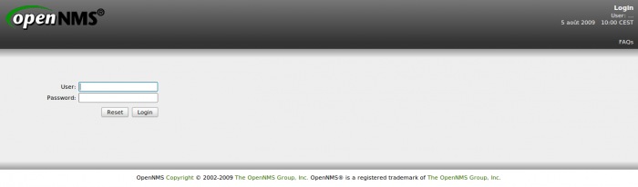](../_detail/supervision/opennms-login.png@id=opennms%253Ainstall-on-ubuntu.html "supervision:opennms-login.png")

4. Présentation de l'interface {#presentation-de-l-interface .sectionedit7}
------------------------------

### 4.1 Accueil {#accueil .sectionedit8}

[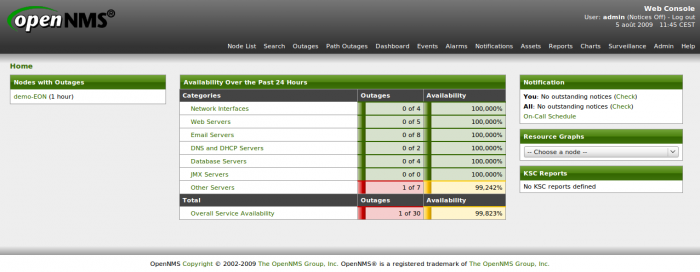](../_detail/supervision/opennms-accueil.png@id=opennms%253Ainstall-on-ubuntu.html "supervision:opennms-accueil.png")

### 4.2 Node List {#node-list .sectionedit9}

Dans cette vue, vous retrouvez une liste de vos différents hôtes
supervisés.

[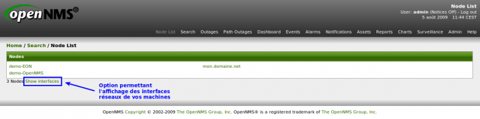](../_detail/supervision/opennms-node_list.png@id=opennms%253Ainstall-on-ubuntu.html "supervision:opennms-node_list.png")

### 4.3 Search {#search .sectionedit10}

Il s’agit d’une vue vous permettant de rechercher vos hôtes supervisés
en fonctions de plusieurs types de paramètres.

### 4.4 Outages {#outages .sectionedit11}

Cette vue vous permet de rechercher un problème en fonction de son ID ou
vous avez la possibilité de tout lister.

### 4.5 Path Outages {#path-outages .sectionedit12}

Je pense que cette vue est un équivalent au “network Outages” de Nagios.
Elle permet d’afficher les problèmes de liens réseaux entre les hôtes
“père/fils” et les services qui y sont impactés.

### 4.6 Dashboard {#dashboard .sectionedit13}

Le dashboard est un des points fort d’openNMS. Cette vue regroupe toutes
les données qu’on a besoin (métrologie, groupes machines, alertes) en 1
seule page. Ce n’est pas magnifique.

[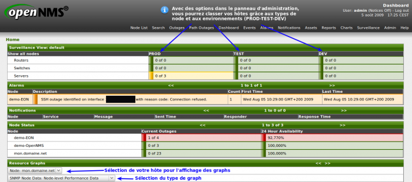](../_detail/supervision/opennms-dashboard1.png@id=opennms%253Ainstall-on-ubuntu.html "supervision:opennms-dashboard1.png")
[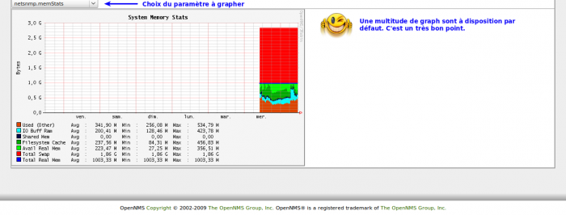](../_detail/supervision/opennms-dashboard2.png@id=opennms%253Ainstall-on-ubuntu.html "supervision:opennms-dashboard2.png")

### 4.7 Events {#events .sectionedit14}

Cette vue vous permet soit de chercher les évènements via un ID ou
lister totalement tous les évènements avec leurs niveaux de criticité.

[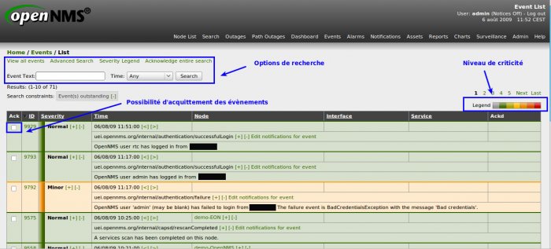](../_detail/supervision/opennms-events1.png@id=opennms%253Ainstall-on-ubuntu.html "supervision:opennms-events1.png")

### 4.8 Alarms {#alarms .sectionedit15}

Cette vue vous permet soit de chercher les alarmes via un ID ou lister
totalement tous les évènements avec leurs niveaux de criticité.

[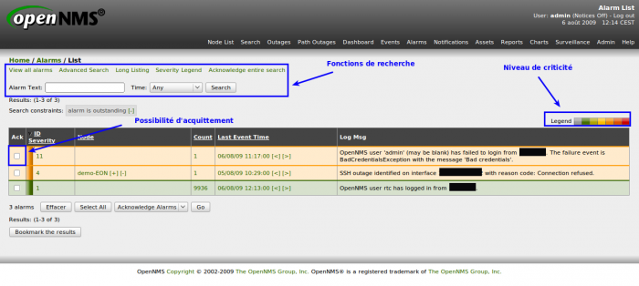](../_detail/supervision/opennms-alarms.png@id=opennms%253Ainstall-on-ubuntu.html "supervision:opennms-alarms.png")

### 4.9 Reports {#reports .sectionedit16}

Je trouve cette vue particulièrement complète en termes de rapports.
Elle est doté de quelques fonctionnalités que j’affectionne beaucoup
dans les outils de supervision.

[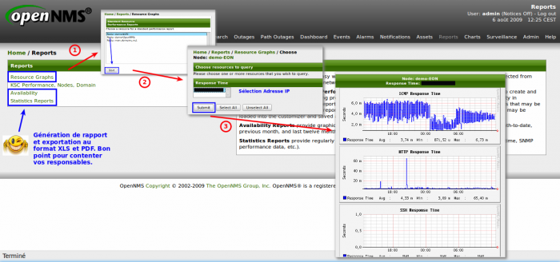](../_detail/supervision/opennms-reports.png@id=opennms%253Ainstall-on-ubuntu.html "supervision:opennms-reports.png")

### 4.10 Charts {#charts .sectionedit17}

Il s’agit de graphiques d’état de santé de la supervision et de
graphiques chiffrant le matériel supervisé.

[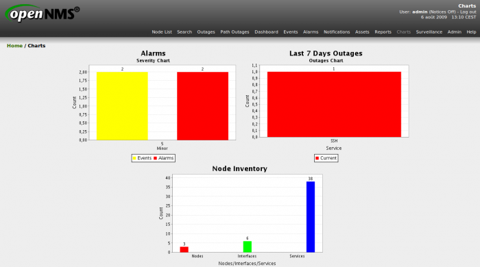](../_detail/supervision/opennms-charts.png@id=opennms%253Ainstall-on-ubuntu.html "supervision:opennms-charts.png")

### 4.11 Admin {#admin .sectionedit18}

Comme tout outil de supervision qui se respecte, nous allons attaquer un
gros morceaux … le panneau d’administration.

[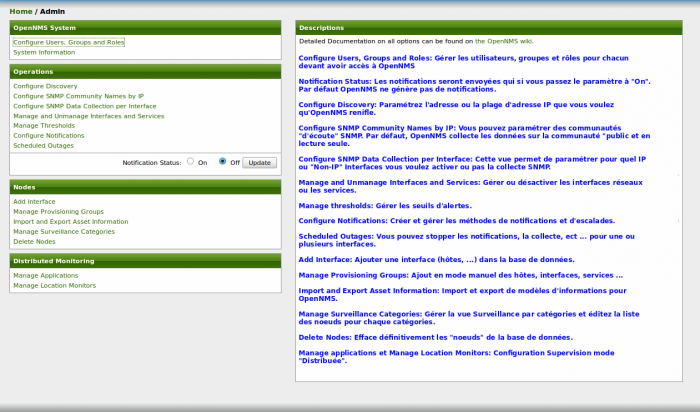](../_detail/supervision/opennms-admin_menu.png@id=opennms%253Ainstall-on-ubuntu.html "supervision:opennms-admin_menu.png")

#### 4.11.1 OpenNMS System

-   Configure Users, Groups and Roles

Cette vue vous permet de créer et gérer vos utilisateurs, groupes et
rôles.

[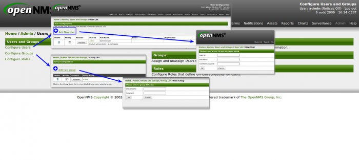](../_detail/supervision/opennms-admin_config_users.png@id=opennms%253Ainstall-on-ubuntu.html "supervision:opennms-admin_config_users.png")

-   System Information

[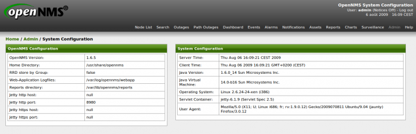](../_detail/supervision/opennms-admin_sysinfo.png@id=opennms%253Ainstall-on-ubuntu.html "supervision:opennms-admin_sysinfo.png")

#### 4.11.2 Operations

-   Configure Discovery

Cette vue vous permet de configurer la méthode de découverte de votre
réseau que ce soit de manière spécifique ou en masses.

-   Configure SNMP Community Names by IP

[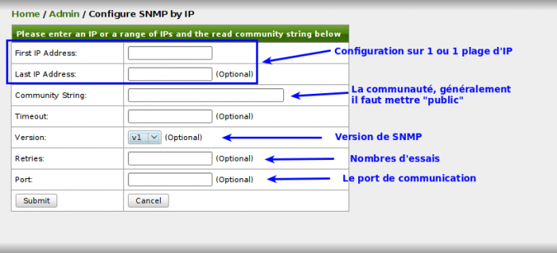](../_detail/supervision/opennms-admin_config_snmp_ip.png@id=opennms%253Ainstall-on-ubuntu.html "supervision:opennms-admin_config_snmp_ip.png")

-   Configure SNMP Data Collection per Interface

Cette vue vous permet de gérer quel interface que SNMP doit collecter.

[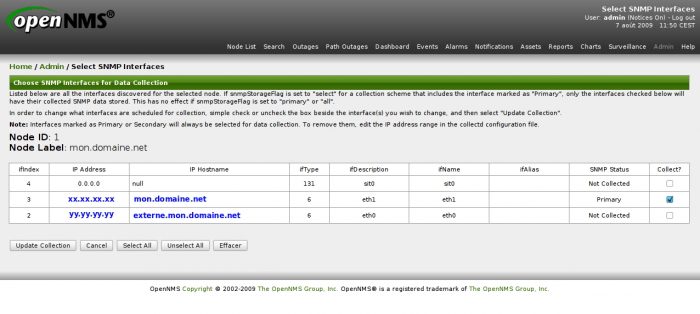](../_detail/supervision/opennms-admin_config_snmp_interface.png@id=opennms%253Ainstall-on-ubuntu.html "supervision:opennms-admin_config_snmp_interface.png")

-   Manage and Unmanage Interfaces and Services

Cette vue vous permet de gérer, désactiver ou même effacer les
interfaces et services qui y sont rattachés.

[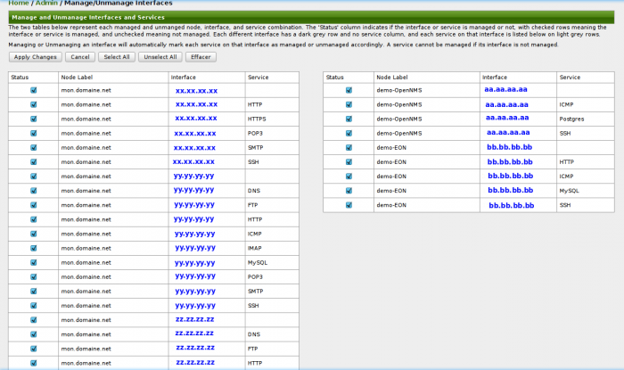](../_detail/supervision/opennms-admin_manage_interfaces.png@id=opennms%253Ainstall-on-ubuntu.html "supervision:opennms-admin_manage_interfaces.png")

-   Manage Thresholds

[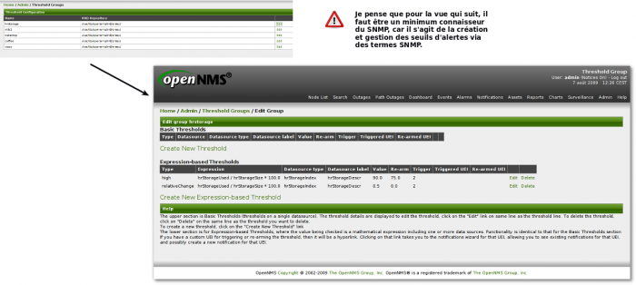](../_detail/supervision/opennms-admin_manage_thresholds.png@id=opennms%253Ainstall-on-ubuntu.html "supervision:opennms-admin_manage_thresholds.png")

-   Configure Notifications

[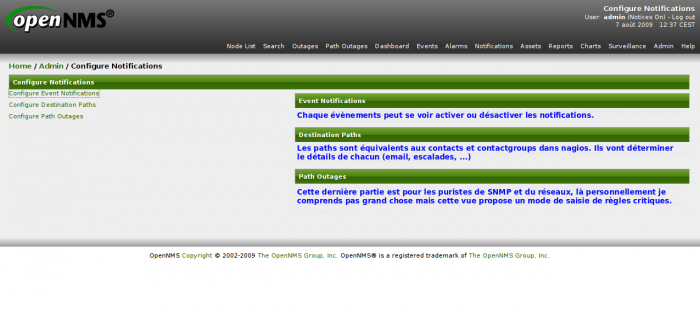](../_detail/supervision/opennms-admin_config_notif.png@id=opennms%253Ainstall-on-ubuntu.html "supervision:opennms-admin_config_notif.png")

Configure Events Notifications

[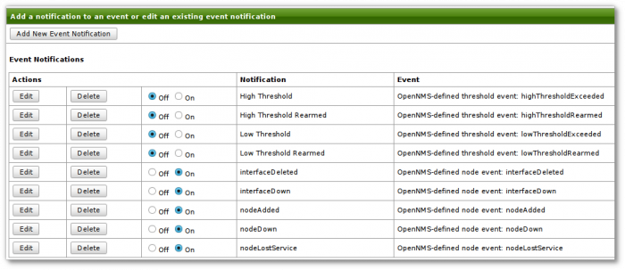](../_detail/supervision/opennms-admin_config_notif_events.png@id=opennms%253Ainstall-on-ubuntu.html "supervision:opennms-admin_config_notif_events.png")

Configure Destination Paths

[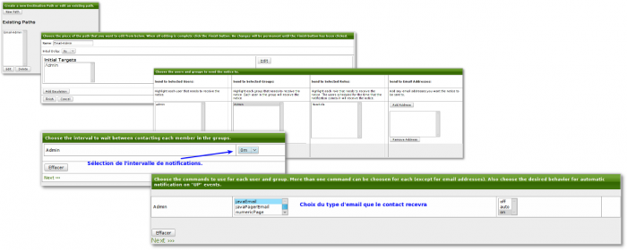](../_detail/supervision/opennms-admin_config_notif_destinations.png@id=opennms%253Ainstall-on-ubuntu.html "supervision:opennms-admin_config_notif_destinations.png")

#### 4.11.3 Nodes

-   Add Interface

Cette vue permet d’ajouter un hôte en saisissant juste son IP. OpenNMS
gérera automatiquement l’ajout des services en fonction de ce qui peut
interroger.

[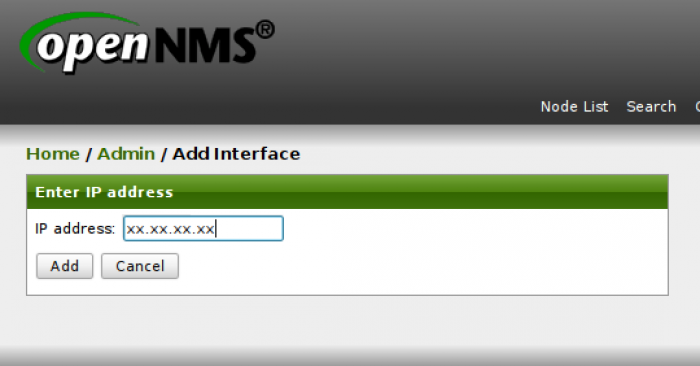](../_detail/supervision/opennms-admin_add_interface.png@id=opennms%253Ainstall-on-ubuntu.html "supervision:opennms-admin_add_interface.png")

-   Manage Surveillance Categories

Dans cette vue, vous pourrez classer vos hôtes dans les différentes
catégories existantes. Vous pouvez même créer vos propres catégories.

[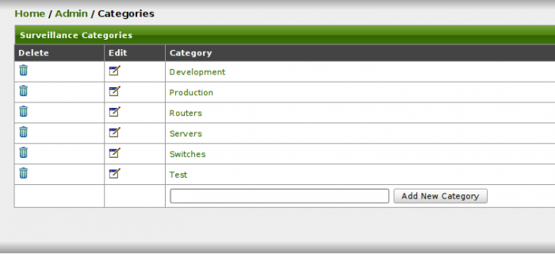](../_detail/supervision/opennms-admin_manage_categories.png@id=opennms%253Ainstall-on-ubuntu.html "supervision:opennms-admin_manage_categories.png")

-   Delete Nodes

[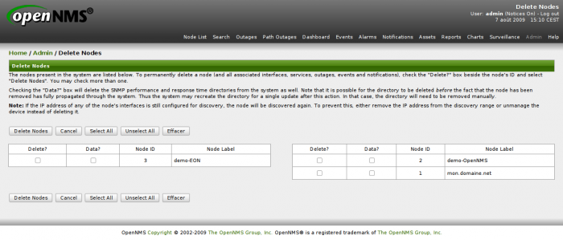](../_detail/supervision/opennms-admin_delete_nodes.png@id=opennms%253Ainstall-on-ubuntu.html "supervision:opennms-admin_delete_nodes.png")

#### 4.11.4 Distributed Monitoring

Les 2 dernières options sont prévu dans le cadre d’une supervision
“distribuée”. Je ne vois pas trop comment interagir avec l’interface.
Ceci demanderait une étude plus approfondi de OpenNMS.

**Cet article a été écrit en fonction de l’installation de la branche
stable de openNMS. Selon une news du 17 juin, la 1.7.4 serait sortie en
instable avec des fonctionnalités très intéressante (cartographie entre
autres). Je vous ferai une démonstration de tout ça très bientôt**

SOMMAIRE {#sommaire .sectionedit1}
--------

**[Accueil](../start.html "start")**

**[Supervision](../supervision/start.html "supervision:start")**

-   [Nagios](../nagios/start.html "nagios:start")
-   [Centreon](../centreon/start.html "centreon:start")
-   [Shinken](../shinken/start.html "shinken:start")
-   [Zabbix](../zabbix/start.html "zabbix:start")
-   [OpenNMS](start.html "opennms:start")
-   [EyesOfNetwork](../eyesofnetwork/start.html "eyesofnetwork:start")
-   [Groundwork](../groundwork/start.html "groundwork:start")
-   [Zenoss](../zenoss/start.html "zenoss:start")
-   [Vigilo](../vigilo/start.html "vigilo:start")
-   [Icinga](../icinga/start.html "icinga:start")
-   [Cacti](../cacti/start.html "cacti:start")
-   [Ressenti
    utilisateur](../supervision/eue/start.html "supervision:eue:start")
-   [Ressenti utilisateur avec
    sikuli](../sikuli/eue/start.html "sikuli:eue:start")

**[Hypervision](../hypervision/start.html "hypervision:start")**

-   [Canopsis](../canopsis/start.html "canopsis:start")

**[Sécurité](../securite/start.html "securite:start")**

**[Infrastructure](../infra/start.html "infra:start")**

**[Développement](../dev/start.html "dev:start")**

OpenNMS {#opennms .sectionedit1}
-------

-   [Configuration des évènements et des
    alarmes](events-alarms.html "opennms:events-alarms")
-   [Découverte des équipements
    (discovery)](discovery.html "opennms:discovery")
-   [Découverte et supervision des services (capsd et
    pollerd)](services.html "opennms:services")
-   [Installation d'OpenNMS sur CentOS
    5.x](install-on-centos.html "opennms:install-on-centos")
-   [Installation d'OpenNMS sur Ubuntu 8.0.4
    LTS](install-on-ubuntu.html "opennms:install-on-ubuntu")
-   [Interface Web
    d'OpenNMS](opennms-interface.html "opennms:opennms-interface")
-   [Optimisations possibles](optimisation.html "opennms:optimisation")
-   [Personnalisation de
    l'interface](custom-ihm.html "opennms:custom-ihm")
-   [Redondance avec Heartbeat et
    Mon](redondance.html "opennms:redondance")

-   [Afficher le texte
    source](install-on-ubuntu@do=edit&rev=0.html "Afficher le texte source [V]")
-   [Anciennes
    révisions](install-on-ubuntu@do=revisions.html "Anciennes révisions [O]")
-   [Derniers
    changements](install-on-ubuntu@do=recent.html "Derniers changements [R]")
-   [Liens vers cette
    page](install-on-ubuntu@do=backlink.html "Liens vers cette page")
-   [Gestionnaire de
    médias](install-on-ubuntu@do=media.html "Gestionnaire de médias")
-   [Index](install-on-ubuntu@do=index.html "Index [X]")
-   [Connexion](install-on-ubuntu@do=login&sectok=6bca6bdf16f8880de3d6d3649db89a26.html "Connexion")
-   [Haut de
    page](install-on-ubuntu.html#dokuwiki__top "Haut de page [T]")

opennms/install-on-ubuntu.txt · Dernière modification: 2013/03/29 09:39
(modification externe)

