[[[Interface Web d'OpenNMS](opennms-interface@do=backlink.html)]]

[wiki monitoring-fr.org](../start.html "[ALT+H]")

-   [Accueil](../index.html "Cliquez pour revenir |  l'accueil")
-   [Blog](http://www.monitoring-fr.org "Blog & News")
-   [Forums](http://forums.monitoring-fr.org "Forums")
-   [Doc](http://doc.monitoring-fr.org "Doc")
-   [Forge](https://github.com/monitoring-fr "Forge")

Vous êtes ici: [Accueil](../start.html "start") »
[OpenNMS](start.html "opennms:start") » [Interface Web
d'OpenNMS](opennms-interface.html "opennms:opennms-interface")

### Table des matières {.toggle}

-   [Interface Web
    d'OpenNMS](opennms-interface.html#interface-web-d-opennms)
    -   [Connexion à
        l’application](opennms-interface.html#connexion-a-l-application)
    -   [Page d'accueil](opennms-interface.html#page-d-accueil)
    -   [Node List et Node
        Details](opennms-interface.html#node-list-et-node-details)
    -   [Outages](opennms-interface.html#outages)
    -   [Dashboard](opennms-interface.html#dashboard)
    -   [Vue events](opennms-interface.html#vue-events)
    -   [Vue alarms](opennms-interface.html#vue-alarms)
    -   [Notifications](opennms-interface.html#notifications)
    -   [Assets](opennms-interface.html#assets)
    -   [Charts](opennms-interface.html#charts)
    -   [Page
        d'administration](opennms-interface.html#page-d-administration)

Interface Web d'OpenNMS {#interface-web-d-opennms .sectionedit1}
=======================

Connexion à l’application {#connexion-a-l-application .sectionedit2}
-------------------------

La connexion à l’application s’effectue via un navigateur web. Un login
et un mot de passe permettent d’identifier le superviseur qui souhaite
se connecter.

Plusieurs types de profils peuvent être définis : administrateur,
superviseur, …

[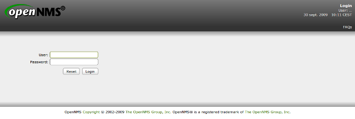](../_detail/supervision/opennms/login-02.png@id=opennms%253Aopennms-interface.html "supervision:opennms:login-02.png")

Page d'accueil {#page-d-accueil .sectionedit3}
--------------

La page d’accueil comprend les éléments suivants :

-   Une liste résumée des équipements qui possèdent actuellement une
    interruption de service réseau (outages) ;
-   Le taux de disponibilité des services réseaux sur 24 heures
    organisés par catégorie ;
-   Un lien direct vers la page de notifications ;
-   Un accès direct vers un graphique de performances ;
-   Un lien vers la page des rapports.

[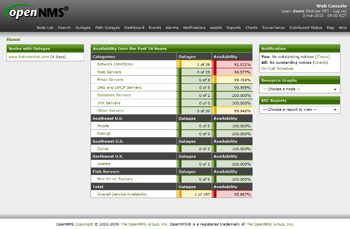](../_detail/supervision/opennms/homepage-02.png@id=opennms%253Aopennms-interface.html "supervision:opennms:homepage-02.png")

Node List et Node Details {#node-list-et-node-details .sectionedit4}
-------------------------

La page Node List liste les équipements actuellement supervisés par
OpenNMS. Ceux-ci ont pu être découverts par le système de découverte ou
chargés à partir de données externes (CMDB par exemple).

[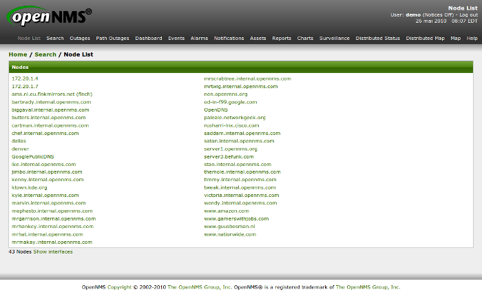](../_detail/supervision/opennms/nodelist-01.png@id=opennms%253Aopennms-interface.html "supervision:opennms:nodelist-01.png")

En cliquant sur un équipement, la page Node Detail s’affiche. Elle
permet de visualiser les éléments suivants :

-   Les assets enregistrés pour cet équipement ;
-   Des informations récupérées par le protocole SNMP (sysName,
    sysLocation, …) ;
-   La liste des interfaces réseaux détectées ;
-   Un résumé des évènements récents survenus sur cet équipement ;
-   Un résumé des interruptions de services survenues sur cet équipement
    ;

[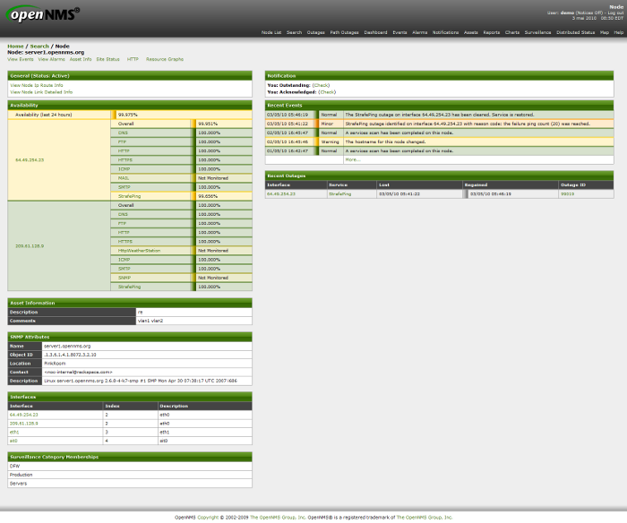](../_detail/supervision/opennms/nodedetail-01.png@id=opennms%253Aopennms-interface.html "supervision:opennms:nodedetail-01.png")

Outages {#outages .sectionedit5}
-------

Les outages correspondent aux interruptions de services sur une
interface d’un équipement. Cette page permet de lister ces
interruptions.

[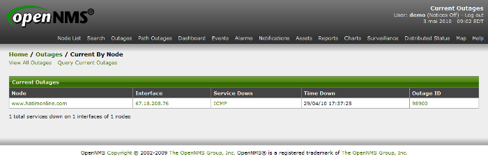](../_detail/supervision/opennms/outages-02.png@id=opennms%253Aopennms-interface.html "supervision:opennms:outages-02.png")

Dashboard {#dashboard .sectionedit6}
---------

La vue Dashboard affiche de façon synthétique les éléments suivants :

-   Les alarmes
-   Les notifications
-   Le statut des nœuds
-   Des graphiques de ressource

Cette représentation peut porter sur l’ensemble des nœuds où sur un
groupe de nœuds précisément. Cette vue est paramétrable selon
l’utilisateur qui se connecte. Par exemple, un utilisateur ne peut avoir
accès qu’à la supervision des serveurs de production.

[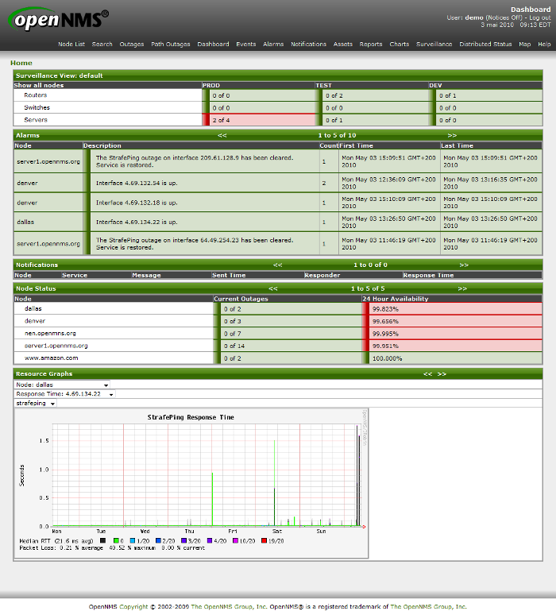](../_detail/supervision/opennms/dashboard-01.png@id=opennms%253Aopennms-interface.html "supervision:opennms:dashboard-01.png")

Vue events {#vue-events .sectionedit7}
----------

La vue Events présente les évènements tels qu’ils ont été reçus par
OpenNMS, c’est-à-dire sans corrélation début – fin et sans regroupement.

Cette vue est utilisée comme historique.

La sévérité des évènements est représentée par une couleur. Un système
de filtre permet de se focaliser sur une partie des évènements.

[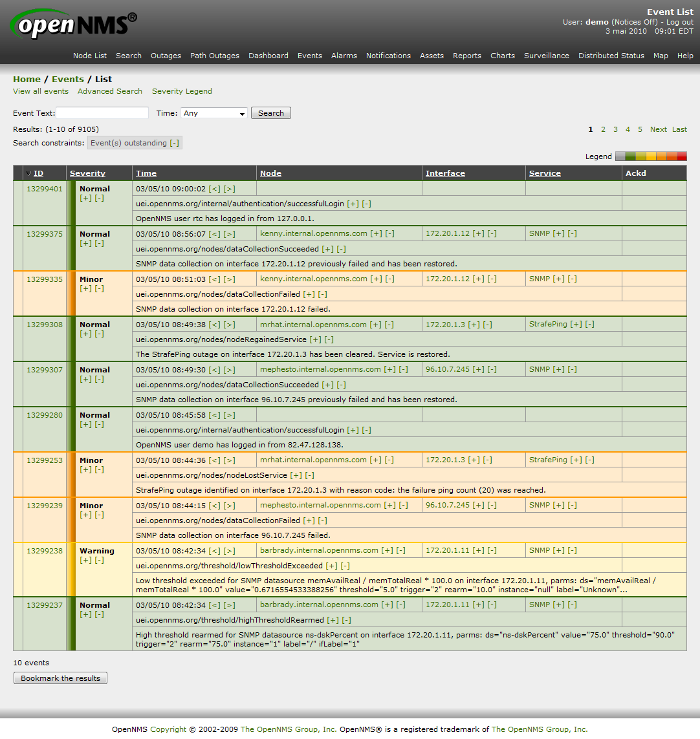](../_detail/supervision/opennms/events-01.png@id=opennms%253Aopennms-interface.html "supervision:opennms:events-01.png")

Vue alarms {#vue-alarms .sectionedit8}
----------

La vue Alarms est la vue la plus importante du logiciel OpenNMS. Elle
présente de façon synthétique les alarmes en cours sur le réseau.

Cette vue, contrairement à la vue Events, possède deux fonctions de
corrélation :

-   la déduplication : un compteur s’incrémente lorsque plusieurs
    alarmes du même type sont reçues ;
-   la corrélation début-fin : l’alarme de fin acquitte l’alarme de
    début ;

La sévérité des alarmes est représentée par une couleur. Un système de
filtre permet de se focaliser sur une partie des alarmes.

[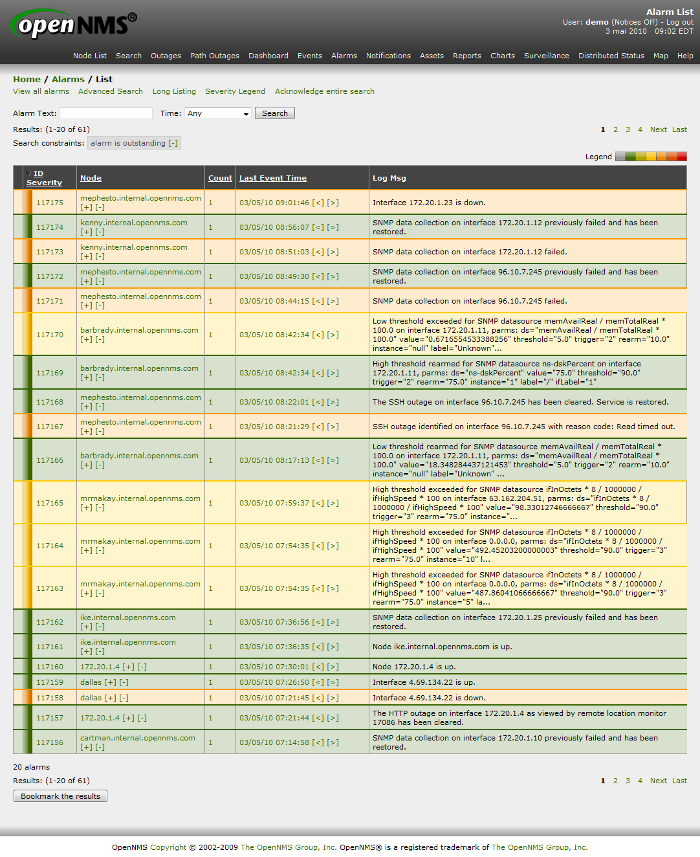](../_detail/supervision/opennms/alarms-02.png@id=opennms%253Aopennms-interface.html "supervision:opennms:alarms-02.png")

Notifications {#notifications .sectionedit9}
-------------

La page des notifications permet au superviseur de visualiser les
notifications qui ont été envoyées par l’outil.

[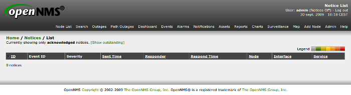](../_detail/supervision/opennms/notifications-01.png@id=opennms%253Aopennms-interface.html "supervision:opennms:notifications-01.png")

Assets {#assets .sectionedit10}
------

Les assets sont des informations supplémentaires sur un équipement. Ils
proviennent la plupart du temps d’une base de données référentielle
(CMDB).

Cette page permet d’afficher les assets en relation avec un équipement.

[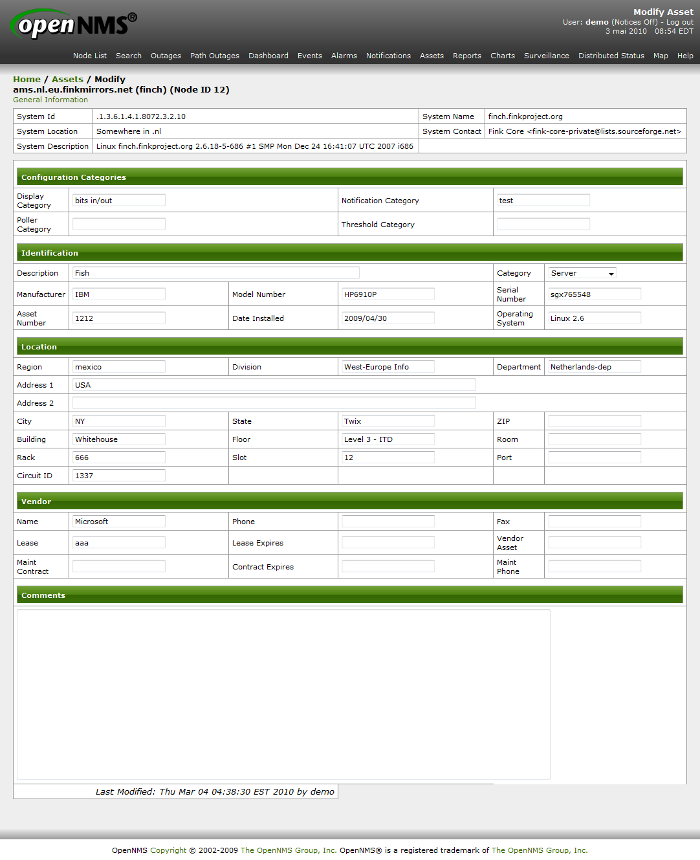](../_detail/supervision/opennms/assets-01.png@id=opennms%253Aopennms-interface.html "supervision:opennms:assets-01.png")

Charts {#charts .sectionedit11}
------

La vue Charts permet de visualiser sous forme de graphique des calculs
réalisés à partir de la base de données. Cette vue est entièrement
configurable selon les besoins.

Seul la visualisation en histogramme est disponible dans cette vue.

[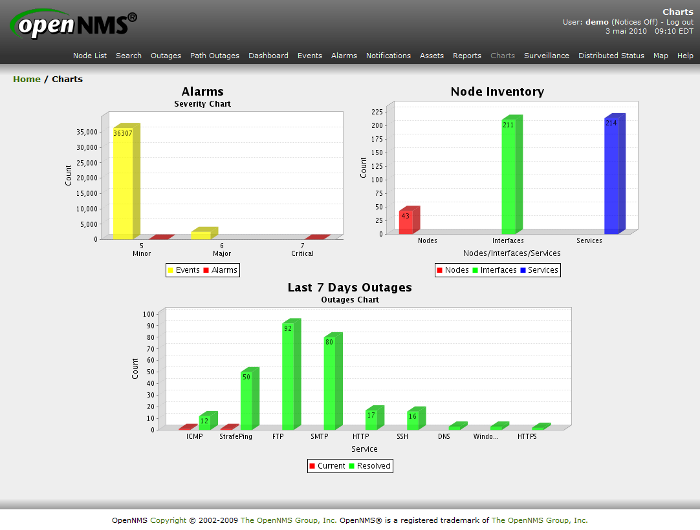](../_detail/supervision/opennms/charts-01.png@id=opennms%253Aopennms-interface.html "supervision:opennms:charts-01.png")

Page d'administration {#page-d-administration .sectionedit12}
---------------------

La page d’administration permet de configurer certains éléments de
l’outil de supervision. D’autres éléments se configurent via des
fichiers de configuration. Les menus disponibles sont listés ci-dessous.

[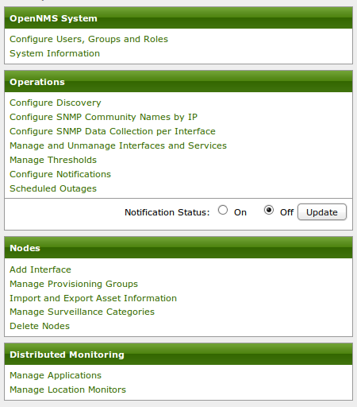](../_detail/supervision/opennms/admin-01.png@id=opennms%253Aopennms-interface.html "supervision:opennms:admin-01.png")

SOMMAIRE {#sommaire .sectionedit1}
--------

**[Accueil](../start.html "start")**

**[Supervision](../supervision/start.html "supervision:start")**

-   [Nagios](../nagios/start.html "nagios:start")
-   [Centreon](../centreon/start.html "centreon:start")
-   [Shinken](../shinken/start.html "shinken:start")
-   [Zabbix](../zabbix/start.html "zabbix:start")
-   [OpenNMS](start.html "opennms:start")
-   [EyesOfNetwork](../eyesofnetwork/start.html "eyesofnetwork:start")
-   [Groundwork](../groundwork/start.html "groundwork:start")
-   [Zenoss](../zenoss/start.html "zenoss:start")
-   [Vigilo](../vigilo/start.html "vigilo:start")
-   [Icinga](../icinga/start.html "icinga:start")
-   [Cacti](../cacti/start.html "cacti:start")
-   [Ressenti
    utilisateur](../supervision/eue/start.html "supervision:eue:start")
-   [Ressenti utilisateur avec
    sikuli](../sikuli/eue/start.html "sikuli:eue:start")

**[Hypervision](../hypervision/start.html "hypervision:start")**

-   [Canopsis](../canopsis/start.html "canopsis:start")

**[Sécurité](../securite/start.html "securite:start")**

**[Infrastructure](../infra/start.html "infra:start")**

**[Développement](../dev/start.html "dev:start")**

OpenNMS {#opennms .sectionedit1}
-------

-   [Configuration des évènements et des
    alarmes](events-alarms.html "opennms:events-alarms")
-   [Découverte des équipements
    (discovery)](discovery.html "opennms:discovery")
-   [Découverte et supervision des services (capsd et
    pollerd)](services.html "opennms:services")
-   [Installation d'OpenNMS sur CentOS
    5.x](install-on-centos.html "opennms:install-on-centos")
-   [Installation d'OpenNMS sur Ubuntu 8.0.4
    LTS](install-on-ubuntu.html "opennms:install-on-ubuntu")
-   [Interface Web
    d'OpenNMS](opennms-interface.html "opennms:opennms-interface")
-   [Optimisations possibles](optimisation.html "opennms:optimisation")
-   [Personnalisation de
    l'interface](custom-ihm.html "opennms:custom-ihm")
-   [Redondance avec Heartbeat et
    Mon](redondance.html "opennms:redondance")

-   [Afficher le texte
    source](opennms-interface@do=edit&rev=0.html "Afficher le texte source [V]")
-   [Anciennes
    révisions](opennms-interface@do=revisions.html "Anciennes révisions [O]")
-   [Derniers
    changements](opennms-interface@do=recent.html "Derniers changements [R]")
-   [Liens vers cette
    page](opennms-interface@do=backlink.html "Liens vers cette page")
-   [Gestionnaire de
    médias](opennms-interface@do=media.html "Gestionnaire de médias")
-   [Index](opennms-interface@do=index.html "Index [X]")
-   [Connexion](opennms-interface@do=login&sectok=6bca6bdf16f8880de3d6d3649db89a26.html "Connexion")
-   [Haut de
    page](opennms-interface.html#dokuwiki__top "Haut de page [T]")

opennms/opennms-interface.txt · Dernière modification: 2013/03/29 09:39
(modification externe)

