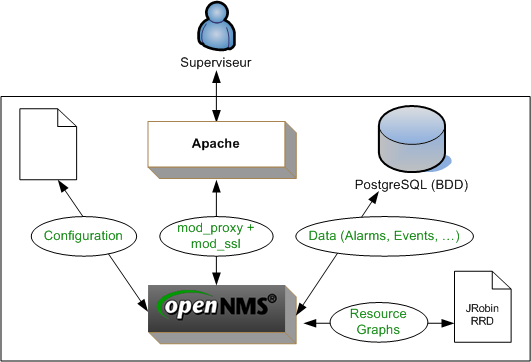

[[[OpenNMS](start@do=backlink.html)]]

[wiki monitoring-fr.org](../start.html "[ALT+H]")

-   [Accueil](../index.html "Cliquez pour revenir |  l'accueil")
-   [Blog](http://www.monitoring-fr.org "Blog & News")
-   [Forums](http://forums.monitoring-fr.org "Forums")
-   [Doc](http://doc.monitoring-fr.org "Doc")
-   [Forge](https://github.com/monitoring-fr "Forge")

Vous êtes ici: [Accueil](../start.html "start") »
[OpenNMS](start.html "opennms:start")

### Table des matières {.toggle}

-   [OpenNMS](start.html#opennms)
    -   [Présentation](start.html#presentation)
    -   [Schéma Fonctionnel](start.html#schema-fonctionnel)
    -   [Documentation](start.html#documentation)

OpenNMS {#opennms .sectionedit1}
=======

Dans ce dossier, figure une présentation des fonctionnalités d’OpenNMS,
ainsi qu’un ensemble de documentations et de tutoriels sur la mise en
place d’une architecture de supervision OpenNMS.

Pour toutes questions, informations complémentaires sur OpenNMS,
rendez-vous sur le
[forum](http://forums.monitoring-fr.org/ "http://forums.monitoring-fr.org/")
du site.

Ce dossier a été réalisé par :

  **Rôle**        **Nom**
  --------------- --------------
  **Rédacteur**   Samuel MUTEL

Présentation {#presentation .sectionedit3}
------------

OpenNMS est un outil de supervision / hypervision de réseau Open Source.
Il est développé en Java et s’appuie sur le moteur applicatif Jetty et
la base de données PostgreSQL pour fonctionner.

Les principales fonctionnalités d’OpenNMS sont les suivantes :

-   Découvrir les équipements réseaux à superviser (ping) ;
-   Découvrir les services présents sur un équipement et en mesurer la
    disponibilité ;
-   Identifier et lister les interruptions de services réseaux (outages)
    ;
-   Collecter les informations et recevoir les alarmes provenant des
    équipements supervisés via le protocole SNMP ;
-   D’enrichir les informations d’un évènement par des données stockées
    dans la base de données ;
-   D’effectuer une corrélation entre les alarmes afin de présenter un
    affichage clair des problèmes en cours ;
-   De corréler, notifier et escalader ces évènements sous forme
    d’alarmes ;
-   De disposer d’une interface Web permettant d’administrer et de
    superviser ;
-   De réaliser des graphiques à partir de polling SNMP ;
-   De représenter graphiquement les équipements supervisés.

Schéma Fonctionnel {#schema-fonctionnel .sectionedit4}
------------------

Documentation {#documentation .sectionedit5}
-------------

-   [Personnalisation de
    l'interface](custom-ihm.html "opennms:custom-ihm")
-   [Découverte des équipements
    (discovery)](discovery.html "opennms:discovery")
-   [Configuration des évènements et des
    alarmes](events-alarms.html "opennms:events-alarms")
-   [Installation d'OpenNMS sur CentOS
    5.x](install-on-centos.html "opennms:install-on-centos")
-   [Installation d'OpenNMS sur Ubuntu 8.0.4
    LTS](install-on-ubuntu.html "opennms:install-on-ubuntu")
-   [Interface Web
    d'OpenNMS](opennms-interface.html "opennms:opennms-interface")
-   [Optimisations possibles](optimisation.html "opennms:optimisation")
-   [Redondance avec Heartbeat et
    Mon](redondance.html "opennms:redondance")
-   [Découverte et supervision des services (capsd et
    pollerd)](services.html "opennms:services")

-   [Installation automatique d'OpenNMS avec
    OSE](http://www.ose-distrib.org/fr/documentations/41-installation/62-installation-en-mode-standalone.html "http://www.ose-distrib.org/fr/documentations/41-installation/62-installation-en-mode-standalone.html")
-   [Réception des alarmes de Nagios avec
    OSE](http://www.ose-distrib.org/fr/documentations/37-configuration/64-reception-des-alarmes-de-nagios-avec-ose-2.html "http://www.ose-distrib.org/fr/documentations/37-configuration/64-reception-des-alarmes-de-nagios-avec-ose-2.html")

SOMMAIRE {#sommaire .sectionedit1}
--------

**[Accueil](../start.html "start")**

**[Supervision](../supervision/start.html "supervision:start")**

-   [Nagios](../nagios/start.html "nagios:start")
-   [Centreon](../centreon/start.html "centreon:start")
-   [Shinken](../shinken/start.html "shinken:start")
-   [Zabbix](../zabbix/start.html "zabbix:start")
-   [OpenNMS](start.html "opennms:start")
-   [EyesOfNetwork](../eyesofnetwork/start.html "eyesofnetwork:start")
-   [Groundwork](../groundwork/start.html "groundwork:start")
-   [Zenoss](../zenoss/start.html "zenoss:start")
-   [Vigilo](../vigilo/start.html "vigilo:start")
-   [Icinga](../icinga/start.html "icinga:start")
-   [Cacti](../cacti/start.html "cacti:start")
-   [Ressenti
    utilisateur](../supervision/eue/start.html "supervision:eue:start")
-   [Ressenti utilisateur avec
    sikuli](../sikuli/eue/start.html "sikuli:eue:start")

**[Hypervision](../hypervision/start.html "hypervision:start")**

-   [Canopsis](../canopsis/start.html "canopsis:start")

**[Sécurité](../securite/start.html "securite:start")**

**[Infrastructure](../infra/start.html "infra:start")**

**[Développement](../dev/start.html "dev:start")**

OpenNMS {#opennms .sectionedit1}
-------

-   [Configuration des évènements et des
    alarmes](events-alarms.html "opennms:events-alarms")
-   [Découverte des équipements
    (discovery)](discovery.html "opennms:discovery")
-   [Découverte et supervision des services (capsd et
    pollerd)](services.html "opennms:services")
-   [Installation d'OpenNMS sur CentOS
    5.x](install-on-centos.html "opennms:install-on-centos")
-   [Installation d'OpenNMS sur Ubuntu 8.0.4
    LTS](install-on-ubuntu.html "opennms:install-on-ubuntu")
-   [Interface Web
    d'OpenNMS](opennms-interface.html "opennms:opennms-interface")
-   [Optimisations possibles](optimisation.html "opennms:optimisation")
-   [Personnalisation de
    l'interface](custom-ihm.html "opennms:custom-ihm")
-   [Redondance avec Heartbeat et
    Mon](redondance.html "opennms:redondance")

-   [Afficher le texte
    source](start@do=edit&rev=0.html "Afficher le texte source [V]")
-   [Anciennes
    révisions](start@do=revisions.html "Anciennes révisions [O]")
-   [Derniers
    changements](start@do=recent.html "Derniers changements [R]")
-   [Liens vers cette
    page](start@do=backlink.html "Liens vers cette page")
-   [Gestionnaire de
    médias](start@do=media.html "Gestionnaire de médias")
-   [Index](start@do=index.html "Index [X]")
-   [Connexion](start@do=login&sectok=6bca6bdf16f8880de3d6d3649db89a26.html "Connexion")
-   [Haut de page](start.html#dokuwiki__top "Haut de page [T]")

opennms/start.txt · Dernière modification: 2013/03/29 09:39
(modification externe)

